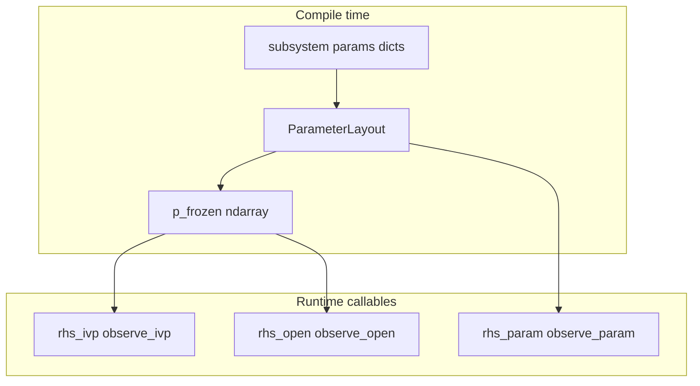

# Compiled system API plan

**Status:** design / not yet implemented. Tracked on the roadmap: [ROADMAP.md](ROADMAP.md) (Main TODO — compilation API).

**Summary:** Compilation packs authoring-time dict `params` into a 1D array `p`, records a **ParameterLayout**, and stores a **frozen copy `p_frozen`** for fixed-parameter tiers. The public compiled surface exposes **six array-only callables** (scalar `t` only): dynamics `rhs_ivp(x,t)`, `rhs_open(x,u,t)`, `rhs_param(x,u,t,p)` and matching concatenated port outputs `observe_ivp` / `observe_open` / `observe_param`. NumPy, JAX, and `jax.jit` variants share **identical signatures**.

---

## Problem

[`minilink/compile/numpy_backend.py`](minilink/compile/numpy_backend.py) / [`minilink/compile/jax_backend.py`](minilink/compile/jax_backend.py) are diagram-centric (`compute_outputs` = subsystem ports, dict `bound_params` per op). The target is a **system-agnostic** compiled surface: **dict stays in the modeling layer**; **compilation** produces **numeric layout + frozen parameter vector** and **pure-style callables** that only see **arrays and scalar time**.

## Compilation contract (dict → array, frozen snapshot)

1. **Scan** all participating parameters (leaf: `sys.params`; diagram: each subsystem’s `params` in deterministic order — e.g. sorted `sys_id`, sorted keys within each dict). Only **numeric** entries participate initially (same scope as DESIGN §4.1).
2. **Build `ParameterLayout`**: total length `p_dim`, per-entry slice/shape for unpack (and optional metadata for debugging).
3. **Pack** into **`p_frozen`**: a **1D `ndarray`** (JAX compile uses same shape/dtype rules). This is a **deep numeric snapshot at compile time** (like today’s `bind_params`, but **canonical storage is `p`**, not dict).
4. **Expose** on the compiled artifact:
   - `layout` (read-only)
   - `p_frozen` (read-only copy; or immutable view)
   - `p_dim: int`
   - Optional **`unpack(p) -> nested dict`** for tooling only — **not** passed into the fast callables.

**Tier semantics (what uses `p_frozen`)**

| Tier | Dynamics | What is fixed |
|------|----------|----------------|
| 1 | `rhs_ivp(x, t) -> dx` | **`u` = `u_frozen`** and **`p` = `p_frozen`** (both closed at compile or bind time) |
| 2 | `rhs_open(x, u, t) -> dx` | **`p` = `p_frozen`** only; `u` varies |
| 3 | `rhs_param(x, u, t, p) -> dx` | Caller supplies **`p`** (same layout as `p_frozen`; typically shape `(p_dim,)`) |

**Outputs (concatenated subsystem output ports, stable topological order)**

| Tier | Signature | Fixed |
|------|-----------|--------|
| 1 | `observe_ivp(x, t) -> y` | `u_frozen`, `p_frozen` |
| 2 | `observe_open(x, u, t) -> y` | `p_frozen` |
| 3 | `observe_param(x, u, t, p) -> y` | nothing |

**Argument types (public API)**

- **`x`**, **`u`**, **`p`**: real **1D arrays** (NumPy or JAX; same shape contracts). No dicts in callables.
- **`t`**: **scalar** `float` (or JAX scalar compatible with tracing); document for JAX.
- **`dx`**, **`y`**: 1D arrays.

Backends return the **same six signatures** whether implementations are pure NumPy, JAX, or **`jax.jit`**-wrapped.

## “Pure” callables (intent)

**Contract:** At the **compiled boundary**, `rhs_*` / `observe_*` must **not** read live `subsystem.params` or other mutable model state for parameter values. Parameters enter only via **`p_frozen`** (tiers 1–2) or **`p`** (tier 3). **`u`** enters only via **`u_frozen`** (tier 1) or **`u`** (tiers 2–3).

Python cannot enforce purity of user `f`/`compute`; this is **documented** + tested for the **compiler-generated** closure behavior (no accidental fallback to `self.params` in tier 1–2 when “compiled pure” mode is requested).

*Migration note:* Today’s `bind_params=False` path passes `None` and blocks read **live** dicts. The new story may split **modes**: e.g. `compile(..., pure_params=True)` → always `p_frozen` + array-only tiers vs a legacy “live dict” path. Exact flag name TBD during implementation; plan assumes **default compiled artifact matches frozen-`p` semantics** for tiers 1–2.

## Naming convention (recommended)

Avoid opaque **`f1` / `f2` / `f3`**. Use **parallel suffixes** on **dynamics** vs **observations**:

| Tier | Role | Dynamics | Outputs (concat ports) |
|------|------|----------|-------------------------|
| 1 | IVP / fixed drive | **`rhs_ivp`** | **`observe_ivp`** |
| 2 | Open-loop input | **`rhs_open`** | **`observe_open`** |
| 3 | Parametric | **`rhs_param`** | **`observe_param`** |

**Rationale**

- **`rhs_*`**: standard ODE “right-hand side” language, distinct from output map.
- **`observe_*`**: clear that this is **measured / concatenated outputs**, not internal diagram signals.
- **`_ivp` / `_open` / `_param`**: one suffix family; `_ivp` matches SciPy `(t,x)` adapter; `_open` = time-varying `u`; `_param` = explicit `p`.

**Alternatives** (if you prefer shorter): `dx_ivp` / `dx_open` / `dx_p` and `y_ivp` / `y_open` / `y_p` — shorter but `y_p` is easy to misread; **`observe_param`** is clearer.

**Grouping in code** (optional ergonomics):

```python
@dataclass(frozen=True)
class DynamicsCallables:
    ivp: Callable[..., ndarray]      # (x, t)
    open_loop: Callable[..., ndarray]  # (x, u, t)
    parametric: Callable[..., ndarray] # (x, u, t, p)

@dataclass(frozen=True)
class ObserveCallables:
    ivp: Callable[..., ndarray]
    open_loop: Callable[..., ndarray]
    parametric: Callable[..., ndarray]
```

Public docs can still refer to **`rhs_ivp`** = `dynamics.ivp`, etc.

**SciPy:** `as_scipy_rhs()` → `(t, x) -> dx` implemented as `lambda t, x: rhs_ivp(x, t)` (order swap only).

## Diagram layer (additional API)

Keep **diagram-only** methods separate from the six core callables, e.g. `DiagramCompiled` protocol:

- **Port-selective** outputs: `observe_ports(x, u, t, p, ports=...)` or overload `observe_*` with optional port list (implementation choice).
- **Internal signal vector / dict** for debugging: `signals_vector`, `signals_dict` (today’s `compute_internal_signals*`).

Core **`observe_*`** remain **concatenated default** (all output ports, topological order), **same `p` semantics** as dynamics.

## Implementation notes

- **Internal:** Tier 1–2 may **unpack `p_frozen` to dict** only inside generated closures before calling existing `f(x,u,t,params)` — no user-visible dict.
- **Diagram tier 3:** Prefer **inject `p` → per-op slices** (DESIGN parameterized plan) so one `p` drives all blocks; same layout as pack from diagram dicts.
- **v1:** Leaf + layout + `rhs_param`/`observe_param` first; diagram parametric tier can follow once plan injection exists; diagram **ivp/open** can ship with `p_frozen` early.

## Migration (existing evaluators)

- Map **`compute_dx` → `rhs_open`**, **`compute_outputs(..., ports=None)` → `observe_open`** (same `x,u,t`; ignore `p` in signature until parametric exists, or add `p` only on `_param` methods).
- Deprecation cycle optional; tests assert numerical parity.

## Files likely touched (implementation phase)

- New: [`minilink/compile/`](minilink/compile/) — `parameter_layout.py` (or merge into `parameterized.py`), protocol + `CompiledCallables` bundles.
- [`minilink/compile/compiler.py`](minilink/compile/compiler.py), backends, [`minilink/compile/__init__.py`](minilink/compile/__init__.py).
- [DESIGN.md](DESIGN.md) §4.2.



## Implementation checklist (mirrors roadmap)

- [ ] **Protocols & bundles:** `CompiledArtifacts` (or equivalent) with `layout`, `p_frozen`, dims, nested dynamics/observe triples; `ParameterLayout` + pack/unpack from diagram/leaf dicts.
- [ ] **Compile pipeline:** build layout, pack `p_frozen` at compile time; tier 1/2 close over `p_frozen` (and tier 1 over fixed `u`); tier 3 takes caller `p`.
- [ ] **Diagram parametric:** `rhs_param` / `observe_param` via inject-`p` into plan ops (see DESIGN); until ready, stub or clear error.
- [ ] **Evaluators:** `NumpyEvaluator` / `JaxEvaluator` implement triples; optional JIT preserving signatures; alias or migrate `compute_dx` → `rhs_open`.
- [ ] **Docs & tests:** DESIGN.md §4.2; tests for pack/layout round-trip, frozen `p` vs live dict drift, triple equivalence, SciPy (`rhs_ivp`).
