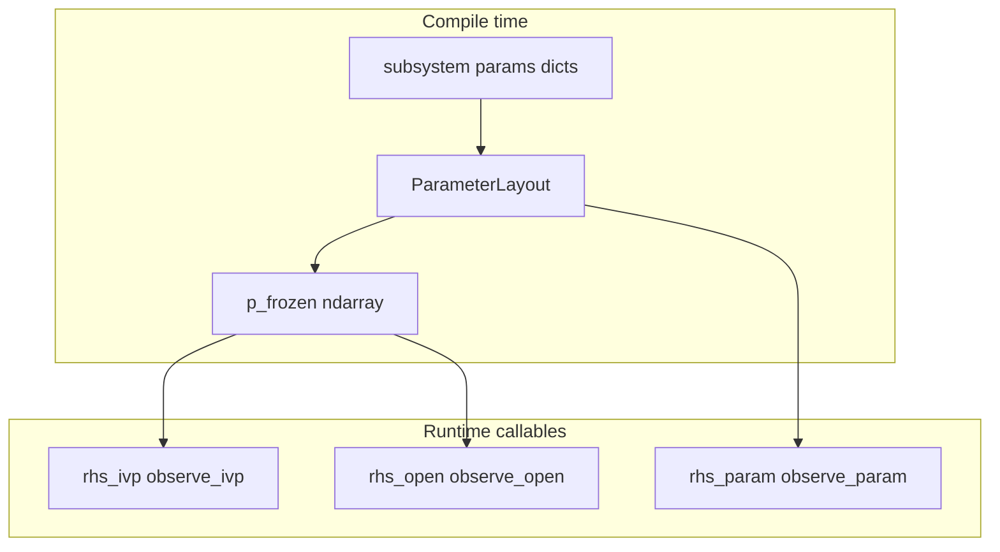

# Compiled system API plan

**Status:** design / not yet implemented. Tracked on the roadmap: [ROADMAP.md](ROADMAP.md) (Main TODO — compilation API).

**Summary:** Compilation packs authoring-time dict `params` into a 1D array `p`, records a **ParameterLayout**, and stores a **frozen copy `p_frozen`** for fixed-parameter tiers. The public compiled surface centers on **six array-only RHS/observe callables** (scalar `t`): `rhs_ivp` / `rhs_open` / `rhs_param` and `observe_*`. On top of that, a wide **`DynamicsEvaluator`**-style API (steps, rollouts, Jacobians, JIT factories, batched rollouts) defines the **full evaluation surface**; many members may **`raise NotImplementedError`** until each backend catches up. The **authoritative method list and shapes** are in **Public `DynamicsEvaluator` interface (detailed specification)** below. **Hand-written JAX** dict `params` (PyTree) remains valid alongside flat **`p`**; see **JAX: dict params (PyTrees) vs compiled flat `p`**.

### Implementation priority (current)

**P0 — Lock the public interface (do this before other compile refactors):**

- Land **`DynamicsEvaluator`** as the **stable name** in code: `typing.Protocol` and/or `DynamicsEvaluatorBase` (`abc.ABC`) in [`minilink/compile/`](minilink/compile/) with **full method signatures** from **Public `DynamicsEvaluator` interface (detailed specification)** below.
- Default bodies: **`raise NotImplementedError`** (or abstract for the six **`rhs_*` / `observe_*`** only, per plan); **no** requirement to wire diagram/leaf compile or `p_frozen` yet.
- Re-export the Protocol/ABC from [`minilink/compile/__init__.py`](minilink/compile/__init__.py); add a short pointer in [DESIGN.md](DESIGN.md) §4.2 to this plan.
- **Goal:** importers and tests can depend on **names and signatures**; implementation phases (**DE-0 … DE-5**, `ParameterLayout`, pack/unpack, backend wiring) follow **after** P0 is merged.

**P1+ — After P0:** `ParameterLayout` + compile pipeline, **`rhs_*` / `observe_*`** on evaluators, `p_frozen`, diagram parametric tier, then **DE-0 … DE-5** (steps, rollouts, JAX tools). Do **not** treat backend or pipeline work as blocking **P0** unless a signature decision truly requires it—resolve signature questions in the **plan + stub module** first.

---

## Problem

[`minilink/compile/numpy_backend.py`](minilink/compile/numpy_backend.py) / [`minilink/compile/jax_backend.py`](minilink/compile/jax_backend.py) are diagram-centric (`compute_outputs` = subsystem ports, dict `bound_params` per op). The target is a **system-agnostic** compiled surface: **dict stays in the modeling layer**; **compilation** produces **numeric layout + frozen parameter vector** and **pure-style callables** that only see **arrays and scalar time**.

## Compilation contract (dict → array, frozen snapshot)

1. **Scan** all participating parameters (leaf: `sys.params`; diagram: each subsystem’s `params` in deterministic order — e.g. sorted `sys_id`, sorted keys within each dict). Only **numeric** entries participate initially (same scope as DESIGN §4.1).
2. **Build `ParameterLayout`**: total length `p_dim`, per-entry slice/shape for unpack (and optional metadata for debugging).
3. **Pack** into **`p_frozen`**: a **1D `ndarray`** (JAX compile uses same shape/dtype rules). This is a **deep numeric snapshot at compile time** (like today’s `bind_params`, but **canonical storage is `p`**, not dict).
4. **Expose** on the compiled artifact:
   - `layout` (read-only)
   - `p_frozen` (read-only copy; or immutable view)
   - `p_dim: int`
   - Optional **`unpack(p) -> nested dict`** for tooling only — **not** passed into the fast callables.

**Tier semantics (what uses `p_frozen`)**

| Tier | Dynamics | What is fixed |
|------|----------|----------------|
| 1 | `rhs_ivp(x, t) -> dx` | **`u` = `u_frozen`** and **`p` = `p_frozen`** (both closed at compile or bind time) |
| 2 | `rhs_open(x, u, t) -> dx` | **`p` = `p_frozen`** only; `u` varies |
| 3 | `rhs_param(x, u, t, p) -> dx` | Caller supplies **`p`** (same layout as `p_frozen`; typically shape `(p_dim,)`) |

**Outputs (concatenated subsystem output ports, stable topological order)**

| Tier | Signature | Fixed |
|------|-----------|--------|
| 1 | `observe_ivp(x, t) -> y` | `u_frozen`, `p_frozen` |
| 2 | `observe_open(x, u, t) -> y` | `p_frozen` |
| 3 | `observe_param(x, u, t, p) -> y` | nothing |

**Argument types (public API)**

- **`x`**, **`u`**, **`p`**: real **1D arrays** (NumPy or JAX; same shape contracts). No dicts in callables.
- **`t`**: **scalar** `float` (or JAX scalar compatible with tracing); document for JAX.
- **`dx`**, **`y`**: 1D arrays.

Backends return the **same six signatures** whether implementations are pure NumPy, JAX, or **`jax.jit`**-wrapped.

## JAX: dict `params` (PyTrees) vs compiled flat `p`

This section integrates the usual JAX guidance for **`dx = f(x, u, t, params)`** with **`params` a `dict`** (e.g. mass, length, inertia as scalars or small arrays) and clarifies how that coexists with this plan’s **array-only `rhs_param(x, u, t, p)`**.

### When a dict works well with `jit` / `grad`

JAX treats nested dicts/lists/tuples as **PyTrees**: leaves are arrays and scalars; structure is preserved in **`jax.grad`** (gradient has the same tree structure as the argument). For dynamics where parameters only appear in **math** (multiply, add, `jnp.sin`, etc.), a dict of physical constants is **natural and efficient**.

**Requirements / caveats**

- **Do not mutate** `params` in-place inside `f` (`pop`, `update`, item assignment). Treat inputs as immutable; compute results from them.
- **Stable structure:** fixed set of keys and value **shapes** across calls. Changing which keys exist or tensor shapes can force **recompilation** (new PyTree structure).
- **Control flow and shapes:** if Python `if` / `for` or array **shapes** depend on dict entries (e.g. `if params["mode"] == 1` or `jnp.zeros(params["n"])`) those values are effectively **compile-time**. Use **`static_argnums` / `static_argnames`** for that subtree, or refactor so only **array math** depends on traced values—otherwise **tracer errors** or frequent recompiles.

So: **dict params for robotics-style `f` (mass, length, …) in pure math** → typically **no** special casing beyond immutability and stable keys.

### How this relates to minilink’s **flat `p`**

| Layer | Parameter form | Role |
|--------|----------------|------|
| **Authoring** (`System.params`, subsystems) | Nested **dict** | Human-readable blocks; matches existing minilink. |
| **Hand-written JAX dynamics** (outside or inside a block) | **Dict** PyTree | Fine for `jit`/`grad`/`vmap` when rules above hold. |
| **Compiled public API (tier 3)** | 1D **`p`** | Single layout for **NumPy + JAX + diagrams**; **injection** into plans; one obvious target for **`grad(..., argnums=…)`** when you want a **vector** optimizer. |

The compiler **packs** dict → **`p`** and can **unpack** inside closures to call existing **`f(x, u, t, params_dict)`**. Going the other way, a user can **`grad`** w.r.t. **`p`** and map back through **`layout`** for named reporting. Optional **JAX-only** helpers could also expose **`rhs_param` composed with `unpack`** for dict-shaped derivatives without changing the **canonical** six-signature contract.

**Summary:** dict params are **excellent** for JAX-native **scalar** dynamics code; the **compiled artifact** still standardizes on **`p`** at the boundary so diagrams and NumPy stay aligned and optimization sees one vector.

### Future JAX toolbox (above the core six callables)

Superseded in detail by **Public `DynamicsEvaluator` interface** below. Quick reference:

| Level | Utility | JAX tool | Typical use |
|------|---------|----------|-------------|
| 0 | Dynamics | `f` / `rhs_*` | Simulation, optimization kernels. |
| 1 | Linearization | `jax.jacobian` / `jacfwd` | LQR, MPC, linearization, sensitivity. |
| 2 | Discrete step | RK4 / midpoint, `jit` | Discrete-time maps, fixed-step sim. |
| 3 | Rollout | `jax.lax.scan` over time | Trajectory for `u_sequence`, `dt`. |
| 4 | Batch rollout | `jax.vmap` | Monte Carlo, ensembles, GPU batching. |
| 5 | Optimization | `jax.grad` / `value_and_grad` | System ID, shooting. |

**Parallel rollouts:** batch dimensions on `x0`, `u_sequence`, or **`p`**; **`in_axes`** must match the batched structure.

**Note:** Adaptive step / events → libraries (e.g. Diffrax) or custom VJP; plan targets **fixed-step** first.

## “Pure” callables (intent)

**Contract:** At the **compiled boundary**, `rhs_*` / `observe_*` must **not** read live `subsystem.params` or other mutable model state for parameter values. Parameters enter only via **`p_frozen`** (tiers 1–2) or **`p`** (tier 3). **`u`** enters only via **`u_frozen`** (tier 1) or **`u`** (tiers 2–3).

Python cannot enforce purity of user `f`/`compute`; this is **documented** + tested for the **compiler-generated** closure behavior (no accidental fallback to `self.params` in tier 1–2 when “compiled pure” mode is requested).

*Migration note:* Today’s `bind_params=False` path passes `None` and blocks read **live** dicts. The new story may split **modes**: e.g. `compile(..., pure_params=True)` → always `p_frozen` + array-only tiers vs a legacy “live dict” path. Exact flag name TBD during implementation; plan assumes **default compiled artifact matches frozen-`p` semantics** for tiers 1–2.

## Naming convention (recommended)

Avoid opaque **`f1` / `f2` / `f3`**. Use **parallel suffixes** on **dynamics** vs **observations**:

| Tier | Role | Dynamics | Outputs (concat ports) |
|------|------|----------|-------------------------|
| 1 | IVP / fixed drive | **`rhs_ivp`** | **`observe_ivp`** |
| 2 | Open-loop input | **`rhs_open`** | **`observe_open`** |
| 3 | Parametric | **`rhs_param`** | **`observe_param`** |

**Rationale**

- **`rhs_*`**: standard ODE “right-hand side” language, distinct from output map.
- **`observe_*`**: clear that this is **measured / concatenated outputs**, not internal diagram signals.
- **`_ivp` / `_open` / `_param`**: one suffix family; `_ivp` matches SciPy `(t,x)` adapter; `_open` = time-varying `u`; `_param` = explicit `p`.

**Alternatives** (if you prefer shorter): `dx_ivp` / `dx_open` / `dx_p` and `y_ivp` / `y_open` / `y_p` — shorter but `y_p` is easy to misread; **`observe_param`** is clearer.

**Grouping in code** (optional ergonomics):

```python
@dataclass(frozen=True)
class DynamicsCallables:
    ivp: Callable[..., ndarray]      # (x, t)
    open_loop: Callable[..., ndarray]  # (x, u, t)
    parametric: Callable[..., ndarray] # (x, u, t, p)

@dataclass(frozen=True)
class ObserveCallables:
    ivp: Callable[..., ndarray]
    open_loop: Callable[..., ndarray]
    parametric: Callable[..., ndarray]
```

Public docs can still refer to **`rhs_ivp`** = `dynamics.ivp`, etc.

**SciPy:** `as_scipy_rhs()` → `(t, x) -> dx` implemented as `lambda t, x: rhs_ivp(x, t)` (order swap only).

## Public `DynamicsEvaluator` interface (detailed specification)

**Authoritative public contract** for the new evaluator API. Re-export from [`minilink/compile/__init__.py`](minilink/compile/__init__.py) when stable.

### Goals

- One **importable abstraction** for **`dx = f(x, u, t)`** with parameters as **`p_frozen`** or explicit **`p`** (1D).
- **Array-only** runtime arguments (except scalar **`t`**); **no dict** in public callables.
- **Wide surface**: steps, rollouts, Jacobians, JIT/`vmap` factories. Unimplemented methods **`raise NotImplementedError`** with a short message **or** are omitted from a **`Protocol`** until implemented—pick one style per module and document it.

### Module layout (recommended)

| Symbol | Role |
|--------|------|
| `DynamicsEvaluator` | `typing.Protocol` listing intended methods (optional `@runtime_checkable`). |
| `DynamicsEvaluatorBase` | `abc.ABC`: **`rhs_*` / `observe_*` abstract**; other methods default to **`NotImplementedError`**. |
| `NumpyDynamicsEvaluator` | Wraps [`NumpyEvaluator`](minilink/compile/numpy_backend.py) + layout / `p_frozen`. |
| `JaxDynamicsEvaluator` | Wraps [`JaxEvaluator`](minilink/compile/jax_backend.py) + JAX helpers. |
| `DiagramDynamicsEvaluator` | Extends base with diagram port/signal API. |

**Factory (later):** `compile_dynamics_evaluator(model, backend=..., ...)` returning the concrete class. Until then, construct **`DynamicsEvaluatorBase`** subclasses from an existing compiled evaluator.

### Array typing

- **NumPy:** `numpy.ndarray`
- **JAX:** `jax.Array` (or `Any` in stubs when JAX optional)
- **`ArrayLike`:** 1D real vector; document **`dtype`** consistency with compile time.

### Global conventions

| Quantity | Shape | Notes |
|----------|--------|--------|
| `n` | | `state_dim` |
| `m` | | `input_dim`; `m == 0` allowed (`u` shape `(0,)`). |
| `p_dim` | | `param_dim` |
| `r` | | `output_dim` (concatenated default outputs) |
| `x` | `(n,)` | |
| `u` | `(m,)` | |
| `p` | `(p_dim,)` | tier 3 |
| `dx` | `(n,)` | |
| `y` | `(r,)` | |
| `t`, `t0`, `dt` | scalar | `float` or 0-d JAX array |
| `u_sequence` | `(T, m)` | **T** steps; row `k` = control for step `k → k+1`. |
| `x_trajectory` | `(T + 1, n)` | index `0` = `x0`. |
| `y_trajectory` | `(T + 1, r)` | aligned with **`x_trajectory`** (see **F**). |

**Suffixes**

- **`_ivp`:** fixed **`u_frozen`**, **`p_frozen`**; signatures omit **`u`** / **`p`**.
- **`_open`:** caller **`u`**; **`p_frozen`** fixed.
- **`_param`:** caller **`u`** and **`p`**.

### A. Metadata (read-only properties)

```text
state_dim: int
input_dim: int
output_dim: int
param_dim: int
p_frozen: ndarray          # (p_dim,)
u_frozen: ndarray          # (m,) for *_ivp; zeros if no external inputs
layout: ParameterLayout | None
backend: Literal["numpy", "jax"]   # optional introspection
```

### B. Core dynamics and observations

```text
def rhs_ivp(self, x: ArrayLike, t: float) -> ArrayLike: ...
def rhs_open(self, x: ArrayLike, u: ArrayLike, t: float) -> ArrayLike: ...
def rhs_param(self, x: ArrayLike, u: ArrayLike, t: float, p: ArrayLike) -> ArrayLike: ...

def observe_ivp(self, x: ArrayLike, t: float) -> ArrayLike: ...
def observe_open(self, x: ArrayLike, u: ArrayLike, t: float) -> ArrayLike: ...
def observe_param(self, x: ArrayLike, u: ArrayLike, t: float, p: ArrayLike) -> ArrayLike: ...
```

**Returns:** `rhs_*` → **`dx`** `(n,)`; `observe_*` → **`y`** `(r,)`.

### C. SciPy bridge

```text
def as_scipy_rhs(self) -> Callable[[float, ndarray], ndarray]:
    """(t, x) -> dx for scipy.integrate.solve_ivp."""
```

**Impl:** `lambda t, x: self.rhs_ivp(x, t)`.

### D. Single-step integrators (explicit, fixed `dt`)

**Euler**

```text
def euler_step_ivp(self, x, t, dt) -> ArrayLike:
    """x_next = x + dt * rhs_ivp(x, t)."""

def euler_step_open(self, x, u, t, dt) -> ArrayLike:
    """x_next = x + dt * rhs_open(x, u, t)."""

def euler_step_param(self, x, u, t, dt, p) -> ArrayLike:
    """x_next = x + dt * rhs_param(x, u, t, p)."""
```

**RK4 — `u` and `p` constant across the four stages of that step** (ZOH). Stage times: `t`, `t+dt/2`, `t+dt/2`, `t+dt`.

```text
def rk4_step_ivp(self, x, t, dt) -> ArrayLike: ...
def rk4_step_open(self, x, u, t, dt) -> ArrayLike: ...
def rk4_step_param(self, x, u, t, dt, p) -> ArrayLike: ...
```

**Reference:**  
`k1 = f(x, t)`; `k2 = f(x + dt/2*k1, t + dt/2)`; `k3 = f(x + dt/2*k2, t + dt/2)`; `k4 = f(x + dt*k3, t + dt)`;  
`x_next = x + dt/6 * (k1 + 2*k2 + 2*k3 + k4)`  
where **`f`** is the matching **`rhs_*`**.

**Placeholders:** `implicit_midpoint_step_ivp` / `_open` / `_param` → **`NotImplementedError`** in v1.

**Later:** generic `rk_step_*(..., butcher=...)`, symplectic splits; adaptive solvers via optional deps (e.g. Diffrax).

### E. Forward integration (rollout)

**Time at step `k`:** `t_k = t0 + k * dt` when evaluating RHS at **step start** (document if changed).

**IVP**

```text
def integrate_euler_ivp(self, x0, t0, dt, n_steps: int) -> ArrayLike:
    """n_steps >= 0. Return shape (n_steps + 1, n)."""

def integrate_rk4_ivp(self, x0, t0, dt, n_steps: int) -> ArrayLike: ...
```

**Open / param** — **`u_sequence`** shape **`(T, m)`** ⇒ **`T`** steps, return **`(T + 1, n)`**.

```text
def integrate_euler_open(self, x0, t0, dt, u_sequence) -> ArrayLike: ...
def integrate_euler_param(self, x0, t0, dt, u_sequence, p) -> ArrayLike: ...
def integrate_rk4_open(self, x0, t0, dt, u_sequence) -> ArrayLike: ...
def integrate_rk4_param(self, x0, t0, dt, u_sequence, p) -> ArrayLike: ...
```

**Optional dispatch**

```text
def integrate_ivp(self, x0, t0, dt, n_steps, *, method: Literal["euler", "rk4"] = "rk4") -> ArrayLike: ...
def integrate_open(self, x0, t0, dt, u_sequence, *, method: Literal["euler", "rk4"] = "rk4") -> ArrayLike: ...
```

**Callback control (NumPy-first, optional)**

```text
def integrate_rk4_open_from_u_of_t(
    self, x0, t0, dt, n_steps: int, u_of_t: Callable[[float], ArrayLike]
) -> ArrayLike:
    """u = u_of_t(t) at each substep. JAX: often NotImplemented."""
```

### F. Observation along a trajectory

**Convention:** **`y_trajectory`** shape **`(T + 1, r)`**, row **`k`** = **`observe_*`** at **`x_trajectory[k]`** with time **`t_k = t0 + k*dt`**.

**Open:** for **`k = 0, …, T-1`**, use **`u_sequence[k]`** with **`observe_open(x_trajectory[k], u_sequence[k], t_k)`**. For **`k == T`**, use **`u_sequence[T-1]`** (last hold) **unless** documented otherwise (alternative: zero **`u`**—pick one and test).

```text
def observe_trajectory_ivp(self, x_trajectory, t0, dt) -> ArrayLike: ...
def observe_trajectory_open(self, x_trajectory, u_sequence, t0, dt) -> ArrayLike: ...
def observe_trajectory_param(self, x_trajectory, u_sequence, t0, dt, p) -> ArrayLike: ...
```

### G. Differentiation and linearization (JAX-first)

**Jacobian layout:** **`∂(output vector) / ∂(input column)`** → **`jacobian_rhs_wrt_x_open`** is **`(n, n)`**.

```text
def jacobian_rhs_wrt_x_open(self, x, u, t) -> ArrayLike:      # (n, n)
def jacobian_rhs_wrt_u_open(self, x, u, t) -> ArrayLike:      # (n, m)
def jacobian_rhs_wrt_p_param(self, x, u, t, p) -> ArrayLike:   # (n, p_dim)

def jacobian_observe_wrt_x_open(self, x, u, t) -> ArrayLike:   # (r, n)
def jacobian_observe_wrt_u_open(self, x, u, t) -> ArrayLike:   # (r, m)
def jacobian_observe_wrt_p_param(self, x, u, t, p) -> ArrayLike:  # (r, p_dim)
```

**Optional:** `_ivp` / `_param`-only Jacobian variants, or thin wrappers around **`_open`** / **`_param`**.

**Linearization**

```text
@dataclass(frozen=True)
class Linearization:
    A: ArrayLike   # (n, n) = ∂f/∂x
    B: ArrayLike   # (n, m) = ∂f/∂u
    C: ArrayLike | None  # (r, n) = ∂h/∂x
    D: ArrayLike | None  # (r, m) = ∂h/∂u

def linearize_open(self, x, u, t) -> Linearization: ...
def linearize_param(self, x, u, t, p) -> Linearization: ...
```

**Low priority:** `hessian_rhs_wrt_x_open`, `value_and_grad_rollout_loss` (may live under **`planning/`**).

### H. JIT and `vmap` factories (JAX)

Return callables with the **same signatures** as the non-JIT methods.

```text
def jit_rhs_ivp(self) -> Callable: ...
def jit_rhs_open(self) -> Callable: ...
def jit_rhs_param(self) -> Callable: ...
def jit_observe_open(self) -> Callable: ...
def jit_observe_param(self) -> Callable: ...
def jit_rk4_step_open(self) -> Callable: ...
def jit_rk4_step_param(self) -> Callable: ...
def jit_integrate_rk4_ivp(self) -> Callable: ...
def jit_integrate_rk4_open(self) -> Callable: ...
def jit_integrate_rk4_param(self) -> Callable: ...
```

**Batched rollouts** — document **`in_axes`** in docstrings.

```text
def vmap_integrate_rk4_open(
    self, *, in_axes_x0: int | None = 0, in_axes_u_sequence: int | None = 0
) -> Callable:
    """e.g. (B,n), (B,T,m) -> (B,T+1,n)."""

def vmap_integrate_rk4_param(self, *, in_axes_p: int = 0, ...) -> Callable: ...
```

**NumPy:** all **H** → **`NotImplementedError`**.

### I. Validation and diagnostics

```text
def validate_inputs(
    self, x: ArrayLike | None = None, u: ArrayLike | None = None, p: ArrayLike | None = None
) -> None: ...

def energy(self, x, t) -> float: ...                    # NotImplemented placeholder
def lyapunov_candidate(self, x, t) -> float: ...       # NotImplemented placeholder
```

### J. Diagram extension (`DiagramDynamicsEvaluator`)

```text
def observe_ports_open(
    self, x: ArrayLike, u: ArrayLike, t: float, ports: list[tuple[str, str]]
) -> ArrayLike: ...

def observe_ports_param(
    self, x: ArrayLike, u: ArrayLike, t: float, p: ArrayLike, ports: list[tuple[str, str]]
) -> ArrayLike: ...

def signals_vector_open(self, x, u, t) -> ArrayLike: ...
def signals_dict_open(self, x, u, t) -> dict[str, ArrayLike]: ...

# *_ivp / *_param mirrors optional
```

Ports: **`(sys_id, port_id)`**; dict keys **`"sys_id:port_id"`**.

### Phased implementation

| Phase | Deliver |
|--------|---------|
| **P0** | **Public interface only** (see **Implementation priority** at top): Protocol/ABC + exports + DESIGN pointer; stubs only. |
| **DE-0** | `DynamicsEvaluatorBase` + `NotImplemented` defaults; **B** wired to `compute_dx` / `compute_outputs`. |
| **DE-1** | **A, B, C** + **D** Euler/RK4 + **E** rollouts (NumPy). |
| **DE-2** | **F** trajectory observations + **I** `validate_inputs`. |
| **DE-3** | **JaxDynamicsEvaluator**: **B–E** + **H** JIT + `lax.scan` rollouts. |
| **DE-4** | **G** Jacobians + `linearize_*`. |
| **DE-5** | **H** `vmap_*` + **J** diagram methods. |

### Relation to the six-callable core

**B** is the **kernel**. **C–I** are **derived** (NumPy loops vs JAX **`scan` / `jit` / `jacobian`**). Implement in [`dynamics_evaluator.py`](minilink/compile/dynamics_evaluator.py) to avoid bloating [`numpy_backend.py`](minilink/compile/numpy_backend.py) / [`jax_backend.py`](minilink/compile/jax_backend.py).

## Diagram layer (additional API)

Keep **diagram-only** methods separate from the six core callables, e.g. `DiagramCompiled` protocol:

- **Port-selective** outputs: `observe_ports(...)` (see **J** above).
- **Internal signal vector / dict** for debugging: `signals_vector`, `signals_dict` (today’s `compute_internal_signals*`).

Core **`observe_*`** remain **concatenated default** (all output ports, topological order), **same `p` semantics** as dynamics.

## Implementation notes

- **Internal:** Tier 1–2 may **unpack `p_frozen` to dict** only inside generated closures before calling existing **`f(x,u,t,params)`** — no user-visible dict.
- **Diagram tier 3:** Prefer **inject `p` → per-op slices** (DESIGN parameterized plan) so one `p` drives all blocks; same layout as pack from diagram dicts.
- **v1:** Leaf + layout + `rhs_param`/`observe_param` first; diagram parametric tier can follow once plan injection exists; diagram **ivp/open** can ship with `p_frozen` early.

## Migration (existing evaluators)

- Map **`compute_dx` → `rhs_open`**, **`compute_outputs(..., ports=None)` → `observe_open`** (same `x,u,t`; add **`p`** only on **`_param`** methods).
- Deprecation cycle optional; tests assert numerical parity.

## Files likely touched (implementation phase)

- New: [`minilink/compile/`](minilink/compile/) — `parameter_layout.py` (or merge into `parameterized.py`), protocol + `CompiledCallables` bundles; **`dynamics_evaluator.py`** for `DynamicsEvaluator` / `DynamicsEvaluatorBase` and defaults.
- [`minilink/compile/compiler.py`](minilink/compile/compiler.py), backends, [`minilink/compile/__init__.py`](minilink/compile/__init__.py).
- [DESIGN.md](DESIGN.md) §4.2.



## Implementation checklist (mirrors roadmap)

- [ ] **P0 — `DynamicsEvaluator` public interface:** add `DynamicsEvaluator` Protocol + `DynamicsEvaluatorBase` (signatures per detailed spec), `__init__.py` exports, DESIGN.md §4.2 link; stubs/`NotImplemented` only — **before** pipeline or backend refactors.
- [ ] **Protocols & bundles:** `CompiledArtifacts` (or equivalent) with `layout`, `p_frozen`, dims, nested dynamics/observe triples; `ParameterLayout` + pack/unpack from diagram/leaf dicts.
- [ ] **Compile pipeline:** build layout, pack `p_frozen` at compile time; tier 1/2 close over `p_frozen` (and tier 1 over fixed `u`); tier 3 takes caller `p`.
- [ ] **Diagram parametric:** `rhs_param` / `observe_param` via inject-`p` into plan ops (see DESIGN); until ready, stub or clear error.
- [ ] **Evaluators:** `NumpyEvaluator` / `JaxEvaluator` implement triples; optional JIT preserving signatures; alias or migrate `compute_dx` → `rhs_open`.
- [ ] **Docs & tests:** DESIGN.md §4.2; tests for pack/layout round-trip, frozen `p` vs live dict drift, triple equivalence, SciPy (`rhs_ivp`).
- [ ] **`DynamicsEvaluator` implementation (after P0):** wire concrete classes per **Public `DynamicsEvaluator` interface**; follow **DE-0 … DE-5**.
