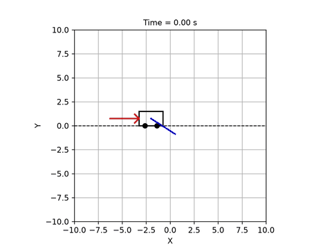
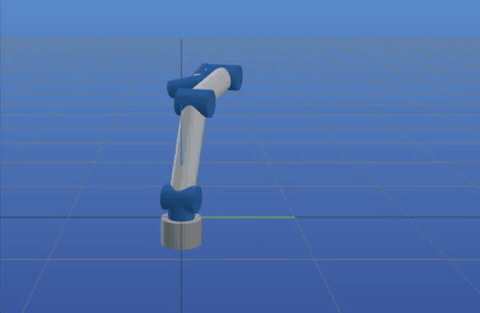
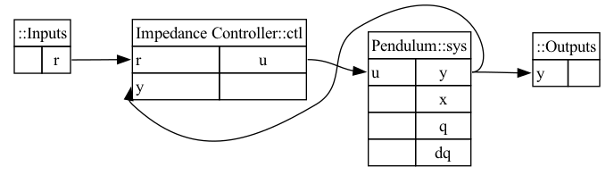
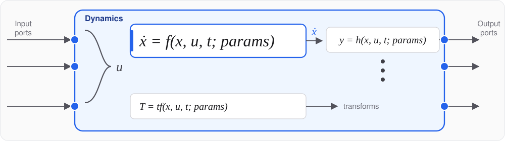
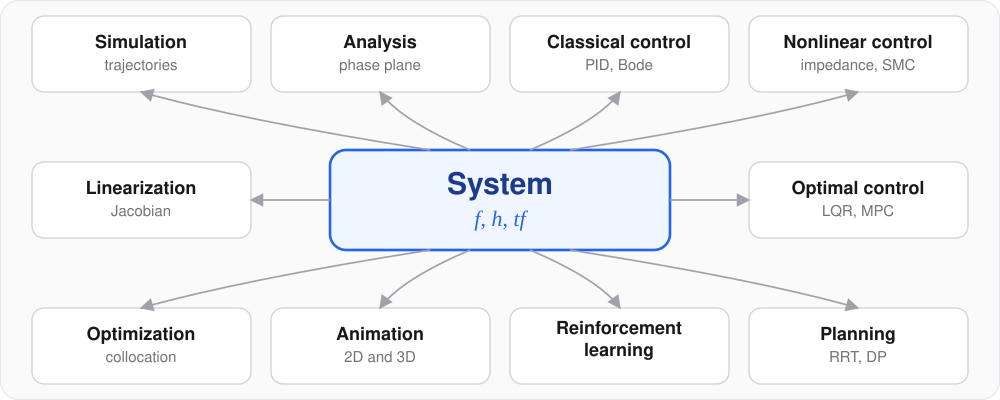

# minilink

**Write the equations once. Simulate, analyze, control, plan, optimize, learn.**

[](https://colab.research.google.com/github/alx87grd/minilink/blob/main/examples/tutorial/showcase_minilink.ipynb)
[](https://alx87grd.github.io/minilink/)
[](LICENSE)

<table>
  <tr>
    <td width="50%" align="center" valign="bottom">
      
    </td>
    <td width="50%" align="center" valign="bottom">
      
    </td>
  </tr>
  <tr>
    <td width="50%" align="center" valign="top">
      cart-pole swing-up by trajectory optimization
    </td>
    <td width="50%" align="center" valign="top">
      UR5, task-space impedance control
    </td>
  </tr>
</table>

Minilink is an open-source Python toolbox for dynamical systems and control.
A model is a short class whose equations read like the textbook, and diagrams
are built from models with `+`, `>>` and `@`. Because every model, controller
and diagram is the same kind of object, one set of tools applies to all of
them: simulation and animation in 2D and 3D, frequency-domain analysis,
classical and state-space control, value iteration, sampling-based planning, trajectory
optimization, model predictive control and reinforcement learning. The same
equations compile and differentiate under JAX, so a course model is also a
research model.

## Ten lines

```python
from minilink import ImpedanceController, Pendulum

controller = ImpedanceController()
plant = Pendulum()

plant.x0[0] = 2.0
plant.params["l"] = 5.0
plant.params["m"] = 1.0

diagram = controller @ plant
diagram.compute_trajectory(tf=10.0)
diagram.plot_diagram()
diagram.plot_trajectory()
diagram.animate()
```



## What is a System

A model is dynamics `f`, outputs `h` and body poses `tf`, functions of the
state `x`, the input `u`, the time `t` and the parameters `params`:

    dx/dt = f(x, u, t; params)      dynamics
    y     = h(x, u, t; params)      one per output port, default y = x
    T     = tf(x, u, t; params)     body poses, for animation



Write `f`, and the plant simulates and plots. Add `tf` and a skin, and it
animates on matplotlib, plotly, meshcat (3D) or pygame, and you can drive it
from the keyboard:

```python
import numpy as np
from minilink import DynamicSystem, Step
from minilink.core.kinematics import translation
from minilink.graphical.animation.primitives import Box, ground_line


class MassSpringDamper(DynamicSystem):
    # m p'' + c p' + k p = u

    def __init__(self):
        super().__init__(n=2, input_dim=1, output_dim=2)
        self.params = {"m": 1.0, "k": 4.0, "c": 0.3}
        self.skin = lambda sys: {
            "world": [ground_line(length=8.0)],
            "body": [Box(length_x=0.6, length_y=0.6, length_z=0.1)],
        }
        self.camera_scale = 4.0

    def f(self, x, u, t=0, params=None):
        p = self.params if params is None else params
        pos, vel = x
        acc = (u[0] - p["c"] * vel - p["k"] * pos) / p["m"]
        return np.array([vel, acc])

    def tf(self, x, u, t=0, params=None):
        return {"body": translation(x[0], 0.0, 0.0)}


msd = MassSpringDamper()
msd.x0[0] = 1.0
loop = Step(final_value=np.array([10.0]), step_time=2.0) >> msd
loop.compute_trajectory(tf=20.0)
loop.animate()  # renderer="plotly" | "meshcat" | "pygame"
# msd.game()    # keyboard drives u, live
```

`f`, `h` and `tf` are functions of `(x, u, t; params)` only: no hidden state on
the object. That one convention is what lets a model compose into diagrams,
run in batches and differentiate later. A diagram flattens to one state vector
and one `f`, so a closed loop linearizes, animates and nests like a plant.

## One model, every tool



| Verb | Call |
| --- | --- |
| Simulate | `plant.compute_trajectory(tf=10.0)` |
| Frequency domain | `plot_bode(plant, x_bar)`, `plot_root_locus(C >> G)` |
| Classical loop | `PID(Kp, Ki, Kd) @ plant` |
| State feedback | `lqr_at_operating_point(plant, x_bar, Q, R) @ plant` |
| Robot control | `ComputedTorqueController(arm)`, `JointImpedance(arm)` |
| 3D robots | `UR5Manipulator()`, then `animate(renderer="meshcat", is_3d=True)` |
| Value iteration | `DynamicProgrammingPlanner(problem, x_grid=(101, 101))` |
| Sampling search | `RRTPlanner(problem)` |
| Trajectory optimization | `TrajectoryOptimizationPlanner(problem, transcription="direct_collocation")` |
| Model predictive control | `ModelPredictiveController(planner, dt_mpc=0.1) @ plant` |
| Reinforcement learning | `Sys2Gym(plant, cost)`, then any Gymnasium agent |
| Identification | `plant.jacobian("f", "params", x_bar)` |

The objects between the tools are the textbook's nouns. A `PlanningProblem`
is a system, a cost and boundary sets; every planner takes it and returns a
`Trajectory`:

```python
from minilink import (
    BallSet, DynamicProgrammingPlanner, Pendulum, PlanningProblem,
    QuadraticCost, RRTPlanner, TrajectoryOptimizationPlanner,
)

plant = Pendulum()
x_down, x_up = np.array([0.0, 0.0]), np.array([np.pi, 0.0])
problem = PlanningProblem(
    sys=plant, x_start=x_down, x_goal=x_up, Xf=BallSet(x_up, 0.2), tf=4.0,
    cost=QuadraticCost.from_system(plant, Q=np.eye(2), R=np.eye(1), xbar=x_up),
)

vi = DynamicProgrammingPlanner(problem, x_grid=(101, 101), u_grid=(11,), dt=0.05)
vi.solve()                                   # value iteration on a grid
loop = vi.get_controller() @ plant           # the policy is a controller

rrt = RRTPlanner(problem, seed=0)
tree_traj = rrt.solve().trajectory           # kinodynamic tree search, bang-bang inputs

opt = TrajectoryOptimizationPlanner(problem, n_steps=40, transcription="direct_collocation")
opt_traj = opt.solve().trajectory            # direct collocation
```

Trajectory optimization transcribes the problem into a `MathematicalProgram`
solved by an `Optimizer`; a sampled controller closes the loop on the
continuous plant with `ctl % dt`, zero-order hold included.

## Differentiable and compiled

The same `f` traces under JAX. One evaluator gives exact derivatives, batched
rollouts and gradients through a whole simulation:

```python
ev = plant.compile(backend="jax")

A = plant.jacobian("f", "x", x_bar)               # exact linearization
S = plant.jacobian("f", "params", x_bar)          # sensitivity to each physical parameter
xs = ev.rollout_batch(x0s, n_steps=1000, dt=0.005,
                      params=dict(plant.params, l=lengths))   # a family of rod lengths, one call
```

Measured in the showcase notebook: 1000 rollouts of 1000 RK4 steps take
27 ms as a compiled batch and about 32 s one step at a time in Python
(Apple M4 Max). Derivatives are exact to machine precision, float64 by
default. Under the hood, `compile()` lowers a leaf or a wired diagram to flat
NumPy or JAX primitives (`f`, `rk4_step`, `rk4_integrate_zoh`,
`rollout_batch`); the trace tier (`f_trace`, `f_trace_p`) is what you
differentiate inside your own `jit`. See
[07_compile](examples/tutorial/07_compile.ipynb) and the
[JAX showcase](examples/tutorial/showcase_jax.ipynb).

## Two audiences, one codebase

- **Teaching.** NumPy, SciPy and Matplotlib are enough for simulation, phase
  planes, animation, linearization, LQR and value iteration. Runs in Colab
  from one setup cell. One import line covers a course:
  `from minilink import Pendulum, PID, lqr, PlanningProblem`.
- **Research.** Optional JAX for compile and autodiff, Ipopt for large NLPs,
  meshcat for 3D, a hybrid stack for sampled MPC, a Gymnasium bridge for RL.
  Every catalog plant compiles on both backends.

The boundary between the two is a contract, not a convention:
[ROADMAP.md §2](ROADMAP.md#2-two-lanes).

## Install

Python 3.10+. Recommended: the conda environment from
[`environment.yml`](environment.yml).

```bash
git clone https://github.com/alx87grd/minilink.git && cd minilink
conda env create -f environment.yml && conda activate minilink
conda env config vars set PYTHONPATH="$PWD" && conda deactivate && conda activate minilink
```

Or open any notebook in Colab: the first cell clones the repository. Basic
tier, pip, and options: [install.md](install.md).

## Learn more

- [Showcase notebook](examples/tutorial/showcase_minilink.ipynb), the tool ladder on real plants
- [JAX showcase](examples/tutorial/showcase_jax.ipynb), write `f` once, get every gradient
- [From RL to Bode showcase](examples/tutorial/showcase_from_rl_to_bode.ipynb), six-axis robot, impedance loop, neural policy, frequency response and Lyapunov certificates
- [Tutorial series 00–11](examples/tutorial/), one notebook per package (core dynamics to reinforcement learning)
- [Teaching notebooks](examples/teaching/), swing-up, DP, PPO, robot equations of motion
- [Examples index](examples/README.md), demos and projects by chapter
- [API reference](https://alx87grd.github.io/minilink/), [DESIGN.md](DESIGN.md), [ROADMAP.md](ROADMAP.md), [tests](tests/README.md)

Minilink is the successor of [pyro](https://github.com/SherbyRobotics/pyro),
the toolbox behind the robotics and control courses at Université de
Sherbrooke. MIT license.
