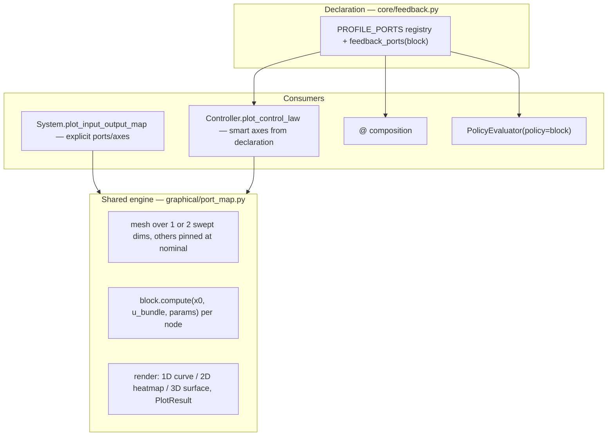

# Feedback-port declaration: tool context for `@` composition and `plot_control_law`

Design writeup, v4. **Core principle: control blocks do not change.** A
controller is a `System` with explicit ports and `ctl` as the port compute —
`ctl` *is* the control law, exactly as today. The `feedback_profile` string
(already on every controller) plus optional port-role attrs give **tools**
the context they need: `@` composition learns the standard way to wire the
block to a plant, and plotting learns what the control law of this block is
and which slice of it a textbook would draw.

No behavioral base class. No `control_law` method. No hidden rewiring. The
only class addition is a thin `Controller(System)` **marker/facade** (§2) —
no ports, no state, no `ctl` involvement — so that `plot_control_law` does
not pollute plants and generic blocks. The deliverables are a
declaration-resolution helper, a smarter `@`, and two plotting tools:
generic `plot_input_output_map` and smart `plot_control_law()` (zero-arg
picks the right axes per profile, heatmap or `show_3d=True` surface,
component selection for high-dim signals).

§1 the declaration; §2 the user-facing plotting API; §3 before → after in
real demos; §4 composition; §5 engine; §6 dynamic laws; §7 phases; §8
decision record.

Status: **Draft v4.2 — metadata + marker architecture, dynamic-controller
ready** (supersedes the `StaticController` base-class drafts; see §8).
Awaiting maintainer sign-off.

## 1. The declaration: metadata only, no behavior changes

### 1.1 What a block author writes

Nothing structurally new. This is `ProportionalController` after the change —
exactly two words differ from today (base-class marker, §2; profile rename,
§1.2):

```python
class ProportionalController(Controller):   # was System — marker/facade only
    feedback_profile = "error"              # was "output" — names the law family

    def __init__(self, K=1.0):
        super().__init__()
        ...
        self.add_input_port("r", dim=p)
        self.add_input_port("y", dim=p)
        self.add_output_port("u", dim=m, function=self.ctl, dependencies=("r", "y"))

    def ctl(self, x, u, t=0, params=None):
        # the control law — the port compute, as always
        ...
```

A student creating a new controller copies this pattern: ports explicit,
`ctl` holds the math, one string says which feedback family it belongs to.

### 1.2 How tools interpret it

New small module `minilink/core/feedback.py` — a profile registry plus a
resolution helper, importable by both `core/composition.py` and
`graphical/` (respects the dependency law; `planning/` imports neither):

```python
# profile → (measurement_port, ref_port, control_port, plot_semantics)
PROFILE_PORTS = {
    "error":      ("y", "r", "u", "error"),        # u = c(e), e = r − y  (P, PID)
    "output":     ("y", "r", "u", "measurement"),  # u = c(y, r) general (NN / learned policies)
    "state":      ("x", "r", "u", "state"),        # absolute state sweep (LQR)
    "impedance":  ("y", "r", "u", "error_qdq"),    # y=[pos; rate], e / de split
    "modelbased": ("y", "r", "u", "absolute_qdq"), # y=[q; dq], absolute coords
    ...
}

def feedback_ports(block):
    """Resolve (measurement, ref, control) for a block.

    Priority: explicit attrs (measurement_port / ref_port / control_port)
    → PROFILE_PORTS[block.feedback_profile] → None (caller falls back to
    heuristics or errors precisely).
    """
```

**`error` vs `output` (future-proofing):** both wire identically (`y ↔ y`),
but the profile also names the *law family* so the plot default is honest.
`error` means the law is driven by `e = r − y` (P, PID) → sweep error space.
`output` is reserved for general output feedback `u = c(y, r)` where `y` is
used absolutely (learned NN / SB3 policies) → sweep measurement space, no
error transform. `ProportionalController` moves `"output"` → `"error"` —
pre-1.0 clean rename, one line per block plus the module docstrings and the
DESIGN feedback-profiles section.

- **Existing controllers need at most one-line edits** — they already
  declare `feedback_profile`; the registry supplies the standard port names.
  Phase A audits the current strings (`output`, `state`, `impedance`,
  `modelbased`, `task`, `kinematic`, `siso`) against the registry and
  applies the `error` rename where the law is error-driven.
- **Explicit attrs override** the registry for nonstandard blocks:
  `LookupTableController` sets `measurement_port = "x"`, `ref_port = None`;
  MPC sets `control_port = "u_ff"`. Multi-ref blocks
  (`TaskKinematicNullspace` `r_null`) keep custom wiring — out of scope for
  the standard roles.
- Dispatch is duck typing (`getattr`), never `isinstance` — any third-party
  `System` can opt in with two attrs.

This is the whole contract: **strings naming which existing ports play which
role**. Nothing on the block behaves differently.

### 1.3 Undeclared blocks: graceful degradation

Declaring a profile is never required for a block to *work* — it only
unlocks the smart tools:

| Capability | Declared | Undeclared |
| --- | --- | --- |
| Simulate / compile / manual port wiring | works | **works** — the declaration never touches core behavior |
| `ctl @ plant` | declaration-driven, precise errors | falls back to today's name/dim heuristics (`y↔y`, `Mux(q,dq)`, `x↔x`) — still works for conventional port names; otherwise a dim-mismatch error with the hint *"declare feedback_profile (or measurement_port/control_port)"* |
| `plot_input_output_map` | works | **works** — no declaration needed |
| `plot_control_law` | smart textbook slice | unavailable — the module twin raises a precise error naming the two attrs to set |
| `PolicyEvaluator(policy=...)` | accepts the block directly | pass a plain callable, as today |

## 2. The high-level plotting API

`plot_input_output_map` is a thin method on `System` (any block, no feedback
vocabulary). `plot_control_law` does **not** belong on `System` — a pendulum
plant must not carry feedback vocabulary — so it lives on thin
**marker/facade** classes in `core/feedback.py`, one per system kind
(mirroring how the library already composes `DynamicSystem` from
`DynamicSystemFacades` + `System` in [facades.py](../../minilink/core/facades.py)):

```python
class Controller(System):
    """Marker + facade: a System wired as a feedback controller.

    Adds no ports, no state, no behavior — subclasses declare ports and ctl
    exactly like any System. Provides the plot_control_law facade and
    documents the declaration contract (feedback_profile, port-role attrs).
    """

    def plot_control_law(self, **kwargs):
        from minilink.graphical import port_map   # lazy
        return port_map.plot_control_law(self, **kwargs)


class DynamicController(Controller, DynamicSystem):
    """Controller with internal state x (filters, integrators, observers)."""
```

Student-facing class heads read like the textbook taxonomy:

```python
class ProportionalController(Controller): ...        # static law
class FilteredController(DynamicController): ...     # PID with filter/integral states
class LQG(DynamicController): ...                    # future: observer + gain
```

This is an **interface, not the rejected magic base** (§8): the only diff in
each controller file is the base-class word, and authoring a new controller
is unchanged in every other respect. It lives in `core/` so
`LookupTableController` in `planning/` may subclass it without touching
`control/` (dependency law intact). MPC may subclass for the marker too —
its `plot_control_law` refuses cleanly (§5). Third-party blocks that cannot
inherit still get the duck-typed module twin
`graphical.port_map.plot_control_law(block, ...)`.

Both facades share one engine (§5).

### 2.1 `plot_control_law()` — the smart shortcut

Requires a resolvable declaration (§1.2); raises a precise error otherwise
("declare feedback_profile or measurement_port/control_port"):

```python
ctl.plot_control_law(
    x_axis=None, y_axis=None,   # components of the smart sweep space; default: first ones
    u_axis=0,                   # which control component to draw (MIMO u)
    r=None,                     # pin the reference; default: ref-port nominal_value
    space=None,                 # "error" | "measurement" | "state"; default from profile
    bounds=None,                # sweep ranges; default port bounds, else nominal ± range
    grid_shape=(101, 101),
    show_3d=False,              # False → heatmap; True → 3-D surface (same flag as plot_cost2go)
    params=None,                # evaluate with alternative params (trained vs untrained, gain sweeps)
    ax=None, show=True,
)   # -> PlotResult
```

**What the zero-argument call draws, per controller:**

| You type | Law (the block's `ctl`) | Picture |
| --- | --- | --- |
| `prop.plot_control_law()` (SISO) | `u = K e` | line `u(e)` |
| `pd.plot_control_law()` (impedance) | `u = Kp e + Kd de` | heatmap over `(e, de)` |
| `lqr.plot_control_law()` | `u = ubar − K (x − rbar)` | heatmap over `(x0, x1)`, `r` pinned at `rbar` |
| `ct.plot_control_law()` (computed torque) | `τ = ID(q, dq, qdd(e))` | `τ1` over `(q0, dq0)`, other joints at nominal |
| `smc.plot_control_law()` | sliding mode | switching surface over `(q0, dq0)` |
| `planner.get_controller().plot_control_law()` | VI lookup `π(x)` | dense interpolated law over `(x0, x1)` |

The selection logic keys on the profile (via §1.2):

| `feedback_profile` | measurement | sweep space | default axes (x, y) |
| --- | --- | --- | --- |
| `error` (P, PID) | `y` | **error** `e = r − y` | `e[0]` line (SISO) or `(e[0], e[1])` |
| `output` (general `u = c(y, r)`, learned policies) | `y` | **measurement** (absolute, `r` pinned) | `(y[0], y[1])` |
| `state` (LQR / state feedback) | `x` | **state** | `(x[0], x[1])` |
| `impedance` (PD) | `y = [pos; rate]` | **error** `(e, de)` | `(e[0], de[0])` |
| `modelbased` (computed torque, SMC) | `y = [q; dq]` | **absolute** measurement | `(q[0], dq[0])` |
| lookup (VI policy, attrs) | `x` | **state** | `(x[0], x[1])` |

Everything not swept is pinned: `r` at the ref-port `nominal_value`,
remaining measurement components at the port nominal. Axes are labeled from
port metadata; color limits come from the control-port bounds.

**Escape hatches:**

```python
ct.plot_control_law(x_axis=1, y_axis=3, u_axis=1)   # joint-2 slice of a 2-DOF arm, τ2
lqr.plot_control_law(show_3d=True)                  # 3-D surface instead of heatmap
pd.plot_control_law(r=np.array([0.5]))              # non-nominal reference
ct.plot_control_law(space="error")                  # error coords for a modelbased law
nn.plot_control_law(params=trained, ax=axes[1])     # compare parameter sets side by side
```

### 2.2 `plot_input_output_map()` — the simple generic tool

Any block with a static output port, no feedback vocabulary, no declaration
needed:

```python
block.plot_input_output_map(
    in_port=None, out_port=None,   # default: first input port → first output port
    x_axis=0, y_axis=None,         # input components to sweep; y_axis=None → 1-D line
    out_axis=0,                    # output component to plot
    bounds=None, grid_shape=(101, 101),
    show_3d=False, params=None, ax=None, show=True,
)   # -> PlotResult
```

```python
sat.plot_input_output_map()                    # Saturation curve u_out(u_in)
nn.plot_input_output_map(x_axis=0, y_axis=1)   # NeuralNetwork surface u(r, y)
```

### 2.3 Controllers as policies

The declaration also lets evaluators consume blocks directly —
`PolicyEvaluator(problem, grid=grid, policy=lqr)` duck-types a block with
declared roles: it assembles the input bundle (measurement from the grid
state, `r` pinned at nominal) and evaluates the control port. No
`regulation_action` method on blocks; the adaptation lives in the tool.

## 3. Core examples: before → after

### 3.1 `vi_pendulum_lqr.py` — the flagship payoff

Today the demo digs `K` and `ubar` out of `params`, hand-rolls the law as a
grid array, and defines a wrapper function just to hand the LQR law to
`PolicyEvaluator`
([vi_pendulum_lqr.py](../../examples/demos/planning/value_iteration/vi_pendulum_lqr.py)):

```python
# before — 10 lines of manual arrays bypassing the block
def lqr_policy(x):
    x = np.asarray(x, dtype=float).reshape(-1)
    return lqr.params["ubar"] - lqr.params["K"] @ (x - r_nom)

J_lqr = PolicyEvaluator(
    problem, grid=grid, policy=lqr_policy, options=planner.options
).solve()
K = lqr.params["K"][0]
ubar = lqr.params["ubar"][0]
lqr_law = ubar - (grid.states - UPRIGHT) @ K
plotting.plot_value(
    grid, lqr_law, vmin=-TORQUE, vmax=TORQUE, cmap="bwr", title="LQR control law"
)
```

```python
# after — the block is the law; tools read its declaration
J_lqr = PolicyEvaluator(
    problem, grid=grid, policy=lqr, options=planner.options
).solve()
lqr.plot_control_law()                        # u over (θ, dθ), r pinned at UPRIGHT
planner.get_controller().plot_control_law()   # dense VI law, same API, same axes
```

`params["K"]` is never unpacked; torque color limits come from the declared
control-port bounds. The teaching notebook
[pendulum_swing_up_vi_vs_lqr.ipynb](../../examples/learn/teaching/pendulum_swing_up_vi_vs_lqr.ipynb)
hand-rolls the identical `lqr_law = ubar - (grid.states - UPRIGHT) @ K_row`
cell and migrates the same way.

### 3.2 `neural_controller_jax.py` — 45 lines of surface plotting

Today the demo builds its own jit/vmap sweep and matplotlib layout
([neural_controller_jax.py](../../examples/demos/control/neural_controller_jax.py)) —
note it already evaluates the block through `compute`, which is exactly the
engine's evaluation path (§5):

```python
# before — hand-rolled control_surface + plot_control_law_heatmaps (abridged)
@jax.jit
def control_surface(r_grid, y_grid, nn_params):
    def row(y_val):
        def cell(r_val):
            return controller.compute([], jnp.array([r_val, y_val]), params=nn_params)[0]
        return jax.vmap(cell)(r_grid)
    return jax.vmap(row)(y_grid)

def plot_control_law_heatmaps(before_params, after_params):
    u_before = np.asarray(control_surface(r_vals, y_vals, before_params))
    u_after = np.asarray(control_surface(r_vals, y_vals, after_params))
    ...                                      # 30 more lines: subplots, pcolormesh,
    mesh = ax.pcolormesh(r_vals, y_vals, u_map, ...)   # colorbars, labels, limits
```

```python
# after — the generic tool with params= and ax= passthrough
fig, axes = plt.subplots(1, 2, sharey=True)
controller.plot_input_output_map(x_axis=0, y_axis=1, params=initial_params,
                                 ax=axes[0], show=False)
controller.plot_input_output_map(x_axis=0, y_axis=1, params=nn_params, ax=axes[1])
```

This demo is exactly why the API carries `params=` and `ax=`. Demo-specific
overlays (dashed lines at training references) stay demo-local; migration
preserves the user-tuned figure layout.

### 3.3 One-liners where no plot exists today

PD impedance, computed torque, and sliding mode laws currently have **no**
plot in any demo — the boilerplate cost was too high. Each becomes a
one-line addition to existing robotics demos and teaching notebooks:

```python
pd.plot_control_law()      # the Kp·e + Kd·de plane every controls course draws
ct.plot_control_law()      # gravity/inertia shaping visible in τ1 over (q0, dq0)
smc.plot_control_law()     # the switching surface (discontinuity across s = 0)
```

### 3.4 VI demos — dense law next to the discrete policy table

`planner.plot_policy()` (discrete grid table) stays as-is. The lookup
controller gains the *interpolated* law view through the same smart API — one
line in [vi_quadratic.py](../../examples/demos/planning/value_iteration/vi_quadratic.py)
and [vi_minimum_time.py](../../examples/demos/planning/value_iteration/vi_minimum_time.py):

```python
controller = planner.get_controller()
controller.plot_control_law()          # what the closed loop actually feels
```

## 4. `@` composition: before → after

Today `_resolve_feedback_path` in
[composition.py](../../minilink/core/composition.py) **guesses** from port
names/dims:

```
try y↔y dims → try Mux(q,dq)→y (dim 2n) → try x↔x → error
```

After, `feedback_ports(controller)` (§1.2) resolves the controller side
first; only plant-side resolution remains:

```python
# resolve_standard_feedback — new first step
roles = feedback_ports(controller)          # explicit attrs → profile registry → None
if roles is not None:
    measurement, ref, control_out = roles
    #   measurement == "x"          → plant x output
    #   measurement == "y", dim 2n  → plant y, else Mux(q,dq)
    #   ref is None                 → no boundary ref (lookup, MPC)
```

Simplifications this buys:

1. **The lookup-controller patch generalizes**: `ref_port is None` replaces
   the `if ref_port in controller.inputs` check added for `@` with
   `LookupTableController` — declaration-driven instead of port-probing.
2. **`_default_control_out` heuristic** (`u` → `u_ff` → first output) becomes
   a fallback only; MPC declares `control_port="u_ff"` explicitly.
3. **Precise errors** from the declaration: *"ImpedanceController declares
   measurement y=[q;dq] dim 4; plant y has dim 2 — plant must expose q/dq (or
   pass feedback='qdq')"* instead of the generic dim-mismatch.
4. **`default_computer_boundary_ports`** (hybrid `Computer @ plant`) reads
   the same declaration — one contract for flow and step paths.

Heuristics are **kept as fallback** for undeclared/third-party systems:
behavior-preserving, gated by full `pytest` (matmul tests in `test_core.py`,
SMC loop in `test_simulation.py`, lookup matmul in `test_planning.py`).

## 5. Plotting engine: evaluate the block through its ports

New `minilink/graphical/port_map.py` mirroring
[phase_plane](../../minilink/graphical/phase_plane/phase_plane.py)
(spec dataclass → `evaluate_port_map` builder → matplotlib render →
`PlotResult`).

**Evaluation path — no special block API.** Per mesh node the engine
assembles the input bundle in the control port's declared dependency order
(mesh values for swept components, port nominals for pinned ones, `r` from
`r=` or the ref-port nominal) and evaluates the block the same way the
neural demo already does by hand: `block.compute(x, u_bundle, t, params=...)`,
extracting the control-port component. Blocks with internal state (`n > 0`)
are evaluated at `x = x0` — that *is* the instantaneous-law slice (§6).

Rendering rules, shared by both facades:

- **1 swept dim → line plot**; **2 swept dims → heatmap** (default) or
  **3-D surface** with `show_3d=True` — same switch as
  `planner.plot_cost2go(show_3d=True)`, one convention across the library.
- **High-dimensional inputs**: `x_axis` / `y_axis` select which components to
  sweep; every unswept component is pinned at the port `nominal_value`.
- **Vector outputs**: `out_axis` / `u_axis` select the plotted component.
- Bounds from `bounds=` or port `lower_bound`/`upper_bound`, else nominal ±
  range; color limits from the output-port bounds when declared.
- `params=` passthrough to `compute`; `ax=` draws into an existing subplot
  (§3.2 is the motivating demo).

**Smart-facade mechanics** (behind the §2.1 profile table):

- **Absolute spaces** (`state`, `modelbased`, lookup) mesh the measurement
  port directly. **Error spaces** mesh over `e` (and `de` for impedance),
  build `y = rbar − e` (impedance: `pos = rbar − e`, `rate = −de`) per node,
  and label axes `e` / `de` — the `kp·e + kd·de` teaching picture without
  the user computing errors by hand. The `error_semantics` field of the
  registry (§1.2) carries the split rule per profile.
- Scalar measurement → line plot automatically (a SISO P controller needs no
  axes at all).



**Exclusions and deferrals:**

- **MPC**: declares `control_port="u_ff"` for `@`, but its output is a solver
  call, not a static map — `plot_control_law` refuses with a clear message.
- **Deferred (optional)** — standalone
  `plot_control_on_plant_phase_plane(controller, plant, ...)` overlay (needs
  `h(x)`, plant labels). Not a block method; ship only if a teaching demo
  clearly needs it.

## 6. Dynamic controllers: same tool, pinned internal state

`DynamicController` (§2) is only the marker — no law-method contract.
`FilteredController` (full PID), `ImpedanceIntegralController`, and future
observer-based blocks (LQG) are `DynamicSystem`s whose control-port compute
depends on internal state; the engine evaluates them at pinned state, so the
same smart API draws the instantaneous law over the workspace

```text
z = [ measurement ; x_ctrl ]     (r pinned at nominal by default)
```

`x_axis` / `y_axis` index into `z`: components `0 .. p−1` are the
measurement (the default axes land here), components `p ..` are the internal
state.

- **Default slice (maintainer-confirmed):** internal state pinned at its
  nominal `x0` (usually zeros → "no integral / filter memory"), then the
  §2.1 profile table applied to the measurement segment — the PD-like view
  of a PID: `u ≈ kp e + kd de`.
- **Teaching slices:** `x_axis` / `y_axis` index into the full `z`
  workspace, e.g. error vs `e_int` for windup (`FilteredController`), or
  `[pos, rate]` vs `e_int` (`ImpedanceIntegralController`).

```python
pid.plot_control_law()                             # e-space, x_ctrl at x0
pid.plot_control_law(x_axis=0, y_axis=pid.n + 0)   # e vs e_int (windup view)
```

**LQG readiness.** An LQG block is `DynamicController` with `x_ctrl = x̂`
(observer state), `feedback_profile = "output"` roles (`y`, `r`, `u`), and
`u = ubar − K(x̂ − r)` as the control-port compute. Note the instantaneous
map barely reads `y` directly (the measurement drives `x̂` through `f`, not
through the output map) — so the *default* measurement sweep is flat, which
is honest, and the meaningful teaching slice sweeps observer-state
components of `z`:

```python
lqg.plot_control_law(x_axis=lqg.p + 0, y_axis=lqg.p + 1)   # u = −K x̂ over (x̂0, x̂1)
```

If observer-based blocks become common, a class-level default-axes hint in
the declaration is the escape valve — deferred until LQG actually lands.

This lands in a later phase (§7) — the static engine ships first.

## 7. Phases + gates (each behavior-preserving)

| Phase | Content | Gate |
| --- | --- | --- |
| A | `core/feedback.py` (registry + `feedback_ports` + `Controller` / `DynamicController` markers); base-word swaps: `System` → `Controller` in static control blocks + lookup, `DynamicSystem` → `DynamicController` for `FilteredController` / `ImpedanceIntegralController`; profile audit incl. `"output"` → `"error"` rename (blocks, module docstrings, DESIGN §feedback-profiles, composition hint strings); explicit attrs where defaults don't fit: `LookupTableController`, MPC (`control_port="u_ff"`); verify `task` / `kinematic` / `siso` port names | `pytest tests/unittest/test_core.py test_planning.py` — metadata + markers only, zero behavior change |
| B | Composition reads the declaration first (heuristics kept as fallback); include `hybrid_composition.py` / `default_computer_boundary_ports` | **full `pytest`** — zero behavior change allowed |
| C | `graphical/port_map.py` engine + `System.plot_input_output_map` + smart `Controller.plot_control_law` + module twin | Agg smoke: LQR, PD impedance, computed torque, SMC, lookup, `Saturation`, `NeuralNetwork`; slice-value test per profile (known law → known surface) |
| D | Demo migration (§3 sites) + `PolicyEvaluator(policy=block)` + DESIGN §feedback-profiles rewrite + pyro-port row | `ruff check .`, `ruff format --check .`; notebook smoke (`run_notebook_checks.py`); run `vi_pendulum_lqr.py`, `vi_pendulum_swingup.py` |
| E | Dynamic-law slices (§6): `z = [x_ctrl; measurement]` workspace for `FilteredController`, `ImpedanceIntegralController` | Agg smoke + windup-slice test |
| E (optional) | `plot_control_on_plant_phase_plane` | only if a teaching demo requires it |

**Risk inventory**

- Error-space sign conventions (`e = r − y`, impedance `de = −rate`) must
  match each law's internal error definition — axis labels are the contract;
  the Phase C slice-value tests (evaluate a known law, assert surface values)
  are the guard.
- Registry vs. actual port names drift: `feedback_ports` must verify the
  resolved names exist in `block.inputs` / `block.outputs` and return `None`
  (fall back / precise error) when they don't — never guess silently.
- `"output"` → `"error"` profile rename: grep every consumer of the string —
  module docstrings ("Feedback profile: output — ..."), DESIGN
  §feedback-profiles, composition error hints, any tests asserting the
  attr — pre-1.0 no-alias rule, single change set.
- `task` / `kinematic` profiles: confirm their real port names before adding
  registry rows; if nonstandard, explicit attrs on those classes instead.
- JAX blocks: engine evaluates via `compute` — keep the mesh loop
  vmap-friendly (batched evaluation when the block is JAX-backed; plain loop
  otherwise). The neural demo is the reference case.
- Demo migration (§3) must preserve user-tuned figure state (layouts, dashed
  training-reference overlays, commented-out plots) — replace only the law
  evaluation and rendering boilerplate.
- `graphical/` imported lazily from the `System` facade methods only.
- Multi-ref controllers (`TaskKinematicNullspace` `r_null`) are out of scope
  for the standard roles; custom wiring unchanged.
- DESIGN §feedback-profiles update → `TODO: User Architectural Review`
  marker until maintainer sign-off.

---

## 8. Decision record

**v4 (this draft) — metadata-only, maintainer decision.** The v1–v3 drafts
introduced a `StaticController` base class where a `control_law(y, r, t)`
method held the math and a base-class `ctl` unbundled ports into it.
Rejected: in a diagram the port compute `ctl` *is* the control law; the
split hid the block's real behavior behind two methods (one invisible in the
subclass) and changed how students author controllers. The feedback profile
must not meddle in block declaration — it exists to give **tools**
(composition, plotting, evaluators) context about which ports form the
standard feedback pattern. Consequences:

- No new block base classes; no migration of `control/` files; blocks keep
  `System` + explicit ports + `ctl`. The plan is purely **additive tooling**.
- The plot engine evaluates blocks through the ordinary `compute` path (as
  `neural_controller_jax.py` already does by hand) instead of a pure-math
  method.
- `regulation_action` dropped; `PolicyEvaluator` accepts a block directly.
- The v3 cleanups (SMC compute-swap hack, `ComputedTorqueController` dual
  bind) are no longer touched — candidates for separate, unrelated cleanup.

**v4.1 refinements (maintainer questions):**

- **`error` vs `output` profiles split** — future-proofing: an error-driven
  law (P, PID) and a general output-feedback policy `u = c(y, r)` (learned
  NN / SB3) wire identically but must plot differently (error space vs
  absolute measurement). Splitting now is a one-line pre-1.0 rename;
  splitting after learned-policy demos exist would be breaking.
- **Undeclared blocks degrade gracefully** (§1.3) — the declaration is never
  required for core behavior; `@` keeps today's heuristics as fallback;
  only the smart plot and block-as-policy conveniences need it.
- **`plot_control_law` moved off `System`** — a plant must not carry
  feedback vocabulary. It lives on the thin `Controller(System)`
  marker/facade in `core/feedback.py` (no ports, no state, no `ctl`
  involvement — one-word base swap per block; explicitly *not* the rejected
  v1–v3 magic base). Module twin kept for third-party duck typing.

**v4.2 refinements (dynamic controllers + family bases):**

- **`DynamicController(Controller, DynamicSystem)` sibling marker** —
  `FilteredController` is a `DynamicSystem`, so a single `Controller(System)`
  could not cover it; the sibling mirrors how the library already composes
  `DynamicSystem` from facades + `System`. Class heads read as the textbook
  taxonomy (`FilteredController(DynamicController)`, future
  `LQG(DynamicController)`). Maintainer confirmed the plotting default for
  stateful laws: internal state pinned at nominal `x0`; full `z` workspace
  indexing for teaching slices (§6), which also covers LQG (sweep observer
  state where the measurement sweep is honestly flat).
- **Per-family law bases (`ErrorController`, `StateFeedbackController` base,
  etc.) — deferred, not rejected.** The pattern is proven in-repo for plants
  (`MechanicalSystem` children fill in `H`, `C`, `g`; the base assembles `f`
  and ports), so it is *not* inherently a mistake. But controller families
  currently have 1–3 members each, and a base with one child is premature
  abstraction — plus any family base that owns `ctl` re-creates the hidden
  rewiring rejected in v4. Criteria to revisit, per family: (a) 2–3 concrete
  members sharing real wiring *and* math structure, (b) the hook method is a
  textbook quantity. Likely first trigger: an observer family when LQG lands
  (Kalman / Luenberger variants sharing estimator wiring). Nothing in the
  metadata framework blocks this later.

**Carried over from the Aug 2026 architectural review (still valid):**

- Controller plots are **controller-local** — no `sys=` on the API; the
  plant appears only when wiring. Plant phase-plane overlay is an optional
  standalone tool.
- Smart defaults: zero-arg `plot_control_law()` picks sweep space
  (measurement / state / error per profile) and first relevant axes;
  `show_3d=True` matches `planner.plot_cost2go`; `x_axis` / `y_axis` /
  `u_axis` select components of high-dim signals; `params=` / `ax=`
  motivated by `neural_controller_jax.py`.
- Declaration-first `@` with heuristics kept as fallback; duck typing, never
  `isinstance`; dependency law intact (`planning/` imports neither
  `control/` nor the registry — it just sets attrs).
- Terminology: "control law" plotting (\(u = c(\cdot)\)) is distinct from
  cost-to-go \(J(x)\) (`plotting.plot_value`) and from training rollout loss
  (demo-local; out of scope).

**One sentence:** a controller stays an ordinary `System` whose `ctl` is the
law; `feedback_profile` and port-role attrs are read-only context that lets
`@` wire it to a plant and lets `plot_control_law()` draw the textbook slice
— tools got smarter, blocks stayed simple.
