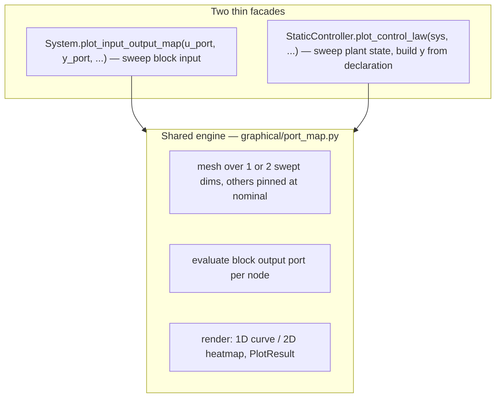
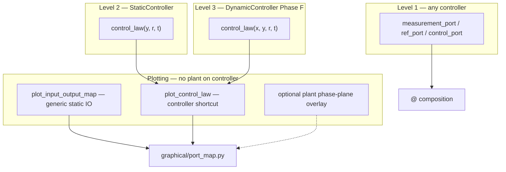

# Control-block contract: `StaticController`, declared feedback ports, `plot_control_law`

Design writeup for a foundational control-block contract: every controller
declares its feedback pattern (measurement / ref / control ports) as class
metadata usable by any `System`; memoryless laws additionally subclass
`StaticController` and implement the pure-array `control_law(y, r, t, params)`.
`@` composition reads the declaration instead of guessing. Static-map plotting
gets one engine and two facades: generic `plot_input_output_map` (sweep a
block's own input port) and `ctl.plot_control_law()` (sweep the plant state
space) — analogous to phase-plane plots for `f`.

Status: **Draft — awaiting architectural review** (DESIGN §4 contract change).

## 0. The signature decision

Constraint scan across **existing laws**:

| Law | Needs | `e → u`? | `x → u`? | `(y, r) → u`? |
| --- | --- | --- | --- | --- |
| `ProportionalController` `K(r-y)` | error only | yes | no | yes |
| `StateFeedbackController` `ubar - K(x-r)` | error + offset | almost (loses `ubar` anchoring semantics) | yes (r baked in) | yes |
| `ImpedanceController` `Kp(r-pos) - Kd·rate` | **absolute** `rate`, error `pos` | **no** | — | yes |
| `ComputedTorqueController` `ID(q, dq, qdd(e))` | **absolute** `q, dq` for the model + error | **no** | — | yes |
| `SlidingModeController` | absolute `q, dq` + error | **no** | — | yes |
| `LookupTableController` `π(x)` | absolute state | no | yes | yes (`r` unused) |

`e → u` fails every model-based law (they need absolute coordinates for
`H(q)`, `g(q)`), and `x → u` fails output feedback. **`(y, r)` is the minimal
signature that covers all of them** — exactly Pyro's `StaticController.c(y, r, t)`.
Error feedback is a *special case computed inside the law* (`e = r - y` as the
first line), not a separate contract.

**Chosen contract** — pure native-array in/out, equation-path style (bare, like `f`):

```python
def control_law(self, y, r, t=0, params=None):
    """u = c(y, r, t).   y: (p,) measurement, r: (k,) reference, u: (m,)."""
```

**Future-proofing** (why this doesn't paint us into a corner):

- **Stateful laws** (adaptive, filtered PID, integral impedance): Pyro's own
  answer is `DynamicController.c(z, y, r, t)` — the state is *prepended*,
  `(y, r, t)` stays. A later `DynamicController(DynamicSystem)` sibling declares
  the same port contract with `control_law(x, y, r, t, params)`. Nothing in
  phase 1 blocks it.
- **MPC / solvers**: never get `control_law` (not a static map), but **do** get
  the declared port contract (`measurement_port="y"`, `control_port="u_ff"`,
  `ref_port=None`) — pure metadata usable by `@`. The contract and the base
  class are deliberately decoupled.
- **NN / RL policies** (`SB3Controller`, future learned laws): declare
  `measurement_port="y"`, wrap `predict` in `control_law` →
  `plot_control_law` free.
- **JAX**: `(y, r, t, params)` with `xp = array_module(y)` traces like `f` —
  no object state in the hot path.
- **Regulation shortcut** (Pyro `cbar`): `regulation_action(y, t=0)` =
  `control_law(y, rbar, t)` with `rbar` from the ref port nominal — defined
  once on the base.

The *two-level* pattern is the foundation:


Dispatch is **duck typing** (`getattr(block, "measurement_port", None)`), never
`isinstance` — so `LookupTableController` in `planning/` complies without
importing `control/` (dependency law intact).

## 1. Exact impact on existing code

### New: `minilink/control/controller.py` (~90 lines)

```python
class StaticController(System):
    feedback_profile = "output"
    measurement_port = "y"
    ref_port = "r"          # None on subclasses without a reference
    control_port = "u"

    def __init__(self, measurement_dim, control_dim, ref_dim=None, rbar=None, ...):
        # builds ports from the declaration; dependencies=(ref, measurement)
        # rbar → ref port nominal_value

    def ctl(self, x, u, t=0, params=None):        # defined ONCE
        k = self.inputs[self.ref_port].dim if self.ref_port else 0
        r, y = u[:k], u[k:]
        return self.control_law(y, r, t, params)

    def regulation_action(self, y, t=0, params=None):
        return self.control_law(y, self.rbar, t, params)

    def plot_control_law(self, sys=None, **kwargs):   # lazy graphical import
```

Port-bundle order `(r, y)` is **internal** — diagrams wire by port name, so
standardizing the dependencies order changes nothing externally (verified by
the full-pytest gate in Phase C).

### Per-file migration (before → after)

| File | Today | After | Removed |
| --- | --- | --- | --- |
| [output.py](../../minilink/control/output.py) | 43 lines: port setup + `ctl` unpacking | declaration + 3-line `control_law`: `return K @ (r - y)` | own `ctl`, `add_*_port` calls |
| [state.py](../../minilink/control/state.py) | port setup + `ctl` unpacking (`x` then `r`) | `measurement_port = "x"`; `control_law`: `return ubar - K @ (y - r)`; `rbar=xbar` | own `ctl`, port setup |
| [impedance.py](../../minilink/control/impedance.py) `ImpedanceController` | `ctl` unpacks `r/pos/rate`, branches on ref dim | `control_law(y, r)`: `pos, rate = y[:n], y[n:]`, same branch | own `ctl`, port setup (labels passthrough kept) |
| [impedance.py](../../minilink/control/impedance.py) `ImpedanceIntegralController` | `DynamicSystem` (integral state) | **not migrated** — declares Level-1 attrs only | nothing |
| [robotic.py](../../minilink/control/robotic.py) `ModelJointImpedance`, `TaskImpedance`, `TaskKinematic` | each has `ctl` + port setup | declaration + `control_law`; embedded-model rule untouched | own `ctl`s, port setup |
| [modelbased.py](../../minilink/control/modelbased.py) `ComputedTorqueController` | binds `_ctl_tracking` **or** `_ctl_regulation` at init; extra `ctl` indirection | single `control_law(y, r)` branching on `len(r)` (same pattern as impedance) | both `_ctl_*` methods, the `ctl` indirection |
| [modelbased.py](../../minilink/control/modelbased.py) `SlidingModeController` | **mutates** `self.outputs["u"].compute = ctl_fn` after `super().__init__` | overrides `control_law` only; `solver_info` kept | the compute-swap hack |
| [siso.py](../../minilink/control/siso.py) `FilteredController` | `DynamicSystem` (filter states) | **not migrated** — Level-1 attrs only | nothing |
| [lookup_policy.py](../../minilink/planning/policy_synthesis/lookup_policy.py) | `System` + `action()` + `ctl` | declares Level-1 attrs (`measurement_port="x"`, `ref_port=None`) + `control_law(y, r)` → interp; **no `control/` import** | nothing (additive) |
| [mpc/controller.py](../../minilink/control/mpc/controller.py) | port-name heuristics find `u_ff` | declares Level-1 attrs only (`control_port="u_ff"`) | nothing (additive) |
| `lqr.py`, factories | return `StateFeedbackController` | unchanged signatures | — |

**Constructor signatures do not change** → zero churn in demos, notebooks,
tests in Phases A–B. The diff is *negative* in `control/`: each migrated file
loses its port boilerplate and `ctl` unpacking.

### What stays exactly as-is

- `System` / `DiagramSystem` / compile path — untouched (the wrapper `ctl` is
  an ordinary port compute).
- `feedback_profile` strings — kept (docs + error hints), now backed by real
  port declarations.
- Embedded-model params rule (DESIGN §4) — `control_law` reads `self.plant`
  live params the same way `ctl` does today.
- DP/VI plotting (`planner.plot_policy` = discrete table) — unrelated, unchanged.

## 2. `@` composition: before → after

Today `_resolve_feedback_path` in
[composition.py](../../minilink/core/composition.py) **guesses** from port
names/dims:

```
try y↔y dims → try Mux(q,dq)→y (dim 2n) → try x↔x → error
```

After, for any block with a declared contract, controller-side ambiguity
disappears:

```python
# resolve_standard_feedback — new first step
measurement = getattr(controller, "measurement_port", None)
if measurement is not None:
    control_out = getattr(controller, "control_port", "u")
    # only PLANT-side resolution remains:
    #   measurement == "x"          → plant x output
    #   measurement == "y", dim 2n  → plant y, else Mux(q,dq)
    #   ref_port is None            → no boundary ref (lookup, MPC)
```

Simplifications this buys:

1. **The lookup-controller patch generalizes**: `ref_port is None` replaces the
   `if ref_port in controller.inputs` check added for `@` with
   `LookupTableController` — declaration-driven instead of port-probing.
2. **`_default_control_out` heuristic** (`u` → `u_ff` → first output) becomes a
   fallback only; MPC declares `control_port="u_ff"` explicitly.
3. **Precise errors** from the declaration: *"ImpedanceController declares
   measurement y=[q;dq] dim 4; plant y has dim 2 — plant must expose q/dq (or
   pass feedback='qdq')"* instead of the generic dim-mismatch.
4. **`default_computer_boundary_ports`** (hybrid `Computer @ plant`) reads the
   same declaration — one contract for flow and step paths.

Heuristics are **kept as fallback** for undeclared/third-party systems:
behavior-preserving, gated by full `pytest` in Phase C (matmul tests in
`test_core.py`, SMC loop in `test_simulation.py`, lookup matmul in
`test_planning.py`).

## 3. Static-map plotting: one engine, two facades

Two standard plots that differ in **what space you sweep**, sharing one
evaluation/render engine:

- **`plot_input_output_map`** — sweep the **block's own input port**. Generic,
  no feedback semantics: `Saturation` curve, `Relay` step, `Gain`,
  `NeuralNetwork` response surface, a PID's `e → u` slice.
- **`plot_control_law`** — sweep the **plant's state space**. The measurement
  is *derived* at each mesh node from the declared contract (`x` directly,
  `h(x)`, or `[q; dq]` stacking), `r` pinned at `rbar`; axes labeled with plant
  state labels. The pedagogically meaningful view next to a cost-to-go plot.

A controller *can* use the generic tool (sweep its `y` port, pin `r`) — that
plots the law in measurement coordinates; only `plot_control_law` gives the
law over the plant phase plane. Two names, one implementation — the axis
semantics flip and the argument sets barely overlap, and a `Saturation` block
should never see feedback vocabulary in its plotting API (selector-orchestrator
style).



**Engine** — new `minilink/graphical/port_map.py` mirroring
[phase_plane](../../minilink/graphical/phase_plane/phase_plane.py)
(spec dataclass → `evaluate_port_map` builder → matplotlib render →
`PlotResult`). Handles 1-D swept input → line plot, 2-D → heatmap,
higher-dim → pick `x_axis`/`y_axis`, pin the rest at the port's
`nominal_value`.

**Generic facade** on `System` (any block whose output port is static — no
state dependency; error otherwise):

```python
def plot_input_output_map(self, u_port=None, y_port=None, *, x_axis=0,
                          y_axis=None, out_axis=0, bounds=None,
                          grid_shape=(101, 101), show=True) -> PlotResult
```

Defaults: first input port → first output port; bounds from `bounds=` or the
port nominal ± range.

**Feedback facade** on `StaticController` (Level 2; requires the declaration;
duck-typed module call for lookup/NN blocks):

```python
def plot_control_law(self, sys=None, *, x_axis=0, y_axis=1, u_axis=0,
                     x_ref=None, r=None, t=0.0, bounds=None,
                     grid_shape=(101, 101), show=True) -> PlotResult
```

- Mesh over **plant state axes**; other states pinned to `x_ref` (default plant
  nominal — Pyro's `xbar`).
- Measurement built from the declaration: `x` → mesh state; `y` →
  `sys.h(x, u_nom, t)`; `y` dim `2n` → `[q; dq]`; `q` → position slice.
- Each node: `regulation_action(y, t)` (or `control_law(y, r, t)` when `r=`
  given), extract `u[u_axis]`; color limits from plant input bounds.
- `sys=None` degrades gracefully into the generic measurement-coordinate sweep
  (Pyro fallback bounds).

Demo payoff in
[vi_pendulum_lqr.py](../../examples/demos/planning/value_iteration/vi_pendulum_lqr.py):

```python
# before: manual array bypassing the block
K = lqr.params["K"][0]; ubar = lqr.params["ubar"][0]
lqr_law = ubar - (grid.states - UPRIGHT) @ K
plotting.plot_value(grid, lqr_law, ...)

# after
lqr.plot_control_law(sys=plant, x_axis=0, y_axis=1)
planner.get_controller().plot_control_law(sys=plant)   # dense VI law, same API
```

`PolicyEvaluator` cost-to-go stays on `plotting.plot_value` (that's `J`, not
the law). Also replaces the hand-rolled `lqr_policy` def:
`PolicyEvaluator(..., policy=lqr.regulation_action)`.

## 4. Phases + gates (each behavior-preserving)

| Phase | Content | Gate |
| --- | --- | --- |
| A | Base class + migrate `output.py`, `state.py`, `impedance.py` | new equivalence tests (`ctl` bundle == `control_law` direct); `pytest tests/unittest/test_core.py test_simulation.py` |
| B | `robotic.py`, `modelbased.py`; Level-1 attrs on lookup + MPC | `pytest tests/unittest/test_planning.py` + robotic demos smoke |
| C | Composition reads declaration (fallback kept) | **full `pytest`** — zero behavior change allowed |
| D | `graphical/port_map.py` engine + both facades (`plot_input_output_map`, `plot_control_law`) | Agg smoke: LQR, lookup, impedance, `Saturation`, `NeuralNetwork`; run `vi_pendulum_lqr.py`, `vi_pendulum_swingup.py` |
| E | Demo migration + DESIGN §feedback-profiles rewrite + pyro-port row (`StaticController.plot_control_law` → Done) | `ruff check .`, `ruff format --check .` |

**Risk inventory**

- Port-bundle packing order: internal to each block's `ctl`; standardized in
  base; full pytest catches any leak.
- `SlidingModeController.solver_info["discontinuous_behavior"]` must survive
  the migration.
- `params is None → self.params` inside `control_law` (never
  `params or self.params`).
- No leading-underscore methods on the base (repo rule); unpack logic inlined
  in `ctl`.
- `graphical/` imported lazily from the facade only.
- DESIGN §4 contract change → `TODO: User Architectural Review` marker until
  maintainer sign-off on the migrated files.

---

## Appendix: architectural review discussion (Aug 2026)

Synthesis of a review pass on this plan against the current library (pre-
implementation on `dev-alex`). **The sections above are the original Fable
design and are unchanged.** This appendix records agreed refinements, open
issues, and implementation priorities from discussion — treat it as addendum
for sign-off, not a rewrite of §0–§4.

### A.1 Review verdict on the original plan

The core contract is sound and matches the codebase:

- **`(y, r) → u`** is the right minimal signature (covers P, LQR/state feedback,
  impedance, model-based laws; error is computed inside the law).
- **Two-level split** (Level-1 port metadata on any controller; Level-2
  `StaticController` + `control_law` for memoryless laws) respects the
  dependency law (`planning/` must not import `control/`).
- **`@` composition** declaration-first with heuristic fallback is the right
  migration (Phase C full-`pytest` gate).
- **Phased rollout** A–E is behavior-preserving and proportionate.

At review time nothing in §1–§2 was implemented yet (`control/controller.py`,
`graphical/port_map.py`, and `measurement_port` attrs still absent). The
pendulum demo [vi_pendulum_lqr.py](../../examples/demos/planning/value_iteration/vi_pendulum_lqr.py)
already hand-rolls the law slice the plan targets.

**Terminology:** “control law” plotting (\(u = c(\cdot)\)) is distinct from
cost-to-go \(J(x)\) (`plotting.plot_value`) and from training rollout loss
(demo-local `rollout_loss` in autotuning / neural demos — out of scope here).

### A.2 Issues and gaps in the original draft (for implementers)

| Topic | Original plan | Review note |
| --- | --- | --- |
| `plot_control_law(sys=plant, …)` | §3 sweeps **plant state**, builds `y` via `h(x)` | See **A.3** — revised priority: controller-local first |
| `StateFeedbackController` bundle order | Standardize `(r, y)` in base `ctl` | Today `dependencies=("x", "r")` — order flips on migration; wiring by port name unchanged; full pytest must catch leaks |
| `LookupTableController` plotting | Duck-typed on `StaticController` | Needs **module-level** `port_map.plot_control_law(block, …)` so `planning/` need not import `control/` |
| Dynamic controllers | Mentioned in §0 future-proofing only | See **A.4** — needs explicit Phase F |
| `FilteredController` / integral impedance | Level-1 attrs only | Specify attrs: `measurement_port="y"`, `ref_port="r"`, `control_port="u"` |
| Multi-ref (`TaskKinematicNullspace` `r_null`) | Not covered | **Out of scope** for single `ref_port`; custom wiring unchanged |
| Embedded-model plot + `sys=` | Controller calls plant `h(x)` | Avoid on controller API — embedded model stays in `control_law` math, not plot coordinates |
| Hybrid path | §2 mentions `default_computer_boundary_ports` | Include in Phase C file list with `hybrid_composition.py` |
| `feedback_profile` vs ports | Both kept | Guard against drift (profile should match declaration) |

### A.3 Plotting — agreed refinement (amends §3 intent for Phase D)

**Design rule:** a controller plots **its own input–output map**. It should
**not** take a plant (`sys=`). The plant appears only when wiring (`ctl @
plant`); plotting stays in coordinates the law actually sees.

**Build order for Phase D:**

1. **Core tool** — `plot_input_output_map` on any static `System` (generic IO
   slice: sweep input port components, pin at nominal, plot output port).
   Examples: `Saturation`, `Gain`, `NeuralNetwork`.
2. **Teaching shortcut** — `plot_control_law` on controller blocks (same
   engine): sweep **measurement port** (`x` or `y` from declaration), pin `r`
   at `rbar` by default, evaluate `regulation_action(y)` → plot `u`. One-liner
   for regulation slices without naming ports.
3. **Later (optional)** — standalone
   `plot_control_on_plant_phase_plane(controller, plant, …)` to overlay a
   control map on a plant phase plane (needs `h(x)`, plant labels). **Not** a
   controller method; ship only if a demo clearly needs it after Phase D.

**Revised API sketch (supersedes §3 `sys=` facade for implementation):**

```python
# Core — any static block
System.plot_input_output_map(in_port=None, out_port=None, x_axis=0, y_axis=None, ...)

# Controller teaching shortcut — no sys=
StaticController.plot_control_law(x_axis=0, y_axis=None, u_axis=0, r=None, ...)

# Module-level (for LookupTableController in planning/)
graphical.port_map.plot_control_law(block, ...)
```

**Demo payoff (same picture as manual `lqr_law`, no plant):**

```python
lqr.plot_control_law(x_axis=0, y_axis=1)   # r pinned at rbar = UPRIGHT
planner.get_controller().plot_control_law(x_axis=0, y_axis=1)
```

The original §3 `sys=plant` path remains a valid **optional overlay tool** (item
3 above), not the primary controller API.

**Why two names?** Same engine; selector-orchestrator split — generic blocks
must not see feedback vocabulary; controllers merit regulation defaults.

### A.4 Dynamic controllers — agreed extension (new Phase F)

Original §0 sketches `DynamicController.c(z, y, r, t)` with state prepended;
Phase 1 correctly excludes migration of `FilteredController` and
`ImpedanceIntegralController`.

**Law contract (Phase F):**

```python
class DynamicController(DynamicSystem):
    def control_law(self, x, y, r, t=0, params=None):
        """u = c(x, y, r, t).   x: (n_ctrl,) internal state."""
```

`f(x, u, t)` stays explicit (anti-windup, filter dynamics — not derived from
`control_law` alone).

**Plotting dynamic laws — still no plant:**

Instantaneous map is \(u = c(x_{\text{ctrl}}, y, r)\). Plot workspace:

```text
z = [ x_ctrl ; measurement ]     (r pinned at rbar by default)
```

- **Default regulation slice:** sweep measurement port, pin `x_ctrl = x0`
  (often zeros → “no integral / filter memory”) — PD-like view of a PID.
- **Teaching slices:** pick any two components of `z`, e.g. measurement vs
  `e_int` for windup (`FilteredController`), or `[pos, rate]` vs `e_int`
  (`ImpedanceIntegralController`).

```python
pid.plot_control_law(x_axis=0, y_axis=1)           # sweep y, ctrl pinned at x0
pid.plot_control_law(x_axis=0, y_axis=pid.n + 0)   # y[0] vs e_int
```

Do **not** append internal state to “measurement” as a separate concept — both
live in one pin-able workspace `z`; measurement is a named segment, not merged
into the `y` vector.

**PID mapping:**

| Block | Static / dynamic | Phase |
| --- | --- | --- |
| `ProportionalController` | Static → `StaticController` | A |
| `ImpedanceController` (PD) | Static → `StaticController` | A |
| `FilteredController` (full PID) | Dynamic → Level-1 attrs now, `DynamicController` in F | B attrs / F migrate |
| `ImpedanceIntegralController` | Dynamic → same | B attrs / F migrate |
| MPC | Level-1 only; no `control_law` or static plot | B |

### A.5 Suggested phase table addendum

| Phase | Addendum content |
| --- | --- |
| D | Implement **controller-local** facades (A.3 items 1–2); defer plant overlay (item 3) |
| F | `DynamicController` + dynamic `plot_control_law` over `z = [x_ctrl; measurement]` |
| F (optional) | `plot_control_on_plant_phase_plane` if teaching demo requires it |

### A.6 Big-picture pattern (discussion summary)



**One sentence:** declare feedback ports for wiring; put static math in
`control_law(y, r, t)` and dynamic math in `control_law(x, y, r, t)`; plot
slices of the controller's own IO map — plant coupling is composition, not
plotting.

