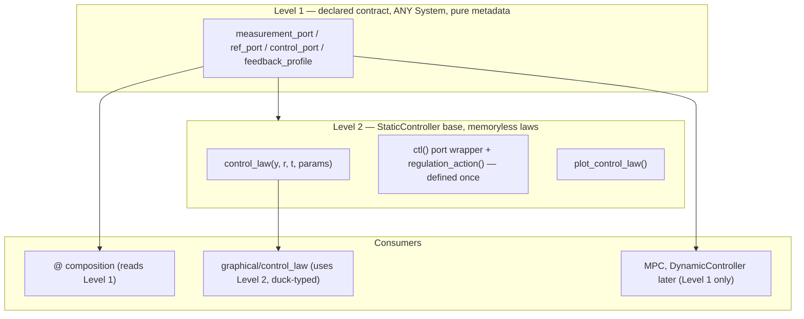

# Control-block contract: `StaticController`, declared feedback ports, `plot_control_law`

Design writeup for a foundational control-block contract: every controller
declares its feedback pattern (measurement / ref / control ports) as class
metadata usable by any `System`; memoryless laws additionally subclass
`StaticController` and implement the pure-array `control_law(y, r, t, params)`.
`@` composition reads the declaration instead of guessing; `ctl.plot_control_law()`
densely samples the continuous law (analogous to phase-plane plots for `f`).

Status: **Draft — awaiting architectural review** (DESIGN §4 contract change).

## 0. The signature decision

Constraint scan across **existing laws**:

| Law | Needs | `e → u`? | `x → u`? | `(y, r) → u`? |
| --- | --- | --- | --- | --- |
| `ProportionalController` `K(r-y)` | error only | yes | no | yes |
| `StateFeedbackController` `ubar - K(x-r)` | error + offset | almost (loses `ubar` anchoring semantics) | yes (r baked in) | yes |
| `ImpedanceController` `Kp(r-pos) - Kd·rate` | **absolute** `rate`, error `pos` | **no** | — | yes |
| `ComputedTorqueController` `ID(q, dq, qdd(e))` | **absolute** `q, dq` for the model + error | **no** | — | yes |
| `SlidingModeController` | absolute `q, dq` + error | **no** | — | yes |
| `LookupTableController` `π(x)` | absolute state | no | yes | yes (`r` unused) |

`e → u` fails every model-based law (they need absolute coordinates for
`H(q)`, `g(q)`), and `x → u` fails output feedback. **`(y, r)` is the minimal
signature that covers all of them** — exactly Pyro's `StaticController.c(y, r, t)`.
Error feedback is a *special case computed inside the law* (`e = r - y` as the
first line), not a separate contract.

**Chosen contract** — pure native-array in/out, equation-path style (bare, like `f`):

```python
def control_law(self, y, r, t=0, params=None):
    """u = c(y, r, t).   y: (p,) measurement, r: (k,) reference, u: (m,)."""
```

**Future-proofing** (why this doesn't paint us into a corner):

- **Stateful laws** (adaptive, filtered PID, integral impedance): Pyro's own
  answer is `DynamicController.c(z, y, r, t)` — the state is *prepended*,
  `(y, r, t)` stays. A later `DynamicController(DynamicSystem)` sibling declares
  the same port contract with `control_law(x, y, r, t, params)`. Nothing in
  phase 1 blocks it.
- **MPC / solvers**: never get `control_law` (not a static map), but **do** get
  the declared port contract (`measurement_port="y"`, `control_port="u_ff"`,
  `ref_port=None`) — pure metadata usable by `@`. The contract and the base
  class are deliberately decoupled.
- **NN / RL policies** (`SB3Controller`, future learned laws): declare
  `measurement_port="y"`, wrap `predict` in `control_law` →
  `plot_control_law` free.
- **JAX**: `(y, r, t, params)` with `xp = array_module(y)` traces like `f` —
  no object state in the hot path.
- **Regulation shortcut** (Pyro `cbar`): `regulation_action(y, t=0)` =
  `control_law(y, rbar, t)` with `rbar` from the ref port nominal — defined
  once on the base.

The *two-level* pattern is the foundation:



Dispatch is **duck typing** (`getattr(block, "measurement_port", None)`), never
`isinstance` — so `LookupTableController` in `planning/` complies without
importing `control/` (dependency law intact).

## 1. Exact impact on existing code

### New: `minilink/control/controller.py` (~90 lines)

```python
class StaticController(System):
    feedback_profile = "output"
    measurement_port = "y"
    ref_port = "r"          # None on subclasses without a reference
    control_port = "u"

    def __init__(self, measurement_dim, control_dim, ref_dim=None, rbar=None, ...):
        # builds ports from the declaration; dependencies=(ref, measurement)
        # rbar → ref port nominal_value

    def ctl(self, x, u, t=0, params=None):        # defined ONCE
        k = self.inputs[self.ref_port].dim if self.ref_port else 0
        r, y = u[:k], u[k:]
        return self.control_law(y, r, t, params)

    def regulation_action(self, y, t=0, params=None):
        return self.control_law(y, self.rbar, t, params)

    def plot_control_law(self, sys=None, **kwargs):   # lazy graphical import
```

Port-bundle order `(r, y)` is **internal** — diagrams wire by port name, so
standardizing the dependencies order changes nothing externally (verified by
the full-pytest gate in Phase C).

### Per-file migration (before → after)

| File | Today | After | Removed |
| --- | --- | --- | --- |
| [output.py](../../minilink/control/output.py) | 43 lines: port setup + `ctl` unpacking | declaration + 3-line `control_law`: `return K @ (r - y)` | own `ctl`, `add_*_port` calls |
| [state.py](../../minilink/control/state.py) | port setup + `ctl` unpacking (`x` then `r`) | `measurement_port = "x"`; `control_law`: `return ubar - K @ (y - r)`; `rbar=xbar` | own `ctl`, port setup |
| [impedance.py](../../minilink/control/impedance.py) `ImpedanceController` | `ctl` unpacks `r/pos/rate`, branches on ref dim | `control_law(y, r)`: `pos, rate = y[:n], y[n:]`, same branch | own `ctl`, port setup (labels passthrough kept) |
| [impedance.py](../../minilink/control/impedance.py) `ImpedanceIntegralController` | `DynamicSystem` (integral state) | **not migrated** — declares Level-1 attrs only | nothing |
| [robotic.py](../../minilink/control/robotic.py) `ModelJointImpedance`, `TaskImpedance`, `TaskKinematic` | each has `ctl` + port setup | declaration + `control_law`; embedded-model rule untouched | own `ctl`s, port setup |
| [modelbased.py](../../minilink/control/modelbased.py) `ComputedTorqueController` | binds `_ctl_tracking` **or** `_ctl_regulation` at init; extra `ctl` indirection | single `control_law(y, r)` branching on `len(r)` (same pattern as impedance) | both `_ctl_*` methods, the `ctl` indirection |
| [modelbased.py](../../minilink/control/modelbased.py) `SlidingModeController` | **mutates** `self.outputs["u"].compute = ctl_fn` after `super().__init__` | overrides `control_law` only; `solver_info` kept | the compute-swap hack |
| [siso.py](../../minilink/control/siso.py) `FilteredController` | `DynamicSystem` (filter states) | **not migrated** — Level-1 attrs only | nothing |
| [lookup_policy.py](../../minilink/planning/policy_synthesis/lookup_policy.py) | `System` + `action()` + `ctl` | declares Level-1 attrs (`measurement_port="x"`, `ref_port=None`) + `control_law(y, r)` → interp; **no `control/` import** | nothing (additive) |
| [mpc/controller.py](../../minilink/control/mpc/controller.py) | port-name heuristics find `u_ff` | declares Level-1 attrs only (`control_port="u_ff"`) | nothing (additive) |
| `lqr.py`, factories | return `StateFeedbackController` | unchanged signatures | — |

**Constructor signatures do not change** → zero churn in demos, notebooks,
tests in Phases A–B. The diff is *negative* in `control/`: each migrated file
loses its port boilerplate and `ctl` unpacking.

### What stays exactly as-is

- `System` / `DiagramSystem` / compile path — untouched (the wrapper `ctl` is
  an ordinary port compute).
- `feedback_profile` strings — kept (docs + error hints), now backed by real
  port declarations.
- Embedded-model params rule (DESIGN §4) — `control_law` reads `self.plant`
  live params the same way `ctl` does today.
- DP/VI plotting (`planner.plot_policy` = discrete table) — unrelated, unchanged.

## 2. `@` composition: before → after

Today `_resolve_feedback_path` in
[composition.py](../../minilink/core/composition.py) **guesses** from port
names/dims:

```
try y↔y dims → try Mux(q,dq)→y (dim 2n) → try x↔x → error
```

After, for any block with a declared contract, controller-side ambiguity
disappears:

```python
# resolve_standard_feedback — new first step
measurement = getattr(controller, "measurement_port", None)
if measurement is not None:
    control_out = getattr(controller, "control_port", "u")
    # only PLANT-side resolution remains:
    #   measurement == "x"          → plant x output
    #   measurement == "y", dim 2n  → plant y, else Mux(q,dq)
    #   ref_port is None            → no boundary ref (lookup, MPC)
```

Simplifications this buys:

1. **The lookup-controller patch generalizes**: `ref_port is None` replaces the
   `if ref_port in controller.inputs` check added for `@` with
   `LookupTableController` — declaration-driven instead of port-probing.
2. **`_default_control_out` heuristic** (`u` → `u_ff` → first output) becomes a
   fallback only; MPC declares `control_port="u_ff"` explicitly.
3. **Precise errors** from the declaration: *"ImpedanceController declares
   measurement y=[q;dq] dim 4; plant y has dim 2 — plant must expose q/dq (or
   pass feedback='qdq')"* instead of the generic dim-mismatch.
4. **`default_computer_boundary_ports`** (hybrid `Computer @ plant`) reads the
   same declaration — one contract for flow and step paths.

Heuristics are **kept as fallback** for undeclared/third-party systems:
behavior-preserving, gated by full `pytest` in Phase C (matmul tests in
`test_core.py`, SMC loop in `test_simulation.py`, lookup matmul in
`test_planning.py`).

## 3. `ctl.plot_control_law()` — dense continuous law (not DP grid)

New `minilink/graphical/control_law.py` mirroring
[phase_plane](../../minilink/graphical/phase_plane/phase_plane.py)
(spec dataclass → builder → matplotlib render → `PlotResult`):

```python
def plot_control_law(controller, sys=None, *, x_axis=0, y_axis=1, u_axis=0,
                     x_ref=None, r=None, t=0.0, bounds=None,
                     grid_shape=(101, 101), show=True) -> PlotResult
```

- Mesh over **plant state axes**; other states pinned to `x_ref` (default plant
  nominal — Pyro's `xbar`); without `sys`, Pyro fallback bounds.
- Measurement built from the declaration: `x` → mesh state; `y` →
  `sys.h(x, u_nom, t)`; `y` dim `2n` → `[q; dq]`; `q` → position slice.
- Each node: `regulation_action(y, t)` (or `control_law(y, r, t)` when `r=`
  given), extract `u[u_axis]`; color limits from plant input bounds.
- Facade on `StaticController` (and duck-typed module call for lookup/NN blocks).

Demo payoff in
[vi_pendulum_lqr.py](../../examples/demos/planning/value_iteration/vi_pendulum_lqr.py):

```python
# before: manual array bypassing the block
K = lqr.params["K"][0]; ubar = lqr.params["ubar"][0]
lqr_law = ubar - (grid.states - UPRIGHT) @ K
plotting.plot_value(grid, lqr_law, ...)

# after
lqr.plot_control_law(sys=plant, x_axis=0, y_axis=1)
planner.get_controller().plot_control_law(sys=plant)   # dense VI law, same API
```

`PolicyEvaluator` cost-to-go stays on `plotting.plot_value` (that's `J`, not
the law). Also replaces the hand-rolled `lqr_policy` def:
`PolicyEvaluator(..., policy=lqr.regulation_action)`.

## 4. Phases + gates (each behavior-preserving)

| Phase | Content | Gate |
| --- | --- | --- |
| A | Base class + migrate `output.py`, `state.py`, `impedance.py` | new equivalence tests (`ctl` bundle == `control_law` direct); `pytest tests/unittest/test_core.py test_simulation.py` |
| B | `robotic.py`, `modelbased.py`; Level-1 attrs on lookup + MPC | `pytest tests/unittest/test_planning.py` + robotic demos smoke |
| C | Composition reads declaration (fallback kept) | **full `pytest`** — zero behavior change allowed |
| D | `graphical/control_law.py` + facade | Agg smoke: LQR, lookup, impedance; run `vi_pendulum_lqr.py`, `vi_pendulum_swingup.py` |
| E | Demo migration + DESIGN §feedback-profiles rewrite + pyro-port row (`StaticController.plot_control_law` → Done) | `ruff check .`, `ruff format --check .` |

**Risk inventory**

- Port-bundle packing order: internal to each block's `ctl`; standardized in
  base; full pytest catches any leak.
- `SlidingModeController.solver_info["discontinuous_behavior"]` must survive
  the migration.
- `params is None → self.params` inside `control_law` (never
  `params or self.params`).
- No leading-underscore methods on the base (repo rule); unpack logic inlined
  in `ctl`.
- `graphical/` imported lazily from the facade only.
- DESIGN §4 contract change → `TODO: User Architectural Review` marker until
  maintainer sign-off on the migrated files.
