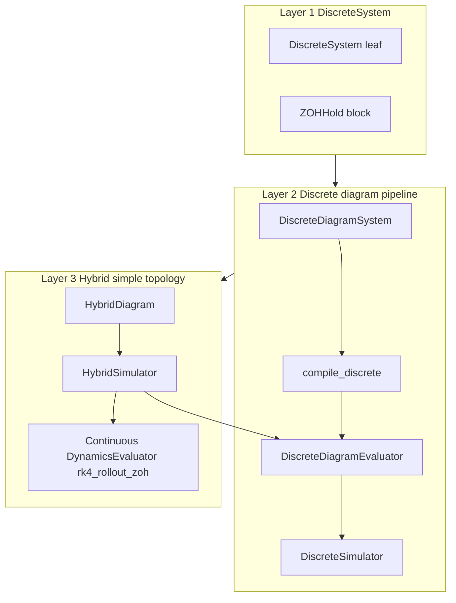
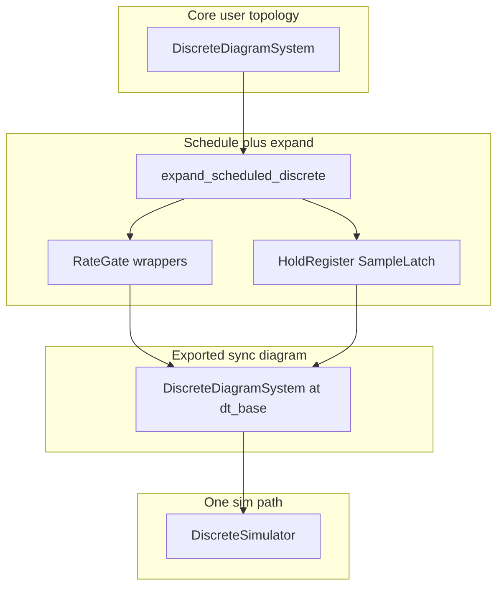

# Hybrid discrete simulation (design only)

Status: draft plan (July 2026). No implementation in this phase.

Architecture for discrete-time blocks, discrete diagrams, multi-rate expansion, and narrow
hybrid simulation (discrete ZOH → continuous plant ← measurements). Supersedes the
continuous-time-only stance in [DESIGN.md](../../DESIGN.md) §3 for this **subset** — not
full Simulink parity.

Implemented contracts (when landed) live in [DESIGN.md](../../DESIGN.md), [ROADMAP.md](../../ROADMAP.md),
and [README.md](../../README.md) call chains.

---

## Summary

Build in three layers:

1. **`DiscreteSystem`** — parallel to `DynamicSystem`, but `f` returns **`x_next`**, not `dx`.
2. **Discrete diagram pipeline** — sibling `DiscreteDiagramSystem` + compile + sync `DiscreteSimulator`; reuse continuous wiring and `ExecutionPlan`.
3. **Hybrid simulation** — simple two-side topology only: fully discrete side → ZOH → fully continuous plant ← measurements.

Multi-rate (e.g. 10 Hz MPC + 100 Hz filter) uses **`expand_scheduled_discrete()`** to export a
**synchronous base-clock `DiscreteDiagramSystem`** with internal `RateGate` / `HoldRegister` /
`SampleLatch` state — **not** a second simulator path with hidden hold buffers.

---

## Recommendation

**Build two abstractions first, then hybrid as thin glue.**

- Each layer is testable in isolation (discrete closed loops before touching the plant).
- Reuses minilink's pattern: `System` → diagram → compile → evaluator → simulator.
- Hybrid schedules two mature pipelines; no fused `ExecutionPlan` mixing `dx` and `x_next`.

| Layer | Delivers | Does not deliver |
| --- | --- | --- |
| **1** | `DiscreteSystem`, `ZOHHold` (math: `x_next` only) | Clock, diagrams, simulation |
| **2a** | `DiscreteDiagramSystem` — synchronous, full topology | Multi-rate without expansion |
| **2b** | compile + sync `DiscreteSimulator` + `expand_scheduled_discrete` | Evaluator hold-buffer scheduler |
| **3** | `HybridDiagram`, `HybridSimulator`, `MPCBlock` | Arbitrary hybrid topology |

---

## Layer overview



---

## Clock architecture

| Question | Answer |
| --- | --- |
| Reuse continuous wiring with `f → x_next`? | **Yes** — sibling `DiscreteDiagramSystem` + shared mixin / `ExecutionPlan` |
| Full topology at synchronous level? | **Yes** |
| Where does clock live? | **`expand_scheduled_discrete()`** + `dt_base`; not on `DiscreteSystem` |
| Second diagram topology class? | **No** |
| Middle layer for wiring + clock? | **Expansion** to sync diagram with hold/gate internal state |
| Public `schedule` on `DiscreteSimulator`? | **No** — multi-rate must go through expansion |

### Expand, then simulate synchronously

```python
# User writes logical topology (no clock)
controller = DiscreteDiagramSystem(...)
controller.connect("mpc", "u", "filter", "r")

# Middle layer: bind schedule + expand to base-clock diagram
sync_diagram = expand_scheduled_discrete(
    controller,
    dt_base=0.01,
    schedule={"mpc": 10, "filter": 1},
)

# Single sim path — sync step every dt_base
simulate_discrete(sync_diagram, x0, options=DiscreteSimOptions(sync_dt=0.01, tf=10.0))
```

The expanded diagram **is** a normal `DiscreteDiagramSystem`. Holds and rate gating are
**internal subsystems with state**, not simulator-side buffers.



### Cross-rate port semantics → internal blocks

| Edge | Semantics | Expansion inserts |
| --- | --- | --- |
| Slow → Fast | ZOH | `HoldRegister` |
| Fast → Slow | Sample at slow tick | `SampleLatch` |
| Subsystem divisor k > 1 | Fire every k base steps | `RateGate` wrapper |
| Same rate | Direct | No change |

Internal subsystem ids prefixed (e.g. `_hold_mpc_u`). User-placed **`ZOHHold`** remains optional for teaching.

### Middle layer API

**File:** `minilink/simulation/scheduled_discrete.py`

```python
@dataclass
class ScheduledDiscreteSpec:
    diagram: DiscreteDiagramSystem
    dt_base: float
    schedule: dict[str, int]   # sys_id -> tick_divisor; default 1

    def expand(self) -> DiscreteDiagramSystem: ...


def expand_scheduled_discrete(
    diagram: DiscreteDiagramSystem,
    *,
    dt_base: float,
    schedule: dict[str, int],
) -> DiscreteDiagramSystem:
    """Return synchronous base-clock diagram with internal hold/gate dynamics."""
```

**New blocks** in `minilink/blocks/`:

| Block | State | Per base tick |
| --- | --- | --- |
| `RateGate` | counter + inner states | Fire inner `f` every k ticks; else identity |
| `HoldRegister` | held output | Update when upstream fires; else hold |
| `SampleLatch` | latched sample | Capture upstream when downstream fires |

### Expansion vs simulator-side holds

| | Expansion → sync diagram | Evaluator hold buffers |
| --- | --- | --- |
| User sees | One `DiscreteDiagramSystem` | Diagram + schedule object |
| Sim paths | One | Two |
| Debug / teaching | Hold state in diagram | Opaque runtime dict |
| Hybrid reuse | Expanded diagram on discrete side | Hybrid knows schedule API |

**Prefer expansion for v1.** Hold buffers may remain a private fallback, not the public contract.

### Clock on `System` vs expansion/simulator

**Recommendation:** core `DiscreteSystem` has **no `sample_period`**. Optional `params["sample_period"]` as a demo hint only. Authoritative schedule lives in `expand_scheduled_discrete(..., schedule=...)`. Mirrors continuous minilink: **`f` is math; time grid lives outside the equation.**

---

## Context: minilink today

| Piece | Today | This plan |
| --- | --- | --- |
| Continuous leaf | `DynamicSystem`: `dx = f(...)` | Unchanged |
| Continuous diagram | `DiagramSystem` + `compile()` → `DynamicsEvaluator` | Unchanged |
| Discrete | Out of scope in DESIGN §3 | Layers 1–2 in scope (subset) |
| MPC demos | Manual Python loop × 7 | Layer 3 via `MPCBlock` + `HybridSimulator` |
| JAX plant rollout | `rk4_rollout_ivp` scan | add `rk4_rollout_zoh` for hybrid inner loop |

---

## Layer 1: `DiscreteSystem`

**Files:** `minilink/core/system.py`, `minilink/blocks/`

```python
class DiscreteSystem(System):
    """
    x_{k+1} = f(x_k, u_k, t_k; p)
    y_k     = h(x_k, u_k, t_k; p)
    """
```

- Same port/params surface as `DynamicSystem`; `f` returns **next state**, not derivative.
- `solver_info`: `continuous_time_equation=False`.
- `dt` inside `f` (discrete integrator) via `params` or wiring — not a class-level clock.
- Parallel: **`rk4_rollout_zoh`** on continuous evaluator (JAX scan) for Layer 3.

---

## Layer 2: Discrete diagram pipeline

### `DiscreteDiagramSystem`

**File:** `minilink/core/discrete_diagram.py` — **sibling** of `DiagramSystem`, shared wiring mixin.

- **`x_next = f(x, u, t)`** — same stacked loop as continuous `DiagramSystem.f`; docstring differs.
- Evaluator exposes **`step(x, u, t)`** calling each block's `f`.
- Subsystems: `DiscreteSystem`, `StaticSystem`, `ZOHHold`. Reject `DynamicSystem` at compile.
- Reuse `build_execution_plan()` and `ExecutionPlan` — do not fork.

| Continuous | Discrete |
| --- | --- |
| `compile_diagram()` → `DynamicsEvaluator` | `compile_discrete_diagram()` → `DiscreteEvaluator` |
| `evaluator.f → dx` | `evaluator.step → x_next` |
| RK4, rollout, SciPy | stepping only |

Mark discrete compile path **`TODO: User Architectural Review`** until closed-loop tests pass.

### `DiscreteSimulator`

**File:** `minilink/simulation/discrete_simulator.py`

**Sync only.** No public `schedule` argument.

```python
@dataclass
class DiscreteSimOptions:
    tf: float
    sync_dt: float

def simulate_discrete(diagram, x0, *, options) -> DiscreteSimResult
```

Multi-rate: expand first, then simulate with `sync_dt = dt_base`.

### Sibling diagram + shared core (not subclass)

| Layer | Shared? |
| --- | --- |
| Port wiring | **Yes** — mixin or `core/wiring.py` |
| Diagram state map | **Yes** — same loop; `dx` vs `x_next` docstring |
| `ExecutionPlan` | **Yes** |
| Leaf type | **Sibling** — `DynamicSystem` vs `DiscreteSystem` |
| Evaluator | **Sibling** — `DynamicsEvaluator` vs `DiscreteEvaluator` |
| Simulator | **Different** — ODE vs discrete step |

Do **not** unify with a `time_domain` flag on one `DiagramSystem` for v1.

---

## Layer 3: Hybrid — two-side topology only

```
[ DiscreteDiagramSystem ]  --ZOH u-->  [ DiagramSystem plant ]
         ^                                      |
         +----------- measurements y -------------+
```

### `HybridDiagram` — `minilink/core/hybrid_diagram.py`

```python
@dataclass
class HybridDiagram:
    discrete: DiscreteDiagramSystem   # expanded sync diagram when multi-rate
    continuous: DiagramSystem
    connections: list[BoundaryConnection]
    dt_base: float
```

### `HybridSimulator` — `minilink/simulation/hybrid_simulator.py`

Per base tick:

1. Discrete side — `evaluator.step` on expanded sync diagram.
2. Boundary — discrete outputs → `u_hold` for plant.
3. Continuous — `cont_evaluator.rk4_rollout_zoh(...)` (JAX scan).
4. Feedback — sample plant outputs → discrete inputs.

Python outer (discrete + MPC solvers) / JAX inner (plant rollout).

### `MPCBlock` — `minilink/planning/mpc/`

- `DiscreteSystem` wrapping `MPCPlanner.step`.
- Warm-start state in `__init__`; no `core/compile/` imports.
- `sys_mpc` vs `sys_sim` stays explicit in demos.

### MPC demo target

Refactor `examples/scripts/mpc/demo_dynamic_bicycle_rate_mpc_straight_line.py` only; preserve user tuning.

---

## Scope

### In scope

- Layers 1–3 as above; one MPC demo refactor; DESIGN / ROADMAP / README sync on implementation.

### Deferred

| Item | Why |
| --- | --- |
| Discrete + continuous in one flat diagram | v1 uses two sides |
| Non-integer divisor ratios | resampling / drift |
| Evaluator hold-buffer scheduler (public) | expansion preferred |
| Multi-clock diagram topology class | expansion exports sync diagram |
| FOH, delay, events, full Simulink multi-rate | ZOH subset only |

---

## Tests (per layer)

| Layer | File | Cases |
| --- | --- | --- |
| 1 | `test_discrete_system.py` | leaf `x_next`; `ZOHHold`; `solver_info` |
| 1 | `test_rk4_rollout_zoh.py` | NumPy/JAX vs repeated `rk4_step` |
| 2 | `test_discrete_diagram.py` | wiring; `@` closed loop |
| 2 | `test_scheduled_discrete.py` | expansion slow→fast ZOH; fast→slow sample |
| 2 | `test_discrete_simulator.py` | sync closed loop; expanded multi-rate |
| 3 | `test_hybrid_simulator.py` | two-side ZOH → plant → feedback |
| 3 | `test_mpc_block.py` | MPCBlock smoke |

---

## Implementation order

| Step | Layer | Deliverable |
| --- | --- | --- |
| 1 | 1 | `DiscreteSystem`, `ZOHHold`, leaf tests |
| 2 | 1 | `rk4_rollout_zoh` |
| 3 | 2 | shared diagram wiring mixin |
| 4 | 2 | `DiscreteDiagramSystem` |
| 5 | 2 | `compile_discrete_diagram` + `DiscreteEvaluator` |
| 6 | 2 | `RateGate`, `HoldRegister`, `SampleLatch` |
| 7 | 2 | `expand_scheduled_discrete()` + tests |
| 8 | 2 | `DiscreteSimulator` + closed-loop tests |
| 9 | 3 | `HybridDiagram` |
| 10 | 3 | `HybridSimulator` |
| 11 | 3 | `MPCBlock` + straight-line demo |
| 12 | all | DESIGN / ROADMAP / README |

**Gate:** Layer 3 starts only after Layer 2 discrete-only tests pass.

---

## AGENTS.md alignment (summary)

- Textbook math: `x_{k+1} = f(...)`; bare `f`/`h` on equation paths.
- Complexity in expansion blocks + simulators; thin leaf types.
- Reuse port gather / `ExecutionPlan`; no blind fork.
- `MPCBlock` in `planning/mpc/`; warm-start in `__init__`.
- Preserve user demo tuning; one demo refactor only.
- Pre-push: `ruff check .`, `ruff format --check .`, proportionate `pytest`.

---

## Expected outcome

- Discrete blocks compose like continuous systems (diagram + ports).
- Multi-rate: one sync sim loop at `dt_base` after expansion.
- Hybrid: thin scheduler over discrete step + `rk4_rollout_zoh` plant.
- MPC demos drop hand-rolled outer loops.
