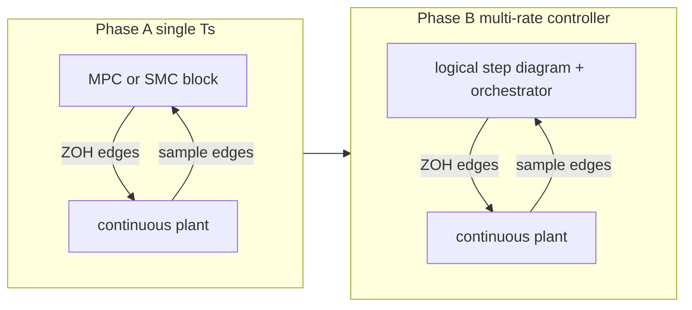
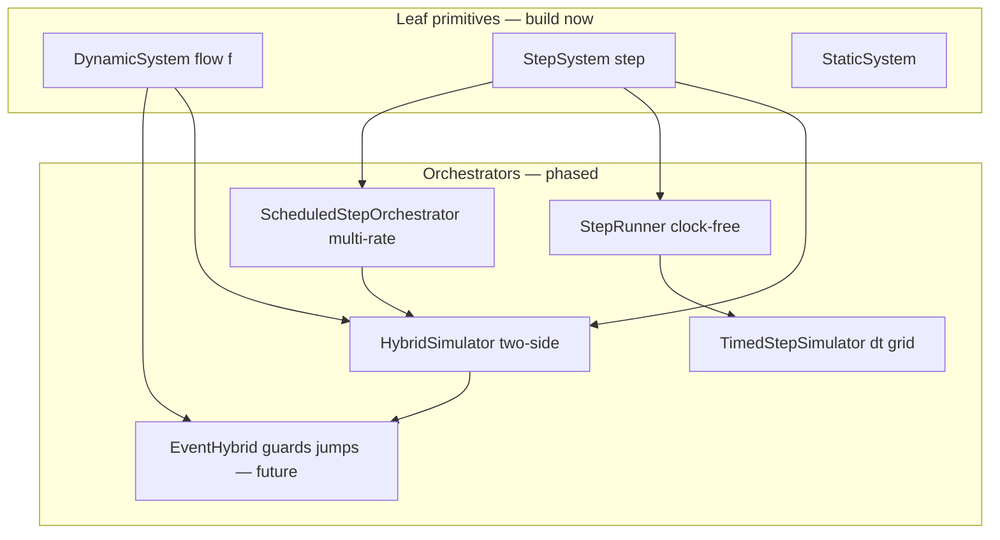
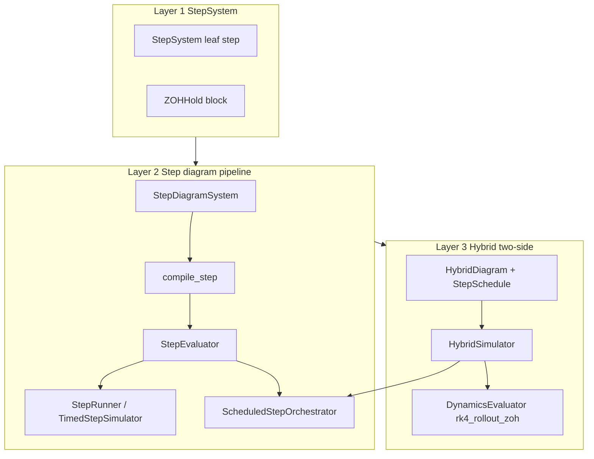

# Hybrid and step simulation (design only)

Status: draft plan (July 2026). No implementation in this phase.

Architecture for **step maps** (difference equations, jumps, turn-based dynamics),
step diagrams, **scheduled multi-rate orchestration**, clock-driven hybrid simulation
(step side ZOH → continuous plant ← measurements), and a path toward **full switched /
hybrid** systems. Supersedes the continuous-time-only stance in [DESIGN.md](../../DESIGN.md)
§3 for this **subset** — not full Simulink parity.

Implemented contracts (when landed) live in [DESIGN.md](../../DESIGN.md),
[ROADMAP.md](../../ROADMAP.md), and [README.md](../../README.md) call chains.

---

## Summary

Build in layers on **two fundamental state-evolution maps**:

| Map | Leaf type | Equation | Meaning |
| --- | --- | --- | --- |
| **Flow `f`** | `DynamicSystem` | `dx = f(x, u, t; p)` | ODE / continuous evolution |
| **Step `step`** | `StepSystem` | `x_{k+1} = step(x, u, k; p)` | One-shot update (difference eq., jump, turn) |

**Static** blocks (`StaticSystem`, `n = 0`) and **output** map `h` are shared across all
kinds. **Hybrid** is not a third map — it is **orchestration** that calls flow and step
engines and decides **when** each applies.

Near-term deliverables:

1. **`StepSystem`** — sibling of `DynamicSystem`; **`step(x, u, k)`** returns next state (not `dx`).
2. **Step diagram pipeline** — sibling `StepDiagramSystem` + compile + `StepRunner`
   (clock-free) + timed `TimedStepSimulator`; reuse wiring and `ExecutionPlan`.
3. **Hybrid simulation (v1)** — two-side topology only: step side → ZOH → continuous plant
   ← measurements; **`HybridSimulator`** owns the orchestration loop.

Multi-rate cascade (e.g. 10 Hz MPC + 100 Hz filter) keeps the **logical**
`StepDiagramSystem` unchanged; a **`ScheduledStepOrchestrator`** runs at `dt_base`,
fires each block on schedule, and owns **hold/latch buffers** for cross-rate signals.
**Optional lowering:** `expand_scheduled_step()` rewrites the diagram with internal
`RateGate` / hold blocks — for JAX scan or teaching, not the default path.

---

## Short-term use cases (what we are building for)

The first **hybrid** capability is **not** an arbitrary mixed diagram. It is a **two-side**
structure — step diagram + continuous diagram — with explicit **boundary connections**:

```text
[ sampled controller (step side) ]  --ZOH (step→plant edges)-->  [ continuous plant ]
              ^                                                           |
              +-------- sample (plant→step edges, any port) ---------------+
```

Both primary near-term targets share this structure; only the controller block differs.
**Phase A supports multiple named ports** across the boundary (not only `"u"` / `"y"`); MPC and
SMC demos use the **minimal** case (one command edge + one measurement edge, possibly vector-valued).

| Use case | Controller (step side) | Plant (flow side) | Sample time |
| --- | --- | --- | --- |
| **MPC closed loop** | `MPCBlock` (`StepSystem` wrapping `MPCPlanner.step`) | `DynamicBicycle` (or other catalog plant) | `Ts` = MPC period |
| **Sliding-mode control (SMC)** | `SMCBlock` or generic sampled `StepSystem` controller | same continuous plant | `Ts` = SMC period |

**Boundary semantics (Phase A):**

| Direction | Policy |
| --- | --- |
| Step output → plant input | **ZOH** — held constant over `[t, t + dt_base]` |
| Plant output → step input | **Sample** — latched at tick boundary (end of plant interval) |

Tick order: **sample → step → ZOH → integrate plant** (standard one-tick feedback delay).
World references (`r`) attach to step or plant diagram boundary inputs — not hybrid edges.

This is the **only** hybrid topology class in scope for v1. Controllers may contain static wiring
inside the step diagram; the plant stays a homogeneous flow diagram.

### Phase A — single-rate controller (ship first)

One controller block, one sample period `Ts`, plant integrated with inner step `dt_plant`
where `dt_plant = Ts` or subdivides `Ts` (e.g. `Ts = 0.1 s`, plant RK4 at `0.01 s` per
`HybridSimulator` tick).

```text
Phase A topology (single Ts):

  r ──► [ MPC or SMC @ 1/Ts ] ──ZOH──► [ plant ] ──► y
              ▲                              │
              └──────── y sampled ───────────┘
```

**Deliverables:**

- `HybridDiagram` + `HybridSimulator` with **`BoundaryConnection`** list (multi-port ZOH + sample).
- `MPCBlock` + refactor one MPC demo (straight-line bicycle).
- **`SMCBlock`** (or documented pattern): `StepSystem` implementing discrete-time sliding
  mode; same `HybridSimulator` loop as MPC — **no second sim path**.
- Controller step diagram may be a **single leaf** (`MPCBlock` / `SMCBlock`) plus static
  blocks; no multi-rate expansion required yet.

**Acceptance:** closed-loop sim matches hand-rolled demo loops within tolerance; plant inputs
held piecewise-constant between samples on every step→plant edge.

### Phase B — multi-block controller, integer multiples of base clock

Cascade or multi-rate **controller only** — e.g. outer MPC @ 10 Hz, inner reference filter @
100 Hz, still driving one continuous plant. All controller blocks run at rates that are
**integer divisors of one `dt_base`** (no non-integer ratios in v1).

```text
Phase B topology (orchestrator on logical diagram):

  r ──► [ filter @ 100 Hz ] ──► [ MPC @ 10 Hz ] ──ZOH──► [ plant @ continuous ]
              StepDiagramSystem (logical)  +  StepSchedule  +  ScheduledStepOrchestrator
```

**Mechanism:** user wires logical `StepDiagramSystem`; attaches
`StepSchedule(dt_base, fire={...})` on `HybridDiagram` (or orchestrator); **no graph
rewrite**. `ScheduledStepOrchestrator` @ `dt_base` updates buffers and calls each block's
`step` when its divisor fires. Plant side unchanged from Phase A.

**Example schedule** (`dt_base = 0.01 s` = 100 Hz):

| Block | Rate | `fire[sys_id]` (divisor d) |
| --- | --- | --- |
| `filter` | 100 Hz | `1` |
| `mpc` | 10 Hz | `10` |

**Deliverables:** `StepSchedule`, `ScheduledStepOrchestrator`, buffer snapshot API for
debug; cascade demo (filter fast + MPC slow).

**Deferred in Phase B:** non-integer ratios (e.g. 30 Hz vs 100 Hz), FOH, delays, mixing flow
blocks on the controller side.

### Multi-rate Phase B: orchestrator vs expansion

Two ways to implement the **same high-level API** (logical cascade + schedule). **Default:
orchestrator buffers.**

| | **A — Orchestrator buffers** (adopt) | **B — Diagram expansion** (optional) |
| --- | --- | --- |
| **Idea** | Logical diagram unchanged; orchestrator owns ZOH/latch **buffers** and fires blocks on schedule | `expand_scheduled_step()` inserts `RateGate`, `HoldRegister`, `SampleLatch` as step blocks with state |
| **Block contract** | Pure `step`; rate via `StepSchedule.fire` (optional per-block hint in `params`) | Pure `step` wrapped in infrastructure blocks |
| **Hold state** | Orchestrator side buffers (export via `buffer_history` on traj) | In diagram state vector `x` |
| **Sim loop** | Orchestrator tick @ `dt_base` → subset of `step` calls | Full `StepEvaluator.step` on expanded diagram |

**Orchestrator — pros:** pure control-law blocks; logical diagram = mental model; complexity
in orchestrators ([AGENTS.md](../../AGENTS.md)); natural Phase A → B (same
`HybridSimulator`, add schedule + buffers); no graph-rewrite pass; path to event hybrid
(orchestrator already owns *when*).

**Orchestrator — cons:** hold state not in `x` unless exported; subset firing is a Python
(or staged) loop — weaker single JAX scan for whole controller; orchestrator must implement
cross-rate rules once (fast→slow sample, slow→fast ZOH).

**Expansion — pros:** one `StepEvaluator.step` @ `dt_base`; holds in `x` (plottable,
teachable); fixed `ExecutionPlan` — better JAX scan story.

**Expansion — cons:** graph rewrite complexity; diagram pollution (`_hold_*` subsystems);
hold/latch as fake dynamics; re-expand on topology/schedule change; feels heavy for simple
MPC + filter cascade.

**Decision:** Phase B **primary** = `ScheduledStepOrchestrator`. Document
`expand_scheduled_step()` as **optional lowering** for perf/JAX/teaching — not required for
MPC/SMC or cascade demos.

### Cascade multi-rate: orchestrator at `dt_base` (Phase B default)

**Do not simulate multiple clocks.** Simulate **one base tick**; the orchestrator decides
which controller blocks fire and what each input reads (live signal vs held buffer).

```text
User writes (logical topology, no holds):

  r → [ filter ] → [ MPC ] → u_cmd
        100 Hz      10 Hz

Orchestrator @ dt_base (ScheduledStepOrchestrator):

  tick k:
    if filter fires:  run filter.step(..., k); buffer["filter:y"] ← output
    else:              use buffer["filter:y"]  (ZOH for downstream)
    if mpc fires:      run mpc.step(..., k, buffer["filter:y"]); buffer["mpc:u"] ← u_cmd
    ...
  HybridSimulator: ZOH step→plant edges → integrate plant → sample plant→step edges
```

**Three user-facing pieces:**

| Piece | Role |
| --- | --- |
| `StepDiagramSystem` | Wire cascade normally (`filter >> mpc`); blocks stay pure `step` |
| `StepSchedule(dt_base, fire)` | Integer divisors per `sys_id`; lives on `HybridDiagram` / orchestrator |
| `ScheduledStepOrchestrator` | Buffers + fire mask @ `dt_base`; embedded in `HybridSimulator` for Phase B |
| `HybridSimulator` | Orchestrator tick + boundary ZOH/sample → continuous plant (Phase A/B) |

**End-to-end API (Phase B):**

```python
controller = StepDiagramSystem()
controller.add_subsystem(ref_filter, "filter")
controller.add_subsystem(mpc_block, "mpc")
controller.add_input_port("r")
controller.connect("input", "r", "filter", "r")
controller.connect("filter", "y", "mpc", "r")
controller.connect_new_output_port("mpc", "u", "u")

schedule = StepSchedule(dt_base=0.01, fire={"filter": 1, "mpc": 10})

hybrid = HybridDiagram(
    step=controller,
    continuous=plant,
    schedule=schedule,
    dt_base=0.01,
)
hybrid.connect_boundary("output", "u", "plant", "u")
hybrid.connect_boundary("input", "y", "plant", "y")
HybridSimulator(hybrid, ...).run()
```

**Cross-rate rules (orchestrator, v1):**

| Situation | Orchestrator behavior |
| --- | --- |
| Same rate | Both fire same ticks |
| Slow consumer ← fast producer | **Sample** producer output when slow block fires |
| Fast consumer ← slow producer | **ZOH** — hold last slow output in buffer |
| Block divisor `d > 1` | Run `step` every d base ticks; skip otherwise (buffer holds) |

**Debug:** orchestrator records `buffer_history` (or `HybridSimResult.buffers`) so internal
holds are plottable like diagram internal signals — without putting hold state in `x`.

**Defaults:**

- **`dt_base`** = fastest controller block period.
- **`fire[sys_id] = d`** = block fires every **d** base steps (step index **`k`** increments every base tick).
- Plant boundary: same ZOH + sample as Phase A.

**Optional lowering (expansion path):**

```python
sync = expand_scheduled_step(controller, dt_base=0.01, schedule={"filter": 1, "mpc": 10})
# → plain StepEvaluator.step @ dt_base; holds become diagram state
```

Use when a single fused JAX scan over the whole controller matters; not required for v1.

**Why this is not “full Simulink”:**

| Full Simulink multi-rate | This plan (Phase B) |
| --- | --- |
| Arbitrary flow + step in one canvas | Controller = step diagram; plant = flow diagram |
| Many opaque clock domains | **One `dt_base`** + explicit `StepSchedule` |
| FOH, delays, triggered subs, events | **ZOH + sample + integer divisors** only |
| General hybrid scheduler | Narrow **`HybridSimulator` + `ScheduledStepOrchestrator`** |

### What this is not (short term)

| Out of scope | Instead |
| --- | --- |
| One flat diagram with Integrator + MPC | Two sides + `HybridSimulator` |
| Controller and plant at unrelated clocks | Phase B `StepSchedule` + orchestrator |
| Event-driven switching (relay, impact) | Future layer 5 |
| Full Simulink hybrid library | ZOH + sample only |


```mermaid
flowchart LR
    subgraph phaseA [Phase A single Ts]
        C1[MPC or SMC block]
        P1[continuous plant]
        C1 -->|ZOH edges| P1
        P1 -->|sample edges| C1
    end

    subgraph phaseB [Phase B multi-rate controller]
        C2[logical step diagram + orchestrator]
        P2[continuous plant]
        C2 -->|ZOH edges| P2
        P2 -->|sample edges| C2
    end

    phaseA --> phaseB
```

---

## Four system kinds

Every block extends the same `System` shell (ports, params, `h`, visualization). Evolution
differs by kind:

| Kind | State | Core map(s) | Equation | Role |
| --- | --- | --- | --- | --- |
| **Static** | `n = 0` | `h` | `y = h(u, t; p)` | Algebra: gains, mux, saturation |
| **Flow** | `n > 0` | `f` | `dx = f(x, u, t; p)` | Plants, integrators, ODE controllers |
| **Step** | `n > 0` | `step` | `x_{k+1} = step(x, u, k; p)` | Digital control laws, games, jumps |
| **Hybrid** | `n > 0` | **`f` + `step`** | flow between steps; step at instants | MPC+plant, switched systems, impacts |


```mermaid
flowchart TB
    subgraph leaves [Leaf maps]
        ST[StaticSystem h only]
        FL[DynamicSystem f flow]
        SP[StepSystem step]
    end

    subgraph diagrams [Homogeneous diagrams]
        D0[static wiring only]
        DF[FlowDiagramSystem]
        DS[StepDiagramSystem]
    end

    subgraph orch [Hybrid orchestration]
        O[scheduler when flow vs step]
    end

    ST --> D0
    FL --> DF
    SP --> DS
    D0 --> DF
    D0 --> DS
    DF --> O
    DS --> O
```

**Homogeneous diagram rule (v1):** flow diagrams contain only static + flow blocks; step
diagrams contain only static + step blocks. Do **not** mix `Integrator` and `StepSystem` in
one flat diagram without an orchestrator — heterogeneous evolution belongs in **`HybridDiagram`**
(layer 4) or a future event hybrid engine (layer 5).

---

## Architecture decision: sibling types, not a flag

Investigated options for the step core:

| Option | Verdict |
| --- | --- |
| Same `DynamicSystem` + `time_domain` flag on `f` | **Reject** — reverses meaning of `f`, breaks textbook clarity, confuses analysis tools |
| `StepSystem(DynamicSystem)` inheritance | **Reject** — same method name, opposite semantics; inherits RK4-facing APIs |
| **Sibling `StepSystem` + shared wiring mixin** | **Adopt** — matches `StaticSystem` / `DynamicSystem` pattern |
| Unified `DiagramSystem` with flag | **Reject for v1** — heterogeneous diagrams need orchestrator, not one compile path |

**Shared without duplication:** port wiring, params nesting, algebraic-loop detection,
`ExecutionPlan`, `PortOperation`, `StateOperation`. **Forked:** leaf type, evaluator public
API (`f` → `dx` vs `step` → `x_new`), and advance loop (ODE integrator vs `x ← step(...)`).

Do **not** use `solver_info["continuous_time_equation"]` as the primary semantic switch —
evolution kind is **type-level** (`isinstance(sys, StepSystem)`). The existing simulator
hook may remain for facades only.

---

## Naming: `f` vs `step`

| | Flow | Step |
| --- | --- | --- |
| **Math** | `dx = f(x, u, t; p)` | `x_{k+1} = step(x, u, k; p)` |
| **Leaf method** | `f(...)` on `DynamicSystem` | **`step(...)`** on `StepSystem` |
| **Evaluator** | `DynamicsEvaluator.f` → `dx` | **`StepEvaluator.step`** → `x_new` (calls each block's `step`) |
| **Step index** | continuous time `t` (float) | **`k`** (int); do not use `n` (state dimension) |
| **Avoid** | — | **`g`** (gravity, costs, NLP constraints already use `g` in minilink) |

Leaf and evaluator share the verb **`step`**, mirroring how diagram evaluators expose **`f`**
for flow systems. Docstrings may use `x_{k+1}` or `x_new`; the return value is the next state
vector.

**`StepSystem` has no class-level clock** — turn-based games use `StepRunner` with caller-owned
`k`. Sample periods for digital control live in **`StepSchedule`** (Phase B) or the outer
`HybridSimulator` tick (Phase A); orchestrator maps `t_k = t0 + k · dt_base` when wall time is
needed for logging or plant integration.

---

## Hybrid orchestration

When flow and step combine, three pieces are required:

1. **Flow engine** — integrate `dx = f(...)` (existing `DynamicsEvaluator` + solvers).
2. **Step engine** — apply `x ← step(...)` (`StepEvaluator.step`).
3. **Scheduler** — decides *when* to flow, *when* to step, and boundary I/O between sides.

The scheduler is **not** a fourth fundamental map. Clocks, guards, and triggers live in
orchestrators — not inside leaf `f` or `step`.

### Trigger policies (what the scheduler implements)

| Policy | Trigger | Example | Engine (phase) |
| --- | --- | --- | --- |
| **Clock-driven** | every `dt_base` or tick `k` | MPC @ 10 Hz + plant | `HybridSimulator`, `TimedStepSimulator` |
| **Turn / index-driven** | caller advances one step | chess, RL `env.step` | `StepRunner` only (no `dt`) |
| **Event-driven** | guard `g(x,u,t)` during flow | impact, relay crossing | **Deferred** — flow + event locator + jump `step` |
| **Mode-driven** | discrete mode `σ` selects `f_σ` | switched continuous plant | **Deferred** — mode in state or params + scheduler |
| **Enable / triggered** | enable signal | triggered subsystem | orchestrator skip-fire (future) |

```text
         ┌──────────────── orchestrator ────────────────┐
         │                                              │
  r ───► │  [step side] ──ZOH (edges)──► [flow plant]   │
         │       ▲              │                       │
         │       └── sample (edges) ────────────────────┘
         └──────────────────────────────────────────────┘
```

### Orchestrator responsibilities

| Responsibility | Owner |
| --- | --- |
| Time / tick index | scheduler |
| Call integrate `f` on plant vs step/orchestrate controller | `HybridSimulator` |
| Cross-rate holds / latches | `ScheduledStepOrchestrator` buffers |
| Boundary: multi-port ZOH / sample, port mapping | `HybridDiagram.connect_boundary` + `HybridSimulator` |
| Homogeneous compile per side | `compile()` vs `compile_step()` |
| Guards / zero-crossings | future `EventHybrid` (layer 5) |

### v1 hybrid cycle (clock-driven, pseudocode)

**Phase A** (`schedule is None` — all blocks fire). Boundary driven by `hybrid.connections`;
`assemble_*` maps buffer dicts to diagram boundary input vectors (see
[04-hybrid-simulation.md](hybrid-discrete/04-hybrid-simulation.md)).

```python
x_flow, x_step = x_flow_0, x_step_0
zoh_buffers, sample_buffers = {}, {}
t, k = t0, 0

while t < tf:
    u_step = assemble_step_inputs(hybrid, world, sample_buffers, x_flow, t, k)
    x_step = step_evaluator.step(x_step, u_step, k)

    step_out = step_evaluator.outputs(x_step, u_step, k)
    u_plant = assemble_plant_inputs(hybrid, zoh_buffers, step_out)

    x_flow = cont_evaluator.rk4_rollout_zoh(x_flow, u_plant, t, dt_base)
    plant_out = cont_evaluator.outputs(x_flow, u_plant, t + dt_base)
    update_sample_buffers(hybrid, sample_buffers, plant_out)

    t += dt_base
    k += 1
```

**Phase B** — replace `step_evaluator.step` with `orchestrator.tick(...)`; plant boundary
unchanged:

```python
while t < tf:
    u_step = assemble_step_inputs(...)
    x_step, step_out, _orch_bufs = orchestrator.tick(x_step, u_step, t, k)
    u_plant = assemble_plant_inputs(hybrid, zoh_buffers, step_out)
    x_flow = cont_evaluator.rk4_rollout_zoh(x_flow, u_plant, t, dt_base)
    ...
    t += dt_base
    k += 1
```

Static blocks remain **inside** each diagram; the orchestrator sees only boundary ports.

---

## Future: switched and full hybrid systems

Path from this plan to hybrid automata / switched systems **without changing the leaf core**:

| Level | Description | Uses |
| --- | --- | --- |
| **A — Compositional** | Two-side MPC + plant | `HybridSimulator` (this plan) |
| **B — Switched flow** | `f_σ(x,u)`, mode `σ` | `DynamicSystem` + mode in state/params; scheduler picks `σ` |
| **C — Full hybrid** | flow + guard + jump | integrate `f` until guard; then `x ← step_jump(...)` |


```mermaid
flowchart TB
    subgraph primitives [Leaf primitives — build now]
        DS[DynamicSystem flow f]
        SS[StepSystem step]
        ST[StaticSystem]
    end

    subgraph schedulers [Orchestrators — phased]
        SR[StepRunner clock-free]
        TS[TimedStepSimulator dt grid]
        SO[ScheduledStepOrchestrator multi-rate]
        H1[HybridSimulator two-side]
        H2[EventHybrid guards jumps — future]
    end

    DS --> H1
    SS --> H1
    SS --> SR --> TS
    SS --> SO --> H1
    H1 --> H2
    DS --> H2
```

**Do not build toward full hybrid by:** merging flow and step into one flagged `f`, or mixing
heterogeneous blocks in one diagram class before event scheduling exists.

---

## Recommendation

**Build two leaf maps (`f` and `step`), homogeneous diagrams, then hybrid as thin glue.**

- Each layer is testable in isolation (step closed loops before touching the plant).
- Reuses minilink's pattern: `System` → diagram → compile → evaluator → runner/simulator.
- Hybrid schedules two mature pipelines; no fused `ExecutionPlan` mixing `dx` and `x_new`.

| Layer | Delivers | Does not deliver |
| --- | --- | --- |
| **1** | `StepSystem`, `ZOHHold` (math: `step` only) | Clock, diagrams, simulation |
| **2a** | `StepDiagramSystem` — logical topology, compile | Multi-rate scheduling |
| **2b** | compile + `StepRunner` + `TimedStepSimulator` | Multi-rate orchestrator |
| **2c** | `StepSchedule` + `ScheduledStepOrchestrator` | Non-integer rate ratios |
| **3a** | **Phase A:** `HybridSimulator`, `MPCBlock`, `SMCBlock`, one `Ts` | Multi-rate controller |
| **3b** | **Phase B:** cascade via orchestrator @ `dt_base` | Expansion lowering (optional) |
| **4–5** | (future) events, guards, switched modes; optional `expand_scheduled_step` | — |
| **Conv.** | **`discretize`** — `DynamicSystem` + `dt` → `StepSystem` (after step core) | Not required for Phase A hybrid |

**Implementation gates:** Layer 3a (single-rate hybrid) after step compile + closed-loop tests work.
Phase B orchestrator does **not** block MPC/SMC. **`discretize` is post–step-core**, optional for
hybrid v1. Expansion lowering is optional post-Phase B.

---

## Layer overview


```mermaid
flowchart TB
    subgraph layer1 [Layer 1 StepSystem]
        SS[StepSystem leaf step]
        ZOH[ZOHHold block]
    end

    subgraph layer2 [Layer 2 Step diagram pipeline]
        SDS[StepDiagramSystem]
        SC[compile_step]
        SE[StepEvaluator]
        SR[StepRunner / TimedStepSimulator]
        SO[ScheduledStepOrchestrator]
        SDS --> SC --> SE --> SR
        SE --> SO
    end

    subgraph layer3 [Layer 3 Hybrid two-side]
        HD[HybridDiagram + StepSchedule]
        HS[HybridSimulator]
        CE[DynamicsEvaluator rk4_rollout_zoh]
        HD --> HS
        HS --> SO
        HS --> CE
    end

    layer1 --> layer2
    layer2 --> layer3
```

---

## Clock architecture

**Phase B rule:** user never hand-wires holds in the logical diagram. Multi-rate is
**`StepSchedule` + `ScheduledStepOrchestrator`** (see
[Multi-rate Phase B](#multi-rate-phase-b-orchestrator-vs-expansion)). Optional
`expand_scheduled_step()` lowers to sync diagram state — not the default.

| Question | Answer |
| --- | --- |
| Reuse continuous wiring for step diagrams? | **Yes** — sibling `StepDiagramSystem` + shared mixin / `ExecutionPlan` |
| Where does clock live? | **`StepSchedule.dt_base`** + `fire` divisors; not on leaf `StepSystem` |
| Where do holds/latches live? | **Orchestrator buffers** (default); or diagram state if expanded |
| Second diagram topology class? | **Yes** — `StepDiagramSystem` sibling of `DiagramSystem` |
| Multiple sim loops for cascade? | **No** — one orchestrator tick @ `dt_base` |
| Public multi-rate API | **`HybridDiagram.schedule`** or orchestrator arg — not on `TimedStepSimulator` alone |

### Phase A: single-rate (no schedule object)

```python
hybrid = HybridDiagram(step=controller, continuous=plant, dt_base=Ts)
hybrid.connect_boundary("output", "u", "plant", "u")
hybrid.connect_boundary("input", "y", "plant", "y")
HybridSimulator(hybrid, ...).run()   # every tick: all blocks fire
```

### Phase B: logical diagram + schedule (default)

```python
controller = StepDiagramSystem()
controller.add_subsystem(ref_filter, "filter")
controller.add_subsystem(mpc_block, "mpc")
controller.connect("input", "r", "filter", "r")
controller.connect("filter", "y", "mpc", "r")

schedule = StepSchedule(dt_base=0.01, fire={"filter": 1, "mpc": 10})

hybrid = HybridDiagram(step=controller, continuous=plant, schedule=schedule, dt_base=0.01)
hybrid.connect_boundary("output", "u", "plant", "u")
hybrid.connect_boundary("input", "y", "plant", "y")
HybridSimulator(hybrid, ...).run()
```

### Optional: expansion lowering

```python
sync = expand_scheduled_step(controller, dt_base=0.01, schedule={"filter": 1, "mpc": 10})
hybrid = HybridDiagram(step=sync, continuous=plant, dt_base=0.01)
hybrid.connect_boundary("output", "u", "plant", "u")
hybrid.connect_boundary("input", "y", "plant", "y")
# StepEvaluator.step on expanded diagram — holds in x, no orchestrator buffers
```

**Rate metadata on blocks:** optional `params["sample_period"]` or class doc hint for
documentation; **authoritative** divisors live in `StepSchedule.fire`. Leaf `step` stays
pure — mirrors continuous minilink: **`step` is math; time grid lives in the orchestrator.**

### Optional expansion blocks (lowering only)

If `expand_scheduled_step()` is implemented later:

| Block | Role when expanded |
| --- | --- |
| `RateGate` | Wrap slow subsystem; fire inner `step` every d base ticks |
| `HoldRegister` | ZOH on slow→fast edges |
| `SampleLatch` | Sample on fast→slow edges |

Not required for Phase B orchestrator path.

---

## Context: minilink today

| Piece | Today | This plan |
| --- | --- | --- |
| Static leaf | `StaticSystem`: `y = h(u)` | Unchanged |
| Flow leaf | `DynamicSystem`: `dx = f(...)` | Unchanged |
| Flow diagram | `DiagramSystem` + `compile()` → `DynamicsEvaluator` | Unchanged |
| Step | Out of scope in DESIGN §3 | Layers 1–3 (subset) |
| MPC demos | Manual Python loop × 7 | Layer 3 via `MPCBlock` + `HybridSimulator` |
| JAX plant rollout | `rk4_rollout_ivp` scan | add `rk4_rollout_zoh` for hybrid inner loop |
| `game()` loop | Euler on `f` | Later: branch for `StepSystem` → `x = step(x, u, k)` |

---

## Layer 1: `StepSystem`

**Files:** `minilink/core/system.py`, `minilink/blocks/`

```python
class StepSystem(System):
    """
    x_{k+1} = step(x, u, k; p)
    y_k     = h(x, u, k; p)
    """
    def step(self, x, u, k=0, params=None):
        ...

    def h(self, x, u, k=0, params=None):
        ...
```

- Same port/params surface as `DynamicSystem` (`u`, `y`, optional `x` ports).
- **`step` returns next state** (`x_new`), not a derivative; do **not** overload `f` on this class.
- **Integer step index `k`**, not float `t`; `k=0` default (same role as `t=0` on `f` / `h`).
- `solver_info`: `continuous_time_equation=False`.
- Sample period inside `step` via `params` or closed-over discretization only when the **model**
  needs it — not a class-level clock.
- Parallel continuous work: **`rk4_rollout_zoh`** on flow evaluator (JAX scan) for Layer 3.

---

## Layer 2: Step diagram pipeline

### Shared wiring extraction

**File:** `minilink/core/wiring.py` (or `WiredDiagramBase` mixin) — used by both
`DiagramSystem` and `StepDiagramSystem`:

- `connect`, `get_local_input`, params nesting, `state_index`, boundary outputs.

### `StepDiagramSystem`

**File:** `minilink/core/step_diagram.py` — **sibling** of `DiagramSystem`.

- **`x_{k+1} = step(x, u, k)`** — same stacked loop as flow `DiagramSystem.f`.
- Evaluator exposes **`step(x, u, k)`** calling each block's `step`.
- Subsystems: `StepSystem`, `StaticSystem`, `ZOHHold`. Reject `DynamicSystem` at compile.
- Reuse `build_execution_plan()` and `ExecutionPlan` — do not fork.

| Flow | Step |
| --- | --- |
| `compile_diagram()` → `DynamicsEvaluator` | `compile_step_diagram()` → `StepEvaluator` |
| `evaluator.f → dx` | `evaluator.step → x_new` |
| RK4, rollout, SciPy | stepping only |

Mark step compile path **`TODO: User Architectural Review`** until closed-loop tests pass.

### `StepRunner` and `TimedStepSimulator`

**Files:** `minilink/simulation/step_runner.py`, `minilink/simulation/timed_step_simulator.py`

**`StepRunner`** — clock-free; caller owns `k` sequence (turn-based, generic stepping):

```python
def run_steps(evaluator, x0, u_sequence, k_sequence) -> StepResult
```

**`TimedStepSimulator`** — uniform grid wrapper (digital control):

```python
@dataclass
class TimedStepOptions:
    tf: float
    sync_dt: float

def simulate_steps(diagram, x0, *, options) -> StepResult
```

Multi-rate: `ScheduledStepOrchestrator` when `schedule is not None`; single-rate uses plain
`StepEvaluator.step` or orchestrator with all divisors `1`.

### Sibling diagram + shared core (not subclass)

| Layer | Shared? |
| --- | --- |
| Port wiring | **Yes** — `core/wiring.py` mixin |
| Diagram state map | **Yes** — same loop; `dx` vs `x_new` docstring |
| `ExecutionPlan` | **Yes** |
| Leaf type | **Sibling** — `DynamicSystem` vs `StepSystem` |
| Evaluator | **Sibling** — `DynamicsEvaluator` vs `StepEvaluator` |
| Runner / simulator | **Different** — ODE vs `x ← step(...)` |

---

## Layer 3: Hybrid — sampled controller + ZOH + continuous plant

Two-side structure with **`BoundaryConnection`** edges (multi-port in Phase A). Minimal MPC/SMC
loops use one step→plant + one plant→step edge; see
[04-hybrid-simulation.md](hybrid-discrete/04-hybrid-simulation.md).

```text
  r ──► [ StepDiagramSystem ] ──(ZOH edges)──► [ DiagramSystem plant ]
              ▲                                        │
              └──── (sample edges, any ports) ──────────┘
```

Phase A: one controller sample period `Ts` (= `dt_base`). Phase B: logical step diagram +
`StepSchedule` + `ScheduledStepOrchestrator` @ `dt_base`; **plant boundary unchanged**.

### `BoundaryConnection` and `HybridDiagram` — `minilink/core/hybrid_diagram.py`

```python
@dataclass(frozen=True)
class BoundaryConnection:
    step: tuple[str, str]          # ("output"|"input"|sys_id, port_id)
    continuous: tuple[str, str]    # ("input"|"output"|sys_id, port_id)
    # Direction: step out → cont in (ZOH), or cont out → step in (sample)

@dataclass
class StepSchedule:
    dt_base: float
    fire: dict[str, int]   # sys_id -> tick divisor; default 1 for every block

@dataclass
class HybridDiagram:
    step: StepDiagramSystem
    continuous: DiagramSystem
    connections: list[BoundaryConnection]
    dt_base: float
    schedule: StepSchedule | None = None

    def connect_boundary(
        self, step_sys_id, step_port_id, continuous_sys_id, continuous_port_id
    ) -> None: ...
```

Validate port dimensions and output→input direction at connect time. `HybridSimulator` keeps
**`zoh_buffers`** (step→plant) and **`sample_buffers`** (plant→step); assembles boundary `u`
vectors like compile `EXTERNAL_INPUT` gathers.

### `ScheduledStepOrchestrator` — `minilink/simulation/scheduled_step.py`

Runs a **logical** compiled step diagram @ `dt_base`:

```python
class ScheduledStepOrchestrator:
    def __init__(self, diagram, schedule: StepSchedule, *, compile_backend="numpy"): ...

    def tick(self, x_step, u_step, t, k) -> tuple[x_step, step_outputs, BufferSnapshot]: ...
    """Fire blocks per schedule.fire; return updated step state and boundary outputs."""

    def buffer_history(self) -> dict[str, np.ndarray]: ...  # debug / plot internal holds
```

Uses compiled port wiring and per-block **`step`** callables; **does not** require expanded
diagram. Embedded by `HybridSimulator` when `schedule is not None`.

### `HybridSimulator` — `minilink/simulation/hybrid_simulator.py`

**Phase A** — `schedule is None`; every block fires each tick.

Per **`dt_base`** tick (see [tick order](hybrid-discrete/04-hybrid-simulation.md)):

1. **Sample** — plant→step edges into `sample_buffers`; assemble step boundary inputs.
2. **Step** — `step_evaluator.step` or `ScheduledStepOrchestrator.tick`.
3. **ZOH** — step→plant edges into `zoh_buffers`; assemble plant boundary inputs.
4. **Flow** — `cont_evaluator.rk4_rollout_zoh(x, u_plant, t, dt_base)` (optional inner substeps).

**Phase B** — orchestrator on step side only; plant boundary path unchanged from Phase A.

Python outer (step + MPC/SMC solvers) / JAX inner (plant rollout).

### `MPCBlock` — `minilink/planning/mpc/`

- `StepSystem` implementing **`step(x, u, k)`** by wrapping `MPCPlanner.step` (planner API unchanged).
- Warm-start state in `__init__`; no `core/compile/` imports.
- `sys_mpc` vs `sys_sim` stays explicit in demos.
- Primary **Phase A** reference controller.

### Sampled sliding-mode controller (`SMCBlock` or pattern)

- **`StepSystem`** implementing discrete-time sliding-mode law (or equivalent sampled SMC).
- Lives on step side of `HybridDiagram`; **same boundary API** as MPC (any `connect_boundary` edges).
- May live in `minilink/control/` as factory + block; no `core/compile/` imports.
- **Phase A** deliverable alongside MPC — proves hybrid sim is not MPC-specific.

### Demo targets

| Phase | Demo | Notes |
| --- | --- | --- |
| **A** | Refactor `examples/scripts/mpc/demo_dynamic_bicycle_rate_mpc_straight_line.py` | Preserve user tuning |
| **A** | New or existing SMC + plant demo (e.g. bicycle or pendulum) | Same `HybridSimulator` API |
| **B** | Cascade: filter @ fast rate + MPC @ slow rate | `StepSchedule` + orchestrator |

---

## Scope

### In scope

- Layers 1–3 as above.
- **Phase A:** single-rate MPC and SMC (sampled controller + ZOH + continuous plant).
- **Phase B:** multi-block controller at integer multiples of `dt_base`.
- DESIGN / ROADMAP / README sync on implementation.

### Deferred

| Item | Why |
| --- | --- |
| Flow + step in one flat diagram | v1 uses two sides + orchestrator |
| Cross-boundary algebraic loop (same tick) | sample-before-step convention; stricter check later |
| Per-port FOH, delay, async boundary rates | ZOH + sample @ `dt_base` only |
| Non-integer divisor ratios | resampling / drift |
| Evaluator hold-buffer scheduler (public) | orchestrator is the public contract |
| `expand_scheduled_step` / infra hold blocks | optional lowering; post-Phase B if needed |
| FOH, delay, events, full Simulink multi-rate | ZOH subset only |
| `EventHybrid` (guards, zero-crossing, jump maps) | layer 5; needs event engine |
| Switched-mode flow without events | mode in state; scheduler later |
| `linearize` / Bode on native `StepSystem` | Jacobian ∂step/∂x is discrete A; separate pass |

---

## Tests (per layer)

| Layer | File | Cases |
| --- | --- | --- |
| 1 | `test_step_system.py` | leaf `step`; `ZOHHold`; `solver_info` |
| 1 | `test_rk4_rollout_zoh.py` | NumPy/JAX vs repeated `rk4_step` |
| 2 | `test_step_diagram.py` | wiring; `@` closed loop |
| 2 | `test_scheduled_step_orchestrator.py` | Phase B: fire mask, ZOH/sample buffers, cascade |
| 2 | `test_step_runner.py` | clock-free stepping |
| 2 | `test_timed_step_simulator.py` | sync closed loop; single-rate step diagram |
| Conv. | `test_discretize.py` | euler/rk4 match continuous integration over `dt` (post–step core) |
| 3 | `test_hybrid_simulator.py` | Phase A: multi-port boundary; minimal u/y matches hand-rolled MPC |
| 3 | `test_hybrid_boundary_connect.py` | invalid boundary wiring raises at connect time |
| 3 | `test_mpc_block.py` | MPCBlock closed loop |
| 3 | `test_smc_hybrid.py` | SMC + plant via same HybridSimulator (Phase A) |
| 2–3 | `test_hybrid_cascade.py` | Phase B: filter fast + MPC slow via orchestrator |
| 2 | `test_expand_scheduled_step.py` | optional: expansion lowering parity vs orchestrator |

---

## Implementation order

Build the **pure stepping framework** first; **`discretize`** comes after step core is tested.
Phase A hybrid does **not** need `discretize` (native `StepSystem` controllers + continuous plant).

| Step | Layer | Deliverable | Phase |
| --- | --- | --- | --- |
| 1 | 1 | `StepSystem`, `ZOHHold`, leaf tests | — |
| 2 | 2 | shared diagram wiring mixin (`core/wiring.py`) | — |
| 3 | 2 | `StepDiagramSystem` | — |
| 4 | 2 | `compile_step_diagram` + `StepEvaluator` | — |
| 5 | 2 | `StepRunner` + `TimedStepSimulator` + closed-loop tests | — |
| 6 | 1 | `rk4_rollout_zoh` | — |
| 7 | 3 | `HybridDiagram` + `HybridSimulator` (multi-port boundary) | **A** |
| 8 | 3 | `MPCBlock` + straight-line MPC demo | **A** |
| 9 | 3 | `SMCBlock` (or pattern) + SMC hybrid demo | **A** |
| 10 | Conv. | **`discretize`** — `DynamicSystem` + `dt` → `StepSystem` | post–step core |
| 11 | 2 | `StepSchedule` + `ScheduledStepOrchestrator` + tests | **B** |
| 12 | 3 | Cascade controller hybrid demo | **B** |
| 13 | 2 | *(optional)* `expand_scheduled_step` + hold blocks | post-B |
| 14 | all | DESIGN / ROADMAP / README | — |

**Gate:** Phase A hybrid (steps 7–9) after step compile + closed-loop tests + `rk4_rollout_zoh`.
Phase B (steps 11–12) after Phase A hybrid tests pass. **`discretize` (step 10) optional** — not
a blocker for MPC/SMC or cascade. Expansion (step 13) optional — do not block MPC/SMC on it.

See [02-discretization.md](hybrid-discrete/02-discretization.md) for the conversion contract.

---

## AGENTS.md alignment (summary)

- Textbook math: `dx = f(...)`, `x_{k+1} = step(...)`; bare `f` / `step` / `h` on equation paths.
- Complexity in orchestrators + simulators; thin leaf types (pure `step`).
- Reuse port gather / `ExecutionPlan`; no blind fork.
- `MPCBlock` in `planning/mpc/`; warm-start in `__init__`.
- Preserve user demo tuning; one demo refactor only.
- Pre-push: `ruff check .`, `ruff format --check .`, proportionate `pytest`.

---

## Expected outcome

- Step blocks compose like flow systems (diagram + ports).
- Turn-based and clock-driven both use `StepSystem`; only the orchestrator differs.
- Multi-rate cascade: **logical diagram + `StepSchedule` + orchestrator @ `dt_base`**
  (holds in orchestrator buffers; optional expansion lowering later).
- Hybrid v1: thin scheduler over `step` + `rk4_rollout_zoh` plant — **MPC and SMC** at one
  `Ts` (Phase A), then cascade controllers on `dt_base` (Phase B).
- MPC and SMC demos drop hand-rolled outer loops; same `HybridSimulator` API.
- Future switched/hybrid: same `f` and `step` atoms + event scheduler — no leaf rewrite.
