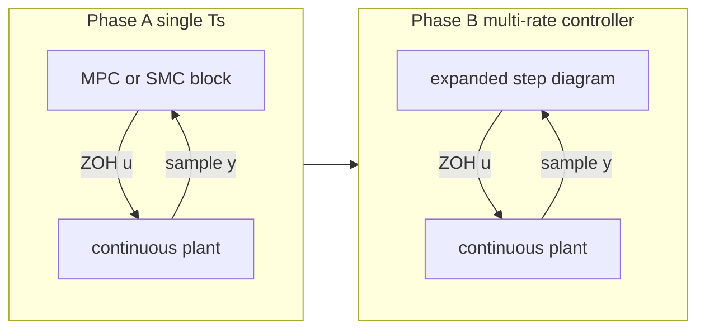
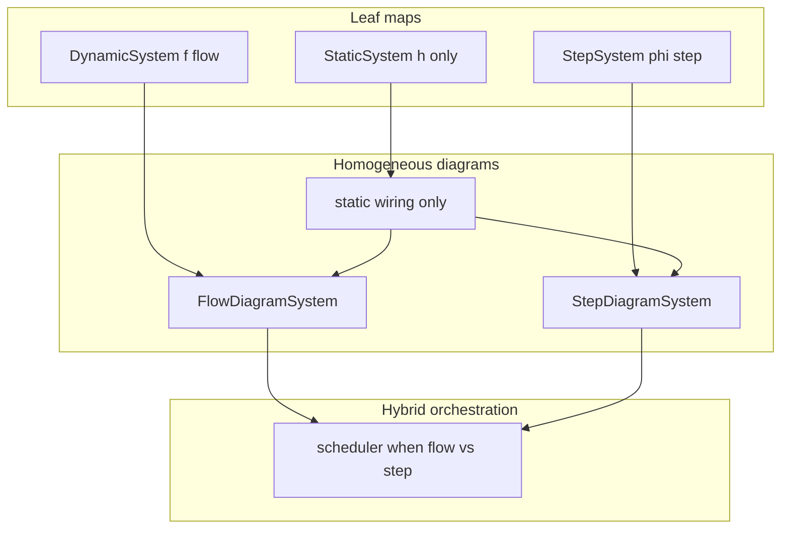
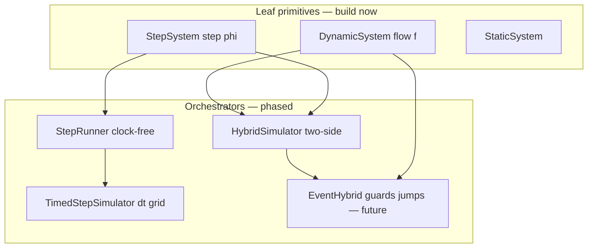
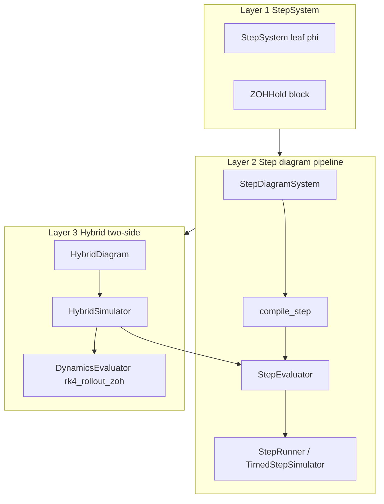

# Hybrid and step simulation (design only)

Status: draft plan (July 2026). No implementation in this phase.

Architecture for **step maps** (difference equations, jumps, turn-based dynamics),
step diagrams, multi-rate expansion, clock-driven hybrid simulation (step side ZOH →
continuous plant ← measurements), and a path toward **full switched / hybrid**
systems. Supersedes the continuous-time-only stance in [DESIGN.md](../../DESIGN.md) §3
for this **subset** — not full Simulink parity.

Implemented contracts (when landed) live in [DESIGN.md](../../DESIGN.md),
[ROADMAP.md](../../ROADMAP.md), and [README.md](../../README.md) call chains.

---

## Summary

Build in layers on **two fundamental state-evolution maps**:

| Map | Leaf type | Equation | Meaning |
| --- | --- | --- | --- |
| **Flow `f`** | `DynamicSystem` | `dx = f(x, u, t; p)` | ODE / continuous evolution |
| **Step `phi`** | `StepSystem` | `x⁺ = φ(x, u, t; p)` | One-shot update (difference eq., jump, turn) |

**Static** blocks (`StaticSystem`, `n = 0`) and **output** map `h` are shared across all
kinds. **Hybrid** is not a third map — it is **orchestration** that calls flow and step
engines and decides **when** each applies.

Near-term deliverables:

1. **`StepSystem`** — sibling of `DynamicSystem`; **`phi`** returns next state (not `dx`).
2. **Step diagram pipeline** — sibling `StepDiagramSystem` + compile + `StepRunner`
   (clock-free) + timed `TimedStepSimulator`; reuse wiring and `ExecutionPlan`.
3. **Hybrid simulation (v1)** — two-side topology only: step side → ZOH → continuous plant
   ← measurements; **`HybridSimulator`** owns the orchestration loop.

Multi-rate (e.g. 10 Hz MPC + 100 Hz filter) uses **`expand_scheduled_step()`** to export a
**synchronous base-clock `StepDiagramSystem`** with internal `RateGate` / `HoldRegister` /
`SampleLatch` state — **not** a second simulator path with hidden hold buffers.

---

## Short-term use cases (what we are building for)

The first **hybrid** capability is **not** an arbitrary mixed diagram. It is one recurring
pattern:

```text
[ sampled controller (step side) ]  --ZOH on u-->  [ continuous plant (flow side) ]
              ^                                              |
              +---------------- measurements y ----------------+
```

Both primary near-term targets share this **two-side** structure; only the controller block
differs.

| Use case | Controller (step side) | Plant (flow side) | Sample time |
| --- | --- | --- | --- |
| **MPC closed loop** | `MPCBlock` (`StepSystem` wrapping `MPCPlanner.step`) | `DynamicBicycle` (or other catalog plant) | `Ts` = MPC period |
| **Sliding-mode control (SMC)** | `SMCBlock` or generic sampled `StepSystem` controller | same continuous plant | `Ts` = SMC period |

**ZOH semantics:** between controller updates, plant input `u` is **held constant**
(zero-order hold). Measurements `y` are **sampled** at controller ticks (typically end of each
plant sub-interval, or start — pick one convention and document in `HybridSimulator`).

This is the **only** hybrid topology in scope for v1. Controllers may contain static wiring
(gains, saturations, mux) inside the step diagram; the plant stays a homogeneous flow diagram.

### Phase A — single-rate controller (ship first)

One controller block, one sample period `Ts`, plant integrated with inner step `dt_plant`
where `dt_plant = Ts` or subdivides `Ts` (e.g. `Ts = 0.1 s`, plant RK4 at `0.01 s` per
`HybridSimulator` tick).

```text
Phase A topology (single Ts):

  r ──► [ MPC or SMC @ 1/Ts ] ──ZOH──► [ plant ] ──► y
              ▲                              │
              └──────── y sampled ───────────┘
```

**Deliverables:**

- `HybridDiagram` + `HybridSimulator` with boundary ZOH + measurement sample.
- `MPCBlock` + refactor one MPC demo (straight-line bicycle).
- **`SMCBlock`** (or documented pattern): `StepSystem` implementing discrete-time sliding
  mode; same `HybridSimulator` loop as MPC — **no second sim path**.
- Controller step diagram may be a **single leaf** (`MPCBlock` / `SMCBlock`) plus static
  blocks; no multi-rate expansion required yet.

**Acceptance:** closed-loop sim matches hand-rolled demo loops within tolerance; plant sees
piecewise-constant `u` between samples.

### Phase B — multi-block controller, integer multiples of base clock

Cascade or multi-rate **controller only** — e.g. outer MPC @ 10 Hz, inner reference filter @
100 Hz, still driving one continuous plant. All controller blocks run at rates that are
**integer divisors of one `dt_base`** (no non-integer ratios in v1).

```text
Phase B topology (expand before hybrid sim):

  r ──► [ filter @ 100 Hz ] ──► [ MPC @ 10 Hz ] ──ZOH──► [ plant @ continuous ]
              StepDiagramSystem (logical)  →  expand_scheduled_step  →  sync @ dt_base
```

**Mechanism:** user wires logical `StepDiagramSystem`; calls
`expand_scheduled_step(..., dt_base, schedule)`; passes **expanded** diagram to
`HybridDiagram.step`. Plant side unchanged from Phase A.

**Example schedule** (`dt_base = 0.01 s` = 100 Hz):

| Block | Rate | `schedule[sys_id]` |
| --- | --- | --- |
| `filter` | 100 Hz | `1` |
| `mpc` | 10 Hz | `10` |

**Deliverables:** `RateGate`, `HoldRegister`, `SampleLatch`, `expand_scheduled_step` tests;
one cascade demo (optional second MPC demo or SMC + filter).

**Deferred in Phase B:** non-integer ratios (e.g. 30 Hz vs 100 Hz), FOH, delays, mixing flow
blocks on the controller side.

### Cascade multi-rate: expand, don't schedule (simplest Phase B design)

**Do not simulate multiple clocks.** Simulate **one fast base tick** on the controller side
and **expand** the logical cascade so slower blocks become step subsystems wrapped with
hold/gate state. This is the minimal Simulink subset — not a general multi-rate engine.

```text
User writes (logical topology, no manual holds):

  r → [ filter ] → [ MPC ] → u_cmd
        100 Hz      10 Hz

Expand once (expand_scheduled_step):

  r → [ filter ] → … → [ HoldRegister? ] → [ RateGate(MPC) ] → u_cmd
        @ dt_base       (on cross-rate edges)   (fire every k=10)

Simulate:

  every dt_base:  step_evaluator.step(...)   on expanded StepDiagramSystem
  hybrid loop:    ZOH u → plant (rk4_rollout_zoh) → sample y   (unchanged from Phase A)
```

**Three user-facing pieces** — no second simulator, no hidden hold dict in the evaluator:

| Piece | Role |
| --- | --- |
| `StepDiagramSystem` | Wire cascade normally (`filter >> mpc`); no clock blocks in user diagram |
| `expand_scheduled_step(diagram, dt_base, schedule)` | Insert `RateGate` / `HoldRegister` / `SampleLatch` on cross-rate edges |
| `HybridSimulator` | Expanded step diagram @ `dt_base` + ZOH `u` → continuous plant |

**End-to-end API (Phase B):**

```python
controller = StepDiagramSystem()
controller.add_subsystem(ref_filter, "filter")
controller.add_subsystem(mpc_block, "mpc")
controller.add_input_port("r")
controller.connect("input", "r", "filter", "r")
controller.connect("filter", "y", "mpc", "r")
controller.connect_new_output_port("mpc", "u", "u")

sync = expand_scheduled_step(
    controller,
    dt_base=0.01,                       # 100 Hz — fastest block rate
    schedule={"filter": 1, "mpc": 10},  # mpc fires every 10 base ticks
)

hybrid = HybridDiagram(step=sync, continuous=plant, connections=[...], dt_base=0.01)
HybridSimulator(hybrid, ...).run()
```

**Expansion rules (v1):**

| Situation | Insert | Per `dt_base` tick |
| --- | --- | --- |
| Same rate | Direct wire | Both fire |
| Slow ← fast (e.g. MPC ← filter) | `SampleLatch` on edge | Latch when slow block fires |
| Fast ← slow | `HoldRegister` on edge | ZOH between slow updates |
| Block divisor `k > 1` | `RateGate` wrapper | Run inner `phi` every k ticks; else identity |

**Defaults:**

- Set **`dt_base`** to the **fastest** controller block period.
- **`schedule[sys_id] = k`** means the block fires every **k** base steps (`10 Hz` on `100 Hz` base → `k=10`).
- Plant boundary: same ZOH + sample as Phase A; plant may use inner substeps `dt_plant << dt_base` inside `rk4_rollout_zoh`.

**Why this is not “full Simulink”:**

| Full Simulink multi-rate | This plan (Phase B) |
| --- | --- |
| Arbitrary flow + step in one canvas | Controller = step diagram only; plant = flow diagram only |
| Many clock domains + opaque scheduler | **One `dt_base`** on controller side after expansion |
| FOH, delays, triggered subs, events | **ZOH + sample + integer divisors** only |
| Hidden runtime hold buffers | Holds are **diagram subsystems with state** (debuggable, in `ExecutionPlan`) |

Step-only closed loops (no plant) use the same expansion, then `TimedStepSimulator` at
`sync_dt = dt_base` — one code path for controller-only and hybrid sim.

### What this is not (short term)

| Out of scope | Instead |
| --- | --- |
| One flat diagram with Integrator + MPC | Two sides + `HybridSimulator` |
| Controller and plant at unrelated clocks without expansion | Phase B expansion to `dt_base` |
| Event-driven switching (relay, impact) | Future layer 5 |
| Full Simulink hybrid library | ZOH + sample only |


```mermaid
flowchart LR
    subgraph phaseA [Phase A single Ts]
        C1[MPC or SMC block]
        P1[continuous plant]
        C1 -->|ZOH u| P1
        P1 -->|sample y| C1
    end

    subgraph phaseB [Phase B multi-rate controller]
        C2[expanded step diagram]
        P2[continuous plant]
        C2 -->|ZOH u| P2
        P2 -->|sample y| C2
    end

    phaseA --> phaseB
```

---

## Four system kinds

Every block extends the same `System` shell (ports, params, `h`, visualization). Evolution
differs by kind:

| Kind | State | Core map(s) | Equation | Role |
| --- | --- | --- | --- | --- |
| **Static** | `n = 0` | `h` | `y = h(u, t; p)` | Algebra: gains, mux, saturation |
| **Flow** | `n > 0` | `f` | `dx = f(x, u, t; p)` | Plants, integrators, ODE controllers |
| **Step** | `n > 0` | `φ` (`phi`) | `x⁺ = φ(x, u, t; p)` | Digital maps, games, jumps, rate gates |
| **Hybrid** | `n > 0` | **`f` + `φ`** | flow between steps; step at instants | MPC+plant, switched systems, impacts |


```mermaid
flowchart TB
    subgraph leaves [Leaf maps]
        ST[StaticSystem h only]
        FL[DynamicSystem f flow]
        SP[StepSystem phi step]
    end

    subgraph diagrams [Homogeneous diagrams]
        D0[static wiring only]
        DF[FlowDiagramSystem]
        DS[StepDiagramSystem]
    end

    subgraph orch [Hybrid orchestration]
        O[scheduler when flow vs step]
    end

    ST --> D0
    FL --> DF
    SP --> DS
    D0 --> DF
    D0 --> DS
    DF --> O
    DS --> O
```

**Homogeneous diagram rule (v1):** flow diagrams contain only static + flow blocks; step
diagrams contain only static + step blocks. Do **not** mix `Integrator` and `StepSystem` in
one flat diagram without an orchestrator — heterogeneous evolution belongs in **`HybridDiagram`**
(layer 4) or a future event hybrid engine (layer 5).

---

## Architecture decision: sibling types, not a flag

Investigated options for the step core:

| Option | Verdict |
| --- | --- |
| Same `DynamicSystem` + `time_domain` flag on `f` | **Reject** — reverses meaning of `f`, breaks textbook clarity, confuses analysis tools |
| `StepSystem(DynamicSystem)` inheritance | **Reject** — same method name, opposite semantics; inherits RK4-facing APIs |
| **Sibling `StepSystem` + shared wiring mixin** | **Adopt** — matches `StaticSystem` / `DynamicSystem` pattern |
| Unified `DiagramSystem` with flag | **Reject for v1** — heterogeneous diagrams need orchestrator, not one compile path |

**Shared without duplication:** port wiring, params nesting, algebraic-loop detection,
`ExecutionPlan`, `PortOperation`, `StateOperation`. **Forked:** leaf type, evaluator public
API (`f` → `dx` vs `step` → `x⁺`), and advance loop (ODE integrator vs `x ← φ`).

Do **not** use `solver_info["continuous_time_equation"]` as the primary semantic switch —
evolution kind is **type-level** (`isinstance(sys, StepSystem)`). The existing simulator
hook may remain for facades only.

---

## Naming: `f` vs `phi`

| | Flow | Step |
| --- | --- | --- |
| **Math** | `dx = f(x, u, t; p)` | `x⁺ = φ(x, u, t; p)` or `x_{k+1} = φ(x_k, u_k, t_k; p)` |
| **Leaf method** | `f(...)` on `DynamicSystem` | **`phi(...)`** on `StepSystem` |
| **Evaluator** | `DynamicsEvaluator.f` → `dx` | **`StepEvaluator.step`** → `x⁺` (calls stored `phi`) |
| **Avoid** | — | **`g`** (gravity, costs, NLP constraints already use `g` in minilink) |

`phi` is the standard one-step **transition map** in dynamical-systems literature and pairs
cleanly with flow `f`. **`step`** is the orchestrator/evaluator verb, not the leaf equation
name.

Phase-1 **`StepSystem` has no clock** — no `sample_period` on the class. Uniform sampling
(`sync_dt`, ZOH, multi-rate) is layer 3; turn-based games use `StepRunner` with `t` as move
index.

---

## Hybrid orchestration

When flow and step combine, three pieces are required:

1. **Flow engine** — integrate `dx = f(...)` (existing `DynamicsEvaluator` + solvers).
2. **Step engine** — apply `x ← φ(...)` (`StepEvaluator.step`).
3. **Scheduler** — decides *when* to flow, *when* to step, and boundary I/O between sides.

The scheduler is **not** a fourth fundamental map. Clocks, guards, and triggers live in
orchestrators — not inside leaf `f` or `phi`.

### Trigger policies (what the scheduler implements)

| Policy | Trigger | Example | Engine (phase) |
| --- | --- | --- | --- |
| **Clock-driven** | every `dt_base` or tick `k` | MPC @ 10 Hz + plant | `HybridSimulator`, `TimedStepSimulator` |
| **Turn / index-driven** | caller advances one step | chess, RL `env.step` | `StepRunner` only (no `dt`) |
| **Event-driven** | guard `g(x,u,t)` during flow | impact, relay crossing | **Deferred** — flow + event locator + jump `φ` |
| **Mode-driven** | discrete mode `σ` selects `f_σ` | switched continuous plant | **Deferred** — mode in state or params + scheduler |
| **Enable / triggered** | enable signal | triggered subsystem, `RateGate` | step blocks with internal state; expansion layer |

```text
         ┌──────────────── orchestrator ────────────────┐
         │                                              │
  u ───► │  [step side φ] ──ZOH──► [flow side f] ──y──►│──► y_meas
         │       ▲                      │               │
         │       └──── sample y ────────┘               │
         └──────────────────────────────────────────────┘
```

### Orchestrator responsibilities

| Responsibility | Owner |
| --- | --- |
| Time / tick index | scheduler |
| Call `StepEvaluator.step` vs integrate `f` | scheduler |
| Boundary: ZOH, sample, port mapping | `HybridDiagram` + scheduler |
| Homogeneous compile per side | `compile()` vs `compile_step()` |
| Guards / zero-crossings | future `EventHybrid` (layer 5) |

### v1 hybrid cycle (clock-driven, pseudocode)

```python
x_flow, x_step = x_flow_0, x_step_0
t = t0
while t < tf:
    u_hold = step_evaluator.outputs(x_step, u_ext, t)["u"]
    x_step = step_evaluator.step(x_step, u_ext, t)
    x_flow = cont_evaluator.rk4_rollout_zoh(x_flow, u_hold, t, dt)
    y_meas = cont_evaluator.outputs(x_flow, u_hold, t + dt)["y"]
    u_ext = sample_for_step_side(y_meas)
    t += dt
```

Static blocks remain **inside** each diagram; the orchestrator sees only boundary ports.

---

## Future: switched and full hybrid systems

Path from this plan to hybrid automata / switched systems **without changing the leaf core**:

| Level | Description | Uses |
| --- | --- | --- |
| **A — Compositional** | Two-side MPC + plant | `HybridSimulator` (this plan) |
| **B — Switched flow** | `f_σ(x,u)`, mode `σ` | `DynamicSystem` + mode in state/params; scheduler picks `σ` |
| **C — Full hybrid** | flow + guard + jump | integrate `f` until guard; then `x ← φ_jump` |


```mermaid
flowchart TB
    subgraph primitives [Leaf primitives — build now]
        DS[DynamicSystem flow f]
        SS[StepSystem step phi]
        ST[StaticSystem]
    end

    subgraph schedulers [Orchestrators — phased]
        SR[StepRunner clock-free]
        TS[TimedStepSimulator dt grid]
        H1[HybridSimulator two-side]
        H2[EventHybrid guards jumps — future]
    end

    DS --> H1
    SS --> H1
    SS --> SR --> TS
    H1 --> H2
    DS --> H2
```

**Do not build toward full hybrid by:** merging flow and step into one flagged `f`, or mixing
heterogeneous blocks in one diagram class before event scheduling exists.

---

## Recommendation

**Build two leaf maps (`f` and `phi`), homogeneous diagrams, then hybrid as thin glue.**

- Each layer is testable in isolation (step closed loops before touching the plant).
- Reuses minilink's pattern: `System` → diagram → compile → evaluator → runner/simulator.
- Hybrid schedules two mature pipelines; no fused `ExecutionPlan` mixing `dx` and `x⁺`.

| Layer | Delivers | Does not deliver |
| --- | --- | --- |
| **1** | `StepSystem`, `ZOHHold` (math: `phi` only) | Clock, diagrams, simulation |
| **2a** | `StepDiagramSystem` — synchronous, full topology | Multi-rate without expansion |
| **2b** | compile + `StepRunner` + `TimedStepSimulator` + `expand_scheduled_step` | Evaluator hold-buffer scheduler |
| **3a** | **Phase A:** `HybridSimulator`, `MPCBlock`, `SMCBlock` pattern, one `Ts` | Multi-rate controller |
| **3b** | **Phase B:** cascade controller via `expand_scheduled_step` | Non-integer rate ratios |
| **4–5** | (future) events, guards, switched modes | — |

**Implementation gates:** Layer 3a (single-rate hybrid) may start after step compile works;
Layer 3b (multi-rate expansion) requires Layer 2 expansion blocks; do not block MPC/SMC on
multi-rate.

---

## Layer overview


```mermaid
flowchart TB
    subgraph layer1 [Layer 1 StepSystem]
        SS[StepSystem leaf phi]
        ZOH[ZOHHold block]
    end

    subgraph layer2 [Layer 2 Step diagram pipeline]
        SDS[StepDiagramSystem]
        SC[compile_step]
        SE[StepEvaluator]
        SR[StepRunner / TimedStepSimulator]
        SDS --> SC --> SE --> SR
    end

    subgraph layer3 [Layer 3 Hybrid two-side]
        HD[HybridDiagram]
        HS[HybridSimulator]
        CE[DynamicsEvaluator rk4_rollout_zoh]
        HD --> HS
        HS --> SE
        HS --> CE
    end

    layer1 --> layer2
    layer2 --> layer3
```

---

## Clock architecture

**Phase B rule:** user never hand-wires holds or rate gates in the logical diagram —
`expand_scheduled_step` is the only public multi-rate entry (see
[Cascade multi-rate](#cascade-multi-rate-expand-dont-schedule-simplest-phase-b-design)).

| Question | Answer |
| --- | --- |
| Reuse continuous wiring for step diagrams? | **Yes** — sibling `StepDiagramSystem` + shared mixin / `ExecutionPlan` |
| Full topology at synchronous level? | **Yes** — after expansion |
| Where does clock live? | **`expand_scheduled_step()`** + `dt_base`; not on `StepSystem` |
| Second diagram topology class? | **Yes** — `StepDiagramSystem` sibling of `DiagramSystem` |
| Middle layer for wiring + clock? | **Expansion** to sync diagram with hold/gate internal state |
| Public `schedule` on `TimedStepSimulator`? | **No** — multi-rate must go through expansion |
| Multiple sim loops for cascade? | **No** — one sync step @ `dt_base` on expanded diagram |

### Expand, then simulate synchronously

```python
# User writes logical cascade (no clock, no holds)
controller = StepDiagramSystem()
controller.add_subsystem(ref_filter, "filter")
controller.add_subsystem(mpc_block, "mpc")
controller.connect("input", "r", "filter", "r")
controller.connect("filter", "y", "mpc", "r")

# Expand to base-clock diagram with internal RateGate / Hold / SampleLatch
sync_diagram = expand_scheduled_step(
    controller,
    dt_base=0.01,
    schedule={"filter": 1, "mpc": 10},
)

# Controller-only: sync step every dt_base
simulate_steps(sync_diagram, x0, options=TimedStepOptions(sync_dt=0.01, tf=10.0))

# Hybrid: pass sync_diagram to HybridDiagram.step — plant loop unchanged
```

The expanded diagram **is** a normal `StepDiagramSystem`. Holds and rate gating are
**internal subsystems with state**, not simulator-side buffers.

### Cross-rate port semantics → internal blocks

| Edge | Semantics | Expansion inserts |
| --- | --- | --- |
| Slow → Fast | ZOH | `HoldRegister` |
| Fast → Slow | Sample at slow tick | `SampleLatch` |
| Subsystem divisor k > 1 | Fire every k base steps | `RateGate` wrapper |
| Same rate | Direct | No change |

**New blocks** in `minilink/blocks/`:

| Block | State | Per base tick |
| --- | --- | --- |
| `RateGate` | counter + inner states | Fire inner `phi` every k ticks; else identity |
| `HoldRegister` | held output | Update when upstream fires; else hold |
| `SampleLatch` | latched sample | Capture upstream when downstream fires |

**Prefer expansion for v1.** Hold buffers may remain a private fallback, not the public contract.

**Recommendation:** core `StepSystem` has **no `sample_period`**. Optional
`params["sample_period"]` as a demo hint only. Authoritative schedule lives in
`expand_scheduled_step(..., schedule=...)`. Mirrors continuous minilink: **`phi` is math;
time grid lives outside the equation.**

---

## Context: minilink today

| Piece | Today | This plan |
| --- | --- | --- |
| Static leaf | `StaticSystem`: `y = h(u)` | Unchanged |
| Flow leaf | `DynamicSystem`: `dx = f(...)` | Unchanged |
| Flow diagram | `DiagramSystem` + `compile()` → `DynamicsEvaluator` | Unchanged |
| Step | Out of scope in DESIGN §3 | Layers 1–3 (subset) |
| MPC demos | Manual Python loop × 7 | Layer 3 via `MPCBlock` + `HybridSimulator` |
| JAX plant rollout | `rk4_rollout_ivp` scan | add `rk4_rollout_zoh` for hybrid inner loop |
| `game()` loop | Euler on `f` | Later: branch for `StepSystem` → `x = phi(x,u,t)` |

---

## Layer 1: `StepSystem`

**Files:** `minilink/core/system.py`, `minilink/blocks/`

```python
class StepSystem(System):
    """
    x⁺ = φ(x, u, t; p)
    y  = h(x, u, t; p)
    """
    def phi(self, x, u, t=0, params=None):
        ...
```

- Same port/params surface as `DynamicSystem` (`u`, `y`, optional `x` ports).
- **`phi` returns next state**, not derivative; do **not** overload `f` on this class.
- `solver_info`: `continuous_time_equation=False`.
- `dt` or sample time inside `phi` via `params` or wiring only when the **model** needs it —
  not a class-level clock.
- Parallel continuous work: **`rk4_rollout_zoh`** on flow evaluator (JAX scan) for Layer 3.

---

## Layer 2: Step diagram pipeline

### Shared wiring extraction

**File:** `minilink/core/wiring.py` (or `WiredDiagramBase` mixin) — used by both
`DiagramSystem` and `StepDiagramSystem`:

- `connect`, `get_local_input`, params nesting, `state_index`, boundary outputs.

### `StepDiagramSystem`

**File:** `minilink/core/step_diagram.py` — **sibling** of `DiagramSystem`.

- **`x⁺ = φ(x, u, t)`** — same stacked loop as flow `DiagramSystem.f`; docstring and method
  name differ (`phi` or diagram-level `step_state`).
- Evaluator exposes **`step(x, u, t)`** calling each block's `phi`.
- Subsystems: `StepSystem`, `StaticSystem`, `ZOHHold`. Reject `DynamicSystem` at compile.
- Reuse `build_execution_plan()` and `ExecutionPlan` — do not fork.

| Flow | Step |
| --- | --- |
| `compile_diagram()` → `DynamicsEvaluator` | `compile_step_diagram()` → `StepEvaluator` |
| `evaluator.f → dx` | `evaluator.step → x⁺` |
| RK4, rollout, SciPy | stepping only |

Mark step compile path **`TODO: User Architectural Review`** until closed-loop tests pass.

### `StepRunner` and `TimedStepSimulator`

**Files:** `minilink/simulation/step_runner.py`, `minilink/simulation/timed_step_simulator.py`

**`StepRunner`** — clock-free; caller owns `t` sequence (turn-based, generic stepping):

```python
def run_steps(evaluator, x0, u_sequence, t_sequence) -> StepResult
```

**`TimedStepSimulator`** — uniform grid wrapper (digital control):

```python
@dataclass
class TimedStepOptions:
    tf: float
    sync_dt: float

def simulate_steps(diagram, x0, *, options) -> StepResult
```

Multi-rate: expand first, then simulate with `sync_dt = dt_base`.

### Sibling diagram + shared core (not subclass)

| Layer | Shared? |
| --- | --- |
| Port wiring | **Yes** — `core/wiring.py` mixin |
| Diagram state map | **Yes** — same loop; `dx` vs `x⁺` docstring |
| `ExecutionPlan` | **Yes** |
| Leaf type | **Sibling** — `DynamicSystem` vs `StepSystem` |
| Evaluator | **Sibling** — `DynamicsEvaluator` vs `StepEvaluator` |
| Runner / simulator | **Different** — ODE vs `x ← φ` |

---

## Layer 3: Hybrid — sampled controller + ZOH + continuous plant

The **only** v1 hybrid structure (see [Short-term use cases](#short-term-use-cases-what-we-are-building-for)):

```
[ StepDiagramSystem ]  --ZOH on u-->  [ DiagramSystem plant ]
         ^                                      |
         +----------- sample y -------------------+
```

Phase A: one controller block at sample period `Ts`. Phase B: expanded multi-rate step
diagram at `dt_base`, same plant boundary.

### `HybridDiagram` — `minilink/core/hybrid_diagram.py`

```python
@dataclass
class HybridDiagram:
    step: StepDiagramSystem          # expanded sync diagram when multi-rate
    continuous: DiagramSystem
    connections: list[BoundaryConnection]
    dt_base: float
```

### `HybridSimulator` — `minilink/simulation/hybrid_simulator.py`

**Phase A** — single controller sample time `Ts` (= `dt_base` or outer tick):

Per controller tick:

1. Step side — `step_evaluator.step` (MPC, SMC, or single `StepSystem` controller).
2. Boundary — hold controller output `u` (ZOH) for the plant over `[t, t + Ts]`.
3. Continuous — `cont_evaluator.rk4_rollout_zoh(x, u_hold, t, Ts)` (optional inner substeps
   `dt_plant << Ts`).
4. Feedback — sample plant outputs `y` at tick boundary → controller inputs.

**Phase B** — same loop at `dt_base`; step side is **pre-expanded** multi-rate diagram
(Phase A plant path unchanged).

Python outer (step + MPC/SMC solvers) / JAX inner (plant rollout).

### `MPCBlock` — `minilink/planning/mpc/`

- `StepSystem` wrapping `MPCPlanner.step`.
- Warm-start state in `__init__`; no `core/compile/` imports.
- `sys_mpc` vs `sys_sim` stays explicit in demos.
- Primary **Phase A** reference controller.

### Sampled sliding-mode controller (`SMCBlock` or pattern)

- **`StepSystem`** implementing discrete-time sliding-mode law (or equivalent sampled SMC).
- Lives on step side of `HybridDiagram`; **same ZOH boundary** as MPC.
- May live in `minilink/control/` as factory + block; no `core/compile/` imports.
- **Phase A** deliverable alongside MPC — proves hybrid sim is not MPC-specific.

### Demo targets

| Phase | Demo | Notes |
| --- | --- | --- |
| **A** | Refactor `examples/scripts/mpc/demo_dynamic_bicycle_rate_mpc_straight_line.py` | Preserve user tuning |
| **A** | New or existing SMC + plant demo (e.g. bicycle or pendulum) | Same `HybridSimulator` API |
| **B** | Cascade: filter @ fast rate + MPC @ slow rate | Uses `expand_scheduled_step` |

---

## Scope

### In scope

- Layers 1–3 as above.
- **Phase A:** single-rate MPC and SMC (sampled controller + ZOH + continuous plant).
- **Phase B:** multi-block controller at integer multiples of `dt_base`.
- DESIGN / ROADMAP / README sync on implementation.

### Deferred

| Item | Why |
| --- | --- |
| Flow + step in one flat diagram | v1 uses two sides + orchestrator |
| Non-integer divisor ratios | resampling / drift |
| Evaluator hold-buffer scheduler (public) | expansion preferred |
| FOH, delay, events, full Simulink multi-rate | ZOH subset only |
| `EventHybrid` (guards, zero-crossing, jump maps) | layer 5; needs event engine |
| Switched-mode flow without events | mode in state; scheduler later |
| `linearize` / Bode on native `StepSystem` | Jacobian ∂φ/∂x is discrete A; separate pass |

---

## Tests (per layer)

| Layer | File | Cases |
| --- | --- | --- |
| 1 | `test_step_system.py` | leaf `phi`; `ZOHHold`; `solver_info` |
| 1 | `test_rk4_rollout_zoh.py` | NumPy/JAX vs repeated `rk4_step` |
| 2 | `test_step_diagram.py` | wiring; `@` closed loop |
| 2 | `test_scheduled_step.py` | expansion slow→fast ZOH; fast→slow sample |
| 2 | `test_step_runner.py` | clock-free stepping |
| 2 | `test_timed_step_simulator.py` | sync closed loop; expanded multi-rate |
| 3 | `test_hybrid_simulator.py` | Phase A: ZOH → plant → sample y; MPC and SMC smoke |
| 3 | `test_mpc_block.py` | MPCBlock closed loop |
| 3 | `test_smc_hybrid.py` | SMC + plant via same HybridSimulator (Phase A) |
| 2–3 | `test_scheduled_step_cascade.py` | Phase B: filter fast + MPC slow on `dt_base` |

---

## Implementation order

| Step | Layer | Deliverable | Phase |
| --- | --- | --- | --- |
| 1 | 1 | `StepSystem`, `ZOHHold`, leaf tests | — |
| 2 | 1 | `rk4_rollout_zoh` | — |
| 3 | 2 | shared diagram wiring mixin (`core/wiring.py`) | — |
| 4 | 2 | `StepDiagramSystem` | — |
| 5 | 2 | `compile_step_diagram` + `StepEvaluator` | — |
| 6 | 2 | `StepRunner` + `TimedStepSimulator` + closed-loop tests | — |
| 7 | 3 | `HybridDiagram` + `HybridSimulator` (ZOH + sample) | **A** |
| 8 | 3 | `MPCBlock` + straight-line MPC demo | **A** |
| 9 | 3 | `SMCBlock` (or pattern) + SMC hybrid demo | **A** |
| 10 | 2 | `RateGate`, `HoldRegister`, `SampleLatch` | **B** |
| 11 | 2 | `expand_scheduled_step()` + tests | **B** |
| 12 | 3 | Cascade controller demo (multi-rate on `dt_base`) | **B** |
| 13 | all | DESIGN / ROADMAP / README | — |

**Gate:** Phase A hybrid (steps 7–9) after step compile + `rk4_rollout_zoh`. Phase B
(steps 10–12) after Phase A hybrid tests pass; do not block MPC/SMC on expansion.

---

## AGENTS.md alignment (summary)

- Textbook math: `dx = f(...)`, `x⁺ = φ(...)`; bare `f` / `phi` / `h` on equation paths.
- Complexity in expansion blocks + simulators; thin leaf types.
- Reuse port gather / `ExecutionPlan`; no blind fork.
- `MPCBlock` in `planning/mpc/`; warm-start in `__init__`.
- Preserve user demo tuning; one demo refactor only.
- Pre-push: `ruff check .`, `ruff format --check .`, proportionate `pytest`.

---

## Expected outcome

- Step blocks compose like flow systems (diagram + ports).
- Turn-based and clock-driven both use `StepSystem`; only the orchestrator differs.
- Multi-rate cascade: **logical diagram → `expand_scheduled_step` → one loop @ `dt_base`**
  (not multiple clocks, not full Simulink).
- Hybrid v1: thin scheduler over step `φ` + `rk4_rollout_zoh` plant — **MPC and SMC** at one
  `Ts` (Phase A), then cascade controllers on `dt_base` (Phase B).
- MPC and SMC demos drop hand-rolled outer loops; same `HybridSimulator` API.
- Future switched/hybrid: same `f` and `phi` atoms + event scheduler — no leaf rewrite.
