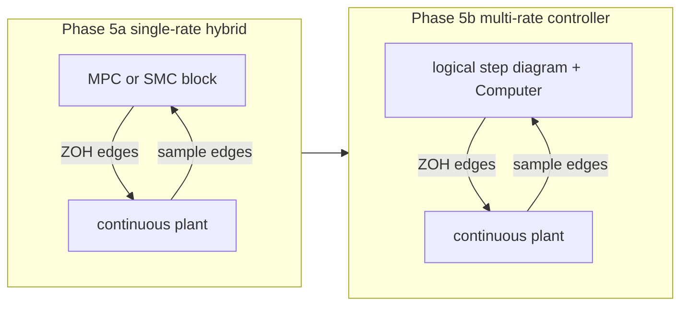
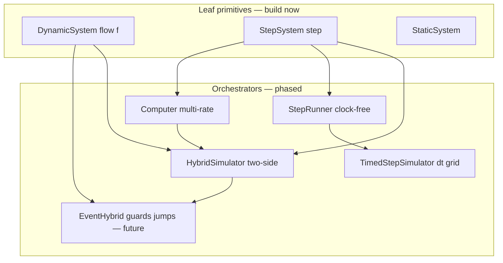
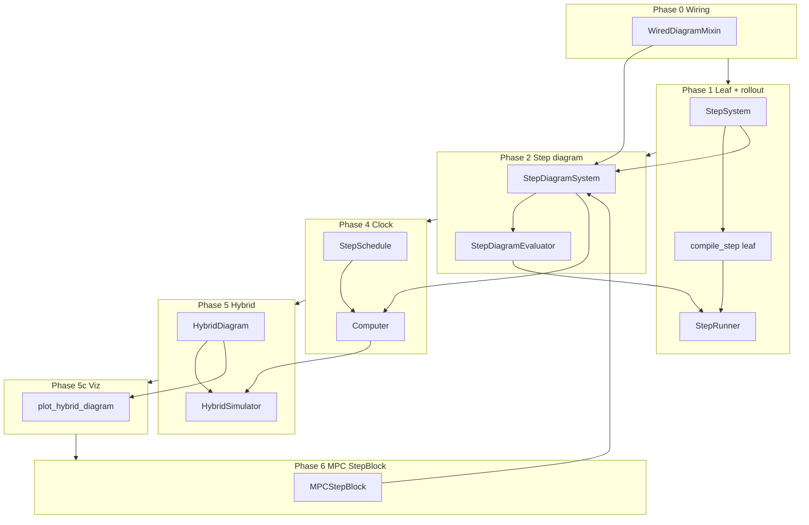

# Hybrid and step simulation (design only)

Status: Phases **0**, **1a**, **1**, **1b**, **2** complete on `dev-hybrid` (July 2026); Phases **3–6**
pending. Shard contracts: [hybrid-discrete/00-master-plan.md](hybrid-discrete/00-master-plan.md).

Architecture for **step maps** (difference equations, jumps, turn-based dynamics),
step diagrams, **scheduled multi-rate orchestration**, clock-driven hybrid simulation
(step side ZOH → continuous plant ← measurements), and a path toward **full switched /
hybrid** systems. Supersedes the continuous-time-only stance in [DESIGN.md](../../DESIGN.md)
§3 for this **subset** — not full Simulink parity.

Implemented contracts (when landed) live in [DESIGN.md](../../DESIGN.md),
[ROADMAP.md](../../ROADMAP.md), and [README.md](../../README.md) call chains.

---

## Summary

Build in layers on **two fundamental state-evolution maps**:

| Map | Leaf type | Equation | Meaning |
| --- | --- | --- | --- |
| **Flow `f`** | `DynamicSystem` | `dx = f(x, u, t; p)` | ODE / continuous evolution |
| **Step `step`** | `StepSystem` | `x_{k+1} = step(x, u, k; p)` | One-shot update (difference eq., jump, turn) |

**Static** blocks (`System` with `n = 0`) and **output** map `h` are shared across all
kinds. **Hybrid** is not a third map — it is **orchestration** that calls flow and step
engines and decides **when** each applies.

Near-term deliverables (see **[00-master-plan.md](hybrid-discrete/00-master-plan.md)** for full phase list):

0. **Phase 0** — extract shared diagram wiring mixin; validate continuous diagrams unchanged. **Done.**
0. **Phase 1a** — move `f` to `DynamicSystem`; typed `compile()` (static / dynamic evaluators); `StaticSimulator`; `compute_trajectory` on static + dynamic only. **Done** (`d131a89`).
1. **Phase 1** — `StepSystem` leaf; unified `compile()` step branch; `StepEvaluator.rollout` / `compute_rollout`; `step(x, u, k)` / `h(x, u, k)`; no wall time on leaf. **Done** (`700f8ea`).
1b. **Phase 1b** — façade mixin split; `DiagramSystem` IS-A `DynamicSystem`; MRO sim dispatch. **Done** (`40c8297`).
2. **Phase 2** — `StepDiagramSystem`, diagram step compile branch, diagram `StepEvaluator`. **Done** (`0b7a1fd`).
3. **Phase 3** — `discretize()` optional conversion tool.
4. **Phase 4** — `StepSchedule.dt_base` + `Computer` (single- and multi-rate).
5. **Phase 5** — `HybridSimulator` + boundary ports; **always** uses Phase 4 on the step side.
6. **Phase 6** — `MPCStepBlock` API: stateless (6a), then warm-start state (6b); MPC demo refactor.

Multi-rate cascade (e.g. 10 Hz MPC + 100 Hz filter) keeps the logical `StepDiagramSystem`
unchanged; **`Computer`** fires blocks on schedule with internal hold buffers.
**Optional lowering:** `expand_scheduled_step()` — deferred.

---

## Implementation phases

Split contracts: [00-wiring-refactor](hybrid-discrete/00-wiring-refactor.md) ·
[01a-evolution-map-refactor](hybrid-discrete/01a-evolution-map-refactor.md) ·
[01-step-core](hybrid-discrete/01-step-core.md) ·
[01b-facade-mixin-split](hybrid-discrete/01b-facade-mixin-split.md) ·
[02-step-diagram](hybrid-discrete/02-step-diagram.md) ·
[03-discretization](hybrid-discrete/03-discretization.md) ·
[04-computer](hybrid-discrete/04-computer.md) ·
[05-hybrid-simulation](hybrid-discrete/05-hybrid-simulation.md) ·
[05c-hybrid-viz-shortcuts](hybrid-discrete/05c-hybrid-viz-shortcuts.md) ·
[06-mpc-step-block](hybrid-discrete/06-mpc-step-block.md)

| Phase | Delivers | Clock | Status |
| --- | --- | --- | --- |
| **0** | `WiredDiagramMixin` / `core/wiring.py`; `DiagramSystem` unchanged API | — | **Done** |
| **1a** | `f` on `DynamicSystem`; `StaticEvaluator` + `StaticSimulator`; unified `compile()` | — | **Done** |
| **1** | `StepSystem`, `ZOHHold`, `compile()` step branch, `StepEvaluator.rollout` / `compute_rollout` | none | **Done** |
| **1b** | Façade mixins; `DiagramSystem(DynamicSystem)`; MRO sim dispatch | — | **Done** |
| **2** | `StepDiagramSystem`, diagram step compile branch, diagram `StepEvaluator` | none | **Done** |
| **3** | `discretize(DynamicSystem, dt)` → `StepSystem` | `dt` in closure | pending |
| **4** | `StepSchedule` + `Computer` | **`dt_base`** authoritative for clocked step sim | pending |
| **5** | `HybridDiagram`, `HybridSimulator`, SMC / cascade | **`schedule.dt_base`**; Computer always on step side | pending |
| **6** | `MPCStepBlock` (6a stateless, 6b warm-start) | uses Phase 4–5 stack | pending |

**Split of concerns:** Phase 4 = sample time + firing **inside** the step diagram. Phase 5 =
step↔plant boundary ZOH/sample + continuous plant (`rk4_rollout_zoh`). Hybrid **requires Phase 4**
even for single-rate control (trivial schedule: empty `fire` ⇒ every block every tick).

**Phase 5 milestones:** **5a** — hybrid + trivial schedule + SMC demo; **5b** — cascade hybrid
with non-trivial `fire`; **5c** — `plot_hybrid_diagram` + `hybrid_closed_loop`. **Phase 6
milestones:** **6a** — stateless `MPCStepBlock` + straight-line MPC demo; **6b** — block state
holds last optimizer **`z`** for warm-start parity.

---

## Short-term use cases (what we are building for)

The first **hybrid** capability is **not** an arbitrary mixed diagram. It is a **two-side**
structure — step diagram + continuous diagram — with explicit **boundary connections**:

```text
[ sampled controller (step side) ]  --ZOH (step→plant edges)-->  [ continuous plant ]
              ^                                                           |
              +-------- sample (plant→step edges, any port) ---------------+
```

Both primary near-term targets share this structure; only the controller block differs.
**Phase 5 supports multiple named ports** across the boundary (not only `"u"` / `"y"`); MPC and
SMC demos use the **minimal** case (one command edge + one measurement edge, possibly vector-valued).

| Use case | Controller (step side) | Plant (flow side) | Sample time |
| --- | --- | --- | --- |
| **MPC closed loop** | `MPCStepBlock` ([Phase 6](hybrid-discrete/06-mpc-step-block.md)) | `DynamicBicycle` (or other catalog plant) | `Ts` = MPC period |
| **Sliding-mode control (SMC)** | `SMCBlock` or generic sampled `StepSystem` controller | same continuous plant | `Ts` = SMC period |

**Boundary semantics (Phase 5):**

| Direction | Policy |
| --- | --- |
| Step output → plant input | **ZOH** — held constant over `[t, t + dt_base]` |
| Plant output → step input | **Sample** — latched at end of previous plant interval |

**Tick semantics:** controller at tick `k` reads **sample_buffers** from plant outputs at the end of
tick `k-1` (one-tick delay). Order: **read sample → step → ZOH → integrate plant → write sample**.
See [05-hybrid-simulation.md](hybrid-discrete/05-hybrid-simulation.md) for tick-0 initialization.
World references (`r`) attach to step or plant diagram boundary inputs — not hybrid edges.

This is the **only** hybrid topology class in scope for v1. Controllers may contain static wiring
inside the step diagram; the plant stays a homogeneous flow diagram.

### Phase 5a — single-rate hybrid (ship first)

One controller block, one sample period `Ts`, plant integrated with inner step `dt_plant`
where `dt_plant = Ts` or subdivides `Ts` (e.g. `Ts = 0.1 s`, plant RK4 at `0.01 s` per
`HybridSimulator` tick).

```text
Phase 5a topology (trivial `StepSchedule`, empty `fire`):

  r ──► [ MPC or SMC @ 1/Ts ] ──ZOH──► [ plant ] ──► y
              ▲                              │
              └──────── y sampled ───────────┘

`StepSchedule(dt_base=Ts)` — Computer runs whole step diagram every tick.
```

**Deliverables:**

- `HybridDiagram` + `HybridSimulator` + **required `StepSchedule`** (trivial or multi-rate).
- **`SMCBlock`** (or documented pattern): `StepSystem` implementing discrete-time sliding
  mode; validates `HybridSimulator` — **no second sim path**.
- Controller step diagram may be a **single leaf** (`SMCBlock` / generic `StepSystem`) plus static
  blocks; no multi-rate expansion required yet.
- **MPC hybrid demo** — [Phase 6a](hybrid-discrete/06-mpc-step-block.md) (`MPCStepBlock` stateless).

**Acceptance:** closed-loop sim matches hand-rolled **SMC** (or agreed test-double) loop within
tolerance; plant inputs held piecewise-constant between samples on every step→plant edge.
MPC parity acceptance lands in Phase 6a.

### Phase 5b — multi-rate controller cascade

Cascade or multi-rate **controller only** — e.g. outer MPC @ 10 Hz, inner reference filter @
100 Hz, still driving one continuous plant. All controller blocks run at rates that are
**integer divisors of one `dt_base`** (no non-integer ratios in v1).

```text
Phase 5b topology (non-trivial `fire` on same `StepSchedule`):

  r ──► [ filter @ 100 Hz ] ──► [ MPC @ 10 Hz ] ──ZOH──► [ plant @ continuous ]
              StepDiagramSystem (logical)  +  StepSchedule  +  Computer
```

**Mechanism:** user wires logical `StepDiagramSystem`; attaches
`StepSchedule(dt_base, fire={...})` on `Computer` inside `HybridDiagram`; **no graph
rewrite**. `Computer` @ `dt_base` updates buffers and calls each block's
`step` when its divisor fires. Plant boundary unchanged from 5a.

**Example schedule** (`dt_base = 0.01 s` = 100 Hz):

| Block | Rate | `fire[sys_id]` (divisor d) |
| --- | --- | --- |
| `filter` | 100 Hz | `1` |
| `mpc` | 10 Hz | `10` |

**Deliverables:** `StepSchedule`, `Computer`, buffer snapshot API for
debug; cascade demo (filter fast + MPC slow).

**Deferred in 5b:** non-integer ratios (e.g. 30 Hz vs 100 Hz), FOH, delays, mixing flow
blocks on the controller side.

### Multi-rate (Phase 5b): Computer vs expansion

Two ways to implement the **same high-level API** (logical cascade + schedule). **Default:
Computer hold buffers.**

| | **A — Orchestrator buffers** (adopt) | **B — Diagram expansion** (optional) |
| --- | --- | --- |
| **Idea** | Logical diagram unchanged; Computer owns ZOH/latch **buffers** and fires blocks on schedule | `expand_scheduled_step()` inserts `RateGate`, `HoldRegister`, `SampleLatch` as step blocks with state |
| **Block contract** | Pure `step`; rate via `StepSchedule.fire` (optional per-block hint in `params`) | Pure `step` wrapped in infrastructure blocks |
| **Hold state** | Orchestrator side buffers (export via `buffer_history` on traj) | In diagram state vector `x` |
| **Sim loop** | Orchestrator tick @ `dt_base` → subset of `step` calls | Full `StepEvaluator.step` on expanded diagram |

**Orchestrator — pros:** pure control-law blocks; logical diagram = mental model; complexity
in Computers ([AGENTS.md](../../AGENTS.md)); 5a → 5b adds non-trivial `fire` only;
(Computer already owns *when*).

**Orchestrator — cons:** hold state not in `x` unless exported; subset firing is a Python
(or staged) loop — weaker single JAX scan for whole controller; Computer must implement
cross-rate rules once (fast→slow sample, slow→fast ZOH).

**Expansion — pros:** one `StepEvaluator.step` @ `dt_base`; holds in `x` (plottable,
teachable); fixed `ExecutionPlan` — better JAX scan story.

**Expansion — cons:** graph rewrite complexity; diagram pollution (`_hold_*` subsystems);
hold/latch as fake dynamics; re-expand on topology/schedule change; feels heavy for simple
MPC + filter cascade.

**Decision:** Phase 5b **primary** = `Computer` (Phase 4). Document
`expand_scheduled_step()` as **optional lowering** for perf/JAX/teaching — not required for
SMC or cascade demos.

### Cascade multi-rate: Computer at `dt_base` (Phase 5b)

**Do not simulate multiple clocks.** Simulate **one base tick**; the Computer decides
which controller blocks fire and what each input reads (live signal vs held buffer).

```text
User writes (logical topology, no holds):

  r → [ filter ] → [ MPC ] → u_cmd
        100 Hz      10 Hz

Orchestrator @ dt_base (Computer):

  tick k:
    if filter fires:  run filter.step(..., k); buffer["filter:y"] ← output
    else:              use buffer["filter:y"]  (ZOH for downstream)
    if mpc fires:      run mpc.step(..., k, buffer["filter:y"]); buffer["mpc:u"] ← u_cmd
    ...
  HybridSimulator: ZOH step→plant edges → integrate plant → sample plant→step edges
```

**Three user-facing pieces:**

| Piece | Role |
| --- | --- |
| `StepDiagramSystem` | Wire cascade normally (`filter >> mpc`); blocks stay pure `step` |
| `StepSchedule(dt_base, fire)` | Integer divisors per `sys_id`; lives on `HybridDiagram` / `Computer` |
| `Computer` | Phase 4 — intra-step firing + cross-rate buffers |
| `HybridSimulator` | Phase 5 — Computer + boundary ZOH/sample + plant |

**End-to-end API (Phase 5b):**

```python
controller = StepDiagramSystem()
controller.add_subsystem(ref_filter, "filter")
controller.add_subsystem(mpc_block, "mpc")
controller.add_input_port("r")
controller.connect("input", "r", "filter", "r")
controller.connect("filter", "y", "mpc", "r")
controller.connect_new_output_port("mpc", "u", "u")

schedule = StepSchedule(dt_base=0.01, fire={"filter": 1, "mpc": 10})

hybrid = HybridDiagram(computer=Computer(controller, schedule), plant=plant)
hybrid.connect_boundary(direction="computer_to_plant", computer_port="u", plant_port="u")
hybrid.connect_boundary(direction="plant_to_computer", computer_port="y", plant_port="y")
HybridSimulator(hybrid, plant_dt_inner=SIM_DT, ...).run()
```

**Cross-rate rules (Computer, v1):**

| Situation | Orchestrator behavior |
| --- | --- |
| Same rate | Both fire same ticks |
| Slow consumer ← fast producer | **Sample** producer output when slow block fires |
| Fast consumer ← slow producer | **ZOH** — hold last slow output in buffer |
| Block divisor `d > 1` | Run `step` every d base ticks; skip otherwise (buffer holds) |

**Debug:** Computer records `buffer_history` (or `HybridSimResult.buffers`) so internal
holds are plottable like diagram internal signals — without putting hold state in `x`.

**Defaults:**

- **`dt_base`** = fastest controller block period.
- **`fire[sys_id] = d`** = block fires every **d** base steps (step index **`k`** increments every base tick).
- Plant boundary: same ZOH + sample as 5a; **`schedule.dt_base`** drives plant hold interval.

**Optional lowering (expansion path):**

```python
sync = expand_scheduled_step(controller, dt_base=0.01, schedule={"filter": 1, "mpc": 10})
# → plain StepEvaluator.step @ dt_base; holds become diagram state
```

Use when a single fused JAX scan over the whole controller matters; not required for v1.

**Why this is not “full Simulink”:**

| Full Simulink multi-rate | This plan (Phase 5b) |
| --- | --- |
| Arbitrary flow + step in one canvas | Controller = step diagram; plant = flow diagram |
| Many opaque clock domains | **One `dt_base`** + explicit `StepSchedule` |
| FOH, delays, triggered subs, events | **ZOH + sample + integer divisors** only |
| General hybrid scheduler | Narrow **`HybridSimulator` + `Computer`** |

### What this is not (short term)

| Out of scope | Instead |
| --- | --- |
| One flat diagram with Integrator + MPC | Two sides + `HybridSimulator` |
| Controller and plant at unrelated clocks | Phase 5b `StepSchedule.fire` |
| Event-driven switching (relay, impact) | Future layer 5 |
| Full Simulink hybrid library | ZOH + sample only |


```mermaid
flowchart LR
    subgraph phase5a [Phase 5a single-rate hybrid]
        C1[MPC or SMC block]
        P1[continuous plant]
        C1 -->|ZOH edges| P1
        P1 -->|sample edges| C1
    end

    subgraph phase5b [Phase 5b multi-rate controller]
        C2[logical step diagram + Computer]
        P2[continuous plant]
        C2 -->|ZOH edges| P2
        P2 -->|sample edges| C2
    end

    phase5a --> phase5b
```

---

## Four system kinds

Every block extends the same `System` shell (ports, params, `h`, visualization). Evolution
differs by kind:

| Kind | State | Core map(s) | Equation | Role |
| --- | --- | --- | --- | --- |
| **Static** | `n = 0` | `h` | `y = h(u, t; p)` | Algebra: gains, mux, saturation |
| **Flow** | `n > 0` | `f` | `dx = f(x, u, t; p)` | Plants, integrators, ODE controllers |
| **Step** | `n > 0` | `step` | `x_{k+1} = step(x, u, k; p)` | Digital control laws, games, jumps |
| **Hybrid** | `n > 0` | **`f` + `step`** | flow between steps; step at instants | MPC+plant, switched systems, impacts |


```mermaid
flowchart TB
    subgraph leaves [Leaf maps]
        ST[StaticSystem h only]
        FL[DynamicSystem f flow]
        SP[StepSystem step]
    end

    subgraph diagrams [Homogeneous diagrams]
        D0[static wiring only]
        DF[FlowDiagramSystem]
        DS[StepDiagramSystem]
    end

    subgraph orch [Hybrid orchestration]
        O[scheduler when flow vs step]
    end

    ST --> D0
    FL --> DF
    SP --> DS
    D0 --> DF
    D0 --> DS
    DF --> O
    DS --> O
```

**Homogeneous diagram rule (v1):** flow diagrams contain only static + flow blocks; step
diagrams contain only static + step blocks. Do **not** mix `Integrator` and `StepSystem` in
one flat diagram without a Computer — heterogeneous evolution belongs in **`HybridDiagram`**
(layer 4) or a future event hybrid engine (layer 5).

---

## Architecture decision: sibling types, not a flag

Investigated options for the step core:

| Option | Verdict |
| --- | --- |
| Same `DynamicSystem` + `time_domain` flag on `f` | **Reject** — reverses meaning of `f`, breaks textbook clarity, confuses analysis tools |
| `StepSystem(DynamicSystem)` inheritance | **Reject** — same method name, opposite semantics; inherits RK4-facing APIs |
| **Sibling `StepSystem` + shared wiring mixin** | **Adopt** — matches `StaticSystem` / `DynamicSystem` pattern |
| Unified `DiagramSystem` with flag | **Reject for v1** — heterogeneous diagrams need Computer, not one compile path |

**Shared without duplication:** port wiring, params nesting, algebraic-loop detection,
`ExecutionPlan`, `PortOperation`, `StateOperation`. **Forked:** leaf type, evaluator public
API (`f` → `dx` vs `step` → `x_new`), and advance loop (ODE integrator vs `x ← step(...)`).

Do **not** use `solver_info["continuous_time_equation"]` as the primary semantic switch —
evolution kind is **type-level** (`isinstance(sys, StepSystem)`). The existing simulator
hook may remain for facades only.

---

## Naming: `f` vs `step` and the third slot

| | Flow | Step |
| --- | --- | --- |
| **Math (evolution)** | `dx = f(x, u, t; p)` | `x_{k+1} = step(x, u, k; p)` |
| **Math (output)** | `y = h(x, u, t; p)` | `y = h(x, u, k; p)` |
| **Leaf evolution** | `DynamicSystem.f` | `StepSystem.step` |
| **Leaf output** | `System.h` with **`t`** | `StepSystem.h` with **`k`** |
| **Evaluator evolution** | `DynamicsEvaluator.f` → `dx` | `StepEvaluator.step` → `x_new` |
| **Third slot on shared gather / `port.compute`** | **`t`** (float, seconds) | **`k`** (int, step/turn index) |
| **Avoid** | — | **`g`** (gravity, costs, NLP constraints already use `g` in minilink) |

**`StepSystem` has no wall time** — `k` can index chess moves, game turns, or Computer fire
counts. **`StepSchedule.dt_base`** ([Phase 4](hybrid-discrete/04-computer.md))
schedules firing and (hybrid) plant holds; it does **not** become `t` inside `step()`.

**Do not** pass `t_k = k · dt_base` into `StepSystem` or step-diagram port eval. **Do not**
convert `float(k)` / `int(t)` at path boundaries.

**JAX:** separate `JaxDiagramEvaluator` (float `t`) and `JaxStepEvaluator` (int `k`) — never
one jitted graph mixing both third-slot types.

Leaf and step evaluator share the verb **`step`**, mirroring how diagram evaluators expose **`f`**
for flow systems. Docstrings may use `x_{k+1}` or `x_new`; the return value is the next state
vector.

Hybrid and clocked discrete sim **always** go through `Computer` on the step
side ([Phase 4+](hybrid-discrete/04-computer.md)).

---

## Hybrid orchestration

When flow and step combine, three pieces are required:

1. **Flow engine** — integrate `dx = f(...)` (existing `DynamicsEvaluator` + solvers).
2. **Step engine** — apply `x ← step(...)` (`StepEvaluator.step`).
3. **Scheduler** — decides *when* to flow, *when* to step, and boundary I/O between sides.

The scheduler is **not** a fourth fundamental map. Clocks, guards, and triggers live in
Computers — not inside leaf `f` or `step`.

### Trigger policies (what the scheduler implements)

| Policy | Trigger | Example | Engine (phase) |
| --- | --- | --- | --- |
| **Clock-driven** | every `dt_base` or tick `k` | MPC @ 10 Hz + plant | `HybridSimulator`, `TimedStepSimulator` |
| **Turn / index-driven** | caller advances one step | chess, RL `env.step` | `StepRunner` only (no `dt`) |
| **Event-driven** | guard `g(x,u,t)` during flow | impact, relay crossing | **Deferred** — flow + event locator + jump `step` |
| **Mode-driven** | discrete mode `σ` selects `f_σ` | switched continuous plant | **Deferred** — mode in state or params + scheduler |
| **Enable / triggered** | enable signal | triggered subsystem | Computer skip-fire (future) |

```text
         ┌──────────────── Computer ────────────────┐
         │                                              │
  r ───► │  [step side] ──ZOH (edges)──► [flow plant]   │
         │       ▲              │                       │
         │       └── sample (edges) ────────────────────┘
         └──────────────────────────────────────────────┘
```

### Orchestrator responsibilities

| Responsibility | Owner |
| --- | --- |
| Time / tick index | scheduler |
| Call integrate `f` on plant vs step/orchestrate controller | `HybridSimulator` |
| Cross-rate holds / latches (within step diagram) | `Computer` (Phase 4) |
| Boundary ZOH / sample (step ↔ plant) | `HybridSimulator` (Phase 5) |
| Homogeneous compile per side | `compile()` vs `compile_step()` |
| Guards / zero-crossings | future `EventHybrid` (layer 5) |

### v1 hybrid cycle (clock-driven, pseudocode)

**Hybrid sim** (`schedule` required). Boundary driven by `hybrid.connections`; step side
**always** `computer.tick` (see [05-hybrid-simulation.md](hybrid-discrete/05-hybrid-simulation.md)).

```python
dt = hybrid.schedule.dt_base
x_flow, x_step = x_flow_0, x_step_0
zoh_buffers, sample_buffers = {}, {}
computer = hybrid.computer; computer.tick(...)
t, k = t0, 0

while t < tf:
    u_step = assemble_step_inputs(hybrid, world, sample_buffers, t, k)
    x_step, step_out, _orch_bufs = orch.tick(x_step, u_step, k)
    u_plant = assemble_plant_inputs(hybrid, zoh_buffers, step_out)
    x_flow = cont_evaluator.rk4_rollout_zoh(
        x_flow, u_plant, t, dt, dt_inner=plant_dt_inner
    )
    plant_out = cont_evaluator.outputs(x_flow, u_plant, t + dt)
    update_sample_buffers(hybrid, sample_buffers, plant_out)
    t += dt
    k += 1
```

`assemble_step_inputs` reads **only** `sample_buffers` and step-diagram boundary inputs — not
raw `x_flow`. **`sample_buffers`** at tick `0` are initialized from plant outputs at `t0`
(see Phase 5 doc).

**Phase 5b:** same loop; non-trivial `schedule.fire` only changes Computer internals.

Static blocks remain **inside** each diagram; the Computer sees only boundary ports.

---

## Future: switched and full hybrid systems

Path from this plan to hybrid automata / switched systems **without changing the leaf core**:

| Level | Description | Uses |
| --- | --- | --- |
| **A — Compositional** | Two-side MPC + plant | `HybridSimulator` (this plan) |
| **B — Switched flow** | `f_σ(x,u)`, mode `σ` | `DynamicSystem` + mode in state/params; scheduler picks `σ` |
| **C — Full hybrid** | flow + guard + jump | integrate `f` until guard; then `x ← step_jump(...)` |


```mermaid
flowchart TB
    subgraph primitives [Leaf primitives — build now]
        DS[DynamicSystem flow f]
        SS[StepSystem step]
        ST[StaticSystem]
    end

    subgraph schedulers [Orchestrators — phased]
        SR[StepRunner clock-free]
        TS[TimedStepSimulator dt grid]
        SO[Computer multi-rate]
        H1[HybridSimulator two-side]
        H2[EventHybrid guards jumps — future]
    end

    DS --> H1
    SS --> H1
    SS --> SR --> TS
    SS --> SO --> H1
    H1 --> H2
    DS --> H2
```

**Do not build toward full hybrid by:** merging flow and step into one flagged `f`, or mixing
heterogeneous blocks in one diagram class before event scheduling exists.

---

## Recommendation

**Build two leaf maps (`f` and `step`), homogeneous diagrams, then hybrid as thin glue.**

- Each layer is testable in isolation (step closed loops before touching the plant).
- Reuses minilink's pattern: `System` → diagram → compile → evaluator → runner/simulator.
- Hybrid schedules two mature pipelines; no fused `ExecutionPlan` mixing `dx` and `x_new`.

| Phase | Delivers | Does not deliver |
| --- | --- | --- |
| **0** | `WiredDiagramMixin`; continuous diagrams unchanged | `StepSystem`, compile fork |
| **1** | `StepSystem`, `ZOHHold`, `compile_step` (leaf), `StepRunner` | Clock, diagrams |
| **2** | `StepDiagramSystem`, `compile_step_diagram`, diagram `StepEvaluator` | `StepSchedule`, hybrid |
| **3** | **`discretize`** | Required for hybrid MPC path |
| **4** | `StepSchedule` + `Computer` | Plant, hybrid boundary |
| **5a** | Hybrid + trivial schedule + SMC | Multi-rate controller; MPC |
| **5b** | Cascade hybrid (non-trivial `fire`) | Expansion lowering; MPC |
| **5c** | `plot_hybrid_diagram`, `hybrid_closed_loop` | `@` across domains |
| **6a** | `MPCStepBlock` stateless + MPC hybrid demo | Warm-start state |
| **6b** | `MPCStepBlock` with last `z` state | — |
| **Future** | events, guards, `expand_scheduled_step` | — |

**Gates:** **Phase 0 before Phase 1a.** **Phase 1a before Phase 1.** Phase 2 before 4 and 5. **Phase 4 before Phase 5.**
Phase 3 optional for hybrid. 5a → 5b → 5c. **Phase 5 before Phase 6.** 6a → 6b.

---

## Phase overview (mermaid)


```mermaid
flowchart TB
    subgraph p0 [Phase 0 Wiring]
        WIR[WiredDiagramMixin]
    end

    subgraph p1 [Phase 1 Leaf + rollout]
        SS[StepSystem]
        CSL[compile_step leaf]
        SR[StepRunner]
    end

    subgraph p2 [Phase 2 Step diagram]
        SDS[StepDiagramSystem]
        SE[StepDiagramEvaluator]
    end

    subgraph p4 [Phase 4 Clock]
        SCH[StepSchedule]
        SO[Computer]
    end

    subgraph p5 [Phase 5 Hybrid]
        HD[HybridDiagram]
        HS[HybridSimulator]
    end

    subgraph p5c [Phase 5c Viz]
        PLOT[plot_hybrid_diagram]
    end

    subgraph p6 [Phase 6 MPC StepBlock]
        MPC[MPCStepBlock]
    end

    WIR --> SDS
    SS --> CSL --> SR
    SS --> SDS --> SE --> SR
    SDS --> SO
    SCH --> SO
    SO --> HS
    HD --> HS
    HD --> PLOT
    MPC --> SDS
    p0 --> p1 --> p2 --> p4 --> p5 --> p5c --> p6
```

---

## Clock architecture

**Phase 5b rule:** user never hand-wires holds in the logical step diagram. Multi-rate is
**non-trivial `StepSchedule.fire`** on the same Computer (Phase 4).
`expand_scheduled_step()` lowers to sync diagram state — not the default.

| Question | Answer |
| --- | --- |
| Reuse continuous wiring for step diagrams? | **Yes** — sibling `StepDiagramSystem` + shared mixin / `ExecutionPlan` |
| Where does clock live? | **`StepSchedule.dt_base`** (Phase 4+); not on leaf `StepSystem` |
| Hybrid step side | **Always** `Computer` (trivial `fire` in 5a) |
| Hybrid plant + boundary | **`HybridSimulator`** — ZOH/sample edges + `rk4_rollout_zoh` |

### Phase 5a: single-rate hybrid (trivial schedule)

```python
schedule = StepSchedule(dt_base=Ts)  # empty fire => all blocks every tick
hybrid = HybridDiagram(computer=Computer(controller, schedule), plant=plant)
hybrid.connect_boundary(direction="computer_to_plant", computer_port="u", plant_port="u")
hybrid.connect_boundary(direction="plant_to_computer", computer_port="y", plant_port="y")
HybridSimulator(hybrid, plant_dt_inner=SIM_DT, ...).run()
```

### Phase 5b: multi-rate controller (non-trivial fire)

```python
controller = StepDiagramSystem()
controller.add_subsystem(ref_filter, "filter")
controller.add_subsystem(mpc_block, "mpc")
controller.connect("input", "r", "filter", "r")
controller.connect("filter", "y", "mpc", "r")

schedule = StepSchedule(dt_base=0.01, fire={"filter": 1, "mpc": 10})

hybrid = HybridDiagram(computer=Computer(controller, schedule), plant=plant)
hybrid.connect_boundary(direction="computer_to_plant", computer_port="u", plant_port="u")
hybrid.connect_boundary(direction="plant_to_computer", computer_port="y", plant_port="y")
HybridSimulator(hybrid, plant_dt_inner=SIM_DT, ...).run()
```

### Optional: expansion lowering

```python
sync = expand_scheduled_step(controller, dt_base=0.01, schedule={"filter": 1, "mpc": 10})
hybrid = HybridDiagram(computer=Computer(sync, schedule), plant=plant)
hybrid.connect_boundary(direction="computer_to_plant", computer_port="u", plant_port="u")
hybrid.connect_boundary(direction="plant_to_computer", computer_port="y", plant_port="y")
# StepEvaluator.step on expanded diagram — holds in x, no Computer hold buffers
```

**Rate metadata on blocks:** optional `params["sample_period"]` or class doc hint for
documentation; **authoritative** divisors live in `StepSchedule.fire`. Leaf `step` stays
pure — mirrors continuous minilink: **`step` is math; time grid lives in the Computer.**

### Optional expansion blocks (lowering only)

If `expand_scheduled_step()` is implemented later:

| Block | Role when expanded |
| --- | --- |
| `RateGate` | Wrap slow subsystem; fire inner `step` every d base ticks |
| `HoldRegister` | ZOH on slow→fast edges |
| `SampleLatch` | Sample on fast→slow edges |

Not required for Phase 5b Computer path.

---

## Context: minilink today

| Piece | Today | This plan |
| --- | --- | --- |
| Static leaf | `System` (`n=0`): boundary `outputs` / `h` on model | Unchanged |
| Flow leaf | `DynamicSystem`: `dx = f(...)` | Unchanged |
| Flow diagram | `DiagramSystem` IS-A `DynamicSystem`; `compile()` → `DynamicsEvaluator` | Phase 1b |
| Step | Out of scope in DESIGN §3 | Layers 1–3 (subset) |
| MPC demos | Manual Python loop × 7 | Phase **6** via `MPCStepBlock` + `HybridSimulator` |
| JAX plant rollout | `rk4_rollout_ivp` scan | add `rk4_rollout_zoh` for hybrid inner loop |
| `game()` loop | Euler on `f` | Later: branch for `StepSystem` → `x = step(x, u, k)` |

---

## Phase 0: Core wiring refactor

Extract shared diagram wiring before any step types land. Full contract and validation gate:
[00-wiring-refactor.md](hybrid-discrete/00-wiring-refactor.md).

**Deliverable:** `minilink/core/wiring.py` mixin; `DiagramSystem` delegates; **pytest + diagram
smoke unchanged**.

**Gate:** Phase 0 merges only after continuous diagram tests and composition shortcuts pass with
no API or topology regressions.

---

## Phase 1: `StepSystem` (leaf + rollout)

**Status:** complete (`700f8ea`). **Landed design:** rollout on compiled `StepEvaluator` via
`StepRolloutMixin` — **no** `StepRunner` / `step_runner.py`. User API: `compute_rollout`.

**Files:** `minilink/core/system.py`, `minilink/core/step_rollout.py`,
`minilink/core/compile/evaluators/step_evaluator.py`, `minilink/blocks/step.py`,
`examples/scripts/step/`

```python
class StepSystem(System):
    """
    x_{k+1} = step(x, u, k; p)
    y_k     = h(x, u, k; p)
    """
    def step(self, x, u, k=0, params=None):
        ...

    def h(self, x, u, k=0, params=None):
        ...
```

- Same port/params surface as `DynamicSystem` (`u`, `y`, optional `x` ports).
- **`step` returns next state** (`x_new`), not a derivative; do **not** overload `f` on this class.
- **Integer step index `k`**, not float `t`; `k=0` default (same role as `t=0` on `f` / `h`).
- **Evolution kind = class type** — route with `isinstance(sys, StepSystem)`; do **not** set or
  read `solver_info["continuous_time_equation"]` for step semantics (legacy flow default only).
- Sample period inside `step` via `params` or closed-over discretization only when the **model**
  needs it — not a class-level clock.
- **Leaf compile** — `compile(StepSystem)` → `NumpyStepEvaluator` / `JaxStepEvaluator`; mirrors
  flow leaf path. Reject flow RK4 on step leaves.
- **`StepEvaluator.rollout`** + **`compute_rollout`** façade — clock-free; diagram path reuses
  same mixin in Phase 2.
- **Teaching demos** via **`compute_rollout`**: Fibonacci, discrete accumulator, logistic map —
  see [01-step-core.md](hybrid-discrete/01-step-core.md#teaching-demos-canonical-leaf-scripts).

---

## Phase 2: Step diagram pipeline

**Contract:** [02-step-diagram.md](hybrid-discrete/02-step-diagram.md) — parallel **`StepExecutionPlan`**
pipeline; flow `ExecutionPlan` / `build_execution_plan` **unchanged**.

### Shared wiring extraction

Completed in [Phase 0](hybrid-discrete/00-wiring-refactor.md) — `minilink/core/wiring.py` mixin.
`DiagramSystem` and `StepDiagramSystem` both compose it. `StepDiagramSystem` IS-A `StepSystem`
(init via `System.__init__(0)` — mirror Phase 1b `DiagramSystem(DynamicSystem)`).

### `StepDiagramSystem`

**File:** `minilink/core/diagram.py` — sibling of `DiagramSystem`.

- **`x_{k+1} = step(x, u, k)`** — interpreted reference; compiled path uses `StepExecutionPlan`.
- User API: **`compute_rollout`** / **`compile().rollout(...)`** (Phase 1b façades).
- Subsystems: `StepSystem`, static `System` (`n=0`), `ZOHHold`. Reject `DynamicSystem` at compile.
- Reuse **`PortOperation`** gathers + `check_algebraic_loops`; evolution via **`StepOperation`**
  / **`step_ops`** — do not extend flow `StateOperation`.

| Flow | Step |
| --- | --- |
| `compile_diagram()` → `NumpyDiagramEvaluator` | `compile_step_diagram()` → `NumpyStepDiagramEvaluator` |
| `ExecutionPlan.state_ops` (`f_func → dx`) | `StepExecutionPlan.step_ops` (`step_func → x_new`) |
| `evaluator.f`, `compute_trajectory`, `Simulator` | `evaluator.step`, `compute_rollout`, `StepRolloutMixin` |

Mark step compile path **`TODO: User Architectural Review`** until closed-loop tests pass.

### Rollout (Phase 1 — reuse)

No `StepRunner` / `run_steps`. Diagram evaluators subclass **`StepEvaluator`** and inherit
**`rollout()`** from **`StepRolloutMixin`** — same as leaf Phase 1.

### `TimedStepSimulator` (optional stopgap)

Optional test-only wrapper if `compute_rollout` is insufficient before Phase 4. **Do not**
document in README until Phase 4 lands. Prefer skipping if tests pass without it.

### Sibling diagram + shared core (not merged compile)

| Layer | Shared? |
| --- | --- |
| Port wiring | **Yes** — `WiredDiagramMixin` |
| Port gather recipes | **Yes** — import `_build_gather_sources` / `_state_slice` |
| Execution plan type | **No** — `StepExecutionPlan` parallel to `ExecutionPlan` |
| Leaf / diagram type | **Sibling** — `DynamicSystem` / `DiagramSystem` vs `StepSystem` / `StepDiagramSystem` |
| Evaluator family | **Sibling** — `DynamicsEvaluator` vs `StepEvaluator` |
| Public rollout | **Step only** — `rollout` / `compute_rollout` (no ODE `Simulator` on step diagrams) |

---

## Phase 5: Hybrid — sampled controller + continuous plant

Two-side structure with **`BoundaryConnection`** edges. Minimal closed loops use one step→plant +
one plant→step edge; full contract:
[05-hybrid-simulation.md](hybrid-discrete/05-hybrid-simulation.md).

```text
  r ──► [ StepDiagramSystem ] ──(ZOH edges)──► [ DiagramSystem plant ]
              ▲                                        │
              └──── (sample edges, any ports) ──────────┘
```

**Requires Phase 4:** `HybridDiagram.schedule` is **required** (trivial `fire` in 5a).
`HybridSimulator` **always** calls `Computer` on the step side.

### `BoundaryConnection` and `HybridDiagram` — `minilink/core/hybrid_diagram.py`

```python
@dataclass(frozen=True)
class BoundaryConnection:
    direction: Literal["computer_to_plant", "plant_to_computer"]
    step_port: str
    continuous_port: str

@dataclass
class HybridDiagram:
    step: StepDiagramSystem
    continuous: DiagramSystem
    schedule: StepSchedule              # required — dt_base lives here
    connections: list[BoundaryConnection] = field(default_factory=list)

    def connect_boundary(
        self,
        *,
        direction: Literal["computer_to_plant", "plant_to_computer"],
        step_port: str,
        continuous_port: str,
    ) -> None: ...
```

`StepSchedule` defined in Phase 4 ([04-computer.md](hybrid-discrete/04-computer.md)).

Validate port dimensions at connect time. `HybridSimulator` keeps **`zoh_buffers`** (step→plant)
and **`sample_buffers`** (plant→step). See [05-hybrid-simulation.md](hybrid-discrete/05-hybrid-simulation.md)
for tick-0 buffer init and `rk4_rollout_zoh(..., dt_inner=...)`.

### `HybridSimulator` — `minilink/simulation/hybrid_simulator.py`

Per **`schedule.dt_base`** tick:

1. **Sample** — plant→step edges → `sample_buffers` → assemble `u_step`
2. **Step** — **`Computer.tick`** (always)
3. **ZOH** — step→plant edges → `zoh_buffers` → assemble `u_plant`
4. **Flow** — `rk4_rollout_zoh(x, u_plant, t, schedule.dt_base, dt_inner=...)`

**5b:** non-trivial `schedule.fire` only; plant boundary unchanged.

### `MPCStepBlock` — `minilink/planning/mpc/` ([Phase 6](hybrid-discrete/06-mpc-step-block.md))

- **6a:** `StepSystem` with **`n = 0`** — wraps `MPCPlanner.step`; no warm-start state.
- **6b:** same block with **`n > 0`** — packed last plan in `x` for shifted `initial_guess`.
- Refactor straight-line MPC demo in **6a**; warm-start parity in **6b**.

### Sampled sliding-mode controller (`SMCBlock` or pattern)

- **`StepSystem`** discrete-time sliding-mode law; **Phase 5a** deliverable.

### Demo targets

| Phase | Demo | Notes |
| --- | --- | --- |
| **5a** | SMC + plant hybrid | trivial schedule |
| **5b** | Cascade: filter fast + slow step block | non-trivial `fire`; MPC slot in 6a refresh |
| **5c** | `plot_hybrid_diagram` on SMC/MPC hybrid | `hybrid_closed_loop` shortcut |
| **6a** | Refactor straight-line MPC demo | stateless `MPCStepBlock` |
| **6b** | Same MPC demo | warm-start state parity |

---

## Phase 6: MPC `StepBlock` — `minilink/planning/mpc/`

Refactor so `MPCPlanner` exports a **`StepSystem`** leaf for hybrid simulation. Full contract:
[06-mpc-step-block.md](hybrid-discrete/06-mpc-step-block.md).

| Milestone | State | Behavior |
| --- | --- | --- |
| **6a** | **`n = 0`** | `MPCPlanner.step(..., initial_guess=None)` every tick; `h` returns `u_cmd` |
| **6b** | **`n = decision_dimension`** | block `x` holds last optimizer **`z`**; `shift_mpc_initial_guess` → next `initial_guess` |

Warm-start state uses the transcription decision vector **`z`**, not a new core Trajectory flatten
— see [06-mpc-step-block.md](hybrid-discrete/06-mpc-step-block.md).

**Gate:** Phase 5 hybrid sim before Phase 6. **6a** before **6b**. One straight-line MPC demo
refactor in 6a; warm-start parity in 6b.

---

## Scope

### In scope

- **Phase 0:** wiring mixin refactor + validation gate.
- Layers 1–3 as above.
- **Phase 5a:** single-rate hybrid (trivial schedule) + SMC.
- **Phase 5b:** multi-block controller at integer multiples of `schedule.dt_base`.
- **Phase 5c:** hybrid diagram plot + `hybrid_closed_loop` shortcut.
- **Phase 6:** `MPCStepBlock` + MPC demo refactor (6a stateless, 6b warm-start).
- DESIGN / ROADMAP / README sync on implementation.

### Deferred

| Item | Why |
| --- | --- |
| Flow + step in one flat diagram | v1 uses two sides + **Computer** |
| Cross-boundary algebraic loop (same tick) | sample-before-step convention; stricter check later |
| Per-port FOH, delay, async boundary rates | ZOH + sample @ `dt_base` only |
| Non-integer divisor ratios | resampling / drift |
| Evaluator hold-buffer scheduler (public) | Computer is the public contract |
| `expand_scheduled_step` / infra hold blocks | optional lowering; post-5b if needed |
| FOH, delay, events, full Simulink multi-rate | ZOH subset only |
| `EventHybrid` (guards, zero-crossing, jump maps) | layer 5; needs event engine |
| Switched-mode flow without events | mode in state; scheduler later |
| `linearize` / Bode on native `StepSystem` | Jacobian ∂step/∂x is discrete A; separate pass |

---

## Tests (per phase)

| Phase | File | Cases |
| --- | --- | --- |
| 0 | `test_wiring_mixin.py` | topology parity; connect validation unchanged |
| 0 | (existing) | `test_composition.py`, `test_diagrams.py`, diagram compile tests |
| 1 | `test_step_system.py` | leaf `step`; `ZOHHold`; `isinstance(StepSystem)`; simulator rejects step leaf |
| 1 | `test_compile_step_leaf.py` | `compile_step` leaf; frozen params parity |
| 1 | `test_step_runner.py` | clock-free `run_steps` on leaf evaluator |
| 1 | `examples/scripts/step/demo_step_*.py` | Fibonacci / accumulator / logistic smoke (exit 0, spot checks) |
| 2 | `test_step_diagram.py` | wiring; closed loop via `connect` |
| 2 | `test_step_diagram_runner.py` | `run_steps` on diagram evaluator |
| 2 | `test_timed_step_simulator.py` | uniform grid via diagram `StepEvaluator.step` |
| 3 | `test_discretize.py` | conversion over fixed `dt` |
| 4 | `test_computer.py` | trivial + multi-rate `fire`, buffers |
| 5 | `test_rk4_rollout_zoh.py` | ZOH rollout; `dt_inner` subdivides hold interval |
| 5 | `test_hybrid_simulator.py` | 5a multi-port boundary; matches hand-rolled SMC |
| 5 | `test_hybrid_boundary_connect.py` | invalid boundary wiring |
| 5 | `test_smc_hybrid.py` | 5a smoke |
| 5 | `test_hybrid_cascade.py` | 5b filter + slow block |
| 5c | `test_hybrid_topology.py` | hybrid plot topology; boundary edges |
| 5c | `test_hybrid_closed_loop.py` | shortcut vs manual `connect_boundary` |
| 6 | `test_mpc_step_block.py` | 6a stateless MPC block |
| 6 | `test_mpc_step_block_warm_start.py` | 6b plan state pack/shift |
| 6 | `test_mpc_hybrid_demo_parity.py` | hybrid vs hand-rolled MPC |
| — | `test_expand_computer.py` | optional expansion lowering |

---

## Implementation order

See [00-master-plan.md](hybrid-discrete/00-master-plan.md). Summary:

| Step | Phase | Deliverable | Status |
| --- | --- | --- | --- |
| **0** | **0** | `core/wiring.py` mixin + validation gate | **Done** |
| 1 | **1a** | `f` on `DynamicSystem`; typed `compile()`; `StaticSimulator` | **Done** |
| 2 | **1** | `StepSystem`, `ZOHHold`, `compile()` step branch, `StepEvaluator.rollout`, teaching demos | **Done** |
| 3 | **1b** | Façade mixins; `DiagramSystem(DynamicSystem)` | **Done** |
| 4–5 | **2** | `StepDiagramSystem`, `StepExecutionPlan`, `compile_step_diagram`, diagram evaluator, `compute_rollout` tests (`TimedStepSimulator` skipped) | **Done** |
| 6 | 3 | `discretize` *(optional)* | pending |
| 7 | 4 | `StepSchedule`, `Computer`, tests | pending |
| 8–10 | 5 | `rk4_rollout_zoh`, hybrid, SMC **(5a)** | pending |
| 11 | 5 | cascade hybrid demo **(5b)** | pending |
| 12 | 5c | `plot_hybrid_diagram`, `hybrid_closed_loop` | pending |
| 13 | 6 | `MPCStepBlock` stateless **(6a)** + straight-line demo | pending |
| 14 | 6 | `MPCStepBlock` warm-start **(6b)** | pending |
| 15 | all | DESIGN / ROADMAP / README | pending |

**Gates:** **0 → 1a → 1 → 1b → 2 → 4 → 5 → 5c → 6.** Phase 3 optional. **5a → 5b.** **6a → 6b.**

See [03-discretization.md](hybrid-discrete/03-discretization.md) for the conversion contract.

---

## AGENTS.md alignment (summary)

- Textbook math: `dx = f(...)`, `x_{k+1} = step(...)`; bare `f` / `step` / `h` on equation paths.
- Complexity in Computers + simulators; thin leaf types (pure `step`).
- Reuse port gather / `ExecutionPlan`; no blind fork.
- `MPCStepBlock` in `planning/mpc/`; warm-start in block state **6b** only.
- Preserve user demo tuning; one demo refactor only.
- Pre-push: `ruff check .`, `ruff format --check .`, proportionate `pytest`.

---

## Expected outcome

- Step blocks compose like flow systems (diagram + ports).
- Turn-based and clock-driven both use `StepSystem`; only the Computer differs.
- Multi-rate cascade: **logical diagram + `StepSchedule` + Computer @ `dt_base`**
  (holds in Computer hold buffers; optional expansion lowering later).
- Hybrid v1: **`schedule.dt_base`** + Computer on step side + boundary in `HybridSimulator`.
- **5a** SMC at one `Ts`; **5b** cascade via non-trivial `fire`.
- **6a** MPC via stateless `MPCStepBlock`; **6b** warm-start matches shifted-guess demos.
- MPC demos drop hand-rolled outer loops; same `HybridSimulator` API.
- Future switched/hybrid: same `f` and `step` atoms + event scheduler — no leaf rewrite.
