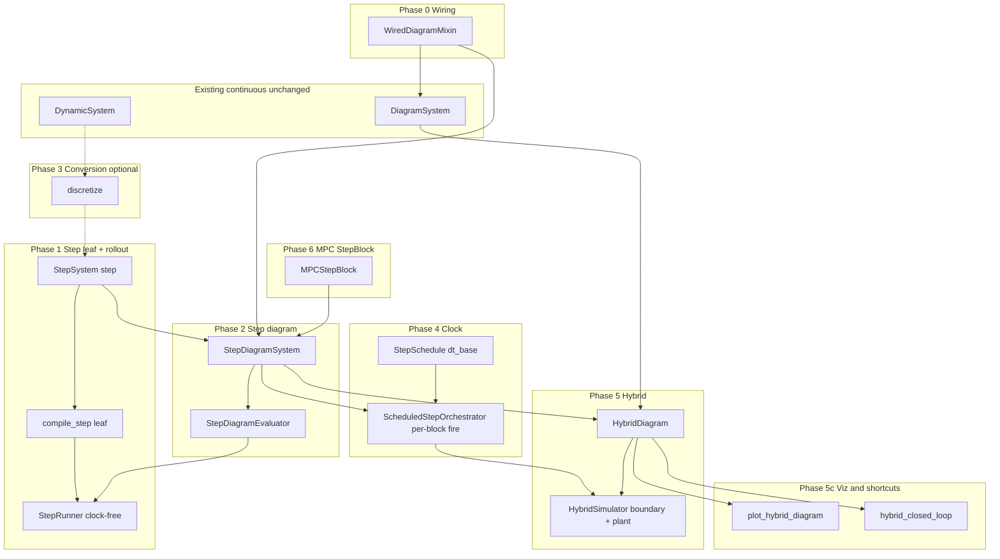

# Hybrid discrete simulation: Master Plan

Status: Phase 0 complete (July 2026); Phases 1–6 pending. Plan:
[00-wiring-refactor.md](00-wiring-refactor.md).

Program charter for discrete-time blocks, step diagrams, optional discretization, scheduled
stepping, narrow hybrid simulation (discrete controller ↔ continuous plant), and MPC
`StepBlock` export. Supersedes the continuous-time-only stance in
[DESIGN.md](../../../DESIGN.md) §3 for this **subset** — not full Simulink parity.

**Priority:** this program is **subsidiary** to the continuous-time core
(`DynamicSystem`, flow `DiagramSystem`, `Simulator`). Step/hybrid exist to run discrete
control laws in closed loop — not to redefine the framework. When trade-offs arise, **keep the
continuous path clean**; add-ons stay on sibling types and separate compile/sim paths. See
[DESIGN.md §3](../../../DESIGN.md#continuous-time-core-stephybrid-subsidiary).

Full design rationale: [hybrid-discrete-simulation.md](../hybrid-discrete-simulation.md).
Phase contracts: shard docs linked below.

## Vision

Build on **two leaf evolution maps**:

| Map | Leaf | Equation |
| --- | --- | --- |
| **Flow** | `DynamicSystem` | `dx = f(x, u, t; p)` |
| **Step** | `StepSystem` | `x_{k+1} = step(x, u, k; p)` |

**Hybrid is orchestration**, not a third map. v1 composes two **homogeneous** diagrams — step
side (`StepSystem` + `StaticSystem`) and flow side (`DynamicSystem` + `StaticSystem`) — linked
by explicit boundary ZOH/sample edges and driven by `HybridSimulator`.

**Done when:** SMC and cascade hybrids run through `HybridSimulator` with parity vs hand-rolled
loops; straight-line MPC demo drops its outer `while` / `SUBSTEPS` loop via `MPCStepBlock` +
`HybridSimulator` (6a stateless, 6b warm-start); DESIGN / ROADMAP / README reflect the new
subset.

## v1 scope

### In scope

- Shared diagram wiring mixin (Phase 0); continuous `DiagramSystem` API unchanged.
- `StepSystem` leaf + `compile_step` + `StepRunner`; `StepDiagramSystem` compile path.
- `StepSchedule.dt_base` + `ScheduledStepOrchestrator` (single- and integer multi-rate).
- Two-side `HybridDiagram` + `HybridSimulator` (boundary ZOH/sample, `rk4_rollout_zoh`).
- SMC hybrid (5a), cascade hybrid with non-trivial `fire` (5b), hybrid plot + shortcuts (5c).
- `MPCStepBlock` stateless (6a) then warm-start via last optimizer **`z`** (6b).

### Out of scope (v1)

| Item | Instead |
| --- | --- |
| One flat diagram mixing `Integrator` + `StepSystem` | Two sides + `HybridDiagram` |
| Event-driven switching, guards, impacts | Future layer 5 |
| FOH, transport delay, async boundary rates | ZOH + sample @ `dt_base` only |
| Non-integer sample-rate ratios | Integer divisors of `dt_base` only |
| `expand_scheduled_step()` lowering | Orchestrator buffers (optional later) |
| Full Simulink / arbitrary multi-clock parity | Narrow orchestrator subset |
| `@` operator returning `HybridDiagram` | `hybrid_closed_loop(..., schedule=...)` |

## Architecture decisions (frozen)

| Decision | Verdict |
| --- | --- |
| `StepSystem` as **sibling** of `DynamicSystem`, not a flag on `f` | Adopt |
| Homogeneous diagrams; heterogeneity only in `HybridDiagram` | Adopt |
| Sample time in **`StepSchedule.dt_base`**, not on leaf `StepSystem` | Adopt |
| Hybrid step side **always** `ScheduledStepOrchestrator` (trivial `fire` in 5a) | Adopt |
| Multi-rate inside step diagram = **orchestrator buffers**, not graph expansion | Adopt default |
| Boundary: step→plant **ZOH**, plant→step **sample** with **one-tick delay** | Adopt |
| `hybrid_closed_loop` facade; **no** `@` across step/flow domains | Adopt |
| 6b warm-start block state = transcription decision **`z`**, not core `Trajectory` flatten | Adopt |
| Phase 0 mixin only — **no** `WiredDiagram` Protocol (typing widened in Phase 2 / 5c) | Adopt |
| Evolution kind by **class type** (`StepSystem` vs `DynamicSystem`), not `solver_info["continuous_time_equation"]` | Adopt |
| Third slot: flow passes **`t` (float)**; step passes **`k` (int)** — no conversion, no artificial time on `StepSystem` | Adopt |
| Separate `DynamicsEvaluator` / `StepEvaluator` JIT (no mixed `t`/`k` in one graph) | Adopt |
| **Continuous core wins trade-offs** — step/hybrid must not complicate flow `DiagramSystem`, `compile()`, or `Simulator` | Adopt |

### Hybrid tick semantics (summary)

Each base tick at `t_k = t0 + k · schedule.dt_base`:

1. **Sample (read)** — plant→step boundary buffers (measurements from end of tick `k-1`).
2. **Step** — `ScheduledStepOrchestrator.tick(...)`.
3. **ZOH (write)** — step→plant boundary holds for `[t_k, t_k + dt_base)`.
4. **Flow** — `rk4_rollout_zoh` on continuous plant (`plant_dt_inner` may subdivide).
5. **Sample (write)** — latch plant outputs for tick `k+1`.

Detail and tick-0 init: [05-hybrid-simulation.md](05-hybrid-simulation.md).

## Implementation phases

| Phase | Doc | Delivers | Milestones |
| --- | --- | --- | --- |
| **0** | [00-wiring-refactor.md](00-wiring-refactor.md) | `WiredDiagramMixin` (wiring, gather, `tf`, `check_algebraic_loops`); `DiagramSystem` delegates — **no new behavior** | — |
| **1** | [01-step-core.md](01-step-core.md) | `StepSystem`, `ZOHHold`; `compile_step` (leaf); `StepRunner` + `StepResult`; teaching demos — **no wall time** | — |
| **2** | [02-step-diagram.md](02-step-diagram.md) | `StepDiagramSystem` (`StepSystem` + `StaticSystem`), `compile_step_diagram`, diagram `StepEvaluator`; `TimedStepSimulator` (test stopgap only); **partial-fire compile hooks** for Phase 4 | — |
| **3** | [03-discretization.md](03-discretization.md) | `discretize(DynamicSystem, dt)` → `StepSystem` *(optional; not on hybrid critical path)* | — |
| **4** | [04-scheduled-orchestrator.md](04-scheduled-orchestrator.md) | `StepSchedule.dt_base` + `ScheduledStepOrchestrator` — public clocked step path | — |
| **5** | [05-hybrid-simulation.md](05-hybrid-simulation.md) | `HybridDiagram`, `HybridSimulator`, `rk4_rollout_zoh` | **5a** trivial schedule + SMC · **5b** cascade + non-trivial `fire` |
| **5c** | [05c-hybrid-viz-shortcuts.md](05c-hybrid-viz-shortcuts.md) | `plot_hybrid_diagram`, `build_hybrid_topology`, `hybrid_closed_loop` | plot after **5a**; milestone done after **5b** |
| **6** | [06-mpc-step-block.md](06-mpc-step-block.md) | `MPCStepBlock` in `planning/mpc/` | **6a** stateless (`n=0`) · **6b** warm-start (`n = decision_dimension`, state = **`z`**) |

**Clock rule:** sample time lives in **`StepSchedule.dt_base`** (Phase 4+). Leaf `step` and
step diagrams stay time-agnostic; hybrid sim **always** uses the orchestrator on the step
side. **`StepRunner`** (Phase 1) is clock-free (games, unit tests, leaf + diagram rollouts);
`TimedStepSimulator` is not the public clocked API once Phase 4 lands.

## User-facing outcomes (demos)

| Phase | Demo / outcome |
| --- | --- |
| **1** | Leaf teaching scripts via `StepRunner`: Fibonacci, discrete accumulator, logistic map (`examples/scripts/step/`) |
| **5a** | SMC (or generic `StepSystem`) + continuous plant via `HybridSimulator` |
| **5b** | Filter @ fast rate + slow controller cascade (`fire` divisors) |
| **5c** | `hybrid.plot_diagram()`; `hybrid_closed_loop(step_ctl, plant, schedule=...)` |
| **6a** | Refactor `demo_dynamic_bicycle_rate_mpc_straight_line.py` — drop outer loop |
| **6b** | Same demo — warm-start parity vs shifted-guess hand loop |
| **13** | README hybrid call chain; DESIGN §3 subset; ROADMAP TRL checkboxes |

## Package map

| Area | Location |
| --- | --- |
| Wiring mixin; flow + step diagrams; hybrid diagram | `minilink/core/` (`wiring.py`, `diagram.py`, `hybrid_diagram.py`) |
| Step + hybrid compile | `minilink/core/compile/` |
| Runners, orchestrator, hybrid sim | `minilink/simulation/` |
| `discretize` | `minilink/analysis/discretize.py` |
| `MPCStepBlock`, warm-start helpers | `minilink/planning/mpc/` |
| Hybrid topology / plot | `minilink/graphical/diagrams/` |
| `hybrid_closed_loop` | `minilink/core/hybrid_composition.py` (or tail of `composition.py`) |

## Architecture pipeline

Orchestrator uses **per-block step hooks** from Phase 2 compile (partial firing), not always a
full `StepEvaluator.step` on every tick. Phase 3 (`discretize`) is optional — dashed in diagram.

## Split of concerns

| Concern | Owner | Phase |
| --- | --- | --- |
| Shared wiring, gather, `tf`, `check_algebraic_loops` | `WiredDiagramMixin` | **0** |
| Third slot: **`t` (flow)** / **`k` (step)** on shared port paths | call site + evaluator | 0–2 |
| Pure `step` / `h` math (`k` only, no wall time) | `StepSystem` | 1 |
| Leaf `compile_step` + clock-free rollout | `StepEvaluator` leaf + `StepRunner` | 1 |
| Step block wiring + compile hooks for partial fire | `StepDiagramSystem` / diagram `StepEvaluator` | 2 |
| Continuous → discrete plant block | `discretize()` | 3 (optional) |
| Sample time + multi-rate **inside** step diagram | `StepSchedule` + orchestrator | 4 |
| Step↔plant ZOH/sample + plant integration | `HybridSimulator` | 5 |
| Hybrid plot + `hybrid_closed_loop` | `graphical/` + `hybrid_composition` | **5c** |
| MPC planner → `StepSystem` for simulation | `MPCStepBlock` | 6 |

## Acceptance criteria

| Milestone | Pass when |
| --- | --- |
| **0** | `DiagramSystem` public API unchanged; `build_diagram_topology` + closed-loop trajectories match pre-refactor (fixed seeds); composition + diagram pytest green | **Done** |
| **1** | Leaf `step` / `h(x, u, k)`; `compile_step` leaf; `StepRunner` rollout; evolution routing via **`isinstance(StepSystem)`**; no wall time on leaf; `ZOHHold` + teaching demo smoke |
| **2** | Step diagram closed loop via `connect`; gather passes **`k`**; `run_steps` on diagram evaluator; partial-fire hooks for Phase 4 |
| **3** *(optional)* | `discretize` euler/rk4 match continuous integration over fixed `dt` |
| **4** | Trivial + multi-rate `fire`; cross-rate buffers; standalone orchestrator tests |
| **5a** | `HybridSimulator` matches hand-rolled SMC (or test double); multi-port boundary; one-tick delay enforced |
| **5b** | Cascade hybrid: filter fast + slow block; non-trivial `fire` parity |
| **5c** | `plot_hybrid_diagram` topology; `hybrid_closed_loop` matches manual `connect_boundary` |
| **6a** | Stateless `MPCStepBlock`; straight-line demo via `HybridSimulator`; trajectory matches stateless hand loop |
| **6b** | Warm-start via **`z`** shift; same demo matches shifted-guess hand loop |
| **13** | DESIGN §3 subset, ROADMAP maturity, README call chain updated |

Open contracts before implementation (detail in shard docs): `ExecutionPlan` step fork in Phase 2;
third-slot / JAX policy in Phases 0–2; tick-0 buffer defaults + `HybridSimResult` in Phase 5;
MPC failure policy in Phase 6.

## Implementation order

| Step | Phase | Deliverable |
| --- | --- | --- |
| **0** | **0** | `core/wiring.py` mixin; `DiagramSystem` delegates; validation gate |
| 1 | 1 | `StepSystem`, `ZOHHold`, `compile_step` (leaf), `StepRunner`, leaf + runner tests, teaching demos |
| 2 | 2 | `StepDiagramSystem` in `diagram.py` on mixin, `compile_step_diagram`, diagram `StepEvaluator`, partial-fire hooks, closed-loop tests |
| 3 | 2 | `TimedStepSimulator` (tests only) |
| 4 | 3 | `discretize` verb + tests *(optional — anytime after step 3)* |
| 5 | 4 | `StepSchedule`, `ScheduledStepOrchestrator`, orchestrator tests |
| 6 | 5 | `rk4_rollout_zoh` |
| 7 | 5 | `HybridDiagram`, `HybridSimulator` (multi-port boundary) |
| 8 | 5 | `SMCBlock` + hybrid demo **(5a)** |
| 9 | 5 | Cascade hybrid demo **(5b**, non-trivial `fire`) |
| 10 | 5c | `build_hybrid_topology`, `plot_hybrid_diagram`, `hybrid_closed_loop` |
| 11 | 6 | `MPCStepBlock` stateless **(6a)** + straight-line MPC demo refactor |
| 12 | 6 | `MPCStepBlock` warm-start **`z`** state **(6b)** |
| 13 | all | DESIGN §3 subset · ROADMAP TRL · README hybrid call chain |

## Gates

- **Phase 0 before Phase 1** — wiring extracted; continuous behavior validated unchanged.
- **Phase 2 before Phase 4 and Phase 5** — step compile + partial-fire hooks exist.
- **Phase 3 optional** — not required for hybrid MPC/SMC; may land anytime after Phase 2 (step 4).
- **Phase 4 before Phase 5** — hybrid always orchestrates the step side.
- **5a before 5b** — trivial schedule before multi-rate cascade.
- **5a before 5c plot** — `HybridDiagram` exists; **5c milestone complete after 5b**.
- **Phase 5 before Phase 6** — hybrid sim exists before `MPCStepBlock`.
- **6a before 6b** — stateless MPC block before warm-start **`z`** state.
