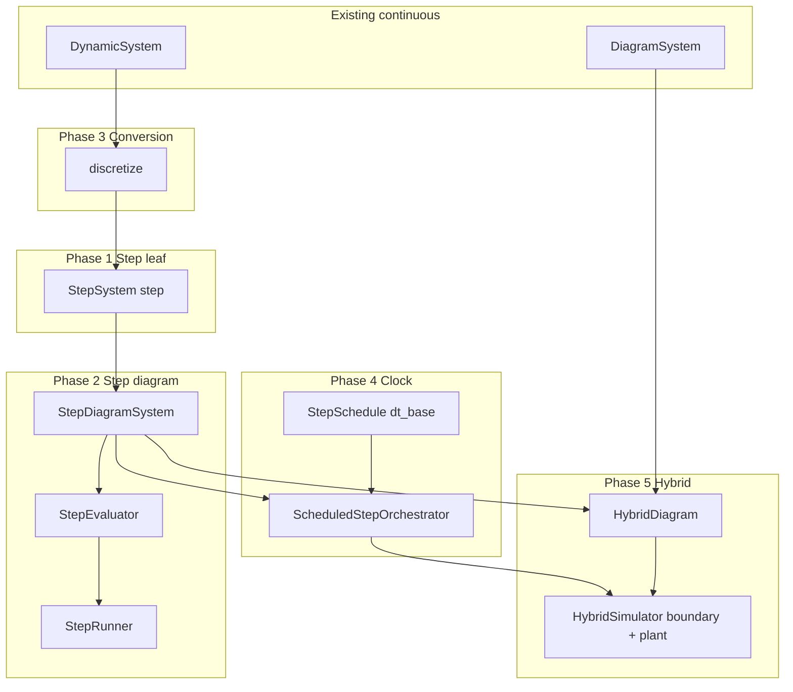

# Hybrid discrete simulation: Master Plan

Status: draft plan (July 2026). No implementation in this phase.

Architecture for discrete-time blocks, step diagrams, optional discretization, scheduled stepping,
and narrow hybrid simulation (discrete controller ↔ continuous plant). Supersedes the
continuous-time-only stance in [DESIGN.md](../../../DESIGN.md) §3 for this **subset** — not
full Simulink parity.

## Vision — five implementation phases

| Phase | Doc | Delivers |
| --- | --- | --- |
| **1** | [01-step-core.md](01-step-core.md) | `StepSystem`, `ZOHHold` — pure `step(x, u, k)`, no clock |
| **2** | [02-step-diagram.md](02-step-diagram.md) | `StepDiagramSystem`, compile, `StepEvaluator`, `StepRunner` |
| **3** | [03-discretization.md](03-discretization.md) | `discretize(DynamicSystem, dt)` → `StepSystem` (optional tool) |
| **4** | [04-scheduled-orchestrator.md](04-scheduled-orchestrator.md) | `StepSchedule.dt_base` + `ScheduledStepOrchestrator` |
| **5** | [05-hybrid-simulation.md](05-hybrid-simulation.md) | `HybridDiagram` + `HybridSimulator` + MPC/SMC demos |

**Clock rule:** sample time lives in **`StepSchedule.dt_base`** (Phase 4+). Leaf `step` and
Phase 2 diagrams stay time-agnostic; hybrid sim **always** uses the orchestrator on the step side.

## Architecture pipeline

## Split of concerns

| Concern | Owner | Phase |
| --- | --- | --- |
| Pure `step` math | `StepSystem` | 1 |
| Step block wiring | `StepDiagramSystem` / `StepEvaluator` | 2 |
| Continuous → discrete plant block | `discretize()` | 3 (optional) |
| Sample time + multi-rate **inside** step diagram | `StepSchedule` + orchestrator | 4 |
| Step↔plant ZOH/sample + plant integration | `HybridSimulator` | 5 |

## Implementation order

| Step | Phase | Deliverable |
| --- | --- | --- |
| 1 | 1 | `StepSystem`, `ZOHHold`, leaf tests |
| 2 | 2 | shared wiring mixin (`core/wiring.py`) |
| 3 | 2 | `StepDiagramSystem`, `compile_step_diagram`, `StepEvaluator` |
| 4 | 2 | `StepRunner`, `TimedStepSimulator`, closed-loop tests |
| 5 | 3 | `discretize` verb + tests *(optional for Phase 5 MPC path)* |
| 6 | 4 | `StepSchedule`, `ScheduledStepOrchestrator`, orchestrator tests |
| 7 | 5 | `rk4_rollout_zoh` |
| 8 | 5 | `HybridDiagram`, `HybridSimulator` (multi-port boundary) |
| 9 | 5 | `MPCBlock` + straight-line demo **(5a)** |
| 10 | 5 | `SMCBlock` + hybrid demo **(5a)** |
| 11 | 5 | Cascade hybrid demo **(5b**, non-trivial `fire`) |
| 12 | all | DESIGN / ROADMAP / README |

**Gates:**

- Phase 2 before 4, 5, and before Phase 3 (discretize returns blocks used in diagrams).
- **Phase 4 before Phase 5** — hybrid always orchestrates the step side.
- Phase 3 optional for Phase 5 MPC/SMC (continuous plant + native controller blocks).
- **5a** before **5b** (trivial schedule before multi-rate cascade hybrid).

Full design: [hybrid-discrete-simulation.md](../hybrid-discrete-simulation.md).
