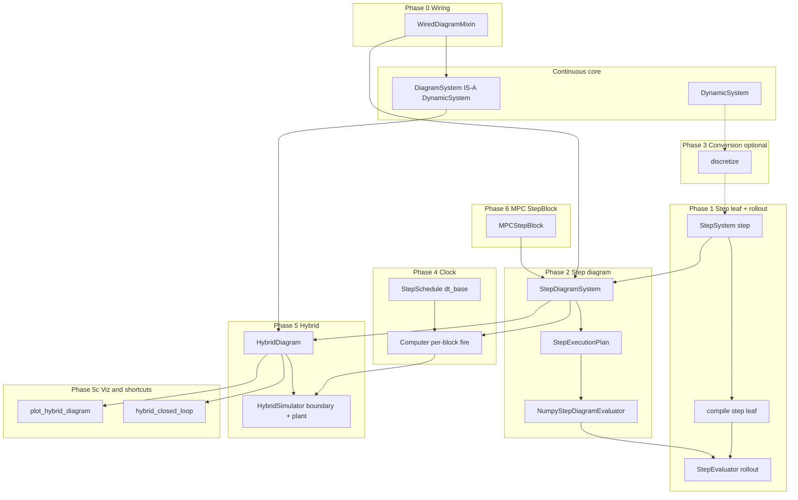

# Hybrid discrete simulation: Master Plan

Status: Phases **0**, **1a**, **1**, **1b**, **2**, **4** complete on `dev-hybrid` (July 2026); Phases **3**, **5–6**
pending. Next: [05-hybrid-simulation.md](05-hybrid-simulation.md). Wiring prep:
[00-wiring-refactor.md](00-wiring-refactor.md).

Program charter for discrete-time blocks, step diagrams, optional discretization, scheduled
stepping, narrow hybrid simulation (discrete controller ↔ continuous plant), and MPC
`StepBlock` export. Supersedes the continuous-time-only stance in
[DESIGN.md](../../../DESIGN.md) §3 for this **subset** — not full Simulink parity.

**Priority:** this program is **subsidiary** to the continuous-time core
(`DynamicSystem`, flow `DiagramSystem`, `Simulator`). Step/hybrid exist to run discrete
control laws in closed loop — not to redefine the framework. When trade-offs arise, **keep the
continuous path clean**; add-ons stay on sibling types and separate compile/sim paths. See
[DESIGN.md §3](../../../DESIGN.md#continuous-time-core-stephybrid-subsidiary).

Full design rationale: [hybrid-discrete-simulation.md](../hybrid-discrete-simulation.md).
Phase contracts: shard docs linked below.

## Vision

Build on **two leaf evolution maps**:

| Map | Leaf | Equation |
| --- | --- | --- |
| **Flow** | `DynamicSystem` | `dx = f(x, u, t; p)` |
| **Step** | `StepSystem` | `x_{k+1} = step(x, u, k; p)` |

**Hybrid is orchestration**, not a third map. v1 composes two **homogeneous** diagrams — step
side (`StepSystem` + static `System` with `n=0`) and flow side (`DynamicSystem` + static
`System`) — linked
by explicit boundary ZOH/sample edges and driven by `HybridSimulator`.

**Done when:** SMC and cascade hybrids run through `HybridSimulator` with parity vs hand-rolled
loops; straight-line MPC demo drops its outer `while` / `SUBSTEPS` loop via `MPCStepBlock` +
`HybridSimulator` (6a stateless, 6b warm-start); DESIGN / ROADMAP / README reflect the new
subset.

## v1 scope

### In scope

- Shared diagram wiring mixin (Phase 0); continuous `DiagramSystem` API unchanged.
- `StepSystem` leaf + unified `compile()` step branch + `StepEvaluator.rollout` + `compute_rollout`; `StepDiagramSystem` compile path.
- `Computer` (`StepDiagramSystem` + `StepSchedule`, `.tick()`) — single- and integer multi-rate.
- Two-side `HybridDiagram` (`computer` + `plant`) + `HybridSimulator` (one multi-channel boundary; ZOH/sample, `rk4_rollout_zoh`).
- SMC hybrid (5a), cascade hybrid with non-trivial `fire` (5b), hybrid plot + shortcuts (5c).
- `MPCStepBlock` stateless (6a) then warm-start via last optimizer **`z`** (6b).

### Out of scope (v1)

| Item | Instead |
| --- | --- |
| One flat diagram mixing `Integrator` + `StepSystem` | Two sides + `HybridDiagram` |
| Event-driven switching, guards, impacts | Future layer 5 |
| FOH, transport delay, async boundary rates | ZOH + sample @ `dt_base` only |
| Non-integer sample-rate ratios | Integer divisors of `dt_base` only |
| `expand_scheduled_step()` lowering | Computer hold buffers (optional later) |
| Full Simulink / arbitrary multi-clock parity | Narrow **Computer** / hybrid subset |
| `@` operator returning `HybridDiagram` | `hybrid_closed_loop(..., schedule=...)` |

## Architecture decisions (frozen)

| Decision | Verdict |
| --- | --- |
| `StepSystem` as **sibling** of `DynamicSystem`, not a flag on `f` | Adopt |
| Homogeneous diagrams; heterogeneity only in `HybridDiagram` | Adopt |
| Sample time in **`StepSchedule.dt_base`**, not on leaf `StepSystem` | Adopt |
| Hybrid step side **always** `Computer.tick` (trivial `fire` in 5a) | Adopt |
| Multi-rate inside step diagram = **Computer** hold buffers, not graph expansion | Adopt default |
| Boundary: step→plant **ZOH**, plant→step **sample** with **one-tick delay** | Adopt |
| `hybrid_closed_loop` facade; **no** `@` across step/flow domains | Adopt |
| 6b warm-start block state = transcription decision **`z`**, not core `Trajectory` flatten | Adopt |
| Phase 0 mixin only — **no** `WiredDiagram` Protocol (typing widened in Phase 2 / 5c) | Adopt |
| Evolution kind by **class type** (`StepSystem` vs `DynamicSystem`), not `solver_info["continuous_time_equation"]` | Adopt |
| Third slot: flow passes **`t` (float)**; step passes **`k` (int)** — no conversion, no artificial time on `StepSystem` | Adopt |
| Separate `DynamicsEvaluator` / `StepEvaluator` JIT (no mixed `t`/`k` in one graph) | Adopt |
| **Continuous core wins trade-offs** — step/hybrid must not complicate flow `DiagramSystem`, `compile()`, or `Simulator` | Adopt |

### Hybrid tick semantics (summary)

Each base tick at `t_k = t0 + k · schedule.dt_base`:

1. **Sample (read)** — plant→step boundary buffers (measurements from end of tick `k-1`).
2. **Step** — `Computer.tick(...)`.
3. **ZOH (write)** — step→plant boundary holds for `[t_k, t_k + dt_base)`.
4. **Flow** — `rk4_rollout_zoh` on continuous plant (`plant_dt_inner` may subdivide).
5. **Sample (write)** — latch plant outputs for tick `k+1`.

Detail and tick-0 init: [05-hybrid-simulation.md](05-hybrid-simulation.md).

## Implementation phases

| Phase | Doc | Delivers | Milestones |
| --- | --- | --- | --- |
| **0** | [00-wiring-refactor.md](00-wiring-refactor.md) | `WiredDiagramMixin` (wiring, gather, `tf`, `check_algebraic_loops`); `DiagramSystem` delegates — **no new behavior** | — |
| **1a** | [01a-evolution-map-refactor.md](01a-evolution-map-refactor.md) | Move `f` to `DynamicSystem`; typed `compile()` → static / dynamic evaluators; `StaticSimulator`; diagram `state_ops` guards | **Done** (`d131a89`) |
| **1** | [01-step-core.md](01-step-core.md) | `StepSystem`, `ZOHHold`; unified `compile()` step branch; `StepRollout` + `rollout()` / `compute_rollout`; teaching demos — **no wall time** | **Done** (`700f8ea`) |
| **1b** | [01b-facade-mixin-split.md](01b-facade-mixin-split.md) | Façade mixins (`Shared` / `Dynamic` / `Step`); `DiagramSystem` IS-A `DynamicSystem`; MRO sim dispatch — no `_simulate` router | **Done** (`40c8297`) |
| **2** | [02-step-diagram.md](02-step-diagram.md) | `StepDiagramSystem` (`StepSystem` + static `System`), `StepExecutionPlan`, `compile_step_diagram`, `NumpyStepDiagramEvaluator`; `compute_rollout` on diagrams; `TimedStepSimulator` optional (skipped) | **Done** (`0b7a1fd`) |
| **3** | [03-discretization.md](03-discretization.md) | `discretize(DynamicSystem, dt)` → `StepSystem` *(optional; not on hybrid critical path)* | — |
| **4** | [04-computer.md](04-computer.md) | Dual runtime: sync rollout vs **`Computer`** (stateful **`tick(u)`**, double buffer, `StepSchedule` + Hz helpers) | **Done** |
| **5** | [05-hybrid-simulation.md](05-hybrid-simulation.md) | `HybridDiagram` (`computer` + `plant`), `HybridSimulator`, `rk4_rollout_zoh` | **5a** trivial schedule + SMC · **5b** cascade + non-trivial `fire` |
| **5c** | [05c-hybrid-viz-shortcuts.md](05c-hybrid-viz-shortcuts.md) | `plot_hybrid_diagram`, `build_hybrid_topology`, `hybrid_closed_loop` | plot after **5a**; milestone done after **5b** |
| **6** | [06-mpc-step-block.md](06-mpc-step-block.md) | `MPCStepBlock` in `planning/mpc/` | **6a** stateless (`n=0`) · **6b** warm-start (`n = decision_dimension`, state = **`z`**) |

**Clock rule:** sample time lives in **`StepSchedule.dt_base`** (Phase 4+). Leaf `step` and
step diagrams stay time-agnostic; hybrid sim **always** uses **`Computer`** on the step
side. **`StepEvaluator.rollout`** (Phase 1) is clock-free (games, unit tests, leaf + diagram rollouts);
`TimedStepSimulator` is not the public clocked API once Phase 4 lands.

## User-facing outcomes (demos)

| Phase | Demo / outcome |
| --- | --- |
| **1** | Leaf teaching scripts via `compute_rollout`: Fibonacci, discrete accumulator, logistic map (`examples/scripts/step/`) |
| **2** | Step diagram demos: unity feedback, ZOH+integrator, cascade integrators/ZOH (`demo_step_diagram_*.py`) |
| **5a** | SMC (or generic `StepSystem`) + continuous plant via `HybridSimulator` |
| **5b** | Filter @ fast rate + slow controller cascade (`fire` divisors) |
| **5c** | `hybrid.plot_diagram()`; `hybrid_closed_loop(step_ctl, plant, schedule=...)` |
| **6a** | Refactor `demo_dynamic_bicycle_rate_mpc_straight_line.py` — drop outer loop |
| **6b** | Same demo — warm-start parity vs shifted-guess hand loop |
| **13** | README hybrid call chain; DESIGN §3 subset; ROADMAP TRL checkboxes |

## Package map

| Area | Location |
| --- | --- |
| Wiring mixin; flow + step diagrams; hybrid diagram | `minilink/core/` (`wiring.py`, `diagram.py`, `hybrid_diagram.py`) |
| Step + hybrid compile | `minilink/core/compile/` (`step_execution_plan.py`, `step_compiler.py`, `step_diagram_evaluator.py`) |
| Runners, Computer, hybrid sim | `minilink/simulation/` |
| `discretize` | `minilink/analysis/discretize.py` |
| `MPCStepBlock`, warm-start helpers | `minilink/planning/mpc/` |
| Hybrid topology / plot | `minilink/graphical/diagrams/` |
| `hybrid_closed_loop` | `minilink/core/hybrid_composition.py` (or tail of `composition.py`) |

## Architecture pipeline

**Computer** uses **per-block step hooks** from Phase 2 compile (partial firing), not always a
full `StepEvaluator.step` on every tick. Phase 3 (`discretize`) is optional — dashed in diagram.

## Split of concerns

| Concern | Owner | Phase |
| --- | --- | --- |
| Shared wiring, gather, `tf`, `check_algebraic_loops` | `WiredDiagramMixin` | **0** |
| Third slot: **`t` (flow)** / **`k` (step)** on shared port paths | call site + evaluator | 0–2 |
| Pure `step` / `h` math (`k` only, no wall time) | `StepSystem` | 1 |
| Leaf unified `compile()` step branch + clock-free rollout | `StepEvaluator` leaf + `rollout()` / `compute_rollout` | 1 |
| Façade mixins + `DiagramSystem(DynamicSystem)` | `facades.py`, `diagram.py` | **1b** |
| Step block wiring + compile hooks for partial fire | `StepExecutionPlan` + **`Computer`** buffer runtime | 2 + 4 |
| Continuous → discrete plant block | `discretize()` | 3 (optional) |
| Sample time + multi-rate **inside** step diagram | `StepSchedule` + **`Computer`** | 4 |
| Step↔plant ZOH/sample + plant integration | `HybridSimulator` | 5 |
| Hybrid plot + `hybrid_closed_loop` | `graphical/` + `hybrid_composition` | **5c** |
| MPC planner → `StepSystem` for simulation | `MPCStepBlock` | 6 |

## Acceptance criteria

| Milestone | Pass when |
| --- | --- |
| **0** | `DiagramSystem` public API unchanged; `build_diagram_topology` + closed-loop trajectories match pre-refactor (fixed seeds); composition + diagram pytest green | **Done** |
| **1a** | `f` only on `DynamicSystem`; `compile(System n==0)` → static evaluator (no fake `f`); `compute_trajectory` on static + dynamic via typed simulators; diagram `state_ops` on `DynamicSystem` only | **Done** |
| **1** | Leaf `step` / `h(x, u, k)`; unified `compile()` step branch; `StepRollout` + `rollout()` / `compute_rollout`; no `f` on `StepSystem`; `ZOHHold` + teaching demo smoke | **Done** |
| **1b** | Three façade mixins; `DiagramSystem(DynamicSystem)`; `Simulator` / `StaticSimulator` isinstance collapse; `test_facades_split.py`; DESIGN / README sync | **Done** |
| **2** | Step diagram topology + sync **`compute_rollout`**; **`StepExecutionPlan`**; partial-fire hooks for **`Computer`** | **Done** |
| **3** *(optional)* | `discretize` euler/rk4 match continuous integration over fixed `dt` |
| **4** | **`Computer`**: stateful **`tick(u)`**, double buffer, `StepSchedule` + Hz helpers; **`compute_rollout` ≠ Computer** when multi-rate | **Done** |
| **5a** | `HybridSimulator` matches hand-rolled SMC (or test double); **multi-channel** boundary; one-tick delay enforced |
| **5b** | Cascade hybrid: filter fast + slow block; non-trivial `fire` parity |
| **5c** | `plot_hybrid_diagram` topology; `hybrid_closed_loop` matches manual `connect_boundary` |
| **6a** | Stateless `MPCStepBlock`; straight-line demo via `HybridSimulator`; trajectory matches stateless hand loop |
| **6b** | Warm-start via **`z`** shift; same demo matches shifted-guess hand loop |
| **13** | DESIGN §3 subset, ROADMAP maturity, README call chain updated |

Open contracts before implementation (detail in shard docs): ~~`ExecutionPlan` step fork in Phase 2~~
**closed** — parallel `StepExecutionPlan` + `step_ops` ([02-step-diagram.md](02-step-diagram.md));
third-slot / JAX policy in Phases 0–2; tick-0 buffer defaults + `HybridSimResult` in Phase 5;
MPC failure policy in Phase 6.

## Implementation order

| Step | Phase | Deliverable |
| --- | --- | --- |
| **0** | **0** | `core/wiring.py` mixin; `DiagramSystem` delegates; validation gate | **Done** |
| 1 | **1a** | Move `f` to `DynamicSystem`; `StaticEvaluator` + `StaticSimulator`; unified `compile()` dispatch | **Done** |
| 2 | **1** | `StepSystem`, `ZOHHold`, `compile()` step branch, `StepRollout` + facades, leaf + rollout tests, teaching demos | **Done** |
| 3 | **1b** | Façade mixin split; `DiagramSystem(DynamicSystem)`; sim boundaries; `test_facades_split.py` | **Done** |
| 4 | **2** | `StepDiagramSystem`, `StepExecutionPlan`, `step_compiler.py`, diagram `StepEvaluator`, partial-fire hooks, closed-loop + `compute_rollout` tests | **Done** |
| 5 | 2 | `TimedStepSimulator` (tests only) | skipped (`compute_rollout` covers Phase 2) |
| 6 | 3 | **`discretize` postponed** — proceed **2 → 4 → 5**; optional verb lands later if needed |
| 7 | 4 | `StepSchedule`, **`Computer`** (`tick(u)`, double buffer, `from_rates`), `test_computer.py` | **Done** |
| 8 | 5 | `rk4_rollout_zoh` |
| 9 | 5 | `HybridDiagram` (`computer` + `plant`), `HybridSimulator` (multi-channel boundary) |
| 10 | 5 | `SMCBlock` + hybrid demo **(5a)** |
| 11 | 5 | Cascade hybrid demo **(5b**, non-trivial `fire`) |
| 12 | 5c | `build_hybrid_topology`, `plot_hybrid_diagram`, `hybrid_closed_loop` |
| 13 | 6 | `MPCStepBlock` stateless **(6a)** + straight-line MPC demo refactor |
| 14 | 6 | `MPCStepBlock` warm-start **`z`** state **(6b)** |
| 15 | all | DESIGN §3 subset · ROADMAP TRL · README hybrid call chain |

## Gates

- **Phase 0 before Phase 1a** — wiring extracted; continuous behavior validated unchanged.
- **Phase 1a before Phase 1** — `f` on `DynamicSystem`; typed compile/sim; no lying `System.f`.
- **Phase 1 before Phase 1b** — `StepSystem` + `compute_rollout` landed before façade split.
- **Phase 1b before Phase 2** — `DiagramSystem` IS-A `DynamicSystem`; MRO dispatch frozen.
- **Phase 2 before Phase 4 and Phase 5** — step compile + partial-fire hooks exist.
- **Phase 3 postponed** — not required for hybrid MPC/SMC; proceed **2 → 4 → 5** after Phase 2.
- **Phase 4 before Phase 5** — hybrid always orchestrates the step side.
- **5a before 5b** — trivial schedule before multi-rate cascade.
- **5a before 5c plot** — `HybridDiagram` exists; **5c milestone complete after 5b**.
- **Phase 5 before Phase 6** — hybrid sim exists before `MPCStepBlock`.
- **6a before 6b** — stateless MPC block before warm-start **`z`** state.
