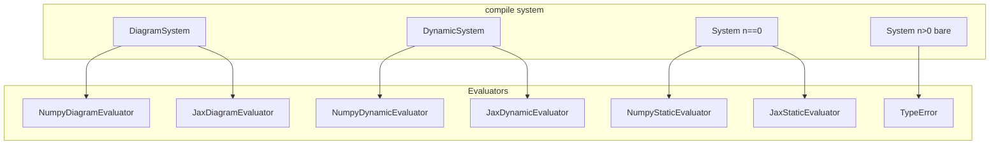

# Phase 1a: Evolution Map Refactor — Implementation Plan

**After [Phase 0](00-wiring-refactor.md), before [Phase 1 step core](01-step-core.md).**  
**Spec:** [01a-evolution-map-refactor.md](01a-evolution-map-refactor.md)  
**Status:** ready for implementation (July 2026).

Full hybrid context: [00-master-plan.md](00-master-plan.md).

**Branch:** `dev-hybrid` (Phase 0 complete). **Gate:** 1a before `StepSystem` / `StepRunner`.

## Implementation checklist

- [ ] Slice 1 — Remove `StaticSystem`; move `f` to `DynamicSystem`; migrate subclasses
- [ ] Slice 2 — Evaluator modules + JAX split (`jax_utils.py`)
- [ ] Slice 2 cleanup — remove `get_*_jit`; `rollout`→`integrate`; drop evaluator `h`/`h_p`
- [ ] Slice 3 — Typed `compile()` dispatch + diagram guards
- [ ] Slice 4 — `time_grid.py` + `StaticSimulator`
- [ ] Slice 5 — Facade routing
- [ ] Slice 6 — Analysis docstrings
- [ ] Slice 7 — Tests + smoke gate

---

# Phase 1a: Evolution Map Refactor — Complete Implementation Plan

**Branch:** `dev-hybrid` (Phase 0 complete)  
**Spec:** [docs/plans/hybrid-discrete/01a-evolution-map-refactor.md](docs/plans/hybrid-discrete/01a-evolution-map-refactor.md)  
**Gate:** 1a must land before Phase 1 `StepSystem` / `StepRunner`

---

## Two core ideas

### 1. Evolution maps live on the right class

| Class | After 1a | Evolution |
| --- | --- | --- |
| **`System`** | Ports, `h`/port `compute`, params, facades, metadata. **Default `n=0`. No `f`.** | Static IO: `y = h(x,u,t)` |
| **`DynamicSystem`** | Continuous states + optional standard port boilerplate | `dx = f(x,u,t)` |
| **`DiagramSystem`** | Composed flow diagram | Stacked `f` from `DynamicSystem` subsystems |
| **`StepSystem`** (Phase 1) | Discrete states | `x_{k+1} = step(x,u,k)` — no `f` |

**`StaticSystem` is removed.** It was a 13-line marker (`super(0)`, name only) with zero runtime behavior. Routing today uses `n > 0`, not `isinstance(StaticSystem)`.

**Library blocks are not framework types.** `Gain`, `Source`, `PController`, `Integrator`, etc. live in `blocks/` and `control/` — they subclass `System` or `DynamicSystem` like any user model. The framework only distinguishes **three compile/sim kinds** in 1a: static `System` (`n==0`), `DynamicSystem`, and `DiagramSystem`. No `isinstance(Source)` anywhere; a `Step` source is just another `n==0` block whose `h(t)` varies in time.

### 2. Typed `compile()` → clean evaluator family

One public entry: `sys.compile()` / `compile(system, backend=...)`. Return type is a **typed evaluator** chosen by system kind — no fake `f` on static blocks.



---

## Target class hierarchy

```text
System                         # static IO shell — NO f, NO step; n=0 default
├── DynamicSystem              # dx = f(x,u,t)     ← f lives HERE
├── StepSystem                 # x_{k+1} = step    (Phase 1 — after 1a)
├── DiagramSystem              # stacked f
└── StepDiagramSystem          # stacked step      (Phase 2)

# blocks/, control/, dynamics/ — user/library subclasses of System or DynamicSystem
# (Gain, Source, Integrator, Pendulum, …) — not separate framework tiers
```

**Routing rule:** evolution kind by **`isinstance` + dimension guard**, not `solver_info["continuous_time_equation"]`.

---

## Evaluator architecture (full design)

### Inheritance — siblings, not nested static→dynamic

```text
OutputEvaluator (ABC)              ← shared by ALL compiled evaluators
├── outputs, outputs_p             ← abstract (dict keyed by port id)
│
├── StaticEvaluator                ← static System leaves; NO evolution map
│   ├── NumpyStaticEvaluator       (System leaf, n==0)
│   └── JaxStaticEvaluator         (full JAX output-tier parity)
│
└── DynamicsEvaluator              ← continuous evolution dx = f(x,u,t)
    ├── f, f_p                     ← abstract
    ├── f_ivp, as_scipy_*          ← IVP + SciPy bridge (defaults)
    ├── IntegrationMixin           ← rk4_step, euler_step, integrate, rk4_integrate_*
    ├── jacobian_f_params          ← JAX override only
    │
    ├── NumpyDynamicEvaluator      (DynamicSystem leaf)
    ├── JaxDynamicEvaluator        (DynamicSystem leaf)
    ├── NumpyDiagramEvaluator      (DiagramSystem)
    └── JaxDiagramEvaluator        (DiagramSystem)
```

**Phase 1 forward-compat:** `StepEvaluator(OutputEvaluator)` adds `step`/`step_p` as a **third sibling** — not under `DynamicsEvaluator`. Discrete **`rollout`** lives on `StepRunner`, not continuous evaluators.

### Method matrix

| Method / group | `StaticEvaluator` | `DynamicsEvaluator` | Future `StepEvaluator` |
| --- | --- | --- | --- |
| `outputs`, `outputs_p` | yes — **primary output API** | yes | yes |
| `h`, `h_p` on evaluator | **no** (removed in 1a) | **no** | **no** |
| `f`, `f_p` | **no** | yes | **no** |
| `step`, `step_p` | **no** | **no** | yes (Phase 1) |
| `f_ivp`, `as_scipy_rhs*` | **no** | yes | **no** |
| `rk4_step`, `euler_step`, `integrate*` | **no** | yes | **no** |
| `jacobian_f_params` | **no** | JAX only | TBD |
| `compute_internal_signals*` | **no** | diagram only | diagram step (Ph 2) |

### Three param tiers (unchanged)

| Tier | Methods | Meaning |
| --- | --- | --- |
| **Frozen** | `f`, `outputs`, `f_ivp`, integration | params deep-copied at `compile()` |
| **Parametric** | `f_p`, `outputs_p`, `integrate_p`, `rk4_step_p` | caller passes `params` dict |
| **IVP** | `f_ivp`, `euler_step_ivp`, `rk4_integrate_ivp` | frozen `u = _u_nominal` baked in |

### Target file layout

```text
minilink/core/compile/evaluators/
  output_evaluator.py      # OutputEvaluator ABC + _outputs_from_ports helper
  dynamics_evaluator.py    # DynamicsEvaluator(OutputEvaluator)
  integration.py           # IntegrationMixin — RK4/euler/integrate defaults
  static_evaluator.py      # StaticEvaluator, NumpyStaticEvaluator, JaxStaticEvaluator
  numpy_evaluator.py       # NumpyDynamicEvaluator, NumpyDiagramEvaluator
  jax_utils.py             # shared JAX compile helpers (NEW, extracted from ~800 LOC jax_evaluator.py)
  jax_evaluator.py         # JaxDynamicEvaluator, JaxDiagramEvaluator (slimmed ~400 LOC)
  # evaluator.py deleted — rename cleanly to dynamics_evaluator.py (pre-1.0; no shim)
```

### Class rename table (drop `Leaf`)

| Old | New |
| --- | --- |
| `NumpyLeafEvaluator` | **`NumpyDynamicEvaluator`** |
| `JaxLeafEvaluator` | **`JaxDynamicEvaluator`** |
| (planned static leaf) | **`NumpyStaticEvaluator`**, **`JaxStaticEvaluator`** |
| `NumpyDiagramEvaluator` | unchanged |
| `JaxDiagramEvaluator` | unchanged |

Pattern: `{Backend}{Kind}Evaluator` — mirrors `System`, `DynamicSystem`, `DiagramSystem`.

---

## `h` / `h_p` audit — model vs compiled evaluator

Two different layers; do not conflate them.

### `System.h()` on the **model** — keep

`y = h(x, u, t; p)` stays on [`System`](minilink/core/system.py) as the modeler's output map. Widely used:

- Block/plant overrides (`Integrator.h`, `Source.h`, manipulator `h_p` as a **port compute** name, etc.)
- Tests call `sys.h(...)` directly on model objects
- `DynamicSystem` boilerplate wires `add_output_port("y", function=self.h)` when `output_dim` is set
- [`linearize`](minilink/analysis/linearize.py) FD path uses `port.compute(...)`, not `sys.h()` — but models still implement `h` as the function behind the port

**Port names are arbitrary.** Controllers expose `"u"`, manipulators expose `"p"`/`"pdot"`/`"q"`/`"dq"`, diagrams expose `"y_meas"`, etc. The `"y"` port is a **SISO convention**, not a framework requirement. [`System.p`](minilink/core/system.py) remains a convenience: dim of `"y"` if present, else `0`.

### `evaluator.h()` / `evaluator.h_p()` — **drop in 1a**

Repo grep (July 2026):

| API | Production callers | Notes |
| --- | --- | --- |
| `evaluator.h(...)` | **zero** | Only [`test_compile_pipeline.py`](tests/unittest/test_compile_pipeline.py) |
| `evaluator.h_p(...)` | **zero** | Same test file only |
| `evaluator.outputs(...)` | [`linearize.py`](minilink/analysis/linearize.py) JAX path, compile tests | Keys = boundary port ids |
| `evaluator.outputs_p(...)` | compile parametric tests | Same dict contract |

`linearize` JAX already builds `h` from the **`outputs` dict** (`outputvalues[value]`), not `evaluator.h()`. Diagram evaluators today implement `h()` as a fragile shortcut ("exactly one boundary port or raise") — unnecessary once callers use `outputs["port_id"]`.

**1a decision:** `OutputEvaluator` exposes only **`outputs` / `outputs_p`** (dict keyed by port id). Remove `h`/`h_p` from `DynamicsEvaluator`, leaf evaluators, diagram evaluators, and the ABC. Delete `test_h_*` / `test_h_p_*` compile tests; assert via `outputs["y"]` or `outputs["y_meas"]` instead.

**Do not confuse** manipulator `h_p(x,u,t,params)` on the **model** (task-position port compute) with a removed evaluator parametric tier — unrelated names.

---

## Compile dispatch (revised for no StaticSystem)

In [`minilink/core/compile/compiler.py`](minilink/core/compile/compiler.py):

```python
from minilink.core.diagram import DiagramSystem
from minilink.core.system import DynamicSystem, System

def compile(system, backend=BACKEND_NUMPY, verbose=False):
    if isinstance(system, DiagramSystem):
        return compile_diagram(system, backend=backend, verbose=verbose)

    key = normalize_backend(backend)

    if isinstance(system, DynamicSystem):
        if key == BACKEND_NUMPY:
            return NumpyDynamicEvaluator(system)
        return JaxDynamicEvaluator(system, verbose=verbose)

    if system.n > 0:
        raise TypeError(
            f"Cannot compile {type(system).__name__} with n={system.n}; "
            "subclass DynamicSystem and implement f()."
        )

    # Static path: any System leaf with n==0 (Gain, Source, controller, …)
    if key == BACKEND_NUMPY:
        return NumpyStaticEvaluator(system)
    return JaxStaticEvaluator(system, verbose=verbose)
```

| Input | NumPy | JAX |
| --- | --- | --- |
| `DiagramSystem` | `NumpyDiagramEvaluator` | `JaxDiagramEvaluator` |
| `DynamicSystem` | `NumpyDynamicEvaluator` | `JaxDynamicEvaluator` |
| `System` with `n==0` | `NumpyStaticEvaluator` | `JaxStaticEvaluator` |
| `System` with `n>0` (no `f`) | `TypeError` | `TypeError` |

**Diagram execution plan** — [`compiler.py`](minilink/core/compile/compiler.py) `_build_execution_plan_from_order`:

```python
# Before: if sys.n > 0:
# After:
if isinstance(sys, DynamicSystem):
    state_ops.append(StateOperation(f_func=sys.f, ...))
```

**[`DiagramSystem.f`](minilink/core/diagram.py)** (~line 60):

```python
# Before: if subsystem.n == 0: continue
# After:
if not isinstance(subsystem, DynamicSystem):
    continue
```

Static subsystems (any `n==0` block in a diagram — gains, sources, controllers) stay in **port ops** only.

---

## Evaluator implementation detail

### New: [`output_evaluator.py`](minilink/core/compile/evaluators/output_evaluator.py)

```python
class OutputEvaluator(ABC):
    n: int; m: int; p: int; backend: str
    _frozen_params: dict; _u_nominal: np.ndarray

    @abstractmethod
    def outputs(self, x, u, t=0.0) -> dict: ...
    @abstractmethod
    def outputs_p(self, x, u, t, params) -> dict: ...
    # No h / h_p — use outputs[port_id]
```

Shared helper:

```python
def _outputs_from_ports(system, x, u, t, params) -> dict:
    return {pid: port.compute(x, u, t, params) for pid, port in system.outputs.items()}
```

### New: [`static_evaluator.py`](minilink/core/compile/evaluators/static_evaluator.py)

**`StaticEvaluator(OutputEvaluator)`** — explicitly **no** `f`, `f_p`, `f_ivp`, RK4, SciPy RHS, `jacobian_f_*`.

**`NumpyStaticEvaluator`:**

- `__init__(system)`: accept any `System` with `n==0`; deep-copy `params`; snapshot `_u_nominal`.
- `outputs` / `outputs_p`: `_outputs_from_ports(...)`.

**`JaxStaticEvaluator`** — **full JAX parity** (do not drop features):

| Step | Static JAX leaf |
| --- | --- |
| 0 | `_check_jax_compatible` on each `port.compute` (skip `f` check) |
| 1 | `_build_jit_static_outputs(system)` from `jax_utils.py` |
| 2 | Warm-start dummy `(x=[], u, t)` |
| Public API | `.outputs`, `.outputs_p` only — **no `f`**, **no `h`**, **no `get_*_jit`** |

`Gain.compile(backend="jax")` must succeed; `.outputs` matches NumPy static evaluator.

### Refactor: [`evaluator.py`](minilink/core/compile/evaluators/evaluator.py) → [`dynamics_evaluator.py`](minilink/core/compile/evaluators/dynamics_evaluator.py) + [`integration.py`](minilink/core/compile/evaluators/integration.py)

**No backward-compat shim.** Per AGENTS.md pre-1.0 rule: delete `evaluator.py`, land `dynamics_evaluator.py`, fix imports in the same PR (~4 sites):

- [`numpy_evaluator.py`](minilink/core/compile/evaluators/numpy_evaluator.py)
- [`jax_evaluator.py`](minilink/core/compile/evaluators/jax_evaluator.py)
- [`compile/__init__.py`](minilink/core/compile/__init__.py) docstring example
- [`docs/api/compile.rst`](docs/api/compile.rst) `automodule` path

- `DynamicsEvaluator(OutputEvaluator)` — abstract `f`, `f_p`; IVP defaults (`f_ivp`, `as_scipy_*`).
- `IntegrationMixin` — move RK4/euler/integrate methods from current [`evaluator.py`](minilink/core/compile/evaluators/evaluator.py) lines 103–211.
- **Remove:** `linearize()`, `jacobian_f_x/u`, `jacobian_h_x/u` (zero callers; [`linearize.py`](minilink/analysis/linearize.py) uses `jax.jacfwd` on `.f`/`.outputs`).
- **Keep:** `jacobian_f_params` on JAX subclasses only.

### Refactor: [`numpy_evaluator.py`](minilink/core/compile/evaluators/numpy_evaluator.py)

- Rename `NumpyLeafEvaluator` → **`NumpyDynamicEvaluator`**; **`DynamicSystem` only**.
- Implement `outputs` / `outputs_p` via `_outputs_from_ports`; **delete `h`/`h_p` methods**.
- `NumpyDiagramEvaluator`: **delete `h`/`h_p`**; keep `outputs` / `outputs_p` only.

### Refactor: [`jax_evaluator.py`](minilink/core/compile/evaluators/jax_evaluator.py) → split

**[`jax_utils.py`](minilink/core/compile/evaluators/jax_utils.py)** (extracted):

- `_check_jax_compatible`
- `_build_jit_dynamic(system)` — returns pre-jitted `f`/`outputs` callables (no separate `h` JIT)
- `_build_jit_static_outputs(system)` — output tier only
- `_build_jit_rk4_integrate_*` (renamed from `*_rollout_*`)
- `_gather_u_jax`
- `JaxIntegrationMixin` — shared IVP/RK4 overrides (~40 duplicated lines today)

**[`jax_evaluator.py`](minilink/core/compile/evaluators/jax_evaluator.py)** (slimmed):

- `JaxDynamicEvaluator` — `DynamicSystem` only; **remove all `get_*_jit`**.
- `JaxDiagramEvaluator` — `_check_jax_compatibility` uses `isinstance(sys, DynamicSystem)`.
- `JaxStaticEvaluator` lives in `static_evaluator.py`; imports from `jax_utils.py`.

**Design rule:** one public callable per tier — `.f`, `.f_p`, `.outputs`, `.outputs_p`. On JAX backends these *are* the JIT'd functions:

```python
# Today — get_f_jit adds nothing:
def f(self, x, u, t=0.0):
    return self._jit_f(x, u, t)
def get_f_jit(self):
    return self._jit_f  # REMOVE
```

---

## Evaluator method audit (remove vs keep)

### Tier A — keep (production)

| Method | Callers |
| --- | --- |
| `f`, `f_p` | Simulator, MPC, trajopt, RRT, planning, benchmarks |
| `rk4_step` | MPC demos, RRT, search extenders |
| `rk4_integrate_forced` (rename) | `rk4_fixed`, shooting, identification, planning tests |
| `rk4_integrate_ivp` (rename) | `rk4_fixed` nominal path |
| `euler_step`, `euler_step_ivp` | euler solver |
| `as_scipy_rhs*`, `as_scipy_jac` | scipy_ivp solver |
| `compute_internal_signals_dict` | `diagram.reconstruct_internal_signals` |
| `jacobian_f_params` | identification demo, JAX tests |

### Tier B — keep (output tier)

| Method | Notes |
| --- | --- |
| `outputs`, `outputs_p` | compile tests; `StaticSimulator` signal recording; linearize JAX path |
| `h`, `h_p` on evaluator | **Remove** — zero production callers |

### Tier C — keep defaults (low use)

| Method | Notes |
| --- | --- |
| `integrate` / `integrate_p` (rename from `rollout`) | `test_blocks.py` teaching |
| `rk4_step_p` | pid autotuning demo |

### Tier D — remove in 1a

| Method | Action |
| --- | --- |
| `get_f_jit`, `get_f_p_jit`, `get_outputs_jit`, `get_outputs_p_jit`, `get_internal_signals_jit` | Remove; migrate 6 call sites to `.f`/`.outputs` |
| `linearize()` on evaluator | Remove (zero callers) |
| `jacobian_f_x/u`, `jacobian_h_x/u` | Remove (only used by dead `linearize()`) |

### `rollout` → `integrate` rename (continuous vocabulary)

| Old | New | Call sites |
| --- | --- | --- |
| `rollout` | `integrate` | `test_blocks.py` |
| `rollout_p` | `integrate_p` | `test_blocks.py` |
| `rk4_rollout_forced` | `rk4_integrate_forced` | `rk4_fixed.py`, shooting, identification, pid autotuning, tests |
| `rk4_rollout_ivp` | `rk4_integrate_ivp` | `rk4_fixed.py` |
| `_build_jit_rk4_rollout_*` | `_build_jit_rk4_integrate_*` | `jax_utils.py` |

**Unchanged:** `Simulator.solve()`, `compute_trajectory` user verbs. Pre-1.0: clean rename, no deprecated aliases.

### `get_*_jit` migration call sites

| File | Change |
| --- | --- |
| [`minilink/analysis/linearize.py`](minilink/analysis/linearize.py) | `get_f_jit()` → `.f`; `get_outputs_jit()` → `.outputs` |
| [`examples/scripts/identification/demo_params_gradient.py`](examples/scripts/identification/demo_params_gradient.py) | `get_f_jit` → `.f`; `get_f_p_jit` → `.f_p` |
| [`examples/scripts/control/demo_neural_controller_jax.py`](examples/scripts/control/demo_neural_controller_jax.py) | `get_f_p_jit` → `.f_p` |
| [`examples/scripts/diagrams/demo_diagram_compiling.py`](examples/scripts/diagrams/demo_diagram_compiling.py) | Drop `get_f_jit` benchmark branch |
| [`benchmarks/f_evaluators.py`](benchmarks/f_evaluators.py) | Always `evaluator.f` |
| [`tests/unittest/test_compile_pipeline.py`](tests/unittest/test_compile_pipeline.py) | Remove `get_*_jit` equivalence tests; keep JAX parity via `.f`/`.outputs` |

---

## Simulation paths

### New: [`minilink/simulation/time_grid.py`](minilink/simulation/time_grid.py)

Extract from [`Simulator.select_time_vector`](minilink/simulation/simulator.py) (lines 171–226):

```python
def build_time_grid(t0, tf, *, n_steps=None, dt=None, default_dt=0.001, verbose=False)
    -> tuple[np.ndarray, float, int]
```

`Simulator.select_time_vector` becomes thin wrapper (passes `solver_info["smallest_time_constant"] * 0.1` as default).

### New: [`minilink/simulation/static_simulator.py`](minilink/simulation/static_simulator.py)

Mirror `Simulator` kwargs: `t0`, `tf`, `n_steps`, `dt`, `compile_backend`, `verbose`.

| Method | Behavior |
| --- | --- |
| `solve()` | Nominal `u` broadcast on grid |
| `solve_forced(u, ...)` | Reuse forced-input coercion from `Simulator` |

**Trajectory contract:**

- `x`: shape `(0, n_pts)`
- `u`: shape `(m, n_pts)`
- `signals`: `evaluator.outputs(...)` at each `t[i]` for `plot_time_signals`

`solver` kwarg: accept but ignore/warn once.

### Guard: [`Simulator.__init__`](minilink/simulation/simulator.py)

```python
if not isinstance(sys, (DynamicSystem, DiagramSystem)):
    if sys.n == 0:
        raise TypeError("Static System leaves use StaticSimulator; compute_trajectory routes there.")
```

### Facade routing: [`minilink/core/facades.py`](minilink/core/facades.py)

> **Superseded by [01b-facade-mixin-split.md](01b-facade-mixin-split.md).** No `_simulate`
> router; `SharedSystemFacades` / `DynamicSystemFacades` / `StepSystemFacades` with MRO dispatch.

```python
# Historical sketch (pre-1b) — do not reintroduce:
def _simulate(self, *, forced=None, input_port_id=None, **kwargs) -> Trajectory:
    from minilink.core.diagram import DiagramSystem
    from minilink.core.system import DynamicSystem

    # Forward-compat StepSystem guard (Phase 1):
    # if type(self).__name__ == "StepSystem": raise TypeError(...)

    if isinstance(self, (DynamicSystem, DiagramSystem)):
        sim = Simulator(self, **kwargs)
    elif self.n == 0:
        sim = StaticSimulator(self, **kwargs)
    else:
        raise TypeError(...)

    return sim.solve_forced(...) if forced is not None else sim.solve()
```

| System kind | API | Implementation |
| --- | --- | --- |
| `System` n==0 (any static block) | `compute_trajectory`, `compute_forced` | `StaticSimulator` |
| `DynamicSystem` / `DiagramSystem` | `compute_trajectory`, `compute_forced` | `Simulator` |
| `StepSystem` (Phase 1) | `run_steps` only | `StepRunner` — not in 1a |

---

## Slice 1 — Remove `StaticSystem`; move `f` to `DynamicSystem`

**File:** [`minilink/core/system.py`](minilink/core/system.py)

1. **Delete `StaticSystem` class** entirely.
2. **Remove `f` from `System`** — update class docstring: static IO shell, not dynamical system with zero `f`.
3. **Add `f` to `DynamicSystem`** — move current zero-default implementation here.
4. **Update `System.__init__` docstring** — `n=0` default = stateless IO block.
5. **Optional:** `DynamicSystem.__init__` requires `n >= 1` (removes `DynamicSystem(0)` test oddity in 4 test files).

**Migrate all `StaticSystem` subclasses → `System`:**

| Area | Files | Change |
| --- | --- | --- |
| Blocks | [`blocks/routing.py`](minilink/blocks/routing.py), [`blocks/nonlinear.py`](minilink/blocks/nonlinear.py), [`blocks/neural.py`](minilink/blocks/neural.py) | `class X(System)` + `super().__init__(0)` in `__init__` |
| Control | [`control/output.py`](minilink/control/output.py), [`control/state.py`](minilink/control/state.py), [`control/modelbased.py`](minilink/control/modelbased.py), [`control/robotic.py`](minilink/control/robotic.py), [`control/impedance.py`](minilink/control/impedance.py) | same |
| Planning | [`planning/policy_synthesis/lookup_policy.py`](minilink/planning/policy_synthesis/lookup_policy.py) | same |
| Demos/tests | 6 demo/test files importing `StaticSystem` | replace import + base class |
| Docs strings | [`composition.py`](minilink/core/composition.py) if referenced | update |

**Pattern for migrated blocks:**

```python
# Before
class Gain(StaticSystem):
    def __init__(self, ...):
        super().__init__()

# After
class Gain(System):
    def __init__(self, ...):
        super().__init__(0)
        self.name = "Gain"
```

Preserve per-class `self.name` overrides (don't inherit `"StaticSystem"`).

**Benchmarks** ([`benchmarks/systems/network.py`](benchmarks/systems/network.py)):

| Class | Change |
| --- | --- |
| `SimpleGain` | stays `System(0)` — already correct |
| `SimpleIntegrator`, `MultiInputNode` | → `DynamicSystem` (have states / `f`) |

**Smoke after slice 1:**

```python
Integrator().f(...)           # works (DynamicSystem)
Gain(...).f                   # AttributeError (no f on System)
```

---

## Slice 2 — Evaluator refactor (full cleanup)

Implement all modules in [Target file layout](#target-file-layout) section above.

**Order within slice 2:**

1. Add `output_evaluator.py` + `_outputs_from_ports`
2. Add `integration.py` (extract from current `evaluator.py`)
3. Add `dynamics_evaluator.py` (refactored `DynamicsEvaluator`, dead methods removed)
4. Add `static_evaluator.py` (`NumpyStaticEvaluator`, `JaxStaticEvaluator`)
5. Extract `jax_utils.py` from `jax_evaluator.py`
6. Slim `jax_evaluator.py` → `JaxDynamicEvaluator`, `JaxDiagramEvaluator`
7. Update `numpy_evaluator.py` renames + inherit defaults
8. Update `evaluators/__init__.py`, `compile/__init__.py` exports
9. Rename `rollout` → `integrate` across evaluator + call sites
10. Remove `get_*_jit` + migrate 6 call sites

---

## Slice 3 — Typed `compile()` dispatch

Implement dispatch in [`compiler.py`](minilink/core/compile/compiler.py) per [Compile dispatch](#compile-dispatch-revised-for-no-staticsystem).

Update `compile()` docstring return type: `StaticEvaluator | DynamicsEvaluator`.

Update diagram guards (`state_ops`, `DiagramSystem.f`) per above.

---

## Slice 4 — `StaticSimulator` + `time_grid.py`

Implement per [Simulation paths](#simulation-paths) section.

---

## Slice 5 — Facade routing

Wire `_simulate` router in [`facades.py`](minilink/core/facades.py); update `compute_trajectory` / `compute_forced` docstrings.

---

## Slice 6 — Analysis / animator guards (docstrings only)

| File | Change |
| --- | --- |
| [`linearize.py`](minilink/analysis/linearize.py), [`equilibria.py`](minilink/analysis/equilibria.py), [`phase_plane.py`](minilink/analysis/phase_plane.py) | Docstrings: expect `DynamicSystem` or `DiagramSystem` for `sys.f` |
| [`backends.py`](minilink/core/backends.py) | `"direct"` mode doc: `DynamicSystem.f` |
| [`animator.py`](minilink/graphical/animation/animator.py) | **Keep `if self.sys.n > 0:`** — `DiagramSystem` has `f` but is not `DynamicSystem` |

Defer full DESIGN/ROADMAP/README sync to Phase 13.

---

## Slice 7 — Tests + smoke gate

### New test files

| File | Cases |
| --- | --- |
| `test_system_evolution_maps.py` | `System` has no `f`; `DynamicSystem.f`; `Gain` (static block) has no `f`; `StaticSystem` import removed |
| `test_compile_static.py` | `compile(Gain)` → `NumpyStaticEvaluator`; JAX parity; no `.f` |
| `test_static_simulator.py` | `Gain.compute_trajectory`: `x.shape==(0,n_pts)`; `signals["y"]`; `Step` source on grid; JAX `compile_backend` |
| `test_facades_routing.py` | `Gain` → `StaticSimulator`; `Integrator` → `Simulator` |
| `test_evaluator_api.py` | No `get_f_jit`; no `h`/`h_p` on compiled evaluators; `outputs["y"]` parity |

### Extend existing

| File | Cases |
| --- | --- |
| `test_compile_pipeline.py` | Diagram static+dynamic; `state_ops` on `DynamicSystem` only; JAX `.f`/`.outputs` parity |
| `test_blocks.py` | `integrate`/`integrate_p` renamed; JAX static `Gain.compile(backend="jax")` |

### Regression gate

```bash
conda activate minilink
ruff check .
ruff format --check .
pytest tests/unittest/test_system_evolution_maps.py \
       tests/unittest/test_compile_static.py \
       tests/unittest/test_static_simulator.py \
       tests/unittest/test_facades_routing.py \
       tests/unittest/test_compile_pipeline.py \
       tests/unittest/test_wiring_mixin.py \
       tests/unittest/test_blocks.py
pytest  # full suite before handoff
```

### Tier 1 pytest one-liner

```bash
pytest tests/unittest/test_compile_pipeline.py \
       tests/unittest/test_wiring_mixin.py \
       tests/unittest/test_blocks.py \
       tests/unittest/test_compile_static.py \
       tests/unittest/test_static_simulator.py \
       tests/unittest/test_jax_direct_collocation.py \
       tests/unittest/test_planning_architecture.py \
       tests/unittest/test_ancf_tire_jax.py -q
```

### Tier 2 — NumPy demos

- [`demo_diagram_compiling.py`](examples/scripts/diagrams/demo_diagram_compiling.py)
- [`demo_nested_loop_diagram.py`](examples/scripts/diagrams/demo_nested_loop_diagram.py)
- [`demo_noise_ports.py`](examples/scripts/diagrams/demo_noise_ports.py)
- [`demo_linearize_fd_vs_jax.py`](examples/scripts/analysis/demo_linearize_fd_vs_jax.py)
- [`cartpole_lqr_stabilization.py`](examples/scripts/statespace/cartpole_lqr_stabilization.py)

### Tier 3 — JAX demos

- [`demo_params_gradient.py`](examples/scripts/identification/demo_params_gradient.py)
- [`demo_pid_autotuning_jax.py`](examples/scripts/control/demo_pid_autotuning_jax.py)
- [`demo_neural_controller_jax.py`](examples/scripts/control/demo_neural_controller_jax.py)
- [`demo_physics_many_spheres.py`](examples/scripts/engine/demo_physics_many_spheres.py)
- [`demo_dynamic_bicycle_trajopt_uturn.py`](examples/scripts/trajectory_optimization/demo_dynamic_bicycle_trajopt_uturn.py)

Use `MPLBACKEND=Agg PYTHONPATH=.`.

### REPL smoke

```python
from minilink.blocks.routing import Gain
from minilink.blocks.basic import Integrator
import numpy as np

g = Gain(2.0, dim=1)
g.compile().outputs(np.array([]), np.array([1.0]), 0.0)
g.compile(backend="jax").outputs(np.array([]), np.array([1.0]), 0.0)
g.compute_trajectory(tf=1.0, n_steps=11)

p = Integrator()
p.compile().f(np.array([0.0]), np.array([1.0]), 0.0)
p.compute_trajectory(tf=1.0, n_steps=11)
```

---

## Risk matrix

| Risk | Mitigation |
| --- | --- |
| `compile(static).f(...)` callers | Zero leaf callers today; intentional removal |
| `StaticSystem` removal breaks imports | Grep ~20 files; mechanical `System` + `super().__init__(0)` migration in same PR |
| `Simulator` on static block | Facade routes to `StaticSimulator`; constructor guard |
| Time-grid drift | Extract without math change; regression test same kwargs |
| JAX static trace failures | `_check_jax_compatible`; `compile_backend="auto"` fallback |
| Diagram static-only | `DiagramEvaluator.f` returns `shape (0,)` — existing `test_f_zero_state` stays green |
| Removing `get_*_jit` | 6 call sites; `.f` ≡ old `get_f_jit()` (proven by tests) |
| `h` default from `outputs` | Diagram 0/2+ ports already raise — preserved |

---

## Out of scope (1a)

- `StepSystem`, `StepEvaluator`, `StepRunner`
- `compute_trajectory` on step systems
- DESIGN §3 / README full hybrid sync (Phase 13)
- Rejecting `StepSystem` inside flow diagrams (Phase 2)

---

## Estimated diff footprint

| Area | Files | ~LOC |
| --- | --- | --- |
| Core hierarchy + StaticSystem removal | `system.py` + ~20 migration files | +50 / -80 net |
| Evaluators | 7 new/refactored modules | +450 / -250 net |
| Compile + diagram | `compiler.py`, `diagram.py` | +40 |
| Simulation | `time_grid.py`, `static_simulator.py`, `simulator.py`, `facades.py` | +200 |
| Call-site migrations | `linearize.py`, demos, benchmarks, tests | ~30 |
| New tests | 5 files + pipeline extension | +250 |

**Total:** ~1000 LOC across ~30 files. Net evaluator LOC should **decrease** despite new static/JAX types.

---

## Implementation order (slices)

1. **Slice 1** — `system.py`: remove `StaticSystem`, move `f`, migrate subclasses
2. **Slice 2** — Evaluator modules + cleanup (can land incrementally behind compile dispatch)
3. **Slice 3** — `compile()` typed dispatch + diagram guards
4. **Slice 4** — `time_grid.py` + `StaticSimulator`
5. **Slice 5** — Facade routing
6. **Slice 6** — Analysis docstrings
7. **Slice 7** — Tests + full smoke gate

Mark [01a-evolution-map-refactor.md](docs/plans/hybrid-discrete/01a-evolution-map-refactor.md) **complete** when done; update its hierarchy section to remove `StaticSystem`.

---

## JAX evaluator cleanup — before / after

Reference for Slice 2 (`jax_utils.py` split + `JaxDynamicEvaluator` / `JaxStaticEvaluator`). Cross-links: [Evaluator method audit](#evaluator-method-audit-remove-vs-keep), [Refactor `jax_evaluator.py`](#refactor-minilinkcorecompileevaluatorsjax_evaluatorpy-minilinkcorecompileevaluatorsjax_evaluatorpy--split).

### Before (today) — one ~811-line file, two roles mixed

[`jax_evaluator.py`](minilink/core/compile/evaluators/jax_evaluator.py) currently does everything:

```text
jax_evaluator.py (~811 LOC)
├── Module helpers
│   ├── _check_jax_compatible
│   ├── _build_jit_rk4_rollout_ivp / _forced
│   └── _gather_u_jax
│
├── JaxLeafEvaluator          ← compiles ANY leaf System (static gets fake f)
│   ├── JIT: _jit_f, _jit_h, _jit_h_p, _jit_outputs, _jit_outputs_p, …
│   ├── get_f_jit(), get_outputs_jit(), …  (duplicate public API)
│   └── Warm-start all of the above
│
└── JaxDiagramEvaluator       ← diagram path; duplicated IVP/RK4 glue
    ├── _f_eager port-signal loop (different from leaf)
    ├── Same RK4 builders, same get_*_jit pattern
    └── h/h_p wrappers on top of outputs
```

**Problems:**

| Problem | Detail |
| --- | --- |
| Wrong compile target | `JaxLeafEvaluator` wraps any `System`, including `n=0` static blocks — JITs `system.f` even when it is meaningless zeros |
| Triple output path | Leaf JITs `h`, `h_p`, *and* `outputs` separately — three ways to get boundary signals |
| Redundant public API | `.f(x,u,t)` calls `_jit_f`; `get_f_jit()` returns the same `_jit_f` — historical micro-benchmark shortcut |
| Duplication | Leaf and diagram each reimplement IVP, `as_scipy_jac`, `rk4_rollout_*`, warm-start (~40 lines × 2) |
| Naming | `JaxLeafEvaluator`; internal `*_rollout_*` collides with future discrete `rollout` on `StepRunner` |
| No static JAX path | `Gain.compile(backend="jax")` goes through the dynamic leaf class today |

**Dynamic leaf compile ceremony today (simplified):**

```text
Step 0: trace-check f, h, every port.compute
Step 1: jax.jit f, h, h_p, f_p, outputs, outputs_p, f_ivp, jac_ivp, rk4_rollout_*
Step 2: warm-start dummy (x, u, t)
Public:  .f / .h / .outputs  +  get_f_jit / get_outputs_jit  (same callables)
```

### After (1a target) — split by system kind, one public API per tier

```text
jax_utils.py (~200 LOC)           ← shared compile machinery
├── _check_jax_compatible
├── _build_jit_dynamic(system)    → _jit_f, _jit_outputs, _jit_f_p, …
├── _build_jit_static_outputs(system)  → outputs only, no f
├── _build_jit_rk4_integrate_*    (renamed from rollout)
├── _gather_u_jax
└── JaxIntegrationMixin           ← shared IVP / scipy_jac / rk4 overrides

static_evaluator.py
└── JaxStaticEvaluator            ← System n==0 only; outputs/outputs_p JIT

jax_evaluator.py (~400 LOC, slimmed)
├── JaxDynamicEvaluator           ← DynamicSystem only; f + outputs tiers
└── JaxDiagramEvaluator           ← same role; uses jax_utils + mixin
```

**What changes:**

| Before | After |
| --- | --- |
| `JaxLeafEvaluator(any System)` | `JaxDynamicEvaluator(DynamicSystem)` + `JaxStaticEvaluator(n==0)` |
| JIT `f`, `h`, `h_p`, `outputs` on leaf | Dynamic: JIT `f` + `outputs` only; static: JIT `outputs` only |
| `get_*_jit()` | **Removed** — `.f` / `.outputs` *are* the JIT functions |
| `h` / `h_p` on evaluator | **Removed** — use `outputs["port_id"]` |
| `rk4_rollout_*` | `rk4_integrate_*` |
| Helpers + 2 classes in one file | `jax_utils.py` + thin class files |
| Diagram checks `sys.n > 0` for f | `isinstance(sys, DynamicSystem)` |

### Compile ceremony after 1a, by kind

**Static leaf** (Gain, controller, any `n==0` block):

```text
Step 0: trace-check port.compute only (no f, no h)
Step 1: _build_jit_static_outputs → _jit_outputs, _jit_outputs_p
Step 2: warm-start dummy (x=[], u, t)
Public: .outputs / .outputs_p
```

**Dynamic leaf** (Integrator, plant):

```text
Step 0: trace-check f + every port.compute
Step 1: _build_jit_dynamic → _jit_f, _jit_outputs, _jit_f_p, f_ivp, jac_ivp, rk4_integrate_*
Step 2: warm-start dummy (x, u, t)
Public: .f, .f_p, .outputs, .outputs_p, jacobian_f_params
```

**Diagram** (`JaxDiagramEvaluator`):

```text
Step 0: _check_jax_compatibility — isinstance(subsys, DynamicSystem) for f checks
Step 3–4: JIT _f_eager loop (unchanged model), outputs, internal_signals, parametric tier
Shared: RK4 integrate + IVP + as_scipy_jac from jax_utils + JaxIntegrationMixin
Public: same as today minus get_*_jit and h/h_p
```

### Explicit JAX removal list (1a)

| Remove | Where |
| --- | --- |
| `get_f_jit`, `get_f_p_jit`, `get_outputs_jit`, `get_outputs_p_jit`, `get_internal_signals_jit` | `JaxDynamicEvaluator`, `JaxDiagramEvaluator` |
| `_jit_h`, `_jit_h_p` and warm-start calls | `JaxDynamicEvaluator` `__init__` |
| `h()`, `h_p()` methods | All JAX (and NumPy) compiled evaluators |
| `JaxLeafEvaluator` class name | Renamed `JaxDynamicEvaluator` |
| `_build_jit_rk4_rollout_*` | Renamed `_build_jit_rk4_integrate_*` in `jax_utils.py` |

### Unchanged (do not break in JAX refactor)

- Diagram eager `_f_eager` / port-signal execution loop (inherently different from leaf compile).
- Three param tiers: frozen (closure-baked `params`), `_p` (caller pytree), IVP (frozen `u_nominal`).
- `jacobian_f_params` on JAX dynamic + diagram evaluators.
- `compute_internal_signals` / `compute_internal_signals_dict` on diagram evaluators.
- Lazy JAX import at evaluator construction (not module level).
- `verbose=` timed compile steps (0 / 1 / 2 for leaf; 0 / 3 / 4 for diagram).
