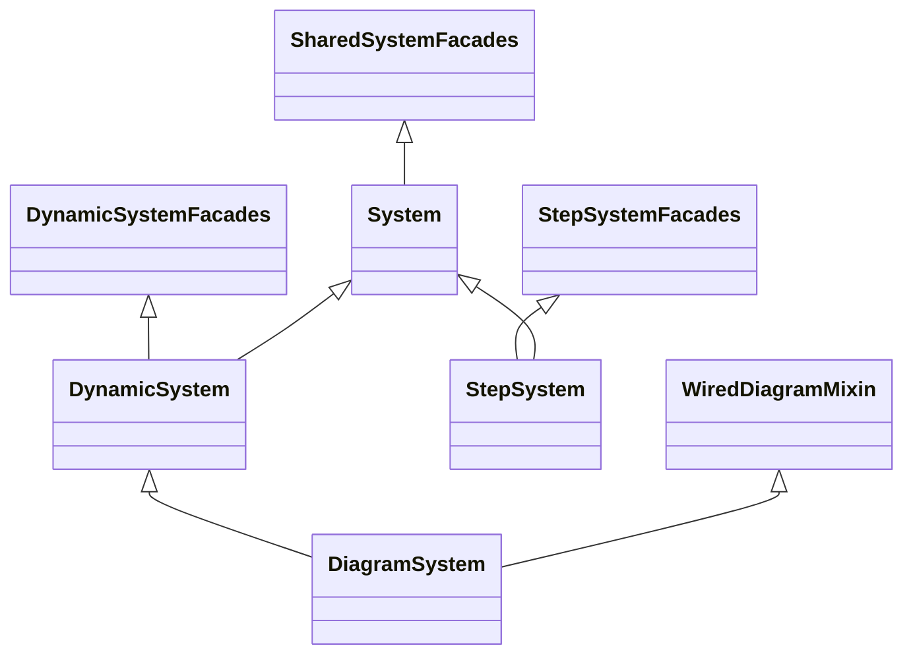

# Phase 1b: Façade mixin split + DiagramSystem IS-A DynamicSystem

**Status:** complete (`40c8297` on `dev-hybrid`, July 2026).

**After [Phase 1 step core](01-step-core.md).** Completes the façade refactor started in
Phase 1: split `SystemFacades` into evolution-aware mixins, make `DiagramSystem` inherit
`DynamicSystem`, delete `_simulate`, collapse `(DynamicSystem, DiagramSystem)` isinstance OR
tuples at sim boundaries.

**Prerequisite:** Phase 1 step core landed (`StepSystem`, `StepRollout`, `compute_rollout`).

**Files:** `minilink/core/facades.py`, `minilink/core/system.py`, `minilink/core/diagram.py`,
`minilink/simulation/simulator.py`, `minilink/simulation/static_simulator.py`, tests,
`DESIGN.md`, `README.md`

## Goal

Three related cleanups in one pass:

1. **Façade split** — `SharedSystemFacades`, `DynamicSystemFacades`, `StepSystemFacades`; no
   monolithic `SystemFacades` with `_simulate` routers.
2. **Type model** — `DiagramSystem` **is a** `DynamicSystem`. `ExecutionPlan` / diagram
   evaluator = **compile fast path**, not a separate evolution kind.
3. **Static convenience** — **keep** `compute_trajectory` / `compute_forced` on static
   `System(n=0)` (sine → `Gain` → plot). Same user verb; engine is `StaticSimulator` — not ODE
   integration.

## AGENTS.md — validation policy (no defensive routers)

Per [AGENTS.md](../../../AGENTS.md): **validation in proportion**; **inheritance for core
system types**; facades are thin shortcuts.

| Do | Don't |
| --- | --- |
| Place methods on the right mixin; **MRO** picks implementation | `isinstance(..., (A, B))` routers in facades (delete `_simulate`) |
| Let **`Simulator` / `StaticSimulator`** enforce type at public `__init__` | Friendly `AttributeError` / `n != 0` guards inside façade methods |
| **`compile()` ordered fork** (`DiagramSystem` before `DynamicSystem`) | Extra `isinstance(DiagramSystem): raise` in leaf evaluator `__init__` |
| Delete `StepSystem` explicit `compute_trajectory` overrides | New coaching errors on misuse |

**StepSystem:** inherits `SharedSystemFacades.compute_trajectory` by MRO but user API is
`compute_rollout`. Misuse hits `StaticSimulator` `n != 0` rejection — no façade check.

## Vision — one verb, three engines (MRO)

| Type | `compute_trajectory` resolves to | Engine |
| --- | --- | --- |
| `System` leaf (`n=0`) | `SharedSystemFacades` | `StaticSimulator` |
| `DynamicSystem` leaf | `DynamicSystemFacades` (wins MRO) | `Simulator` |
| `DiagramSystem` | `DynamicSystemFacades` (via IS-A) | `Simulator` → diagram evaluator |
| `StepSystem` | use **`compute_rollout`** | `StepEvaluator` |

On static leaves, “trajectory” = **time-sampled boundary IO** (`x.shape == (0, N)`,
`traj.signals`) — not state evolution.

## Target class diagram



**MRO examples**

- `Gain`: `System` → `SharedSystemFacades`
- `Integrator`: `DynamicSystem` → `DynamicSystemFacades` → `System` → `SharedSystemFacades`
- `DiagramSystem`: `WiredDiagramMixin` → `DiagramSystem` → `DynamicSystem` → …
- `StepSystem`: `StepSystemFacades` → `System` → `SharedSystemFacades`

## Method assignment (full audit)

### `SharedSystemFacades` — on `System`

| Method | Rationale |
| --- | --- |
| `compile` | All kinds; `DiagramSystem` overrides |
| `get_diagram`, `_repr_svg_`, `plot_diagram` | Structure / notebook viz |
| `render` | Single frame; static blocks with `tf` / skin |
| `animate` | Playback from `traj`; fallback `self.compute_trajectory()` via MRO |
| `compute_trajectory`, `compute_forced` | `StaticSimulator`; no `n` guard — Dynamic overrides |
| `plot_trajectory` | Any `Trajectory`; auto-sim uses MRO |

### `DynamicSystemFacades` — on `DynamicSystem` (diagrams inherit)

| Method | Rationale |
| --- | --- |
| `compute_trajectory`, `compute_forced` | **Override** Shared → `Simulator` |
| `plot_phase_plane` | Needs `sys.n >= 1` and `sys.f` |
| `plot_bode`, `plot_pzmap` | Linearization / frequency |
| `modal_analysis` | Linearize `A` |
| `game` | Live Euler loop; needs `f` |

Inherited from Shared (not duplicated): `plot_trajectory`, `animate`, `render`.

### `StepSystemFacades` — on `StepSystem` only

- `compute_rollout`, `plot_rollout`

### Delete

- `SystemFacades`, `_simulate`, `StepSystem` trajectory error overrides

### Per-type façade surface

| Method | Gain | Integrator | Diagram | StepSystem |
| --- | --- | --- | --- | --- |
| `compile`, `render`, `plot_diagram`, `animate` | yes | yes | yes | yes |
| `compute_trajectory` | yes (static) | yes | yes | use `compute_rollout` |
| `compute_forced` | yes | yes | yes | — |
| `plot_trajectory` | yes | yes | yes | yes* |
| `plot_phase_plane`, `plot_bode`, `plot_pzmap`, `modal_analysis`, `game` | no | yes | yes | no |
| `compute_rollout`, `plot_rollout` | no | no | no | yes |

\*Step: `plot_trajectory` with explicit `traj=`.

## Implementation sketches

### Shared static `compute_trajectory`

```python
def compute_trajectory(self, t0=0, tf=10, ..., x0=None, compile_backend="numpy", verbose=False):
    from minilink.simulation.static_simulator import StaticSimulator
    sim = StaticSimulator(self, x0=x0, t0=t0, tf=tf, n_steps=n_steps, dt=dt, ...)
    traj = sim.solve()
    self.traj = traj
    return traj
```

### Dynamic override

```python
def compute_trajectory(self, t0=0, tf=10, ...):
    from minilink.simulation.simulator import Simulator
    sim = Simulator(self, x0=x0, t0=t0, tf=tf, n_steps=n_steps, dt=dt, solver=solver, ...)
    traj = sim.solve()
    self.traj = traj
    return traj
```

### `DiagramSystem(DynamicSystem)`

```python
class DiagramSystem(WiredDiagramMixin, DynamicSystem):
    def __init__(self):
        self.subsystems = {}
        self.connections = {}
        System.__init__(self, 0)   # skip DynamicSystem port boilerplate
        self._init_wiring(name="Diagram")
```

Keep `f`, `compile` overrides. Static-only diagrams (`n=0`) use `Simulator` + diagram evaluator
(signal-flow), not leaf `StaticSimulator`.

## Sim boundaries

| File | Change |
| --- | --- |
| `simulator.py` | `not isinstance(sys, DynamicSystem)` |
| `static_simulator.py` | `isinstance(sys, DynamicSystem)` → reject |

Update error messages (drop stale “`compute_trajectory` routes there”).

## Compile fork

`DiagramSystem` before `DynamicSystem` in `compiler.py`. **No new guards** in leaf evaluator
`__init__` — test `type(compile(diagram))` is `NumpyDiagramEvaluator`.

## Tests

| File | Change |
| --- | --- |
| `test_static_simulator.py` | **Keep** facade `compute_trajectory` tests |
| `test_facades_routing.py` | **Delete** |
| `test_facades_rollout.py` | Remove `test_compute_trajectory_friendly_error` |
| **New** `test_facades_split.py` | MRO surface; `Simulator(Gain)` raises; `isinstance(d, DynamicSystem)`; `compile(diagram)` type |

## Regression checklist

```text
Gain: compile, render, animate, compute_trajectory ok; no game, compute_rollout
Integrator: dynamic + shared; no compute_rollout
StepSystem: compute_rollout; animate with traj=
DiagramSystem: compute_trajectory ok; isinstance(d, DynamicSystem)

Simulator(Gain(...)) → TypeError
StaticSimulator(gain) → ok
StaticSimulator(diagram) → TypeError

compile(diagram) → NumpyDiagramEvaluator
compile(integrator) → NumpyDynamicEvaluator
compile(gain) → NumpyStaticEvaluator
```

## Docs sync

- **DESIGN.md** — three mixins, MRO vision, `DiagramSystem` subclasses `DynamicSystem`, sim API
  table, static trajectory semantics
- **README.md** — facade table; `gain.compute_trajectory(...)` example kept
- **01a-implementation-plan.md** — align static routing + IS-A note

## Out of scope

- `sample_outputs` rename, `abscissa_label`, `StepDiagramSystem`, `facades/` package split
- Optional manual nested-diagram test

## Risks

- **`compile()` order** — critical; covered by test
- **Two static paths** — leaf `StaticSimulator` vs static-only diagram via `Simulator`; document
- **Non-breaking** — `gain.compute_trajectory`, README diagram examples

## Implementation slices

| # | Slice | Done |
| --- | --- | --- |
| 1 | Split `facades.py` (Shared / Dynamic / Step); delete `_simulate` | yes |
| 2 | `DiagramSystem(DynamicSystem)`; sim isinstance collapse | yes |
| 3 | Wire mixins in `system.py`; drop Step overrides | yes |
| 4 | Tests + delete `test_facades_routing.py` | yes |
| 5 | `DESIGN.md`, `README.md`, simulator messages | yes |
| 6 | `ruff` + full `pytest` | yes |
