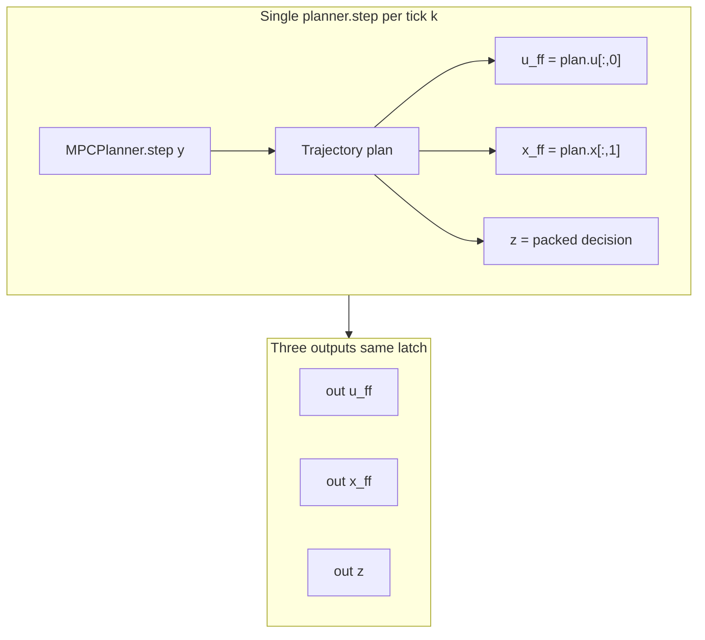

# Phase 6: MPC block for hybrid simulation

**Status: pending** — next hybrid program milestone.

**After [Phase 5](05-hybrid-simulation.md).** Expose MPC as a step-diagram leaf usable in
`Computer` / `HybridDiagram`, replacing hand-rolled outer loops in MPC demos.

**Requires:** Phases **1–2** (`StepSystem`, `StepDiagramSystem`), Phase **5**
(`HybridSimulator`), Phase **4** (`Computer`).

**Files:** `minilink/planning/mpc/controller.py`, `minilink/planning/mpc/plan_reconstruct.py`;
6b adds `step_block.py`, `warm_start.py`.

## Motivation

Today MPC demos call `MPCPlanner.step(x, initial_guess=...)` inside a Python `while t < tf`
loop with manual `u_hold`, `SUBSTEPS`, and warm-start shifting. Phase 5 delivers
`HybridSimulator`; Phase 6 moves MPC **into** the step-diagram contract:

```python
hybrid = HybridDiagram(computer=Computer(step_diagram, schedule), plant=plant_diagram)
result = hybrid.compute_forced(..., plant_dt_inner=SIM_DT)
```

`MPCPlanner` remains the compile-once NLP engine; new blocks adapt planner output to diagram
ports and `Computer.tick`.

## Split: algebraic (6a) vs step (6b)

| Mode | Base type | State | Mechanism in `Computer.tick` |
| --- | --- | --- | --- |
| **6a stateless** | `System` (`n=0`) | none | **port `compute` only** (same as `SlidingModeController` in hybrid SMC demos) |
| **6b warm-start** | `StepSystem` (`n=n_z`) | packed decision `z` | port ops solve once (latch) → feedforward outs; **`step` commits `z` only** (no second NLP) |

**Invalid assumption:** `MPCStepBlock(StepSystem, n=0)` — `StepSystem.__init__` raises if
`n < 1`. Static blocks use `System(n=0)`; step diagrams compile them as **port ops only**
(`step_compiler.py` — no `step_ops`).

**Why not `step`/`h` for stateless MPC?** `Computer.tick` runs **port ops before step ops**.
SMC parity relies on algebraic `port.compute` returning control for the **current** tick. A
`step`+`h` latch would apply **lagged** `u_ff` (solve at end of tick, `h` reads previous latch).
Stateless MPC must be algebraic.

```mermaid
sequenceDiagram
  participant C as Computer.tick k
  participant P as port_ops mpc
  participant S as step_op mpc 6b only
  participant NLP as planner.step once

  C->>P: local_x = z_k-1 or empty
  P->>NLP: first port triggers _solve_for_tick
  NLP-->>P: latch plan z
  P->>P: u_ff x_ff z read latch
  C->>S: step returns latch.z
  Note over C: outs = port values; computer.x = z_k
```



## Order of operations (Computer contract)

**`Computer.tick` always runs port ops, then step ops**, per subsystem (`computer.py`). We do
**not** change that order.

### Per-tick timeline (one MPC block firing at tick `k`)

| Phase | What runs | MPC block sees | MPC block produces |
| --- | --- | --- | --- |
| 1. Port ops | Each output port `compute` | `local_x` = **pre-step** state (`z_{k-1}` for 6b; empty for 6a); `local_u` includes `y_k` | Writes `u_ff`, `x_ff`, `z` to signal buffer |
| 2. Step op | `step` (6b only) | Same `local_x` = `z_{k-1}` | Returns `z_k` → `computer.x` |
| 3. Commit | `outs` = boundary slices of signal buffer; `k += 1` | — | Plant ZOH uses `outs["u_ff"]` |

Feedforward outputs at tick `k` come from the NLP solved **at** tick `k` using measurement
`y_k`. That matches hand-loop demos (`solve` then `u_hold = plan.u[:, 0]`). Port-ops-before-step
does **not** lag `u_ff` as long as the solve happens in port ops (not in `h` after a previous
tick's step).

### Why not solve in `step` only?

- Port ops run **before** `step` → `h` would expose **previous** tick's plan (one MPC period late).
- Solving in `step` after port ops → `outs` already committed without current `u_ff`.

**Sole NLP call site: port ops**, via a shared latch. `step` (6b) only **commits** latched `z`.

### Single-solve latch (shared by 6a and 6b)

```python
def _solve_for_tick(self, k, y, z_warm=None):
    if self._latch_k == k:
        return self._latch
    plan = self._planner.step(y, initial_guess=guess_from(z_warm))
    self._latch_k = k
    self._latch = TickSolve(plan=plan, z=result.z,
                           u_ff=plan.u[:, 0], x_ff=plan.x[:, 1])
    return self._latch
```

Each output port `compute(k, ...)` calls `_solve_for_tick` and returns one field. **First port
evaluated at tick `k` runs the NLP; the other two read the latch.** Tests assert
`planner.step` call count == number of MPC fires.

**Purity note:** port `compute` is conventionally pure in `(x, u, t, params)`. The latch is a
deliberate, documented exception for multi-output MPC leaves, keyed on integer tick `k` (always
passed by `Computer`).

### 6a static vs 6b step

| | **6a `MPCController`** | **6b `MPCStepBlock`** |
| --- | --- | --- |
| Base | `System`, `n=0` | `StepSystem`, `n=n_z` |
| `step_op` | none | `return self._latch.z` (no NLP) |
| Warm start | `initial_guess=None` | `z_warm` = `local_x` = `z_{k-1}`, shifted via `warm_start.py` |
| `z` persistence | ephemeral (`signals["z"]` only) | `computer.x` **and** `signals["z"]` after tick `k` |

**Do not use `expose_state=True` for `z` on 6b:** the state port is evaluated in port ops
**before** `step`, showing `z_{k-1}`. Use explicit output port `z` returning latched `z_k`, and/or
read `computer.x[:, k]` post-tick.

### Feedforward port semantics

- `u_ff = plan.u[:, 0]` — apply over current MPC interval (matches existing demos).
- `x_ff = plan.x[:, 1]` — nominal state at the **next** collocation node (for low-level feedback).
- `z` — packed `last_optimization_result.z`; logging, animation, 6b warm-start seed.

Factory validates `transcription.options.n_steps >= 2`.

## Block contracts

### `MPCController` — Phase 6a

**File:** `minilink/planning/mpc/controller.py`

- Extends `System`, `n=0` (mirror `ProportionalController`)
- **Input:** `y` (measurement, dim `planner.problem.sys.n`)
- **Outputs (three ports, one solve):** `u_ff`, `x_ff`, `z` as above
- **Solve latch:** `_solve_for_tick(k, y, z_warm=None)` — not a `StepSystem.step` in 6a
- Factory: `mpc_controller(planner)` — validates prepared `MPCPlanner`, `n_steps >= 2`, port dims

### `MPCStepBlock` — Phase 6b (deferred)

- Extends `StepSystem`, `n = transcription.decision_dimension(problem)`
- **Same three output ports** and **same `_solve_for_tick` latch** as 6a
- **`step`:** `return self._solve_for_tick(k, y, z_warm=local_x).z`
- Warm-start shift: `minilink/planning/mpc/warm_start.py` (from straight-line demo logic)

## Diagram outputs → `StepRollout` (no `plan_log`)

```python
step_diagram.connect_new_output_port("mpc", "u_ff", "u_ff")
step_diagram.connect_new_output_port("mpc", "x_ff", "x_ff")
step_diagram.connect_new_output_port("mpc", "z", "z")
```

`HybridSimulator` records boundary `outs` into `StepRollout.signals`. Shapes per tick:
`u_ff` `(m,)`, `x_ff` `(n,)`, `z` `(n_z,)`.

6a demo wires `u_ff` to plant; `x_ff` and `z` for optional feedback and post-sim horizon.

**Post-sim reconstruction** — `minilink/planning/mpc/plan_reconstruct.py`:

```python
def mpc_plans_from_rollout(
    computer: StepRollout,
    transcription,
    problem,
    *,
    z_source: str = "signals",
    t0: float,
    dt_mpc: float,
) -> list[tuple[float, Trajectory]]:
    ...
```

Animation: `HorizonPolyline(mpc_plans_from_rollout(...))` on `hybrid.animate(overlays=[...])`.

## Phase 6a deliverables

| Item | Detail |
| --- | --- |
| Block | `MPCController` + `mpc_controller()` |
| Demo | `examples/scripts/hybrid/demo_dynamic_bicycle_rate_mpc_straight_line.py` — generic `HybridDiagram`; **do not edit** `examples/scripts/mpc/demo_dynamic_bicycle_rate_mpc_straight_line.py` |
| Tests | `test_mpc_controller.py`; `test_mpc_hybrid_straight_line.py` (stateless parity on `u_ff`) |
| Exports | `mpc_controller`, `MPCController`, `mpc_plans_from_rollout` from `planning/mpc/__init__.py` |

### Demo wiring (sketch)

```python
mpc = mpc_controller(mpc_planner)
step_diagram = StepDiagramSystem()
step_diagram.add_subsystem(mpc, "mpc")
step_diagram.add_input_port("y")
step_diagram.connect("input", "y", "mpc", "y")
step_diagram.connect_new_output_port("mpc", "u_ff", "u_ff")
step_diagram.connect_new_output_port("mpc", "x_ff", "x_ff")
step_diagram.connect_new_output_port("mpc", "z", "z")

plant_diagram = DiagramSystem()
# rate bicycle + Demux(dims=(1,1)) at boundary u

hybrid = HybridDiagram(computer=Computer(step_diagram, schedule), plant=plant_diagram)
hybrid.connect_boundary(direction="computer_to_plant", computer_port="u_ff", plant_port="u")
hybrid.connect_boundary(direction="plant_to_computer", computer_port="y", plant_port="y")
```

**Parity (6a):** stateless — `initial_guess=None` every MPC tick; match hand loop on `u_ff`.

## Explicit non-changes

- No `hybrid_mpc_closed_loop()` shortcut
- No `MPCPlanner` API changes
- No `HybridSimulator` / `Computer` tick-order changes
- Existing `examples/scripts/mpc/*` demos untouched until 6b parity

## Implementation checklist

- [ ] `MPCController` + `mpc_controller()` in `controller.py`
- [ ] `mpc_plans_from_rollout()` in `plan_reconstruct.py`
- [ ] Exports; DESIGN / ROADMAP / README updates
- [ ] `test_mpc_controller.py`, `test_mpc_hybrid_straight_line.py`
- [ ] Hybrid straight-line demo + horizon overlay from `signals["z"]`
- [ ] **6b:** `MPCStepBlock`, `warm_start.py`, warm-started demo parity

## Verification

```bash
conda activate minilink
ruff check . && ruff format --check .
pytest tests/unittest/test_mpc_controller.py tests/unittest/test_mpc_hybrid_straight_line.py
MPLBACKEND=Agg python examples/scripts/hybrid/demo_dynamic_bicycle_rate_mpc_straight_line.py
```

## Tests (6a + 6b)

| File | Cases |
| --- | --- |
| `test_mpc_controller.py` | `u_ff`/`x_ff`/`z` ports; exactly one `planner.step` per tick |
| `test_mpc_hybrid_straight_line.py` | hybrid vs stateless hand loop on `u_ff` |
| `test_mpc_step_block.py` (6b) | warm-start `z` state; shift matches demo |
| `test_mpc_hybrid_demo_parity.py` (6b) | hybrid vs warm-started hand loop |

## Deferred

- JAX-differentiable MPC inside block (planner stays NumPy for v1)
- Multi-rate MPC via `StepSchedule.fire` on `mpc` sys_id
- `hybrid_mpc_closed_loop()` sugar when a second demo repeats Demux boilerplate
