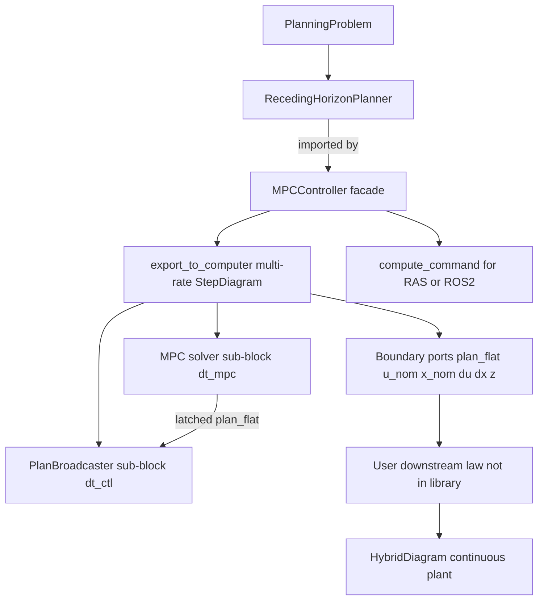
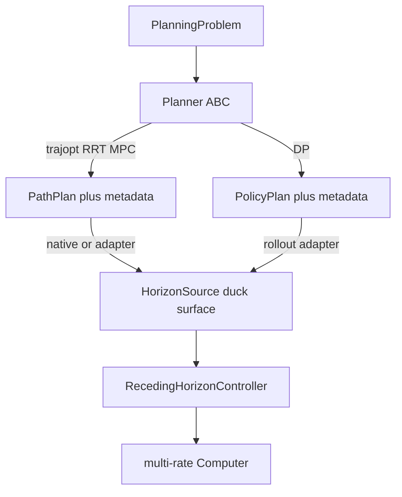
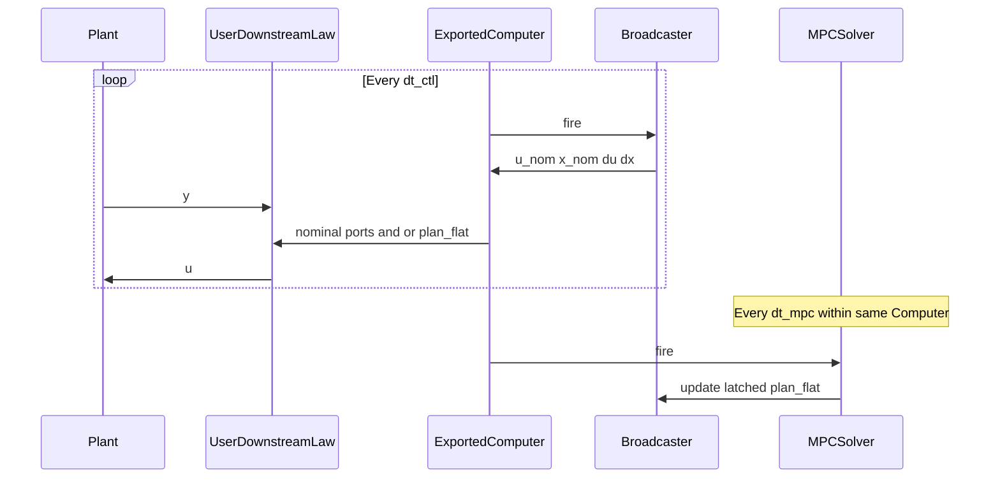

# MPC controller architecture (design only)

Status: draft plan (July 2026). No implementation in this phase.

Companion to [planning-pipeline-architecture.md](planning-pipeline-architecture.md):

| Plan | Focus |
| --- | --- |
| **A / B** ([planning-pipeline-architecture.md](planning-pipeline-architecture.md)) | PathPlan / PolicyPlan results; parametric scene NLP |
| **C** (this doc) | RH/MPC facade; multi-rate export; plan broadcast; **horizon-source contract (C8)** |

Implemented PoC contracts live in [DESIGN.md](../../DESIGN.md) (step/hybrid + Phase 6a–6b) and [ROADMAP.md](../../ROADMAP.md) §5.5 / §5.5a.

---

## Verdict on the PoC

Today’s shape is directionally right for Minilink, but the roles are blurred:

| Layer | Today | Smell |
| --- | --- | --- |
| NLP engine | [`MPCPlanner`](../../minilink/planning/mpc/planner.py) | Good — compile-once `prepare` / `step` |
| Diagram leaf | [`MPCStatelessController`](../../minilink/planning/mpc/controller.py) / [`MPCStatefulController`](../../minilink/planning/mpc/step_block.py) | Thin adapters hard-tied to `MPCPlanner`; export is a single-rate leaf |
| Latch / feedforward | [`MPCTickLatch`](../../minilink/planning/mpc/tick_latch.py) | Only slices `u_ff` / `x_ff` / `z` at MPC tick rate |
| Plan wire format | NLP `z` only | No `Trajectory.to_flat` / `from_flat` wire for consumers |
| High-rate nominals | none | No bundled interpolator; callers cannot easily get `u_nom(t)` / `x_nom(t)` between solves |
| Deploy surface | none | No clocked tick API for a real node |
| Debug | `step_disp` + post-hoc overlays | No shared live debug mode across hand-loop / hybrid / node |

---

## Architectural decision (chosen)

**MPC is neither “only a planner” nor “only a control block.”** Use a layered split that matches Minilink’s Planner-vs-System law:



1. **Horizon backend (planner / tool)** — anything that can emit a drafted
   `PathPlan` from the current `x0` each tick (see **C8**). `MPCPlanner.step`
   is the first backend; trajopt / RRT / DP-rollout adapters share the same
   surface. Not a `System`.

2. **`RecedingHorizonController` facade** (aim alias **`MPCController`** when the
   backend is NLP-MPC) — holds a **horizon source**, warm-start policy, latch,
   debug, last plan/metadata. **Single source** for hand loops, export, and
   real nodes. Does **not** require the backend to be `MPCPlanner`.

3. **Multi-rate Computer export (chosen packaging)** — `export_to_computer` / `%` builds a **`StepDiagramSystem` + `StepSchedule`**, not a lone NLP leaf:
   - **Tick sub-block** fires at `dt_mpc` (calls `generate_horizon`)
   - **Broadcaster sub-block** fires at faster `dt_ctl` ([`StepSchedule.fire`](../../minilink/simulation/computer.py) divisors)
   - Broadcaster time-interpolates the latched drafted plan and exposes **nominal** ports
   - Boundary exposes **everything a downstream law needs**; Minilink does **not** ship FF/FB tracker blocks as the product of this work

4. **Thin single-leaf export (optional escape hatch)** — keep ability to export solver-only for demos that only want `u_ff` at MPC rate; default recommended path is the multi-rate bundle.

5. **Beginner path = `mpc @ plant`** — same mental model as `ctl @ plant` / `computer @ plant`. The facade carries schedule defaults and auto-wires a safe applied-`u` so the first working closed loop is one composition line (see C0). Advanced ports stay exposed; beginners need not name them.

**Not chosen:** embedding stabilizers / tracking laws in the MPC package.  
**Not chosen:** a separate user-facing downstream-law toolkit as a deliverable — only **exposure** (ports + flatten + broadcaster inside the export).  
**Not chosen:** forking `Planner` into deep `TrajectoryPlanner` / `PolicyPlanner` class trees — keep one ABC + result families + a thin horizon-source surface (**C8**).  
**Not chosen:** continuous `DiagramSystem` hosting the NLP — tick side stays on the Computer; interpolation broadcasts on the faster Computer tick.

Default for “RAS”: generic `compute_command` + same `plan_flat` / nominal-eval helpers the broadcaster uses internally (aligns with future [`ros2.py`](../../ROADMAP.md) wrapping).

---

## C8. Planner contracts compatible with receding horizon

Coupled with [planning-pipeline-architecture.md](planning-pipeline-architecture.md)
(A/B: `PathPlan` / `PolicyPlan`). Goal: RRT, trajopt, DP, and NLP-MPC can all
participate in the **same receding-horizon control loop** without pretending
they are the same offline algorithm.

### What “compatible with MPC/RH” actually means

Three combination modes (do not conflate them):

| Mode | Meaning | Example |
| --- | --- | --- |
| **H1 — Horizon backend swap** | Each tick, some tool emits a drafted `PathPlan` from `x0`; RH controller latches + broadcasts | NLP-MPC `step`; RRT from `x0`; trajopt re-solve; DP **rollout** |
| **H2 — Cascade / warm refine** | One planner proposes a path; another refines it as warm start | RRT → trajopt/MPC; previous tick plan → shift warm start |
| **H3 — Problem composition** | Offline artifact shapes the online NLP (not a horizon swap) | DP cost-to-go as terminal cost; reference path as soft tracking cost |

`RecedingHorizonController` **imports H1** (required). H2 is options on the
horizon source (`warm_start=`). H3 lives in `PlanningProblem` construction, not
in the controller import type.

### Keep one `Planner` ABC; specialize results and capabilities — not deep subclasses

Align with plan A: **one** [`Planner`](../../minilink/planning/planner.py) +
declarative [`PlanningProblem`](../../minilink/planning/problems.py).



| Layer | Contract | Notes |
| --- | --- | --- |
| **Input** | `PlanningProblem` | Shared; do not fork problem types per algorithm |
| **Orchestrator** | `Planner` | `compute_solution()` offline / batch; soft `result_kind` `"path"` / `"policy"` |
| **Path result** | `PathPlan` | Open-loop `(t,x,u)` + metadata |
| **Policy result** | `PolicyPlan` | `controller()`, **`rollout(x0, horizon) → PathPlan`** |
| **Online tick** | **Horizon source** (duck-typed) | What the RH controller imports |

**Do not** make the RH facade call `Planner.compute_solution()` blindly each
tick (RRT would ignore fresh `x0` unless the problem is rebuilt; DP returns a
table, not a horizon).

### Horizon-source surface (what RH actually needs)

Duck-typed — familiar pattern, not `typing.Protocol`:

```python
# Required
source.generate_horizon(x0, *, warm_start=None, params=None) -> PathPlan

# Optional but useful
source.prepare()                       # compile-once NLP, DP table already built, …
source.warm_state_dim -> int           # 0 if none; else dim of warm vector for StepSystem
source.default_warm_state() -> array   # for Computer x0
# n, m from problem.sys / resulting PathPlan
```

`PathPlan` is the **only** tick output family the RH controller understands.
Policies enter only via **`rollout → PathPlan`** (or via H3 problem composition).

### How each current planner family maps

| Family | Offline `compute_solution` | As horizon source (H1) | Notes |
| --- | --- | --- | --- |
| **NLP-MPC** (`MPCPlanner`) | `step(x_start)` thin `compute_solution` | **Native:** `generate_horizon` ≡ `step` | Primary; warm `z`; xp-clean around SciPy |
| **Trajopt** | Full re-transcribe/solve → `Trajectory` | Adapter: set `x0`, optional warm guess, solve → `PathPlan` | Slow RH demo; tests facade without parametric NLP |
| **RRT / RRT\*** | Tree search from `problem.x_start` → `Trajectory` | Adapter: each tick `x_start=x0` → `PathPlan` | Sampling RH; usually `warm_state_dim=0`; optional later: reuse tree |
| **DP** | Value/policy table → `PolicyPlan` | Adapter: **`policy.rollout(x0, tf=…, dt=…)` → `PathPlan`** | Does **not** re-run VI each tick. For closed-loop DP feedback prefer `controller()` continuous `@`, not RH |
| **Future JAX NLP** | Same as MPC | Same `generate_horizon` | Drop-in backend; helpers already xp-clean |

### Specialized “sub-contracts” — capabilities over class trees

Avoid deep trees (`PathPlanner` / `SamplingPlanner` / …). Prefer **soft
capabilities + adapters**:

| Capability | Who | Evidence |
| --- | --- | --- |
| `result_kind == "path"` | trajopt, RRT, MPC | Returns / wraps `PathPlan` |
| `result_kind == "policy"` | DP | Returns / wraps `PolicyPlan` |
| `as_horizon_source(...)` | those that can do H1 | Duck object with `generate_horizon` |
| `supports_warm_start` | MPC, trajopt | `warm_state_dim > 0` or accepts `warm_start=` |

```python
path_planner.as_horizon_source()             # default: re-solve / replan from x0
policy_plan.as_horizon_source(tf=, dt=)      # rollout wrapper
mpc_planner.as_horizon_source()              # identity / self
```

Optional later: a small mixin with abstract `generate_horizon` — still **one**
`Planner` tree.

### Naming the facade

| Name | Use |
| --- | --- |
| **`RecedingHorizonController`** | Accurate generic facade (any horizon source) |
| **`MPCController`** | Alias or thin subclass when source is NLP-MPC — keeps aim demos sounding like MPC |

### Package organization

```text
planning/
  planner.py              # Planner ABC
  problems.py             # PlanningProblem
  results.py              # PathPlan, PolicyPlan, SolveMetadata  (plan A)
  horizon.py              # duck docs + as_horizon_source adapters
  mpc/                    # NLP-MPC backend + RH controller export/broadcast
  trajectory_optimization/
  search/
  policy_synthesis/
```

RH export/broadcast lives next to the closed-loop product (`planning/mpc/`);
horizon adapters live in `planning/horizon.py` so search/DP do **not** import
`mpc/` internals. Dependency: `mpc/` → `horizon.py`; not the reverse.

### Example compositions

```python
# H1 NLP-MPC (aim)
rh = MPCController(mpc_planner, dt_mpc=0.1)
hybrid = rh @ plant

# H1 RRT receding horizon (same controller machinery)
rh = RecedingHorizonController(rrt.as_horizon_source(), dt_mpc=0.5)
hybrid = rh @ plant

# H1 DP rollout as drafted plan (open-loop FF of greedy policy)
rh = RecedingHorizonController(policy.as_horizon_source(tf=2.0, dt=0.1), dt_mpc=0.1)
hybrid = rh @ plant

# H2 cascade (sketch): RRT proposes, MPC refines
guess = rrt.as_horizon_source().generate_horizon(x0)
plan = mpc_planner.generate_horizon(x0, warm_start=guess.trajectory)

# H3: PlanningProblem carries DP terminal / track cost — then normal MPCPlanner
```

### Decisions (C8)

| Question | Decision |
| --- | --- |
| One `Planner` ABC? | **Yes** (with plan A) |
| Fork Path/Policy planner class trees? | **No** — split **results** + soft capabilities |
| What does RH controller import? | **Horizon source** (`generate_horizon → PathPlan`), not raw `Planner` |
| Can RRT/trajopt drive RH? | **Yes** via `as_horizon_source` adapters |
| Can DP drive RH? | **Yes** via **`PolicyPlan.rollout` → PathPlan**; VI stays offline |
| DP closed-loop feedback? | Prefer `controller()` continuous path; RH rollout is a different use |
| Where do adapters live? | `planning/horizon.py` (no search→mpc dependency) |
| Facade name? | `RecedingHorizonController` + `MPCController` alias for NLP-MPC demos |

---

## C0. High-level UX — aim setup (defaults first)

**Goal:** textbook-short closed loop after the planner exists. Advanced multi-rate / `plan_flat` / custom laws remain available; they must not be required for the first hybrid demo.

### Aim call chain

```python
# 1) build PlanningProblem + prepare MPCPlanner (unchanged, expert content)
planner = MPCPlanner(problem, transcription=..., options=...)

# 2) wrap once — warm-start + multi-rate broadcast bundle by default
mpc = MPCController(planner, dt_mpc=0.1)

# 3) close the loop like any other digital controller
hybrid = mpc @ plant

hybrid.compute_trajectory(tf=..., x0_plant=..., plant_dt_inner=...)
```

Equivalents (same defaults under the hood):

```python
hybrid = mpc_closed_loop(mpc, plant)
# or
computer = mpc.export_to_computer()   # uses mpc.dt_mpc / mpc.dt_ctl defaults
hybrid = computer @ plant
```

`MPCController.__matmul__(plant)` must: apply default export → `export_to_computer(...)` → existing `Computer @ plant` / `hybrid_closed_loop` wiring (`y` ↔ measurement, applied `u` → plant `u`).

### Default policy (chosen)

| Knob | Default | Rationale |
| --- | --- | --- |
| `dt_mpc` | **required** on facade (or derived from transcription knot `dt` when unambiguous) | MPC rate is a control design choice |
| `dt_ctl` | `dt_mpc / 10` (or transcription knot `dt` if finer and divides evenly) | ctl-rate nominals without forcing another arg |
| Export | multi-rate **bundle** (`bundle=True`) | broadcaster included so `u_nom` exists |
| Warm-start | **on** (stateful solver sub-block) | matches today’s working hybrid demos |
| Applied `u` for `@` auto-wire | **`u_nom`** (ctl-rate ZOH of interpolated plan); fallback `u_ff` if broadcaster disabled | smoother than tick-only first-move; still pure FF |
| Fail-soft | hold last applied `u` when `success=0` (configurable) | safe beginner default |
| `x0_computer` | packed default warm-start from planner | `compute_trajectory` should not require calling `mpc_default_computer_x0` by hand |

Power users override: `MPCController(..., dt_ctl=..., applied_u="u_ff", warm_start=False)` or `export_to_computer(bundle=False)` / explicit `hybrid_closed_loop(..., computer_out="u_nom")`.

### What stays out of the one-liner

Building `PlanningProblem`, costs, transcription, and scene stays explicit (that *is* the planning work). The **composition** after `MPCController(...)` should feel as light as `ctl @ plant`.

Optional later sugar (non-blocking): `mpc_closed_loop(planner, plant, dt_mpc=...)` constructs the facade with defaults in one call — still no magic problem builder.

### Contrast with today’s PoC

```python
# Today (working but ceremony-heavy)
mpc = mpc_stateful_controller(planner, dt_mpc=MPC_DT)
computer = mpc % MPC_DT
hybrid = computer @ sys
# + manual x0_computer=mpc_default_computer_x0(planner)
```

```python
# Target aim
mpc = MPCController(planner, dt_mpc=MPC_DT)
hybrid = mpc @ sys
```

---

## Two-rate export model

| Rate | Sub-block | Role |
| --- | --- | --- |
| **`dt_mpc`** | MPC solver | One NLP → latch plan + `z` + metadata; write `plan_flat` |
| **`dt_ctl`** (faster) | Plan broadcaster | Interp latched plan at tick time → `u_nom`, `x_nom`, optional `du_nom`, `dx_nom` |



Canonical export sketch (explicit):

```python
computer = mpc.export_to_computer(dt_ctl=0.01, dt_mpc=0.1)
# StepSchedule(dt_base=0.01, fire={"mpc_solver": 10, "plan_broadcaster": 1})
hybrid = computer @ plant
# User wires: computer.u_nom / x_nom / plan_flat → their law → plant.u
# or simple demos: computer.u_ff >> plant.u
```

Aim sketch (defaults; see C0):

```python
hybrid = mpc @ plant  # export + hybrid_closed_loop; applied u defaults to u_nom
```

---

## Proposed contracts

### C1. Receding-horizon planner surface (duck-typed)

```python
planner.step(x_start, *, initial_guess=None, params=None) -> PathPlan
planner.decision_dimension / pack / unpack   # warm state
planner.problem.sys.n, .m
```

`PathPlan` (+ `SolveMetadata`) from improvement A in [planning-pipeline-architecture.md](planning-pipeline-architecture.md) when available. Until then, accept `Trajectory` + side-channel metadata.

### C2. `MPCController` facade (primary user object)

Owns: planner, `dt_mpc`, optional default `dt_ctl`, warm-start, latch, debug, last plan/metadata, **applied-`u` port name for `@`**.

| Method | Role |
| --- | --- |
| `step` / `compute_command` → `MPCCommand` | hand loop + RAS (plan-first) |
| `export_to_computer(dt_ctl=..., dt_mpc=..., *, bundle=True)` | **default**: multi-rate solver+broadcaster diagram |
| `__matmul__(plant)` / `mpc_closed_loop(mpc, plant)` | **aim path**: export with facade defaults → `hybrid_closed_loop` |
| `as_solver_block()` | raw solver leaf (escape hatch / tests) |
| `as_broadcast_bundle(...)` | explicit `StepDiagramSystem` before `as_computer` |
| `reset` / `last_*` / `plot_*` / `debug_*` | shared |
| default `x0_computer` helper | used by façade / traj API so aim demos skip manual packing |

`MPCCommand`: `plan`, `plan_flat` (= `plan.to_flat()`), `u_ff`, `x_ff`, `z`, `metadata`.
(Prefer absolute times already stored in `plan.t` when latching for broadcast — no parallel `t0_abs` field unless a relative-horizon backend forces it.)

**Auto-wire for `@`:** resolve plant feedback as today’s hybrid rules (`y` in, `u` out) but source computer_out from facade `applied_u` defaulting to **`u_nom`** (then `u_ff` / `u`). Boundary still exposes `plan_flat`, `x_nom`, … for optional extra wires.
### C3. Boundary ports to expose (for any downstream law)

The **exported Computer** boundary must expose enough for feedforward **or** feedback without guessing:

| Port / signal | Rate | Purpose |
| --- | --- | --- |
| `y` (in) | sample / plant | measurement into solver (and available to user law) |
| `plan_flat` (out) | updates on MPC fire; held between | `Trajectory.to_flat()` of latest plan — reconstruct with `Trajectory.from_flat` |
| `u_nom` (out) | **ctl rate** | time-interp nominal input |
| `x_nom` (out) | **ctl rate** | time-interp nominal state |
| `du_nom` (out) | ctl rate | nominal input rate (when enabled) |
| `dx_nom` (out) | ctl rate | nominal state rate (model `f` preferred; else FD) |
| `u_ff` (out) | MPC hold or ctl | convenience first-move / knot-0 (simple FF demos) |
| `x_ff` (out) | MPC hold | next-knot / seed state |
| `z` (out) | MPC | warm-start / debug |
| `success` (out) | MPC hold | fail-soft gating for user laws |
| `t_plan` or `tau` (out, optional) | ctl | time within current horizon |

**Exposure principle:** Minilink ships the **reference generation surface**; the user (or a later separate PR) wires `u = π(u_nom, x_nom, y, …)`. No tracking / law factory is required in this architecture pass.

**Aim principle:** `mpc @ plant` auto-wires one applied channel (default `u_nom` → plant `u`) so beginners get a closed loop without reading this table; the full set remains for custom diagrams.

Auto-wiring remains: prefer facade `applied_u` (`u_nom` default), else `u`/`u_ff`; richer demos explicitly wire `x_nom` / feedback.

### C4. Real-pipeline (RAS / ROS) surface

Same information model as the exported Computer:

```python
cmd = mpc.compute_command(y_meas, warm_state=z_prev)
# publish cmd.plan_flat (+ metadata); high-rate side uses same eval helpers as broadcaster
ref = PlanBroadcaster.from_flat(cmd.plan_flat).evaluate(t_wall)
# or: plan = Trajectory.from_flat(cmd.plan_flat); ...
# user node: u = their_law(ref, y_meas)
```

Requirements: one NLP per MPC tick; high-rate path is interp-only; fail-soft hook; no plot libs on hot path.

### C5. Debug and observability

| Feature | Use |
| --- | --- |
| `debug` / levels | prints + plot hooks without code forks |
| `step_disp` | MPC-tick timings (keep) |
| `last_command` / plan history | closed-loop + node logs |
| Overlay `u_nom`/`x_nom` vs plant | catch interp / clock bugs |
| Static / dynamic horizon plots | tuning + closed-loop viz ([`mpc_animation_overlays`](../../minilink/planning/mpc/animation_overlays.py)) |
| Failure dump | last `z`, `plan_flat`, residuals |

### C6. Trajectory flatten + broadcaster

#### C6a. Flatten / inflate — two layers (NumPy report vs native math)

**DESIGN fact:** [`Trajectory`](../../minilink/core/trajectory.py) is already a
**NumPy reporting / I/O object** ([DESIGN.md](../../DESIGN.md) §4: convert at
boundaries — evaluators, solvers, plotting, `Trajectory`). Its constructor
`np.asarray`’s and copies. Making `Trajectory` itself JAX-traceable would fight
that contract and the textbook “report bag” role.

**Chosen split:**

| Layer | API | Backend | Role |
| --- | --- | --- | --- |
| Report / wire (Python, ports, RAS, plots) | `Trajectory.to_flat()` / `Trajectory.from_flat()` | NumPy | Human artifact; Computer `plan_flat` port; save/round-trip |
| Traceable math (optional) | bare helpers `pack_horizon(t,x,u)` / `unpack_horizon(flat, n,m,N)` and `eval_nominal(t, t_knots, x_knots, u_knots)` | **native** via `xp = array_module(...)` | JIT / AD / ctl-rate interp inside equation paths |

```python
# Boundary (NumPy Trajectory)
plan_flat = plan.to_flat()
plan      = Trajectory.from_flat(plan_flat)

# Equation / JIT path (no Trajectory object)
flat = pack_horizon(t, x, u)                    # xp-native in → flat native out
t, x, u = unpack_horizon(flat, n=n, m=m, N=N)  # shapes fixed at prepare /
u_nom, x_nom = eval_nominal(t_query, t, x, u)  # linear interp, xp-native
```

Layout for both layers (same byte/layout contract):

- Header: `n`, `m`, `N` (and version / flags if needed)
- Payload: `t` (`N`), flattened `x` `(n, N)`, flattened `u` `(m, N)`
- Core channels only in v1
- Round-trip on NumPy side; native helpers preserve dtype/device of inputs

**Not chosen: a public `JaxTraj` type** (for now). Reasons:

- Dual traj classes (`Trajectory` vs `JaxTraj`) add a second vocabulary for the
  same `(t,x,u)` math — weak fit for “familiar patterns first” and pre-1.0
  simplicity.
- Minilink already solves hybrid algebra with **functions + `xp`**, not parallel
  container types (geometry SDF, costs, plants use native arrays; report bags
  stay NumPy).
- Broadcaster only needs **`(t,x,u)` arrays + `eval_nominal`**, not a full traj
  object under JIT.
- Revisit a tiny named tuple / dataclass of native arrays only if call sites
  drown in bare `t,x,u` triples — name it then (`HorizonArrays` or similar),
  still not a JAX twin of `Trajectory`.

MPC port still named `plan_flat`; value is `latest_plan.to_flat()` at the
Computer boundary. Absolute time for broadcasting lives in knot `t` when
latching. Inside a JAX-friendly step graph, prefer holding **`(t,x,u)` or
`flat` as arrays** and calling `eval_nominal` — do not round-trip through
`Trajectory` on the hot path.

#### C6b. Broadcaster sub-block (inside exported Computer)

- Input: latched `plan_flat` (Python/Computer: inflate or keep arrays)
- On each **ctl** fire: `eval_nominal(t_sched, …)` → `u_nom`, `x_nom`, optional `du_nom`, `dx_nom`
- Implement `eval_nominal` (and optional derivative helpers) as **native-array**
  functions so a future JAX Computer / JIT wrap can trace them; hybrid NumPy
  Computer today remains the default path
- Fixed horizon `N` (and `n`,`m`) known after `prepare` → static shapes for JIT
- Same helpers callable outside diagrams for RAS
- Horizon end policy: clamp / hold last knot (configurable)
- `dx`: prefer `f(x_nom, u_nom, t)` from planning model; `du`: FD/spline on `u` knots
- If model `f` unavailable, fall back to FD on `x` and mark `dx_source="fd"`

**Traceability aim (honest scope + future JAX NLP):**

Today’s SciPy SLSQP **MPC solve is not JAX-traceable** — that is fine for v1.
Everything **around** the solve should stay **full native / `xp`-clean** so a
future JAX NLP backend can drop in without rewriting the controller, broadcast,
or deploy surface:

| Piece | Traceable now? | Notes |
| --- | --- | --- |
| `pack_horizon` / `unpack_horizon` / `eval_nominal` / `du`,`dx` helpers | **Yes — require** | No `np.asarray` / `float()` / Python branching on data |
| Warm-start shift on `(t,x,u)` or packed `z` | **Yes — require** | Same xp path |
| Parametric program `J`,`h`,`g` / transcription defects (already JAX DC) | **Keep** | Compile-once path stays; solver backend is the plug |
| Broadcaster leaf math | **Yes — require** | Array in → nominals out |
| `MPCController` glue / latch bookkeeping | Host Python OK | Calls into native helpers; does not pollute them |
| SciPy (or other host) NLP tick | **No (today)** | Host callback; result converted at boundary to arrays / `Trajectory` |
| Future JAX NLP tick | **Target** | Same `step(x0, warm)` contract; returns arrays; no SciPy |

Rule: **solver backend is swappable; horizon wire + nominal broadcast + warm-start
math are not solver-specific and must stay equation-path clean.** Do not freeze
NumPy-only APIs into those helpers “because MPC isn’t JIT yet.”

- **Must (v1):** NumPy Computer + broadcaster; `Trajectory` flatten round-trip;
  native helpers free of host coercion
- **Should (v1):** JAX `jit` smoke tests on `eval_nominal` / pack/unpack /
  warm-start shift (no NLP inside the jit)
- **Later:** JAX NLP backend behind the same RH `step` surface; Computer may then
  run a fully traced ctl+solve path if desired
- **Not required in v1:** JIT’d hybrid Computer that embeds the SciPy NLP

---

## Feature list by development phase

### P0 — Planner tuning

Prepare / `step`, inspect plan, `Trajectory.to_flat` / `from_flat` round-trip,
native `pack_horizon`/`unpack_horizon` parity (+ JAX jit smoke on helpers), scene
plots — no plant loop.

### P1 — Export surface validation

- Multi-rate `export_to_computer(dt_ctl, dt_mpc)` builds solver+broadcaster diagram
- Port inventory present; `Trajectory.from_flat(plan_flat)` restores full plan
- Dense sample of `u_nom`/`x_nom` matches `Trajectory.resample` / knot interp
- `eval_nominal` matches resample; **JAX `jit` smoke** on `eval_nominal` / pack
- `du_nom`/`dx_nom` sanity vs FD / `f`

### P2 — Closed-loop hybrid (user wires law)

- **Aim demo:** `mpc = MPCController(planner, dt_mpc=...); hybrid = mpc @ plant` (no manual `%` / `x0_computer` ceremony)
- Exported Computer `@` plant with full port inventory when diagramming explicitly
- Simple path: default applied `u_nom` (pure FF); override `applied_u="u_ff"` if desired
- Feedback path: **user** diagram block using exposed `x_nom`/`u_nom`/`y` (example in a demo script only — not a library law module as the goal)
- Warm-start parity; overlays; debug

### P3 — Deploy

`compute_command` + `plan_flat` publish; high-rate eval helpers shared with broadcaster; later `ros2.py`.

---

## Mapping to current code

| Current | Target |
| --- | --- |
| `mpc_stateful_controller` + `%` + `@` | `MPCController(...)` + `mpc @ plant` (same net hybrid) |
| `MPC*Controller` + `export_to_computer` | Facade export → multi-rate `StepDiagramSystem` (solver + broadcaster) by default |
| `MPCTickSolve` | `MPCCommand` + latched plan feeding broadcaster |
| Single `% MPC_DT` demos | Aim path uses facade defaults; explicit `%` / `export_to_computer(dt_ctl=..., dt_mpc=...)` still OK |
| Manual `mpc_default_computer_x0` | Facade supplies default computer `x0` for traj |
| No traj wire flatten | `Trajectory.to_flat` / `from_flat` (NumPy report); native `pack_horizon` / `eval_nominal` for traceable math |
| `Trajectory.resample` | NumPy convenience; broadcaster math uses `eval_nominal` (xp) |
| Downstream trackers | **Out of scope** as library; demos may show ad-hoc wiring |
| Package home | Stay in `planning/mpc/`; ROADMAP `control/mpc.py` obsolete or re-export note |

**Do not** force continuous `DiagramSystem` / `Simulator` to host the NLP leaf — keep hybrid + `Computer` as the MPC-rate path.

---

## Non-goals (this plan)

- Shipping a downstream control-law library (tracking, LQR-on-error, cascade helpers as products)
- Implementing the rewrite in this documentation pass
- A separate public `PlanCodec` type (use `Trajectory.to_flat` / `from_flat`)
- A public `JaxTraj` twin of `Trajectory` (use native-array helpers instead)
- Making `Trajectory` itself JAX-traceable (stays NumPy reporting object per DESIGN)
- Making the **SciPy** MPC NLP tick JAX-traceable (host solver today; JAX NLP is a later backend)
- Freezing NumPy-only helpers for pack / nominal / warm-start (those stay xp-clean for the JAX NLP day)
- Shooting MPC, acados binding, or ROS2 package
- Trajopt / MPC transcription merge (B8 in [planning-pipeline-architecture.md](planning-pipeline-architecture.md))
- NLP inside continuous `Simulator`
- Required `d²x/dt²` in v1

---

## Suggested implementation order

1. `PathPlan` / `SolveMetadata` (A) if needed for clean `MPCCommand`
2. **`Trajectory.to_flat` / `from_flat`** (NumPy) + native **`pack_horizon` / `unpack_horizon` / `eval_nominal` / warm-start shift** (+ **required** JAX jit smoke on those helpers — no NLP inside)
3. Broadcaster leaf using `eval_nominal` (NumPy Computer first; math stays xp-clean)
4. `MPCController.export_to_computer` → multi-rate bundle (`StepSchedule.fire`) + default `dt_ctl` / warm-start / `x0_computer`
5. **`MPCController.__matmul__` / `mpc_closed_loop`** aim path (defaults → `hybrid_closed_loop`, applied `u_nom`)
6. Expose full boundary port set; keep solver-only escape hatch
7. Rewrite hybrid minimal demo to `mpc @ plant`; keep one explicit multi-rate diagram demo
8. Hand-loop / RAS `compute_command` aligned with same flatten/eval
9. Debug overlays for nominals vs plant
10. *(Later, separate)* JAX NLP backend behind the same RH `step` / parametric program surface

---

## Decision summary

| Question | Decision |
| --- | --- |
| MPC = planner or control block? | **Both layers:** planner NLP + controller facade that exports diagram blocks |
| Import any planner? | **Receding-horizon path surface only** (not RRT/DP) |
| Default export? | **Multi-rate Computer**: solver @ `dt_mpc` + broadcaster @ `dt_ctl` |
| Beginner closed loop? | **`mpc @ plant`** with defaults (`dt_ctl`, warm-start, applied `u_nom`) |
| Baseline public artifact? | **Drafted plan** (`plan` + `plan.to_flat()`) and **ctl-rate nominals** |
| Flat wire API home? | **`Trajectory.to_flat` / `from_flat`** (NumPy report) — not PlanCodec |
| JAX today? | **Helpers xp-clean** (pack / eval / warm-start); SciPy NLP host-only |
| JAX later? | Same RH `step` + helpers; swap in full JAX NLP without rewriting broadcast/export |
| Ship FF/FB laws? | **No** — expose ports/info; users wire laws; aim path is pure FF `u_nom` |
| RAS / ROS? | Shared `compute_command` + traj flatten/eval helpers; `ros2.py` later |
