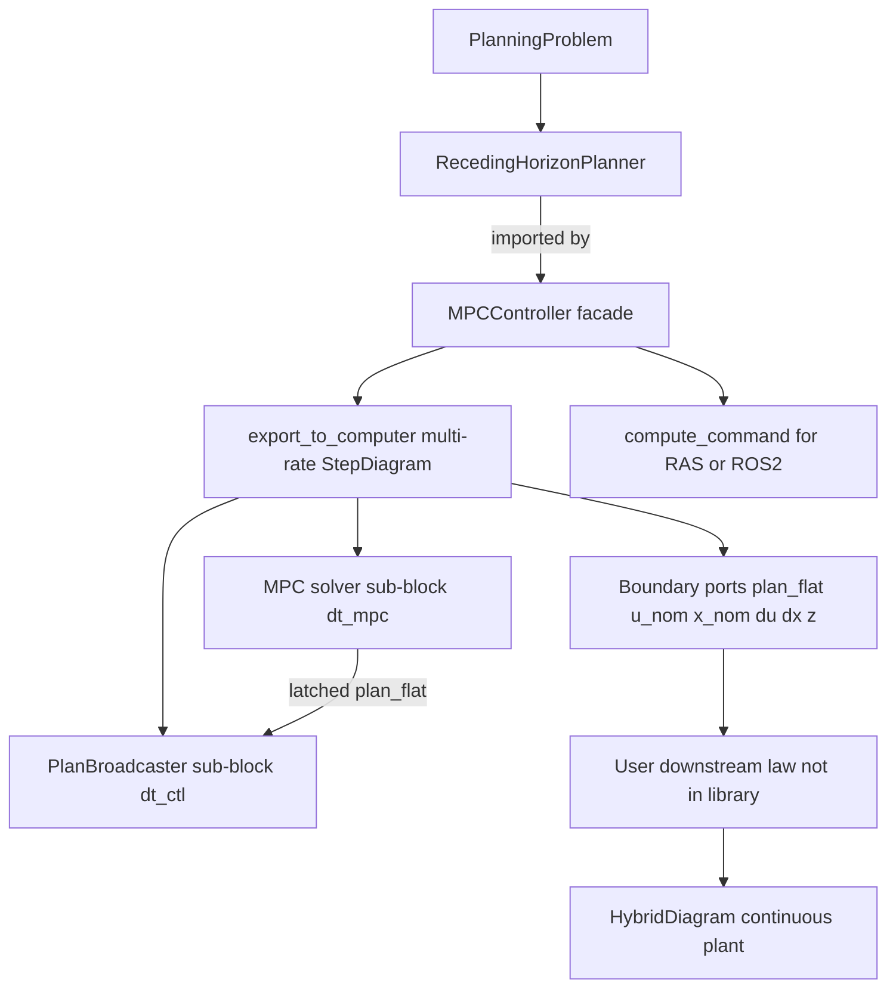
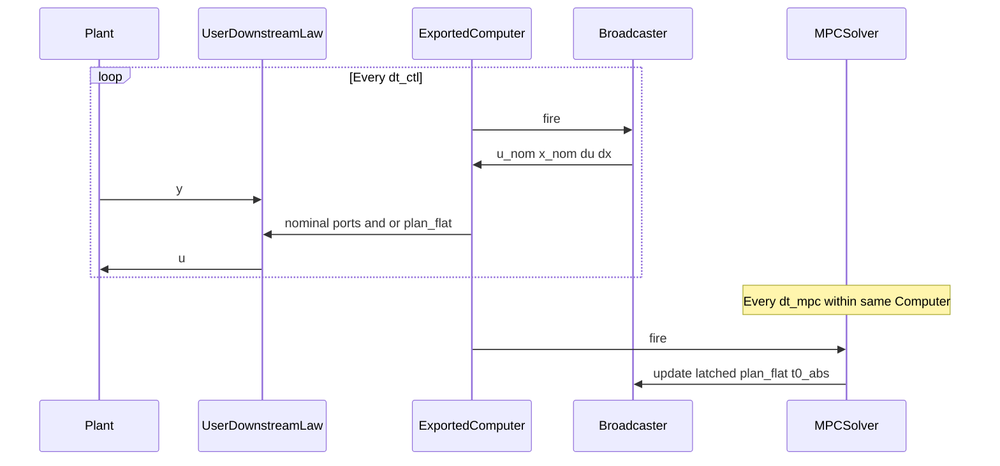

# MPC controller architecture (design only)

Status: draft plan (July 2026). No implementation in this phase.

Companion to [planning-pipeline-architecture.md](planning-pipeline-architecture.md):

| Plan | Focus |
| --- | --- |
| **A / B** ([planning-pipeline-architecture.md](planning-pipeline-architecture.md)) | PathPlan / PolicyPlan results; parametric scene NLP |
| **C** (this doc) | MPCController facade; multi-rate Computer export; plan broadcast exposure |

Implemented PoC contracts live in [DESIGN.md](../../DESIGN.md) (step/hybrid + Phase 6a–6b) and [ROADMAP.md](../../ROADMAP.md) §5.5 / §5.5a.

---

## Verdict on the PoC

Today’s shape is directionally right for Minilink, but the roles are blurred:

| Layer | Today | Smell |
| --- | --- | --- |
| NLP engine | [`MPCPlanner`](../../minilink/planning/mpc/planner.py) | Good — compile-once `prepare` / `step` |
| Diagram leaf | [`MPCStatelessController`](../../minilink/planning/mpc/controller.py) / [`MPCStatefulController`](../../minilink/planning/mpc/step_block.py) | Thin adapters hard-tied to `MPCPlanner`; export is a single-rate leaf |
| Latch / feedforward | [`MPCTickLatch`](../../minilink/planning/mpc/tick_latch.py) | Only slices `u_ff` / `x_ff` / `z` at MPC tick rate |
| Plan wire format | NLP `z` only | No standard Trajectory flatten/reconstruct for consumers |
| High-rate nominals | none | No bundled interpolator; callers cannot easily get `u_nom(t)` / `x_nom(t)` between solves |
| Deploy surface | none | No clocked tick API for a real node |
| Debug | `step_disp` + post-hoc overlays | No shared live debug mode across hand-loop / hybrid / node |

---

## Architectural decision (chosen)

**MPC is neither “only a planner” nor “only a control block.”** Use a layered split that matches Minilink’s Planner-vs-System law:



1. **`RecedingHorizonPlanner` (planner / tool)** — owns transcription, compile, `step(x0, warm_start=…) → PathPlan`. Lives under `planning/`. Not a `System`. `MPCPlanner` is the first implementation.

2. **`MPCController` (control facade)** — holds any receding-horizon path backend. Owns warm-start, latch, debug, last plan/metadata. **Single source** for hand loops, export, and real nodes.

3. **Multi-rate Computer export (chosen packaging)** — `export_to_computer` / `%` builds a **`StepDiagramSystem` + `StepSchedule`**, not a lone NLP leaf:
   - **Solver sub-block** fires at `dt_mpc` (warm-start `StepSystem` or cold static+latch)
   - **Broadcaster sub-block** fires at faster `dt_ctl` ([`StepSchedule.fire`](../../minilink/simulation/computer.py) divisors)
   - Broadcaster time-interpolates the latched drafted plan and exposes **nominal** ports
   - Boundary exposes **everything a downstream law needs**; Minilink does **not** ship FF/FB tracker blocks as the product of this work

4. **Thin single-leaf export (optional escape hatch)** — keep ability to export solver-only for demos that only want `u_ff` at MPC rate; default recommended path is the multi-rate bundle.

5. **Beginner path = `mpc @ plant`** — same mental model as `ctl @ plant` / `computer @ plant`. The facade carries schedule defaults and auto-wires a safe applied-`u` so the first working closed loop is one composition line (see C0). Advanced ports stay exposed; beginners need not name them.

**Not chosen:** embedding stabilizers / tracking laws in the MPC package.  
**Not chosen:** a separate user-facing downstream-law toolkit as a deliverable — only **exposure** (ports + codec + broadcaster inside the export).  
**Not chosen:** “any `Planner`” literally — require a receding-horizon path surface.  
**Not chosen:** continuous `DiagramSystem` hosting the NLP — NLP stays on the Computer; interpolation broadcasts on the faster Computer tick.

Default for “RAS”: generic `compute_command` + same `plan_flat` / nominal-eval helpers the broadcaster uses internally (aligns with future [`ros2.py`](../../ROADMAP.md) wrapping).

---

## C0. High-level UX — aim setup (defaults first)

**Goal:** textbook-short closed loop after the planner exists. Advanced multi-rate / `plan_flat` / custom laws remain available; they must not be required for the first hybrid demo.

### Aim call chain

```python
# 1) build PlanningProblem + prepare MPCPlanner (unchanged, expert content)
planner = MPCPlanner(problem, transcription=..., options=...)

# 2) wrap once — warm-start + multi-rate broadcast bundle by default
mpc = MPCController(planner, dt_mpc=0.1)

# 3) close the loop like any other digital controller
hybrid = mpc @ plant

hybrid.compute_trajectory(tf=..., x0_plant=..., plant_dt_inner=...)
```

Equivalents (same defaults under the hood):

```python
hybrid = mpc_closed_loop(mpc, plant)
# or
computer = mpc.export_to_computer()   # uses mpc.dt_mpc / mpc.dt_ctl defaults
hybrid = computer @ plant
```

`MPCController.__matmul__(plant)` must: apply default export → `export_to_computer(...)` → existing `Computer @ plant` / `hybrid_closed_loop` wiring (`y` ↔ measurement, applied `u` → plant `u`).

### Default policy (chosen)

| Knob | Default | Rationale |
| --- | --- | --- |
| `dt_mpc` | **required** on facade (or derived from transcription knot `dt` when unambiguous) | MPC rate is a control design choice |
| `dt_ctl` | `dt_mpc / 10` (or transcription knot `dt` if finer and divides evenly) | ctl-rate nominals without forcing another arg |
| Export | multi-rate **bundle** (`bundle=True`) | broadcaster included so `u_nom` exists |
| Warm-start | **on** (stateful solver sub-block) | matches today’s working hybrid demos |
| Applied `u` for `@` auto-wire | **`u_nom`** (ctl-rate ZOH of interpolated plan); fallback `u_ff` if broadcaster disabled | smoother than tick-only first-move; still pure FF |
| Fail-soft | hold last applied `u` when `success=0` (configurable) | safe beginner default |
| `x0_computer` | packed default warm-start from planner | `compute_trajectory` should not require calling `mpc_default_computer_x0` by hand |

Power users override: `MPCController(..., dt_ctl=..., applied_u="u_ff", warm_start=False)` or `export_to_computer(bundle=False)` / explicit `hybrid_closed_loop(..., computer_out="u_nom")`.

### What stays out of the one-liner

Building `PlanningProblem`, costs, transcription, and scene stays explicit (that *is* the planning work). The **composition** after `MPCController(...)` should feel as light as `ctl @ plant`.

Optional later sugar (non-blocking): `mpc_closed_loop(planner, plant, dt_mpc=...)` constructs the facade with defaults in one call — still no magic problem builder.

### Contrast with today’s PoC

```python
# Today (working but ceremony-heavy)
mpc = mpc_stateful_controller(planner, dt_mpc=MPC_DT)
computer = mpc % MPC_DT
hybrid = computer @ sys
# + manual x0_computer=mpc_default_computer_x0(planner)
```

```python
# Target aim
mpc = MPCController(planner, dt_mpc=MPC_DT)
hybrid = mpc @ sys
```

---

## Two-rate export model

| Rate | Sub-block | Role |
| --- | --- | --- |
| **`dt_mpc`** | MPC solver | One NLP → latch plan + `z` + metadata; write `plan_flat` |
| **`dt_ctl`** (faster) | Plan broadcaster | Interp latched plan at tick time → `u_nom`, `x_nom`, optional `du_nom`, `dx_nom` |



Canonical export sketch (explicit):

```python
computer = mpc.export_to_computer(dt_ctl=0.01, dt_mpc=0.1)
# StepSchedule(dt_base=0.01, fire={"mpc_solver": 10, "plan_broadcaster": 1})
hybrid = computer @ plant
# User wires: computer.u_nom / x_nom / plan_flat → their law → plant.u
# or simple demos: computer.u_ff >> plant.u
```

Aim sketch (defaults; see C0):

```python
hybrid = mpc @ plant  # export + hybrid_closed_loop; applied u defaults to u_nom
```

---

## Proposed contracts

### C1. Receding-horizon planner surface (duck-typed)

```python
planner.step(x_start, *, initial_guess=None, params=None) -> PathPlan
planner.decision_dimension / pack / unpack   # warm state
planner.problem.sys.n, .m
```

`PathPlan` (+ `SolveMetadata`) from improvement A in [planning-pipeline-architecture.md](planning-pipeline-architecture.md) when available. Until then, accept `Trajectory` + side-channel metadata.

### C2. `MPCController` facade (primary user object)

Owns: planner, `dt_mpc`, optional default `dt_ctl`, warm-start, latch, debug, last plan/metadata, **applied-`u` port name for `@`**.

| Method | Role |
| --- | --- |
| `step` / `compute_command` → `MPCCommand` | hand loop + RAS (plan-first) |
| `export_to_computer(dt_ctl=..., dt_mpc=..., *, bundle=True)` | **default**: multi-rate solver+broadcaster diagram |
| `__matmul__(plant)` / `mpc_closed_loop(mpc, plant)` | **aim path**: export with facade defaults → `hybrid_closed_loop` |
| `as_solver_block()` | raw solver leaf (escape hatch / tests) |
| `as_broadcast_bundle(...)` | explicit `StepDiagramSystem` before `as_computer` |
| `reset` / `last_*` / `plot_*` / `debug_*` | shared |
| default `x0_computer` helper | used by façade / traj API so aim demos skip manual packing |

`MPCCommand`: `plan`, `plan_flat`, `t0_abs`, `u_ff`, `x_ff`, `z`, `metadata`.

**Auto-wire for `@`:** resolve plant feedback as today’s hybrid rules (`y` in, `u` out) but source computer_out from facade `applied_u` defaulting to **`u_nom`** (then `u_ff` / `u`). Boundary still exposes `plan_flat`, `x_nom`, … for optional extra wires.
### C3. Boundary ports to expose (for any downstream law)

The **exported Computer** boundary must expose enough for feedforward **or** feedback without guessing:

| Port / signal | Rate | Purpose |
| --- | --- | --- |
| `y` (in) | sample / plant | measurement into solver (and available to user law) |
| `plan_flat` (out) | updates on MPC fire; held between | whole drafted plan via `PlanCodec` — reconstruct anytime |
| `u_nom` (out) | **ctl rate** | time-interp nominal input |
| `x_nom` (out) | **ctl rate** | time-interp nominal state |
| `du_nom` (out) | ctl rate | nominal input rate (when enabled) |
| `dx_nom` (out) | ctl rate | nominal state rate (model `f` preferred; else FD) |
| `u_ff` (out) | MPC hold or ctl | convenience first-move / knot-0 (simple FF demos) |
| `x_ff` (out) | MPC hold | next-knot / seed state |
| `z` (out) | MPC | warm-start / debug |
| `success` (out) | MPC hold | fail-soft gating for user laws |
| `t_plan` or `tau` (out, optional) | ctl | time within current horizon |

**Exposure principle:** Minilink ships the **reference generation surface**; the user (or a later separate PR) wires `u = π(u_nom, x_nom, y, …)`. No tracking / law factory is required in this architecture pass.

**Aim principle:** `mpc @ plant` auto-wires one applied channel (default `u_nom` → plant `u`) so beginners get a closed loop without reading this table; the full set remains for custom diagrams.

Auto-wiring remains: prefer facade `applied_u` (`u_nom` default), else `u`/`u_ff`; richer demos explicitly wire `x_nom` / feedback.

### C4. Real-pipeline (RAS / ROS) surface

Same information model as the exported Computer:

```python
cmd = mpc.compute_command(y_meas, warm_state=z_prev)
# publish cmd.plan_flat (+ metadata); high-rate side uses same eval helpers as broadcaster
ref = PlanBroadcaster.from_flat(cmd.plan_flat).evaluate(t_wall)
# user node: u = their_law(ref, y_meas)
```

Requirements: one NLP per MPC tick; high-rate path is interp-only; fail-soft hook; no plot libs on hot path.

### C5. Debug and observability

| Feature | Use |
| --- | --- |
| `debug` / levels | prints + plot hooks without code forks |
| `step_disp` | MPC-tick timings (keep) |
| `last_command` / plan history | closed-loop + node logs |
| Overlay `u_nom`/`x_nom` vs plant | catch interp / clock bugs |
| Static / dynamic horizon plots | tuning + closed-loop viz ([`mpc_animation_overlays`](../../minilink/planning/mpc/animation_overlays.py)) |
| Failure dump | last `z`, `plan_flat`, residuals |

### C6. `PlanCodec` + broadcaster (internal to export; also callable)

#### C6a. `PlanCodec`

Standard `pack` / `unpack` for the whole drafted plan (self-describing header + `t,x,u` payload). Round-trip required. **Not** NLP `z`. Used as the wire between solver → broadcaster and as the public `plan_flat` port.

Chosen layout (fixed, documented):

- Header: `n`, `m`, `N`, `t0_abs`, and time-grid description (`dt` or full `t` length)
- Payload: `t` (`N`), then flattened `x` `(n, N)`, then flattened `u` `(m, N)`
- Round-trip: `unpack(pack(plan)) == plan` (within float tolerance)
- Optional: `PlanCodec.view_shapes(plan_flat) → (n, m, N)`

#### C6b. Broadcaster sub-block (inside exported Computer)

- Input: latched `plan_flat` (+ absolute time basis from solver)
- On each **ctl** fire: evaluate at schedule time → `u_nom`, `x_nom`, optional `du_nom`, `dx_nom`
- Same evaluate helpers callable outside diagrams for RAS
- Horizon end policy: clamp / hold last knot (configurable)
- `dx`: prefer `f(x_nom, u_nom, t)` from planning model; `du`: FD/spline on `u` knots
- If model `f` unavailable, fall back to FD on `x` and mark `dx_source="fd"`

---

## Feature list by development phase

### P0 — Planner tuning

Prepare / `step`, inspect plan, `PlanCodec` round-trip, scene plots — no plant loop.

### P1 — Export surface validation

- Multi-rate `export_to_computer(dt_ctl, dt_mpc)` builds solver+broadcaster diagram
- Port inventory present; `plan_flat` unpack restores full plan
- Dense sample of `u_nom`/`x_nom` matches `Trajectory.resample` / knot interp
- `du_nom`/`dx_nom` sanity vs FD / `f`

### P2 — Closed-loop hybrid (user wires law)

- **Aim demo:** `mpc = MPCController(planner, dt_mpc=...); hybrid = mpc @ plant` (no manual `%` / `x0_computer` ceremony)
- Exported Computer `@` plant with full port inventory when diagramming explicitly
- Simple path: default applied `u_nom` (pure FF); override `applied_u="u_ff"` if desired
- Feedback path: **user** diagram block using exposed `x_nom`/`u_nom`/`y` (example in a demo script only — not a library law module as the goal)
- Warm-start parity; overlays; debug

### P3 — Deploy

`compute_command` + `plan_flat` publish; high-rate eval helpers shared with broadcaster; later `ros2.py`.

---

## Mapping to current code

| Current | Target |
| --- | --- |
| `mpc_stateful_controller` + `%` + `@` | `MPCController(...)` + `mpc @ plant` (same net hybrid) |
| `MPC*Controller` + `export_to_computer` | Facade export → multi-rate `StepDiagramSystem` (solver + broadcaster) by default |
| `MPCTickSolve` | `MPCCommand` + latched plan feeding broadcaster |
| Single `% MPC_DT` demos | Aim path uses facade defaults; explicit `%` / `export_to_computer(dt_ctl=..., dt_mpc=...)` still OK |
| Manual `mpc_default_computer_x0` | Facade supplies default computer `x0` for traj |
| `Trajectory.resample` | Interp backend for broadcaster |
| Downstream trackers | **Out of scope** as library; demos may show ad-hoc wiring |
| Package home | Stay in `planning/mpc/`; ROADMAP `control/mpc.py` obsolete or re-export note |

**Do not** force continuous `DiagramSystem` / `Simulator` to host the NLP leaf — keep hybrid + `Computer` as the MPC-rate path.

---

## Non-goals (this plan)

- Shipping a downstream control-law library (tracking, LQR-on-error, cascade helpers as products)
- Implementing the rewrite in this documentation pass
- Shooting MPC, acados binding, or ROS2 package
- Trajopt / MPC transcription merge (B8 in [planning-pipeline-architecture.md](planning-pipeline-architecture.md))
- NLP inside continuous `Simulator`
- Required `d²x/dt²` in v1

---

## Suggested implementation order

1. `PathPlan` / `SolveMetadata` (A) if needed for clean `MPCCommand`
2. `PlanCodec` + round-trip tests
3. Broadcaster leaf + evaluate helpers
4. `MPCController.export_to_computer` → multi-rate bundle (`StepSchedule.fire`) + default `dt_ctl` / warm-start / `x0_computer`
5. **`MPCController.__matmul__` / `mpc_closed_loop`** aim path (defaults → `hybrid_closed_loop`, applied `u_nom`)
6. Expose full boundary port set; keep solver-only escape hatch
7. Rewrite hybrid minimal demo to `mpc @ plant`; keep one explicit multi-rate diagram demo
8. Hand-loop / RAS `compute_command` aligned with same codec/eval
9. Debug overlays for nominals vs plant

---

## Decision summary

| Question | Decision |
| --- | --- |
| MPC = planner or control block? | **Both layers:** planner NLP + controller facade that exports diagram blocks |
| Import any planner? | **Receding-horizon path surface only** (not RRT/DP) |
| Default export? | **Multi-rate Computer**: solver @ `dt_mpc` + broadcaster @ `dt_ctl` |
| Beginner closed loop? | **`mpc @ plant`** with defaults (`dt_ctl`, warm-start, applied `u_nom`) |
| Baseline public artifact? | **Drafted plan** (`plan_flat` + reconstruct) and **ctl-rate nominals** |
| Ship FF/FB laws? | **No** — expose ports/info; users wire laws; aim path is pure FF `u_nom` |
| RAS / ROS? | Shared `compute_command` + codec/eval helpers; `ros2.py` later |
