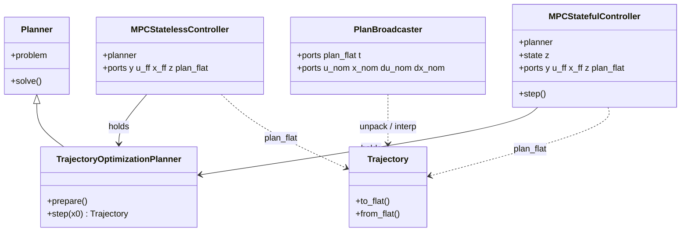
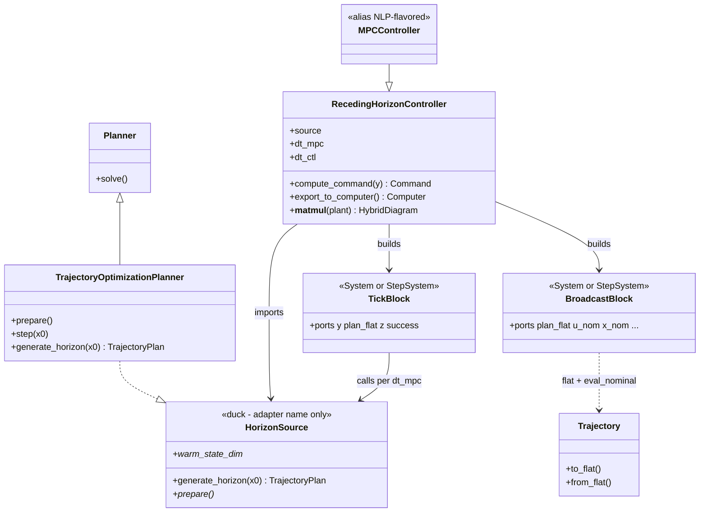
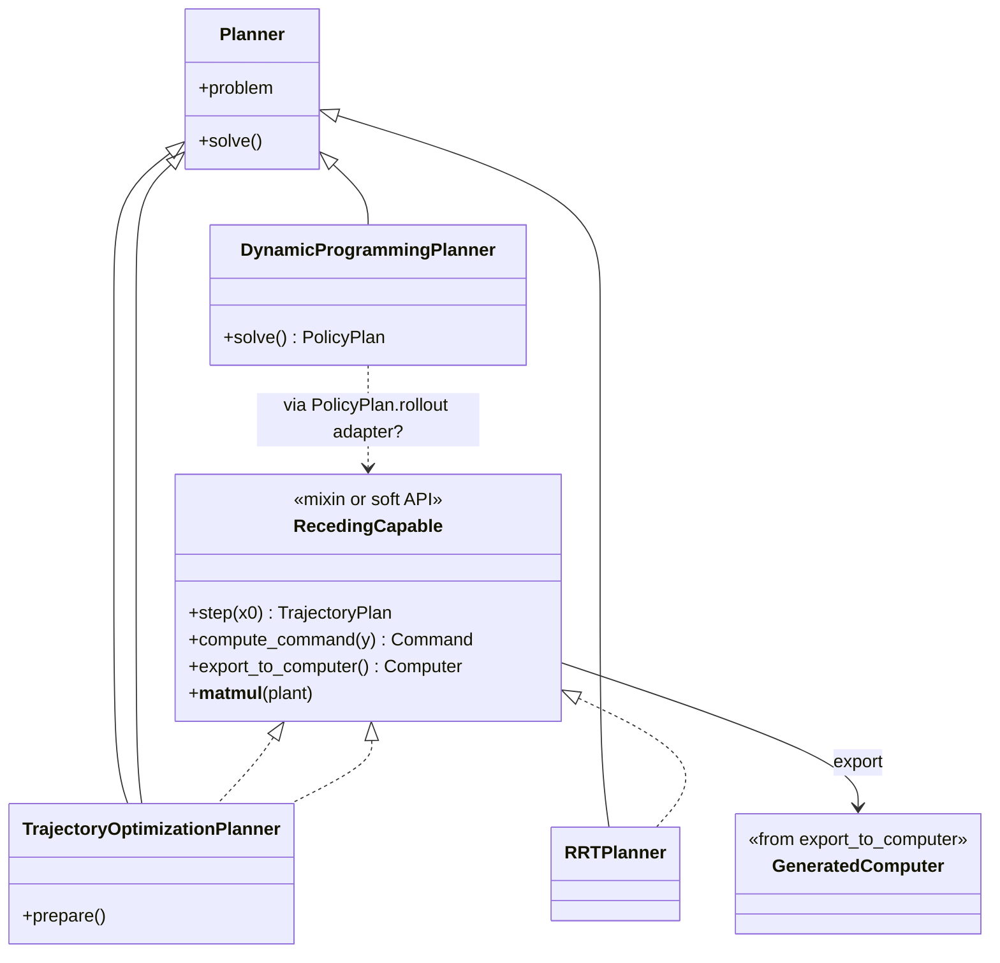
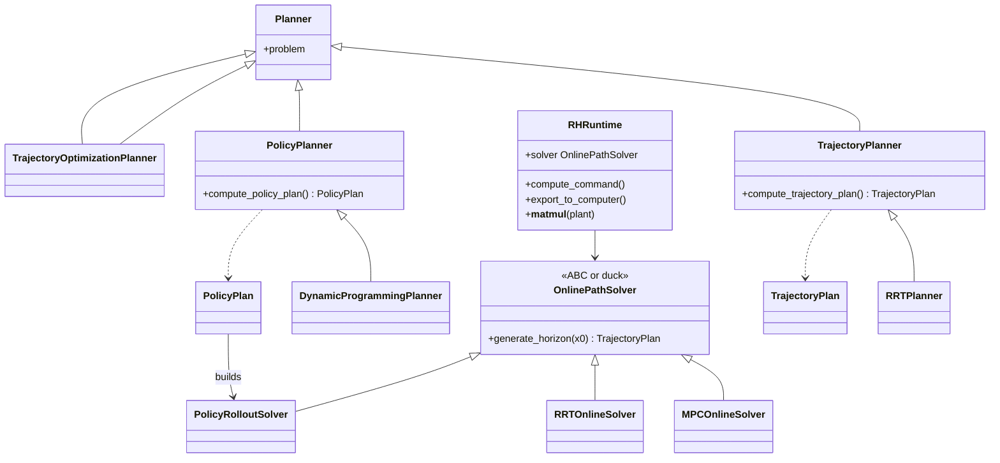

# MPC / receding-horizon architecture — requirements & brainstorm

Status: **approved requirements** (July 2026). Implementation plan (canonical):
[mpc-rh-refactor/](mpc-rh-refactor/) — [vision](mpc-rh-refactor/vision.md) +
[phases](mpc-rh-refactor/phases.md). Legacy pointer:
[receding-horizon-implementation-plan.md](receding-horizon-implementation-plan.md).
When this brainstorm differs, **mpc-rh-refactor wins** on names/API.

> **Decision Preamble:** Target **Option β** (facade + planner with
> `solve_trajectory_from`) for MPC / receding horizon. See
> [mpc-rh-refactor/phases.md](mpc-rh-refactor/phases.md): RH façade on today’s
> `MPCPlanner` first, then merge into parametric
> `TrajectoryOptimizationPlanner`; no separate `HorizonSource` type.
>
> *See [planning-pipeline-architecture.md](planning-pipeline-architecture.md) for
> `TrajectoryPlan` / parametric NLP background.*

Companion brainstorm: [planning-pipeline-architecture.md](planning-pipeline-architecture.md)
(planner I/O families, parametric NLP / scene). This doc focuses on **MPC /
closed-loop export / broadcast / deploy** requirements (R1–R12).

PoC baseline (what exists today): [DESIGN.md](../../DESIGN.md) step/hybrid +
Phase 6a–6b; code under [`minilink/planning/mpc/`](../../minilink/planning/mpc/).

### Document map

| § | Content |
| --- | --- |
| 1–3 | Why review; PoC gaps; open questions |
| 4 | Requirements **R1–R12** |
| 4b–4c | Minimal online plan-and-act loop; swappable backends; perception/`params` |
| 5 | Architecture options **α–δ** (class systems & contracts) |
| 6–9 | Sketches, phases, JAX, Planner contract |
| 10–13 | Consistency map; not decided; next steps; non-goals |

### Requirements at a glance

| ID | Summary |
| --- | --- |
| R1 | Static and/or stepping export; hybrid with continuous plant |
| R2 | RAS / deploy tick API |
| R3 | One source: tune → closed-loop → deploy |
| R4 | Baseline out = whole drafted plan |
| R5 | Expose ports for FF→FB; don’t ship law toolkit |
| R6 | Faster nominal broadcast `u_nom`/`x_nom`/(rates) |
| R7 | Standard plan flatten / reconstruct |
| R8 | Aim UX ≈ `mpc @ plant` with defaults |
| R9 | Shared debug (prints / plots / overlays) |
| R10 | Host NLP OK; plumbing stay JAX-traceable |
| R11 | Swappable `solve_from(x[, params])` backends |
| R12 | Runtime scene/cost/`params` inputs (perception); couple to plan B |

---

## 1. Why this review

The current MPC path is a **working proof of concept**. Roles were not designed
against a durable Minilink contract: planner vs control block vs export vs real
deploy. We need a **system-requirements** pass for an updated MPC / receding-horizon
(RH) system that one source of code can serve from **planner tuning → closed-loop
sim → real controller** (e.g. RAS / ROS-style node).

This document lists **requirements discussed**, **open questions**, and
**brainstorm sketches**. Prefer sketches labeled *idea* over *decision*.

---

## 2. PoC snapshot (facts, not solutions)

| Layer today | What it does | Gap vs desired |
| --- | --- | --- |
| `TrajectoryOptimizationPlanner` (parametric) | compile-once NLP; `solve_from(x0)` | Good kernel; hard-tied to “is the MPC system” in PoC |
| `MPCStatelessController` / `MPCStatefulController` | algebraic / warm-start leaves; `u_ff`/`x_ff`/`z` | Single-rate; only first-move slices; only specific planners |
| `MPCTickLatch` | one NLP per tick | No plan flatten port; no ctl-rate nominals |
| Hybrid demos | `mpc % dt` then `computer @ plant` | Ceremony-heavy vs aim `mpc @ plant` |
| Deploy / RAS | none | No clocked tick API aimed at a real node |
| Debug | `step_disp` + post-hoc overlays | No shared debug mode across hand-loop / hybrid / node |

---

## 3. Open architecture questions (must resolve later)

These are still **open**. Any sketch in §5–§8 is a candidate, not the answer.

1. **What *is* MPC in Minilink?**
   - Only a planner?
   - Only a control block (`System` / `StepSystem`)?
   - A planner that **exports** as a control block / Computer?
   - A controller object that **imports** a planner (or several planner kinds)?
   - Another type that can be exported both ways?

2. **Should “MPC” mean NLP-MPC only, or any receding-horizon drafted plan?**
   - Narrow: parametric NLP + hybrid export.
   - Broad: same **control loop** for trajopt / RRT / DP-rollout backends.
   - **Clarification:** “receding horizon” is a **loop pattern** (re-plan from
     current `x` each tick, apply action, repeat). It does **not** require a
     special RH planner class — repeatedly solving an ordinary
     `PlanningProblem` / trajopt each step is already that idea (often
     inefficient). A parametric `TrajectoryOptimizationPlanner` (compile-once, warm-start) is an
     **optimization**, not the definition of the concept.

   **Decision:** The former `MPCPlanner` class is officially deprecated and its capabilities are merged into `TrajectoryOptimizationPlanner`. Fast, compile-once behavior is now just a "parametric mode" of the generic planner. The overarching control block (`RecedingHorizonController`) will accept *any* generic planner, completely decoupling the control loop from the solver implementation.

3. **How does this couple to the global `Planner` contract?**
   - Keep one `Planner` ABC + split results (`TrajectoryPlan` / `PolicyPlan`)?
   - Add specialized subclasses / mixins / adapters?
   - What minimal “online tick” surface do closed-loop exporters need?

4. **Where do warm-start state, plan latch, and high-rate broadcast live?**
   - Inside planner? Facade? Diagram sub-blocks? Shared latch?

5. **Naming:** `MPCController` vs `RecedingHorizonController` vs export-only helpers.

---

## 4. System requirements (from discussion)

Requirements are **R-*** ids. They should survive whichever architecture we pick.

### R1 — Dual diagram export (sim)

The MPC / RH product must be usable as:

- a **static** (`n=0`) block when no optimizer warm state is needed, and/or
- a **stepping** (`StepSystem`) block when warm-starting the next optimization
  (decision vector or equivalent warm state on `Computer.x`),

and must connect to a **continuous plant** for hybrid simulation (today’s
`Computer @ plant` / `HybridDiagram` world).

### R2 — Real-pipeline surface (RAS / deploy)

Same source must expose methods suitable for wrapping in a **real control node**
(lab RAS, later ROS2, etc.) — not only Minilink hybrid sim:

- clocked tick API (measurement in → command / plan out)
- success / timing / fail-soft hooks suitable for deadlines
- no GUI imports on the hot path

*(“RAS” treated as generic real-time node; ROS2 is a planned thin wrapper later.)*

### R3 — One source, three phases

Same core code supports:

| Phase | Need |
| --- | --- |
| **Tune planner** | prepare / step / inspect plan / plot / cost fields / timing |
| **Closed-loop sim** | hybrid with plant; warm-start; overlays |
| **Deploy** | node tick + publish plan / nominals / metadata |

### R4 — Control outputs: drafted plan is baseline

Outgoing action options should not be limited to “first move u”.

**Baseline:** expose the **whole latest drafted trajectory** (flattened plan)
so any downstream law can reconstruct the horizon.

Also keep convenience slices (e.g. first-move / next-state) for simple FF demos.

### R5 — Exposure for any downstream law (do *not* ship the laws)

Do **not** prioritize building a library of trackers / FF-FB modes as the product.

**Do** expose ports and information so downstream can implement:

- pure feedforward
- plan hold
- feedback / tracking on nominals
- cascade / custom laws

from the **same** exported surface.

### R6 — Faster-than-MPC-tick nominal broadcast

Between MPC / RH ticks, support **time-dependent broadcast** of nominals at a
higher rate (or continuous eval):

- `u_nom(t)`, `x_nom(t)`
- if possible `du_nom(t)`, `dx_nom(t)`

Idea under discussion: the MPC / RH export is not a lone leaf — it may be a
**Computer / small diagram** that includes a **faster interpolating broadcast
sub-block** reading the latched plan.

### R7 — Standard flatten / reconstruct of the whole plan

Provide a **standard** method to pack the whole plan as a big array and unpack
it back to a trajectory-like object so:

- diagram ports can carry one vector
- middleware / RAS can publish one payload
- downstream blocks can reconstruct the full plan if they want

Brainstorm preference voiced in discussion: put flatten/inflate on
**`Trajectory`** (alongside `save`/`load`/`resample`) rather than inventing a
separate `PlanCodec` type — still open to refinement.

### R8 — Aim UX: easy high-level closed loop

Desire: super-easy high-level with defaults, roughly:

```text
mpc @ plant
```

after the planning problem / planner exists — same mental model as `ctl @ plant`,
without forcing users to assemble `% schedule`, multi-rate fire tables, and
manual computer `x0` by hand. Advanced ports remain available when needed.

### R9 — Debug / observability

Debug mode covering development phases:

- prints (timings, success) — keep/extend `step_disp`
- static plots (last horizon, cost fields, plant vs plan)
- dynamic / animation overlays (horizon history, nominals vs plant)
- failure dumps (last plan / warm state / residuals as available)

**Decision:** Observability hooks must remain **ROS-agnostic** and rely purely on native Minilink methods. The controller exposes telemetry (`get_solve_metadata()`, `get_nominal(t, include_derivatives)`) and fast dynamic update hooks (`update_animation(handles)`). Downstream deployment nodes (like ROS2) or debug scripts (`step_disp`) call these methods to handle actual logging and visualization without polluting the library core.

### R10 — JAX posture

- **Today’s SciPy (or host) NLP tick need not be JAX-traceable.**
- **Most surrounding math should stay full JAX-traceable** (native arrays /
  `xp`, no forced NumPy coercion) for the day a **full JAX NLP solver** exists:
  pack/unpack, nominal eval / derivatives, warm-start shift, parametric `J/h/g`
  already on the JAX path, etc.
- Prefer **not** a parallel public `JaxTraj` twin unless later evidence shows it;
  keep `Trajectory` as the NumPy reporting bag (DESIGN), and keep equation-path
  helpers xp-clean.

### R11 — Swappable online planning backends

Tools that can **solve a trajectory (or plan artifact) from the current measured
state** must be **swappable** inside the generic online plan-and-act algorithm
(§4b). The closed-loop product should not be hard-wired only to a specific planner.

Enforce / provide a clear shared surface (duck typing, adapter factory, or small
ABC — choice open) so trajopt, compile-once NLP-MPC, RRT, DP-rollout, etc. plug
into the **same** tick → latch → broadcast / apply path. See **§4b**.

### R12 — Runtime problem parameters (perception / scene / cost / feasibility)

Beyond \(x\), design the online loop for **time-varying planning parameters** —
especially obstacle avoidance from a **perception pipeline**:

- **Baseline (pure path tracking):** tick may need only \(y \approx x\); track /
  cost can be fixed at problem build.
- **Perception avoidance:** the online block needs **inputs** for obstacle /
  scene (or cost-shaping / feasibility) updates so each tick replans with a live
  environment.

Couples to [planning-pipeline-architecture.md](planning-pipeline-architecture.md)
§B (parametric scene, `ObstacleBank`, `ProblemParameters.scene`, bind without
re-JIT) and spatial **scene → cost / field** exports. Treat params as
**first-class tick inputs** now, not a retrofit. See **§4c**.

---

## 4b. Minimal “MPC-in-the-generic-sense” loop — core vs parameters

Discussion clarification: what is **necessary** for a planner type to sit in this
loop, versus what is just **problem parameterization**?

### The generic scheme (core)

At each control tick:

1. Read measurement \(x\) (or estimate).
2. Optionally read **runtime planning parameters** \(p\) (scene, cost, refs, …) —
   needed for perception avoidance; may be fixed/empty for pure tracking (§4c).
3. Solve a planning problem using \(x\) as start (and \(p\) when provided).
4. Obtain a drafted plan / applied \(u\).
5. Apply an action; repeat.

That is **feedback via online planning**. Naive re-solve of ordinary trajopt/RRT
with updated `x_start` already qualifies. Compile-once / warm-start are optional
efficiency.

### Swappable backends (R11) — enforce a common online surface

**Framework need:** anything that implements the minimal online surface is
**drop-in swappable** in this loop (same tick wiring, export, `compute_command`,
broadcast) without rewriting the closed-loop product.

```text
solve_from(x, *, params=None, warm_start=None) -> TrajectoryPlan
# interim: Trajectory + metadata OK
# adapter OK: refresh PlanningProblem.x_start (+ params), solve()
```

| Must for swap-in | Why |
| --- | --- |
| Accept current **\(x\)** as start | Loop core |
| Accept optional **`params`** for online problem data | R12 |
| Return drafted **path** (prefer) | R4 / broadcast |
| Same call shape across backends | Swappability |

| Backend | Meets surface how |
| --- | --- |
| Ordinary trajopt | Refresh `x_start` (+ params); re-solve each tick |
| Compile-once NLP-MPC | `step(x, scene_params=…)` / bind \(p\) |
| RRT / RRT\* | Replan from \(x\) (params may reshape clearance) |
| DP rollout | Roll out \(\pi\) from \(x\) |

Prefer documenting/enforcing this surface so “MPC block” means **online planning
loop**, not “only SciPy collocation.”

### Is “receding horizon” necessary?

**No — not for the generic scheme to work.**

| Term | Required for plan-and-act? |
| --- | --- |
| Online replan from current \(x\) | **Yes — core** |
| Finite sliding horizon \(T\) (“receding”) | **No** — common instance |
| Warm start / parametric NLP | Optional efficiency |
| First-move-only vs whole-plan apply | Optional application policy |

### Core vs problem parameters

| | Role |
| --- | --- |
| **Required each tick** | \(x\) (measurement); ideally a path out |
| **Problem parameters** (fixed or live) | Cost, feasibility/sets/obstacles, horizon \(T\), goal, **scene/perception**, refs |
| **Efficiency only** | Warm-start \(z\), compile-once NLP |

Changing only \(x\) is enough for the scheme to *be* feedback planning.
Updating cost shaping / feasibility from perception is **the same loop** with a
richer \(p\) — design for \(p\) early (R12), even when demos use Case A tracking.

**DP:** pure \(\pi(x)\) feedback is valid but not “solve a trajectory from \(x\)”
unless rolled out to a path.

### Naming implication

```text
OnlinePlanningLoop
  └─ swappable: solve_from(x, params=…)
       ├─ naive trajopt/RRT re-solve
       ├─ compile-once MPC NLP
       └─ DP rollout / …
```

---

## 4c. Runtime `params` & perception — couple to scene/cost wiring (R12)

### Why now

If the online block only inputs \(y \approx x\), obstacle avoidance from
**perception** has nowhere to enter. Tracking without obstacles can hard-code
the track at build time. Avoidance needs **online** obstacle → cost / feasibility
updates.

```text
perception / scene source --p (scene, cost shaping, …)--> online planning block
plant measurement         --y ≈ x ----------------------> online planning block
                                                     --> plan_flat, u_nom, …
```

### Two operating cases

| Case | Tick inputs | Problem data |
| --- | --- | --- |
| **A — Pure tracking** | \(y\) | Track / weights / horizon fixed at build (or static params) |
| **B — Perception avoidance** | \(y\) **+** perception/scene (or cost/feasibility) params | Structure fixed (e.g. max \(K\) obstacles); **numeric** centers/radii/`active` (or weights) update each tick |

Case A ⊂ Case B with empty/static scene.

### Link to planning-pipeline §B + spatial costs

[planning-pipeline-architecture.md](planning-pipeline-architecture.md) §B:

- `ProblemParameters.scene` / `SceneParameters`
- `ObstacleBank(K)` + `active` mask; JAX-traceable SDF
- Parametric bind \(p\) (scene, not only \(x0\)); soft costs first
- `TrajectoryOptimizationPlanner.solve_from(..., params=...)` without re-JIT

**This plan adds the closed-loop / block side:**

| Need | Notes |
| --- | --- |
| Diagram / RAS **inputs for \(p\)** | Named ports or packed param vector — TBD |
| Wire perception → online block | Same hybrid world as \(y\) |
| Backends use one `params` language | Prefer `ProblemParameters`-like bag; scene exports already become **costs / fields** |
| Reuse spatial scene→cost path | Runtime overrides on that path — not a parallel obstacle API |
| R10 | Param arrays stay xp-clean for future JAX NLP |

### Brainstorm: `params` bag

```text
params (tick) ~ ProblemParameters-like
  scene: centers, radii, active, …     # ObstacleBank
  cost: optional weight / bar overrides
  # x0 usually from y; may also appear explicitly
```

Tracking demo: no scene ports or `active=False`.  
Avoidance demo: perception fills bank → soft cost (later feasibility) each tick.

### Open questions (R12)

- Port shape: structured dict vs flat `p` vs many named ports
- Soft-cost-only v1 vs hard parametric feasibility (align with plan B)
- Naive backends: rebuild Scene/cost each tick vs true parametric bind
- RRT clearance consuming the same scene bag

---

## 5. Architecture options — class systems & contracts

Below are **candidate architectures** to address R1–R12. They are alternatives
to discuss, not a pick. Shared building blocks any option can reuse:

| Building block | Role | Notes |
| --- | --- | --- |
| `Trajectory.to_flat` / `from_flat` (idea) | R4, R7 wire | NumPy report / ports / RAS |
| `pack_horizon` / `eval_nominal` (idea) | R6, R10 | xp-native interp / rates |
| `solve_from(x, params=…)` surface (idea) | R11, R12 | Swappable online backends |
| Scene / `ObstacleBank` / parametric \(p\) (plan B) | R12 | Perception → cost/feasibility |
| `PlanningProblem` + `Planner` | offline orchestration | already exists |
| `TrajectoryPlan` / `PolicyPlan` (plan A) | typed results | draft elsewhere |

### How to read each option

For each: **class diagram (sketch)** → **key contracts (methods/ports)** →
**how it hits the requirements** → **tradeoffs**.

---

### Option α — Evolve the PoC leaves (planner + block twins)

Closest to today’s Phase 6a/6b. Grow ports and helpers; little new façade.



**Contracts (sketch)**

```text
TrajectoryOptimizationPlanner
  prepare()
  step(x0, *, initial_guess=None) -> Trajectory   # later TrajectoryPlan

MPC*Controller  (System | StepSystem)
  inputs:  y
  outputs: plan_flat, u_ff, x_ff, z [, success]
  export_to_computer(schedule) -> Computer        # single-rate replan

PlanBroadcaster  (System, user-wired)
  inputs:  plan_flat  (+ time via t / schedule)
  outputs: u_nom, x_nom [, du_nom, dx_nom]

# Aim closed loop stays hand-assembled:
#   computer = mpc % dt_mpc
#   # user wires broadcaster into a larger step diagram OR plant-side algebra
#   hybrid = computer @ plant
```

**Requirements fit**

| R | Fit |
| --- | --- |
| R1 | Strong if both leaf types kept |
| R2 | Weak unless methods duplicated on planner or a new free function |
| R3 | Partial — three APIs (planner / leaf / broadcaster) |
| R4–R7 | Addable (`plan_flat` + `Trajectory` flatten + broadcaster) |
| R8 | Weak — no single `mpc @ plant` object |
| R9 | Scattered |
| R10 | Helpers can stay xp-clean |
| R11 | Weak — still hard-tied to `TrajectoryOptimizationPlanner` |

**Tradeoffs:** smallest delta from PoC; hardest aim UX and multi-planner story;
users assemble multi-rate themselves.

---

### Option β — Receding-horizon facade + horizon source + bundled multi-rate export

User-facing **controller facade** imports something that can produce a path from
`x0` each tick; default export is a **tick + broadcast** Computer.

**Clarification (not a “must”):** this does **not** require a specialized
`RecedingHorizonPlanner` algorithm class. The tick can call an ordinary
`TrajectoryOptimizationPlanner.solve()` after updating `x_start`
(or an adapter that does that). That *is* still the RH / “plan-and-update”
idea — typically less efficient than compile-once parametric MPC, but valid.
“Horizon source” here is only a **name for the online tick adapter** (could
wrap a regular planner), not a claim that RH needs different math than
open-loop planning.



**Contracts (sketch)**

```text
# Duck-typed adapter — wrap TrajectoryOptimizationPlanner.step OR “re-solve PlanningProblem each tick”
HorizonSource
  generate_horizon(x0, *, params=None, warm_start=None) -> TrajectoryPlan
  prepare()?                  # optional (compile-once NLP); no-op for naive re-solve
  warm_state_dim -> int       # 0 if none
  default_warm_state()? 

# Equivalent naive adapter (valid loop):
#   apply params to PlanningProblem / Scene / cost; x_start = x0
#   TrajectoryPlan(planner.solve())

RecedingHorizonController / MPCController
  __init__(source, *, dt_mpc, dt_ctl=..., warm_start=..., applied_u=..., debug=...)
  compute_command(y, *, params=None, warm_state=None, t=None, k=None) -> Command
      Command: plan, plan_flat, u_ff, x_ff, z?, metadata
  export_to_computer(dt_ctl=None, dt_mpc=None, *, bundle=True) -> Computer
  __matmul__(plant) -> HybridDiagram
  as_stateless_block() / as_step_block()
  reset(), last_*, plot_*/debug_*

TickBlock
  inputs: y [, params / scene]
  outputs: plan_flat, z?, success, u_ff?, x_ff?
  # fires at dt_mpc; calls generate_horizon(y, params=…)

BroadcastBlock
  inputs: plan_flat (held)
  outputs: u_nom, x_nom [, du_nom, dx_nom] [, tau]

# Swappable backends (R11):
RRTPlanner.as_horizon_source() -> HorizonSource
TrajectoryOptimizationPlanner.as_horizon_source() -> HorizonSource
PolicyPlan.as_horizon_source(tf, dt) -> HorizonSource
TrajectoryOptimizationPlanner.as_horizon_source() -> HorizonSource
```

**Requirements fit**

| R | Fit |
| --- | --- |
| R1 | Bundle export + leaf escapes |
| R2 | `compute_command` first-class |
| R3 | One facade for tune/sim/deploy hooks |
| R4–R7 | `plan_flat` + broadcast built into default export |
| R5 | Ports exposed; no law library |
| R6 | Broadcast sub-block in default Computer |
| R8 | Strong — `mpc @ plant` |
| R9 | Natural home on facade |
| R10 | Tick may call host NLP; helpers xp-clean |
| R11 | HorizonSource adapters (incl. naive re-solve) |
| R12 | `params` / scene on tick + `compute_command` |

**Tradeoffs:** more new types; clearest separation of **replan** vs **broadcast** vs
**planner algorithm**; best path for R8/R11/R12. Naming (`MPC*` vs `RH*`) still open.
Does **not** force a special planning algorithm — only a place to put the loop.

---

### Option γ — Planner-centric export (planner *is* the product)

Push export / `@` / RAS onto the **planner** (or a mixin), minimize façades.
Blocks are thin generated views of the planner.



**Contracts (sketch)**

```text
Planner                          # offline: solve() as today

RecedingCapable  (mixin / convention)
  step(x0, ...) -> TrajectoryPlan
  compute_command(y, ...) -> Command
  export_to_computer(...) -> Computer   # may embed broadcast
  __matmul__(plant) -> HybridDiagram

# Aim:
hybrid = mpc_planner @ plant          # planner acts like controller
# or
hybrid = rrt_planner @ plant          # if RRT implements RecedingCapable

# DP stays awkward: either
policy = dp.solve()
hybrid = policy.as_horizon_source(...).export...   # still needs an object
# or policy.controller() @ plant for true feedback (not RH)
```

**Requirements fit**

| R | Fit |
| --- | --- |
| R1–R7 | Possible if mixin builds same multi-rate Computer |
| R2 | `compute_command` on planner |
| R8 | `planner @ plant` is very short — but overloads Planner role |
| R9 | Lives on planner — mixes offline orchestration with online runtime |
| R10 | OK for helpers |
| R11 | Forces every algorithm into RecedingCapable or special cases DP |

**Tradeoffs:** fewest named products for NLP-MPC demos; blurs textbook split
(“planners are tools, controllers are systems”); DP/RRT capability uneven;
harder dependency law (`search` may grow hybrid/export imports).

---

### Option δ — Formal planner subclass split + separate online runtime

Heavier structure: fork orchestrators by result family; online RH is a separate
runtime type that only accepts path-producing online solvers.



**Contracts (sketch)**

```text
TrajectoryPlanner.compute_trajectory_plan() -> TrajectoryPlan
PolicyPlanner.compute_policy_plan() -> PolicyPlan
PolicyPlan.rollout(x0, tf, dt) -> TrajectoryPlan
PolicyPlan.controller() -> System

OnlinePathSolver.generate_horizon(x0, ...) -> TrajectoryPlan

RHRuntime(solver, dt_mpc, dt_ctl, ...)
  # same export / @ / compute_command surface as Option β facade
```

**Requirements fit**

| R | Fit |
| --- | --- |
| R1–R10 | Same as β if `RHRuntime` matches the facade export story |
| R11 | Strong typing of path vs policy offline; online still needs adapters |
| Textbook | Clearer offline taxonomy; denser hierarchy (conflicts with “familiar patterns first” / plan A’s “no deep fork”) |

**Tradeoffs:** most explicit contracts; most ceremony and hierarchy; may fight
existing planning-pipeline draft (“keep one Planner ABC”). Consider only if
result wrappers alone feel too weak.

---

## 5b. Side-by-side comparison

| Concern | α PoC leaves | β Facade + source | γ Planner-centric | δ Class fork + runtime |
| --- | --- | --- | --- | --- |
| Delta from today | Smallest | Medium | Medium–large | Largest |
| Aim `… @ plant` | Weak | Strong (`mpc @ plant`) | Strong (`planner @ plant`) | Strong (`runtime @ plant`) |
| RAS `compute_command` | Bolt-on | First-class | On planner | On runtime |
| Default plan + broadcast | User wires | Bundled export | Bundled if mixin does | Bundled if runtime does |
| Multi-planner RH (R11) | Weak | Adapters | Uneven mixin | Explicit online solvers |
| Planner vs System law | Clear | Clear | **Blurred** | Clear but heavy |
| Aligns with plan A (one Planner ABC) | Yes | Yes | Yes (soft) | **No** (fork) |
| Risk | Stuck in ceremony | New façade type to learn | Wrong abstraction | Over-engineering |

**Shared open choices inside every option**

- Flatten home: `Trajectory` methods vs module helpers only  
- Default applied `u` for `@`: `u_nom` vs `u_ff`  
- Broadcast inside Computer vs continuous-side algebraic leaf  
- `MPCController` naming vs `RecedingHorizonController`  

---

## 5c. Discussion prompts (pick later)

1. Is **aim UX (R8)** valuable enough to justify a façade / runtime (β/δ) over α?
2. Is **importing RRT/DP into the same RH loop (R11)** a first-milestone need, or phase-2?
3. Do we accept **blurring Planner-as-controller (γ)** for shortness, or keep tools vs systems sharp (α/β)?
4. Does plan A’s “one Planner ABC” rule out δ, or is RH important enough to revisit that?
5. If naive “re-solve trajopt/RRT each tick” is enough for demos, how much specialize
   `TrajectoryOptimizationPlanner` vs treat it as one efficient backend among equals?

---

## 6. Brainstorm sketches (lighter ideas — still not fixed)

### 6.1 Layering one-liners (maps to options)

- **α:** Planner owns NLP; System leaves grow ports; user assembles broadcast.
- **β:** Facade imports horizon source; export = tick + broadcast Computer.
- **γ:** Planner gains `@` / export (mixin).
- **δ:** Path/Policy planner classes + separate `RHRuntime`.

### 6.2 Drafted-plan wire (R4, R7)

**Idea:**

```text
plan  →  flat vector  →  port / RAS payload  →  reconstruct plan
```

- Baseline public artifact = whole horizon, not only `u_ff`.
- Distinct from NLP decision vector `z` (warm-start / transcription-specific).
- Flatten API brainstorm: `Trajectory.to_flat` / `from_flat` (NumPy report);
  optional xp-native `pack_horizon` / `unpack_horizon` for traceable math (R10).

### 6.3 High-rate nominal broadcast (R6)

**Idea — two rates:**

| Rate | Role |
| --- | --- |
| `dt_mpc` (or replan period) | produce / latch latest plan |
| `dt_ctl` (faster) or continuous `t` | interpolate latched plan → `u_nom`, `x_nom`, optional rates |

**Derivative brainstorm:**

- `du`: FD / spline on input knots
- `dx`: prefer model `f(x_nom, u_nom, t)` when available; else FD

**Packaging brainstorm:** export builds a small step diagram + `StepSchedule.fire`
(multi-rate already exists on `Computer`) with a broadcast sub-block (esp. β/δ).

### 6.4 Downstream laws (R5)

**Requirement emphasis:** expose information, don’t ship the law library.

Minimum exposure brainstorm:

| Signal | Why |
| --- | --- |
| `plan_flat` | reconstruct whole plan |
| `u_nom`, `x_nom` | FF or tracking at ctl rate |
| `du_nom`, `dx_nom` | richer laws / filters |
| `u_ff`, `x_ff` | simple FF / seeds |
| `z` / warm state | warm-start & debug when applicable |
| `success` / metadata | fail-soft |

Auto-wire for aim demos may pick one applied `u` (e.g. `u_nom` or `u_ff`) —
exact default still open.

### 6.5 Aim closed loop (R8)

**Desire:**

```python
# after planner / problem exists
hybrid = mpc @ plant
```

Who is `mpc`? Option α: awkward. β: facade. γ: planner. δ: runtime.

### 6.6 Real node (R2)

**Idea:** same tick as the diagram latch:

```text
cmd = product.compute_command(y, warm_state=...)
# publish plan_flat / u / metadata; high-rate side evals nominals from latched plan
```

### 6.7 Debug (R9)

Shared debug flag / levels across hand-loop, hybrid, and node; overlays of
nominals vs plant; horizon history; keep timing prints.

---

## 7. Feature checklist by development phase (requirements view)

### P0 — Planner tuning

- [ ] Build problem + (prepare) planner
- [ ] Single / multi tick from `x0` with warm start where applicable
- [ ] Inspect full plan; flatten round-trip
- [ ] Plots / cost-field guides / timing
- [ ] Parametric scene / `params` tick inputs (R12); couple to ObstacleBank / plan B
- [ ] Swappable backend adapter smoke (trajopt re-solve and/or MPC step)

### P1 — Open-loop / export surface

- [ ] Flatten ↔ reconstruct whole plan
- [ ] Dense `u_nom`/`x_nom` (and rate) checks vs knot interp / `f`
- [ ] Multi-rate export sketch validated (if that packaging stays)

### P2 — Closed-loop Minilink

- [ ] Aim path toward `mpc @ plant` with defaults
- [ ] Warm-start parity vs hand loop
- [ ] User can wire FF **or** custom FB using exposed ports (demo only OK)
- [ ] Overlays + debug mode

### P3 — Deploy

- [ ] `compute_command` (or equivalent) for RAS/ROS wrap
- [ ] Publish drafted plan / nominals / metadata
- [ ] Fail-soft / deadline fields
- [ ] Later thin `ros2.py` (roadmap) — out of scope to implement here

---

## 8. JAX requirements (R10) — clarity

| Piece | Expectation |
| --- | --- |
| Host NLP (SciPy today) | Not required to be JIT/traceable |
| Pack / unpack / nominal eval / warm-start shift | Keep xp-clean / traceable |
| Parametric transcription / `J,h,g` on JAX path | Keep for future JAX NLP drop-in |
| `Trajectory` object | Remains NumPy reporting / I/O (DESIGN); don’t force it under `jit` |
| Parallel `JaxTraj` type | Avoid unless proven necessary |

Rule of thumb: **solver backend swappable later; horizon wire + broadcast math
should not freeze into NumPy-only APIs just because today’s NLP is host-side.**

---

## 9. Planner contract brainstorm (R11) — coupled review

### 9.1 Tension

See **§4b** for the generic loop vs RH specialization.

Calling raw `Planner.solve()` every control tick **does work** as a
plan-and-act loop if you refresh `x_start` (or equivalent) each time. That *is*
the core idea. Classic textbook MPC is “solve an open-loop problem from the
current state, apply an action, repeat” — often with a finite moving horizon,
but the **horizon itself is problem data**, not what makes feedback planning
work. Efficiency motivates compile-once / warm-start MPC.

Practical frictions today (API shape, not theory):

- RRT/trajopt bind start in `PlanningProblem` unless rebuilt/`replace` each tick
- DP returns a **policy table**, not a path unless you **roll out**
- Only `TrajectoryOptimizationPlanner.step(x0)` is shaped for cheap online use today

Adapters help UX — but **naive re-solve of a regular planner each tick remains
a valid backend**, and **changing only \(x\)** is enough for the scheme; cost,
sets, and \(T\) can stay fixed or can also vary as `params`.

### 9.2 Modes to keep distinct (brainstorm taxonomy)

| Mode | Meaning | Example |
| --- | --- | --- |
| **H1 — Horizon backend** | Each tick emit a drafted plan from `x0` | NLP-MPC step; RRT from `x0`; trajopt re-solve; DP **rollout** to a path |
| **H2 — Cascade / warm refine** | One tool proposes; another refines | RRT path → MPC/trajopt warm start |
| **H3 — Problem composition** | Offline artifact shapes online NLP | DP cost-to-go as terminal cost; track path as soft cost |

Closed-loop export (sim/RAS) cares first about **H1**. H2/H3 are valuable but
different API seams. Options β/δ make H1 a first-class import; α keeps it
inside `TrajectoryOptimizationPlanner` only; γ pushes H1 onto every planner unevenly.

### 9.3 Organization ideas (still open)

**Idea — keep one `Planner` ABC** (matches planning-pipeline draft A): shared
`PlanningProblem`; split **results** (`TrajectoryPlan` vs `PolicyPlan`); avoid deep
`TrajectoryPlanner`/`PolicyPlanner` class trees. (Favors α/β/γ over δ.)

**Idea — soft capabilities / adapters** instead of deep subclasses:

- `result_kind`: path vs policy
- `as_horizon_source(...)` or equivalent for things that can do H1
- DP online path into RH mainly via **`rollout(x0) → path`**, while true policy
  feedback stays `controller() @ plant`

**Idea — explicit online surface** the closed-loop product imports, e.g. duck
typing along the lines of “given `x0`, return a drafted path plan” — name TBD
(`horizon source`, `receding backend`, …). (Central to β.)

**Idea — package placement:** adapters near `planning/` core; NLP-MPC + export
bundle under `planning/mpc/`; avoid forcing `search/` / DP to import MPC
internals.

### 9.4 Open questions (Planner review)

- Exact names and whether mixins help or hurt textbook clarity
- Whether `PolicyPlan.rollout` is required before RH+DP demos
- How much RRT tree reuse belongs in v1 vs “replan every tick”
- Whether the user-facing closed-loop object is named MPC-only or RH-generic

---

## 10. Consistency map — conversation topics ↔ requirements

| What was asked | Where captured |
| --- | --- |
| Planner vs block vs export; import planners | §3, §5 options, §9 |
| Static + stepping export; hybrid with continuous plant | R1, §5 |
| RAS / real pipeline methods | R2, §6.6 |
| Debug plots / prints | R9, §6.7 |
| Phases: tune → closed loop → deploy, one source | R3, §7 |
| Flattened drafted plan as baseline out | R4, R7, §6.2 |
| Downstream FF→FB via **exposure**, not law toolkit | R5, §6.4 |
| Faster nominal `u(t)`,`x(t)` (+ rates); export may include broadcast sub-block | R6, §6.3 |
| Aim `mpc @ plant` with defaults | R8, §6.5 |
| Flatten on `Trajectory`? | §6.2 (preference, not lock) |
| JAX: NLP not traceable now; plumbing stay traceable for future JAX NLP | R10, §8 |
| RRT/DP/trajopt with RH; Planner contract / sub-contracts | R11, §4b, §9 |
| Minimal loop = solve from measured \(x\); RH not mandatory | §4b |
| Cost / feasibility / horizon as problem params, not loop core | §4b |
| Swappable `solve_from(x, params=…)` backends | R11, §4b |
| Perception → scene/cost params as tick inputs | R12, §4c |
| Couple to planning-pipeline §B / ObstacleBank | R12, §4c |

---

## 11. Explicitly *not* decided here

- Which of Options α / β / γ / δ (or a hybrid)
- Final class diagram / public names
- Exact `solve_from` / HorizonSource naming and enforcement style (duck vs ABC)
- Port shape for runtime `params` / scene (R12)
- Whether multi-rate Computer is the only export shape
- Default applied port (`u_nom` vs `u_ff`)
- Exact flatten layout / header
- Soft-cost-only vs hard parametric feasibility in v1 (align with plan B)
- ROS2 package, acados, shooting MPC, tracker library
- Updating DESIGN/ROADMAP in this brainstorm (doc-only for now)

---

## 12. Suggested next steps (process, not implementation commit)

1. Agree which **R-*** are must-have for the first rewrite milestone.
2. Prefer an architecture option (§5) — or say which requirements force β vs α.
3. Pick a **thin vertical slice** (e.g. flatten + nominal broadcast + aim `@`
   with NLP-MPC only) before multi-planner adapters.
4. Align with plan A (`TrajectoryPlan` / `PolicyPlan`) before locking RH import types.
5. Revisit §3 with the slice in hand — then write the real DESIGN contract.

---

## 13. Non-goals of *this* document

- Implementing the rewrite
- Freezing architecture as “the” Minilink MPC design
- Shipping downstream tracking controllers as a required deliverable
- Claiming maturity / ROADMAP checkboxes yet
