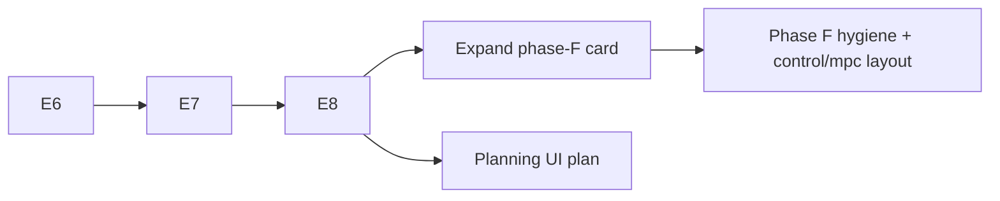

# Phase F — Post-refactor cleanup

**Status:** stub — **expand with a concrete task list only after [E8](phase-E8.md) is green**  
**Depends on:** E6–E8 complete (refactor finished before detail cleaning)  
**Do not start:** while E6–E8 are in flight — avoids churn on interim layout and PoC leftovers

## Goal

One hygiene pass after the MPC/RH refactor is **functionally done**. Prune merge
debt, sync docs with the landed product API, reduce demo duplication, and
**land the package layout below** — **without** changing contracts in
[vision.md](vision.md).

**Constructor / planner API UX** is **not** Phase F — see
[planning UI simplification](../planning-ui-simplification.md) (UI-1+).

---

## Parked layout (expand into F.1… after E8)

Captured from product review (July 2026). Do **not** implement until E8 is green;
this section becomes the numbered task list when F is expanded.

### Package home

Move the product MPC System family from `planning/mpc/` → **`control/mpc/`**.

- DESIGN §3: diagram **control laws** live in `control/`; `planning/` owns
  trajopt/search tools (`TrajectoryOptimizationPlanner`, parametric NLP stay
  under `planning/trajectory_optimization/`).
- Document a narrow DESIGN exception: `control/mpc` may import
  `planning.trajectory_optimization` (RH controller wraps a traj-family planner).
- Pre-1.0 hard cut: no lasting `planning.mpc` re-export; retarget all call sites
  in the same change.

### Target file structure (fewer files)

```text
minilink/control/mpc/
  __init__.py       # public API only
  controller.py     # fused product module (see below)
  warm_start.py     # guess / computer x0 helpers
  viz.py            # mpc_plans_from_rollout + mpc_animation_overlays
```

**Fuse into `controller.py`** (today’s scatter under `planning/mpc/`):

- `model_predictive_controller.py` — factory, mixin, `compute_command`, `@`, debug
- `controller.py` + `step_block.py` — algebraic / warm-start System backends
- `tick_latch.py`, `command.py`, `_block_common.py`

**Keep separate:** `warm_start.py` (demos + latch), `viz.py` (graphical / hybrid).

**Delete:** `planning/mpc/parametric_*.py` shims; then remove `planning/mpc/` entirely.

### Public import after F

```python
from minilink.control.mpc import ModelPredictiveController, Command, ...
```

### Also in F (hygiene categories)

| Category | Note |
| --- | --- |
| Test filenames | Rename `test_mpc_stateful/stateless_*.py` when retargeting imports |
| Docs | DESIGN package map, README import paths, mark old brainstorm docs historical |
| Demos | Dedup only when touching a file; preserve user-tuned constants (AGENTS.md) |

---

## When to expand this card

1. E6, E7, E8 gates pass on `dev-mpc-v2`.
2. Re-scan demos, tests, and plan docs against [vision.md](vision.md).
3. Turn **Parked layout** into numbered tasks (F.1 package move, F.2 fuse,
   F.3 retarget/delete, F.4 docs, F.5 gate) in a short expansion PR.

Until then, treat the parked layout as **intent**, not an active work order.

---

## Split of responsibility

| Phase F (hygiene + layout) | [planning-ui-simplification.md](../planning-ui-simplification.md) |
| --- | --- |
| Move MPC → `control/mpc`, fuse files, delete shims | Flat planner constructor kwargs |
| Doc and export alignment | Simulator-style defaults, tier-2 advanced path |
| Optional demo dedup helpers | README / DESIGN constructor examples |
| Test naming tidy-up | RRT / DP family alignment (UI-5 / UI-6) |

---

## Sequencing



UI work may run in parallel with F after E8; coordinate when the same demo or
README section is edited.

---

## Gate (phase exit)

```bash
ruff check . && ruff format --check .
pytest tests/unittest/test_model_predictive_controller.py \
       tests/unittest/test_mpc_*.py tests/unittest/test_planning_architecture.py -q

export MPLBACKEND=Agg SDL_VIDEODRIVER=dummy
python examples/scripts/hybrid/demo_mpc_hybrid_minimal.py
python examples/scripts/mpc/demo_dynamic_bicycle_rate_mpc_straight_line.py
```

---

## Non-goals

- Vision or planner ABC contract changes
- E6 / E7 / E8 feature work (stay in those cards)
- Implementing the parked layout before E8
- Physics-hiding presets or merging problem → planner → controller stages

---

## Exit

E8 green; F expanded and executed (including `control/mpc` layout); docs and
exports match product API; optional UI plan landed or scheduled per
[planning-ui-simplification.md](../planning-ui-simplification.md).
