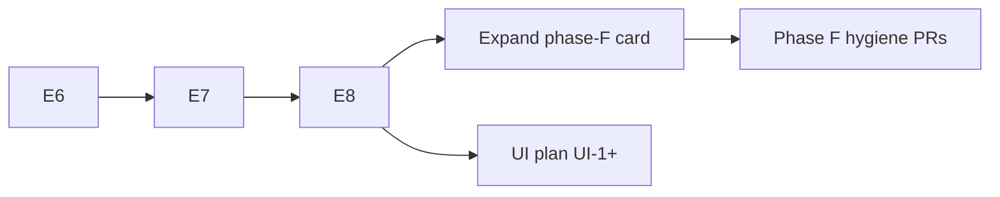

# Phase F — Post-refactor cleanup

**Status:** stub — **expand with a concrete task list only after [E8](phase-E8.md) is green**  
**Depends on:** E6–E8 complete (refactor finished before detail cleaning)  
**Do not start:** while E6–E8 are in flight — avoids churn on interim layout and PoC leftovers

## Goal

One hygiene pass after the MPC/RH refactor is **functionally done**. Prune merge
debt, sync docs with the landed product API, and reduce demo duplication —
**without** changing contracts in [vision.md](vision.md).

This card is a **generic guideline**. Specific file lists and rename maps are
written during the F expansion PR, once E8 gates are green and the tree is
stable.

**Constructor / planner API UX** is **not** Phase F — see
[planning UI simplification](../planning-ui-simplification.md) (UI-1+).

---

## When to expand this card

1. E6, E7, E8 gates pass on `dev-mpc-v2`.
2. Re-scan `minilink/planning/mpc/`, demos, tests, and plan docs against
   [vision.md](vision.md).
3. Replace the checklist below with numbered tasks (F.1, F.2, …) in a short
   expansion PR cited on the hygiene PR.

Until then, treat items below as **categories**, not committed work orders.

---

## Cleanup guidelines

| Category | Guideline |
| --- | --- |
| **Dead code** | Remove compat shims, unused modules, and duplicate logic left from E4 merge; no behavior change |
| **Public surface** | `mpc/__init__` and README match E5: product entry is `ModelPredictiveController` only |
| **Docs** | Plans and DESIGN agree with landed names; mark superseded brainstorm docs historical; fix broken paths |
| **Demos / notebooks** | Extract repeated scaffolding only when touching a file; preserve user-tuned constants and commented sections (AGENTS.md) |
| **Tests** | Rename or consolidate only when coverage stays the same; keep MPC + hybrid regression lists from [phases.md](phases.md) |
| **API ergonomics** | Defer to [planning-ui-simplification.md](../planning-ui-simplification.md) — not ad-hoc recipe layers |

**Principle:** finish the refactor first; clean against the **final** layout, not interim PoC internals.

---

## Split of responsibility

| Phase F (hygiene) | [planning-ui-simplification.md](../planning-ui-simplification.md) |
| --- | --- |
| Delete unused / compat code | Flat planner constructor kwargs |
| Doc and export alignment | Simulator-style defaults, tier-2 advanced path |
| Optional demo dedup helpers | README / DESIGN constructor examples |
| Test naming tidy-up | RRT / DP family alignment (UI-5 / UI-6) |

---

## Sequencing



UI work may run in parallel with F after E8; coordinate when the same demo or
README section is edited.

---

## Gate (phase exit)

Same bar as [phases.md](phases.md) baseline inventory:

```bash
ruff check . && ruff format --check .
pytest tests/unittest/test_model_predictive_controller.py \
       tests/unittest/test_mpc_*.py tests/unittest/test_planning_architecture.py -q

export MPLBACKEND=Agg SDL_VIDEODRIVER=dummy
python examples/scripts/hybrid/demo_mpc_hybrid_minimal.py
python examples/scripts/mpc/demo_dynamic_bicycle_rate_mpc_straight_line.py
```

Add phase-specific tests if E7/E8 introduce new smoke demos before expanding F.

---

## Non-goals

- Vision or planner ABC contract changes
- E7 / E8 feature work (stay in those cards)
- Detailed cleanup inventory before E8 (this stub stays generic until then)
- Physics-hiding presets or merging problem → planner → controller stages

---

## Exit

Refactor complete (E8 green); hygiene tasks executed from an expanded task
list; docs and exports match product API; optional UI plan landed or scheduled
per [planning-ui-simplification.md](../planning-ui-simplification.md).
