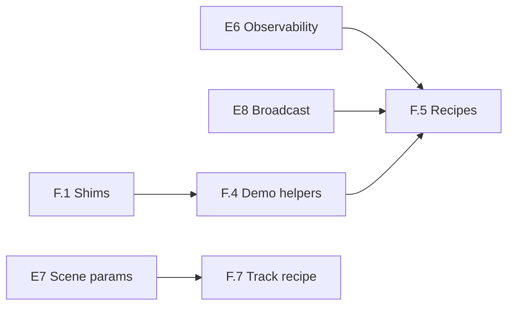

# Phase F — Post-refactor cleanup & beginner UX

**Status:** planning (expand before coding)  
**Depends on:** [E6](phase-E6.md)–[E8](phase-E8.md) green (functional contract complete)  
**Runs in parallel with:** E6–E8 implementation — inventory here; land code only after gates

## Goal

After E0–E5 the **product API is correct** but the **user ceremony is still
heavy**. Phase F is a deliberate simplify-and-prune pass:

1. Remove dead code and doc drift left from the MPC → TOP merge.
2. Deduplicate demo boilerplate without touching user-tuned constants.
3. Add a thin **recipe layer** so a simple MPC demo needs **one import**, not
   five option/transcription dataclasses.

F does **not** change the locked contracts in [vision.md](vision.md). Recipes
are orchestration sugar on top of `PlanningProblem` → `TrajectoryOptimizationPlanner`
→ `ModelPredictiveController`.

---

## Audit snapshot (`dev-mpc-v2` vs `main`)

~100 files, +5.5k / −1.6k lines. Structural wins already landed:

| Removed / merged | New / canonical |
| --- | --- |
| `mpc/planner.py` (`MPCPlanner`) | `TrajectoryOptimizationPlanner` + parametric compile |
| `mpc/transcription.py`, `mpc/options.py` | Transcription options on TOP path |
| PoC `mpc_*_controller` factories (public) | `ModelPredictiveController()` product factory |
| `compute_solution` | `Planner.solve()` + `TrajectoryPlan` |

Remaining pain is **ceremony** and **copy-paste**, not missing features.

---

## Cleanup inventory

### F.1 — Dead code & shims (low risk, do first)

| Item | Evidence | Action |
| --- | --- | --- |
| `mpc/parametric_program.py` | Compat re-export; **zero** in-repo imports | Delete; point docs at `trajectory_optimization.parametric_program` |
| `mpc/parametric_evaluator.py` | Same | Delete |
| Stale `MPCPlanner` strings | `phase-E1.md` title, `mpc-controller-architecture.md` §decision, `benchmarks/baselines/e4_trajopt_parity.json` notes | Editorial pass; mark historical sections |
| `receding-horizon-implementation-plan.md` | Superseded by this folder | Add banner “historical”; no new edits |

**Gate:** `ruff` + `pytest tests/unittest/test_mpc_*.py` unchanged.

### F.2 — Internal naming (medium risk)

E5 kept `MPCStatelessController` / `MPCStatefulController` as **private**
factory backends (`controller.py`, `step_block.py`). Names still read like
public API.

| Today | Proposed |
| --- | --- |
| `MPCStatelessController` | `_StatelessMpcBlock` (or merge into `model_predictive_controller.py`) |
| `MPCStatefulController` | `_StatefulMpcBlock` |
| `export_mpc_to_computer` error strings | Drop class names; say “stateless warm_start=False block” |

**Gate:** `test_mpc_stateless_controller.py`, `test_mpc_stateful_controller.py`,
`test_mpc_export_computer.py`, `test_model_predictive_controller.py`.

**Non-goal:** Renaming `ModelPredictiveController` (locked product name).

### F.3 — Test consolidation (optional, after F.2)

| Today | Proposal |
| --- | --- |
| `test_mpc_stateless_controller.py` | Fold port-compute paths into `test_model_predictive_controller.py` |
| `test_mpc_stateful_controller.py` | Same for warm-start / `z` state |
| Keep | `test_mpc_hybrid_*.py`, `test_mpc_planner.py`, `test_mpc_solve_trajectory_from.py` |

Only if duplication is obvious post-rename; do not shrink coverage.

### F.4 — Demo duplication (preserve tuning)

Repeated across **7+** bicycle MPC scripts and **2** notebooks (not identical —
preserve per-demo `TF`, gains, obstacle layouts, commented plots per AGENTS.md):

| Pattern | Copies | Extract to |
| --- | --- | --- |
| Rate-input bound setup (`W_REAR_MAX`, `DELTA_MAX`, dot limits) | 8 scripts | `examples/scripts/mpc/_bicycle_rate_limits.py` **or** recipe default |
| `rounded_rect_loop_waypoints` + `_quarter_arc_waypoints` | 4 scripts + 1 notebook | `minilink/planning/spatial/paths.py` (public) or `examples/scripts/mpc/_track_geometry.py` |
| Hand-loop RK4 substep driver (`MPC_DT`, `SIM_DT`, `compute_command`, ZOH) | straight-line + obstacle variants | `minilink/planning/mpc/hand_loop.py` — `run_zoh_hand_loop(mpc, plant_evaluator, …)` |
| Default quadratic weights for straight-line tracking | 3+ scripts | Recipe preset only; **do not** overwrite per-demo `Q`/`R` |

**Rule:** Shared helpers hold **structure**; demos keep **numbers** and
user edits.

### F.5 — Package surface polish

| Item | Action |
| --- | --- |
| `minilink/planning/__init__.py` | One-line module doc only today — after recipes land, export `bicycle_rate_mpc` (or `recipes`) |
| `planning-pipeline-architecture.md` | Update parametric paths from `mpc/parametric_*` → `trajectory_optimization/parametric_*` |
| README call chain | Add **recipe** one-liner beside explicit TOP stack ([vision “Aim UX”](vision.md)) |

---

## Beginner UX — recipe layer

### Problem (today)

Minimal hybrid demo still requires **five planning types**:

```python
from minilink.planning.problems import PlanningProblem
from minilink.planning.trajectory_optimization.direct_collocation import (
    DirectCollocationOptions,
    DirectCollocationTranscription,
)
from minilink.planning.trajectory_optimization.planner import (
    TrajectoryOptimizationOptions,
    TrajectoryOptimizationPlanner,
)
from minilink.planning.mpc import ModelPredictiveController
```

Scene demos add **6+** spatial imports. That is correct for **teaching**
(`demo_mpc_spatial_scene_guide.py`) but wrong for **“run my first MPC”**.

### Design principles (AGENTS.md)

- **Minimalist UX:** beginner path thin; transcription/optimizer complexity in
  orchestrators.
- **Two audiences:** recipes for students; explicit stack for library readers
  and notebooks.
- **Familiar patterns:** factory functions (`ModelPredictiveController`, `lqr`,
  `make_holonomic_problem`) — no new `Protocol` / metaclass machinery.
- **Docs are contract:** README gets the recipe hello-world; DESIGN keeps the
  explicit 2×2 planner contract.

### Proposed placement

```
minilink/planning/recipes/
  __init__.py          # re-exports
  mpc_bicycle.py       # rate-input JAX bicycle presets (first recipe)
```

Optional later: `recipes/trajopt_cartpole.py`, `recipes/rrt_holonomic.py` —
**out of scope for F.0**.

### Proposed record (transparent, not a black box)

Simple `dataclass` (repo already uses dataclasses for `TrajectoryPlan`,
`TrajectoryOptimizationOptions`):

```python
@dataclass
class MpcBicycleStack:
    """Named handles for a compile-once bicycle MPC stack."""

    problem: PlanningProblem
    planner: TrajectoryOptimizationPlanner
    controller: System | StepSystem   # ModelPredictiveController product

    def hybrid(self, plant=None, *, plant_dt_inner=0.01, compile_backend="jax"):
        """``controller @ plant`` with sensible ``x0_computer`` when warm_start."""
        ...
```

Users who need to tweak transcription still reach `.planner.transcription`.

### Proposed factories (sketch)

```python
# minilink/planning/recipes/mpc_bicycle.py

def bicycle_rate_mpc_stack(
    sys=None,
    *,
    x0=None,
    u_target=4.0,
    horizon=2.0,
    mpc_hz=5.0,
    n_steps=20,
    warm_start=True,
    compile_backend="jax",
    optimizer_method="scipy_slsqp",
    optimizer_options=None,
    cost_weights=None,   # optional override; default straight-line preset
) -> MpcBicycleStack:
    """PlanningProblem + TOP + ModelPredictiveController for rate-input bicycle."""
    ...

def bicycle_rate_mpc_hybrid(
    sys=None,
    *,
    tf_sim=5.0,
    plant_dt_inner=0.01,
    **stack_kw,
) -> HybridDiagram:
    """One-call closed loop: stack + ``mpc @ plant``."""
    ...
```

**Target hello-world** (README + `demo_mpc_hybrid_minimal.py` optional slim
variant):

```python
from minilink.planning.recipes import bicycle_rate_mpc_hybrid

hybrid = bicycle_rate_mpc_hybrid(tf_sim=5.0, mpc_hz=5.0)
hybrid.compute_trajectory(tf=5.0)
hybrid.animate()
```

Explicit stack remains documented for notebooks and
`demo_dynamic_bicycle_rate_mpc_straight_line_trajopt.py` (per-tick rebuild
teaching).

### What recipes must not hide

| Stay explicit in teaching path | OK inside recipe default |
| --- | --- |
| `Scene`, `ReferenceTrack`, obstacle banks | Straight-line / default stadium |
| `compile_parametric_program` call | Auto via `validate_mpc_planner` |
| `params` / E7 scene binds | Reject until E7; recipe passes `params=None` |
| Hand-loop vs hybrid choice | Recipe offers both entry points |

### Hand-loop recipe

```python
def run_bicycle_rate_hand_loop(
    stack: MpcBicycleStack,
    *,
    tf_sim,
    sim_hz=200.0,
    plant_mismatch=None,
) -> Trajectory:
    """ZOH plant integration between ``compute_command`` ticks."""
```

Moves ~40 lines out of each hand-loop demo; overlays stay in demo.

---

## Sequencing

| Step | Work | Can start when |
| --- | --- | --- |
| **F.0** | Expand this card; link from [phases.md](phases.md) | Now (parallel) |
| **F.1** | Delete parametric shims; doc drift pass | E5 green (now) |
| **F.2** | Private block rename | E5 green |
| **F.3** | Test fold (optional) | After F.2 |
| **F.4** | Shared demo geometry / hand-loop helper | E3 green (now); land with care |
| **F.5** | `recipes/mpc_bicycle.py` + README hello-world | E6 green (telemetry stable) |
| **F.6** | Slim `demo_mpc_hybrid_minimal.py` variant or comment block showing recipe | After F.5 |
| **F.7** | Scene/track recipe (`bicycle_rate_mpc_track_hybrid`) | After E7 if scene `params` needed |



---

## Gate (phase exit)

```bash
ruff check . && ruff format --check .
pytest tests/unittest/test_model_predictive_controller.py \
       tests/unittest/test_mpc_*.py tests/unittest/test_planning_architecture.py -q

# Recipe smoke (add when F.5 lands)
python -c "from minilink.planning.recipes import bicycle_rate_mpc_hybrid; bicycle_rate_mpc_hybrid(tf_sim=1.0)"

export MPLBACKEND=Agg SDL_VIDEODRIVER=dummy
python examples/scripts/hybrid/demo_mpc_hybrid_minimal.py
python examples/scripts/mpc/demo_dynamic_bicycle_rate_mpc_straight_line.py
```

---

## Non-goals (F)

- Second product controller name or `MPCController` alias.
- Merging `TrajectoryOptimizationOptions` / `DirectCollocationOptions` into
  one mega-dataclass (recipes **compose** them, do not replace).
- Rewriting spatial teaching notebook step-by-step pedagogy.
- ROS2 / external deploy nodes (E6 scope).
- Auto-migrating all demos to recipes — **one** flagship hello-world switch
  plus optional slim variant; others keep explicit imports for teaching.

---

## Open questions (user architectural review)

1. **Recipe home:** `planning/recipes/` vs `examples/catalog/` for
   demo-only presets? Preference: `planning/recipes/` if used in README
   contract; `examples/` if demo-local only.
2. **Track geometry:** promote `rounded_rect_loop_waypoints` to
   `planning/spatial/paths.py` or keep under `examples/scripts/mpc/_*`?
3. **Hand-loop helper:** public `planning.mpc.hand_loop` vs private
   `examples` helper? Public if notebooks import it.

Mark decisions in this card before F.5 coding.
