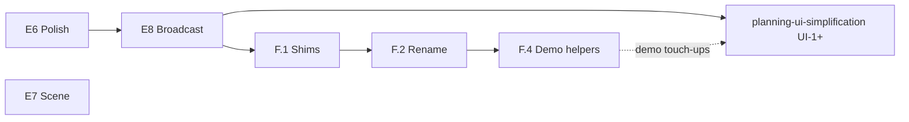

# Phase F — Post-refactor cleanup

**Status:** planning (expand before coding)  
**Depends on:** [E6](phase-E6.md)–[E8](phase-E8.md) green (functional contract complete)  
**Runs in parallel with:** E6–E8 — inventory and low-risk items here; land after gates

**API / constructor UX:** **not in this card.** Flat planner kwargs, Simulator-style
defaults, and planner-family alignment live in the standalone
[planning UI simplification plan](../planning-ui-simplification.md). Phase F
handles **prune, rename, dedup, and doc hygiene** after E0–E5; UI work follows
that plan (UI-1+), typically in the same post-E8 window.

---

## Goal

E0–E5 delivered the correct product stack on `dev-mpc-v2`. Phase F is the
**hygiene pass**: remove merge leftovers, align internal names with E5 intent,
deduplicate demo scaffolding, and fix stale docs — **without** changing locked
contracts in [vision.md](vision.md).

| In Phase F | In [planning-ui-simplification.md](../planning-ui-simplification.md) |
| --- | --- |
| Delete compat shims | Flat `TrajectoryOptimizationPlanner` kwargs |
| **Delete** `controller.py` / `step_block.py`; private `_MpcBlock` impl | Default `transcription`, tier-2 `options=` |
| Shared track geometry / hand-loop helpers | RRT / DP family alignment (UI-5 / UI-6) |
| Stale `MPCPlanner` doc strings | README / DESIGN constructor examples |
| Test file consolidation | — |

---

## Audit snapshot (`dev-mpc-v2` vs `main`)

~100 files, +5.5k / −1.6k lines. Structural wins already landed:

| Removed / merged | New / canonical |
| --- | --- |
| `mpc/planner.py` (`MPCPlanner`) | `TrajectoryOptimizationPlanner` + parametric compile |
| `mpc/transcription.py`, `mpc/options.py` | Transcription on TOP path |
| PoC `mpc_*_controller` factories (public) | `ModelPredictiveController()` product factory |
| `compute_solution` | `Planner.solve()` + `TrajectoryPlan` |

Remaining work is **debt and duplication**, not missing MPC features.

---

## F.1 — Dead code & shims (low risk; can start after E5)

| Item | Evidence | Action |
| --- | --- | --- |
| `mpc/parametric_program.py` | Compat re-export; zero in-repo imports | Delete; docs → `trajectory_optimization.parametric_program` |
| `mpc/parametric_evaluator.py` | Same | Delete |
| Stale `MPCPlanner` strings | `phase-E1.md` title, `mpc-controller-architecture.md`, `benchmarks/baselines/e4_trajopt_parity.json` | Editorial pass; mark historical |
| `planning-pipeline-architecture.md` | Links `mpc/parametric_*` | Update paths to `trajectory_optimization/parametric_*` |
| `receding-horizon-implementation-plan.md` | Superseded by this folder | Banner “historical”; no new edits |

**Gate:** `ruff` + `pytest tests/unittest/test_mpc_*.py` unchanged.

**Coordination:** land before or with [UI-2](../planning-ui-simplification.md#ui-2--documentation--flagship-demo) so README does not reintroduce deleted paths.

---

## F.2 — Retire PoC implementation modules (medium risk)

E5 removed `MPCStatelessController` / `MPCStatefulController` from **`mpc/__init__`
and demos** — the product surface is only `ModelPredictiveController`. Those
PoC **names and files should not remain** as a second “controller family” in
the codebase; they are leftover implementation split, not a public contract.

**What still exists today (internal only):**

| File | Class | Role |
| --- | --- | --- |
| `controller.py` | `MPCStatelessController` | `warm_start=False` → `System` ports |
| `step_block.py` | `MPCStatefulController` | `warm_start=True` → `StepSystem` + packed `z` |

`ModelPredictiveController()` imports these and returns one or the other. Tests
already go through the factory (`test_mpc_stateless_controller.py` names are
legacy only).

**Why two implementations can stay (privately):** minilink needs different
bases — algebraic `System` vs discrete-state `StepSystem` for warm-start.
**What must go:** PoC module names, separate `controller.py` / `step_block.py`
as if they were product types.

**Proposed F.2 work:**

| Step | Action |
| --- | --- |
| F.2.1 | Move implementations into `model_predictive_controller.py` (or single `mpc/_blocks.py`) as `_StatelessMpcBlock` / `_StatefulMpcBlock` — leading underscore, no “Controller” in public-facing names |
| F.2.2 | Delete `controller.py` and `step_block.py` |
| F.2.3 | Update `_block_common.py` docstrings / errors to refer to warm-start mode, not PoC class names |
| F.2.4 | Optionally rename tests to `test_mpc_warm_start_false.py` / `test_mpc_warm_start_true.py` or fold into `test_model_predictive_controller.py` (see F.3) |

**Non-goals:** Merging `System` and `StepSystem` paths into one class; renaming
`ModelPredictiveController` (locked product name).

**Gate:** `test_mpc_stateless_controller.py`, `test_mpc_stateful_controller.py`,
`test_mpc_export_computer.py`, `test_model_predictive_controller.py`,
`test_mpc_hybrid_*.py`.

---

## F.3 — Test consolidation (optional, after F.2)

| Today | Proposal |
| --- | --- |
| `test_mpc_stateless_controller.py` | Fold into `test_model_predictive_controller.py` or rename to warm-start-mode tests |
| `test_mpc_stateful_controller.py` | Same |
| Keep separate | `test_mpc_hybrid_*.py`, `test_mpc_planner.py`, `test_mpc_solve_trajectory_from.py` |

Do not shrink coverage; skip if module collapse (F.2) already forces test renames only.

---

## F.4 — Demo & notebook scaffolding (preserve user tuning)

Repeated across **7+** bicycle MPC scripts and notebooks. Per AGENTS.md:
**shared structure only** — each demo keeps its `TF`, gains, obstacle layouts,
commented plots, and manual edits.

| Pattern | Copies | Extract to |
| --- | --- | --- |
| Rate-input bound setup (`W_REAR_MAX`, `DELTA_MAX`, dot limits) | 8 scripts | `examples/scripts/mpc/_bicycle_rate_limits.py` or shared helper module |
| `rounded_rect_loop_waypoints` + `_quarter_arc_waypoints` | 4 scripts + spatial notebook | `examples/scripts/mpc/_track_geometry.py` (demo-local first; promote to `spatial/paths` only if notebooks need import) |
| Hand-loop RK4 substep driver | straight-line / obstacle variants | `minilink/planning/mpc/hand_loop.py` — `run_zoh_hand_loop(mpc, plant_evaluator, …)` |

**After [UI-2](../planning-ui-simplification.md):** migrate flagship demos to flat
TOP constructor when touching files — do not bulk-rewrite untouched demos.

**Teaching exceptions (keep as-is):**

- `demo_dynamic_bicycle_rate_mpc_straight_line_trajopt.py` — per-tick rebuild reference
- `demo_mpc_spatial_scene_guide.py` / notebook — explicit spatial pipeline

---

## F.5 — Package & index hygiene

| Item | Action |
| --- | --- |
| `minilink/planning/mpc/__init__.py` | Confirm exports match E5 card; no resurrected PoC factories |
| `docs/plans/README.md` | Row for [planning-ui-simplification.md](../planning-ui-simplification.md) |
| ROADMAP MPC bullet | Point hygiene + UI plan when maturity text changes |

---

## Sequencing



| Step | When |
| --- | --- |
| **F.1** | After E5 (now) or with E8 doc pass |
| **F.2** | After F.1 |
| **F.3** | Optional after F.2 |
| **F.4** | After E8; coordinate with UI-2 demo edits |
| **UI-1+** | Per [planning-ui-simplification.md](../planning-ui-simplification.md); not blocked by F.4 |

---

## Gate (phase exit)

```bash
ruff check . && ruff format --check .
pytest tests/unittest/test_model_predictive_controller.py \
       tests/unittest/test_mpc_*.py tests/unittest/test_planning_architecture.py -q

export MPLBACKEND=Agg SDL_VIDEODRIVER=dummy
python examples/scripts/hybrid/demo_mpc_hybrid_minimal.py
python examples/scripts/mpc/demo_dynamic_bicycle_rate_mpc_straight_line.py
```

---

## Non-goals (Phase F)

- Changing vision contracts (`PlanningProblem`, 2×2 `Planner`, `ModelPredictiveController`)
- Recipe layers or hidden physics presets (see UI plan principle: ceremony not structure)
- `ModelPredictiveController(problem, ...)` convenience ctor
- E7 scene `params` or E8 broadcast implementation (stay in E7 / E8 cards)

---

## Suggested PR slicing

| PR | Contents |
| --- | --- |
| PR-F1 | F.1 shims + doc path fixes |
| PR-F2 | F.2 collapse PoC modules into private blocks + delete `controller.py` / `step_block.py` |
| PR-F3 | F.4 demo helpers (optional F.3 test fold) |
| PR-UI-* | Per [planning-ui-simplification.md](../planning-ui-simplification.md) — separate from F unless same demo file |

---

## Exit

Repo is free of MPC-merge shims and PoC-name drift; private blocks read internal;
demo duplication reduced without overwriting user tuning; constructor UX tracked
in [planning-ui-simplification.md](../planning-ui-simplification.md).

Next after F: maintain E6–E8 cards; UI land per UI plan.
