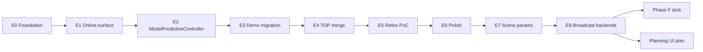

# Phases — E0–E8 overview

Contracts live in [vision.md](vision.md). This file owns **order, gates, and
PR slicing**. Expand the active phase card before coding.

Do not start the next phase until that phase’s gate is green unless noted.

Branch: **`dev-mpc-v2`** (hybrid + MPC controllers present; same full stack as
`dev-alex` when the vision locked).

## Baseline inventory (must keep working)

**Hybrid MPC demos** — primary closed-loop regression:

| Demo | Role |
| --- | --- |
| `examples/scripts/hybrid/demo_mpc_hybrid_minimal.py` | Flagship — **on** `ModelPredictiveController` + `mpc @ plant` |
| `examples/scripts/hybrid/demo_mpc_hybrid_track_lap.py` | Richer hybrid + scene — **on** product API (script); notebook may lag |

**MPC hand-loop demos** — keep green:

| Demo | Role |
| --- | --- |
| `demo_dynamic_bicycle_rate_mpc_straight_line.py` | **On** `compute_command` (product warm-start) |
| `demo_dynamic_bicycle_rate_mpc_closed_loop_lap.py` | Full closed-loop lap — **on** `compute_command` (E5) |
| Obstacle / stadium / wide / multi-obstacle | **on** `compute_command` (E5) |
| `demo_mpc_spatial_scene_guide.py` | Teaching / scene API |
| `demo_dynamic_bicycle_rate_mpc_straight_line_trajopt.py` | Per-tick trajopt reference (keep as reference) |

**Hybrid tip:** `compute_trajectory` defaults to `compile_backend="numpy"`.
Fine `plant_dt_inner` with that default makes plant rollout dominate wall
time; JAX plants should pass `compile_backend="jax"` (see hybrid demos).

**Tests** — gate whenever touching `Planner` / MPC / hybrid:

| Area | Tests |
| --- | --- |
| MPC NLP | `tests/unittest/test_mpc_planner.py` |
| Product controller | `test_model_predictive_controller.py` |
| MPC blocks / hybrid | `test_mpc_stateless_controller.py`, `test_mpc_stateful_controller.py`, `test_mpc_export_computer.py`, `test_mpc_hybrid_*.py` |
| JAX collocation | `tests/unittest/test_jax_direct_collocation.py` |
| Planning contracts | `tests/unittest/test_planning_architecture.py` |
| RRT / DP | `test_rrt.py`, `test_dynamic_programming.py` |

**Always before push:** `ruff check .` && `ruff format --check .`, plus the
phase’s pytest list.

## Dependency graph

E0–E6 done: foundation → online from-API → controller → flagships → TOP merge
→ PoC retirement → observability polish. Next functional work is E7. E8
dual-rate contract is locked early; implementation stays last.

**After E8:** expand [phase-F-cleanup.md](phase-F-cleanup.md) — parked intent
includes moving MPC to `control/mpc` and fusing modules. Constructor UX:
[planning-ui-simplification.md](../planning-ui-simplification.md).

Continuous \(T\) lives only on `PlanningProblem.tf` (`None` / finite / `+inf`;
demos set finite `tf=` for trajopt/MPC); transcription options carry
`n_steps` only.

## Phase index

| Phase | Goal | Card |
| --- | --- | --- |
| **E0** | Types, `problem.tf`, strip options `tf`, `solve` rename | [phase-E0.md](phase-E0.md) **(done)** |
| **E1** | `MPCPlanner.solve_trajectory_from` → `TrajectoryPlan` | [phase-E1.md](phase-E1.md) **(done)** |
| **E2** | `ModelPredictiveController` System family + `@` | [phase-E2.md](phase-E2.md) **(done)** |
| **E3** | Migrate flagship demos to controller | [phase-E3.md](phase-E3.md) **(done)** |
| **E4** | Merge parametric MPC into TOP | [phase-E4.md](phase-E4.md) **(done)** |
| **E5** | Retire PoC controller leaves | [phase-E5.md](phase-E5.md) **(done)** |
| **E6** | Observability polish | [phase-E6.md](phase-E6.md) **(done)** |
| **E7** | Parametric scene (pipeline B) | [phase-E7.md](phase-E7.md) |
| **E8** | Broadcast + dual-rate export | [phase-E8.md](phase-E8.md) **(contract locked)** |
| **F** | Post-refactor cleanup (expand after E8) | [phase-F-cleanup.md](phase-F-cleanup.md) **(stub)** |

## Suggested PR slicing

| PR | Contents | Gate focus | Status on `dev-mpc-v2` |
| --- | --- | --- | --- |
| PR-A | E0 | planning + MPC + hybrid tests | landed |
| PR-B | E1 + E2 | MPC + `ModelPredictiveController` + export tests | landed |
| PR-C | E3 | hybrid parity + smoke demos | landed |
| PR-D | E4 | MPC + trajopt + hybrid + controller | landed |
| PR-E | E5 | after remaining demos/tests on controller | landed |
| PR-F+ | E6–E8 | phase gates | E6 landed; E7–E8 later |
| PR-F-hygiene | Phase F — expand card after E8, then land | F gate | after E8 |
| PR-UI | [planning-ui-simplification.md](../planning-ui-simplification.md) | UI-1+ gates | after E8 (parallel with F) |

## Start here

1. **E0** — done ([phase-E0.md](phase-E0.md)).
2. **E1** — done ([phase-E1.md](phase-E1.md)).
3. **E2** — done ([phase-E2.md](phase-E2.md)).
4. **E3** — done ([phase-E3.md](phase-E3.md)).
5. **E4** — done ([phase-E4.md](phase-E4.md)).
6. **E5** — done ([phase-E5.md](phase-E5.md)).
7. **E6** — done ([phase-E6.md](phase-E6.md)).
8. **E7** — expand [phase-E7.md](phase-E7.md) before coding (parametric scene).
9. **F** — after E8: expand [phase-F-cleanup.md](phase-F-cleanup.md), then hygiene
   PRs; API UX per [planning-ui-simplification.md](../planning-ui-simplification.md).
