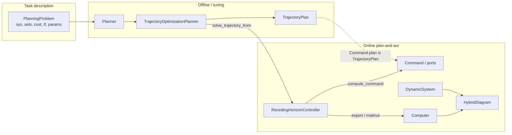
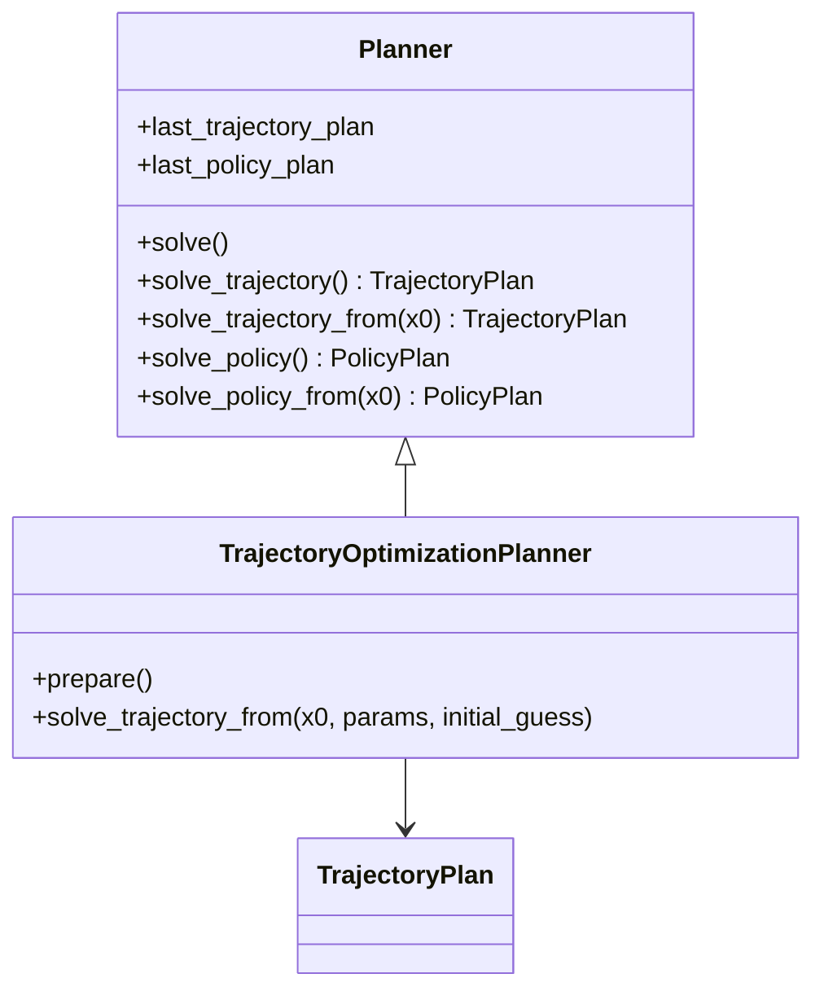

# Vision — MPC / receding-horizon end goal

Status: **locked** (July 2026). Do not re-open naming here without an explicit
decision; implement via [phases.md](phases.md).

## Product story

> Describe a **deterministic planning task** once (`PlanningProblem`).
> Solve it offline or online with a **Planner** that returns a typed
> **TrajectoryPlan**. Drive a plant in closed loop by wrapping any
> plan-producing solver in a **RecedingHorizonController** that re-plans
> from measured \(x\) each tick, latches the drafted horizon, and exports
> as a discrete control block / hybrid `Computer`.

“MPC” in demos = compile-once trajopt used as the `solve_trajectory_from`
planner inside that controller — not a second planner ABC.

## Big picture



## Roles

| Object | Role |
| --- | --- |
| `PlanningProblem` | Math task, incl. continuous \(T\) (`tf`) |
| `Planner` | Tool: how to compute a solution |
| `TrajectoryOptimizationPlanner` | NLP trajopt; batch or parametric compile-once |
| `TrajectoryPlan` | Traj-family result: schedule + metadata + warm_state |
| `RecedingHorizonController` | Online product: tick / latch / ports / `@ plant` |
| `Computer` / `HybridDiagram` | Existing step/hybrid host |

**No `HorizonSource`.** RH calls `planner.solve_trajectory_from(...)`.

**Laws:** continuous core stays clean; planners are tools; RH is the System
façade; one Planner ABC; RH is a loop pattern, not a special algorithm class.

## Aim UX

```python
plan = planner.solve()
rhc = RecedingHorizonController(planner, dt_mpc=0.2)
hybrid = rhc @ plant
hybrid.compute_trajectory(tf=10.0)

cmd = rhc.compute_command(y)
```

`MPCController` may be a thin alias for NLP defaults.

---

## `PlanningProblem`

Owns: `sys`, `X`/`U`/`X0`/`Xf`, `x_start`/`x_goal`, `cost`, **`tf`**
(continuous planning horizon \(T\)), `params`, `metadata`.

| Quantity | Home |
| --- | --- |
| Continuous \(T\) | `PlanningProblem.tf` only — `None` unset, `+inf` infinite-horizon, or finite |
| Knot count \(N\) | Transcription options (`n_steps`) only — **no** options `tf` |
| Replan period | `RecedingHorizonController.dt_mpc` |
| Sim length | Simulator / hybrid `tf` (different object) |

Finite trajopt/MPC grids: \(t = \mathrm{linspace}(0, T, N)\) via
`require_finite_tf()`. Cost does **not** carry \(T\). RRT/DP may leave `tf`
unset or use `+inf`.

---

## `Planner` — 2×2 API

One ABC; subclasses implement any subset (others → `NotImplementedError`).

|  | Trajectory → `TrajectoryPlan` | Policy → `PolicyPlan` |
| --- | --- | --- |
| Fixed (offline) | `solve_trajectory(**kw)` | `solve_policy(**kw)` |
| From \(x_0[,p]\) | `solve_trajectory_from(...)` | `solve_policy_from(...)` |

Short offline entry: **`solve()`** replaces `compute_solution` (dispatch by
`result_kind`). Verb is **`solve`**, not `compute` (avoids clash with
`System.compute_trajectory`). Family marker: `"traj"` \| `"policy"`.

**Dual cache slots** (not one `last_result`):

- `last_trajectory_plan`
- `last_policy_plan`

Solving one does not clear the other (DP may hold policy + rolled-out traj).

RH only requires `solve_trajectory_from`. Internal NLP `bind(x0)` is not on
the Planner ABC — called inside parametric `solve_trajectory_from`.

**Optional kwargs convention** (traj-family; ABC stays `**kwargs`):

| Kwarg | Meaning | Who uses it |
| --- | --- | --- |
| `params=None` | Scene / bind façade (\(p\)); `None` ≡ bind \(x_0\) only for parametric NLP | TOP / MPC; others omit or ignore |
| `initial_guess=None` | Optional seed (schedule and/or packed decision vector) | NLP / local methods; RRT etc. omit |

`initial_guess` is a **seed**, not warm-start *policy*. The planner does not
orchestrate “reuse last online plan”; that lives on
`RecedingHorizonController` (below).



---

## `TrajectoryOptimizationPlanner` + MPC merge

Two modes:

| Mode | Artifact | Entry |
| --- | --- | --- |
| `batch` | Fixed `MathematicalProgram` | `solve_trajectory` (re-transcribe) |
| `parametric` | `ParametricMathematicalProgram` + `bind(p)` | `prepare` then `solve_trajectory_from` |

Today’s `MPCPlanner` folds into parametric TOP; keep a thin alias pre-1.0.
Public `solve_trajectory_from(x0, params=None, initial_guess=None)` always
accepts `params` and `initial_guess` (façade); `params is None` ≡ today’s
`bind(x0)`. Scene keys later. Offline `solve_trajectory` takes the same
optional `initial_guess`.

`bind` is evaluator-internal: SciPy sees only `z`; evaluator injects bound `x0`.

**Footnote:** batch TOP may keep an offline convenience `warm_start: bool`
meaning “reuse `last_trajectory_plan` as seed.” That is **not** the RH
product flag — online warm-start orchestration is RH-only.

---

## `TrajectoryPlan`

```text
TrajectoryPlan
  trajectory: Trajectory
  metadata: SolveMetadata
  warm_state: array | None
  x_dot, u_dot: ndarray | None   # reserved optional; default None
  to_flat() / from_flat()
```

Keeps `Trajectory` as pure `(t,x,u)` schedule. Wrapper carries solve extras
(metadata, warm \(z\), optional knot rates). Symmetry with future `PolicyPlan`.
`warm_state` is a **result** artifact for the next caller; using it is not
automatic inside the planner.

---

## `RecedingHorizonController`

Holds a planner duck with `solve_trajectory_from`. Runs:

1. Tick → (optional) warm-start: if enabled, build a seed via
   `warm_start.py` from the latched plan / `warm_state`
2. Call `planner.solve_trajectory_from(x0, params=…, initial_guess=seed)`
   and latch the returned `TrajectoryPlan`
3. `Command` / ports (`plan_flat`, `u_ff`, `x_ff`, `z`, `success`)
4. `export_to_computer` / `__matmul__(plant)`
5. `compute_command` for deploy nodes (ROS-agnostic)

Default applied `u` for `@`: **`u_ff`** (ZOH). Broadcast `u_nom`/`x_nom` later.

Warm-start *policy* (`warm_start=True` on the controller) is owned here — not
on the Planner ABC / generic from-API.

---

## Utility homes

| Concern | Home |
| --- | --- |
| Transcription / pack \(z\) / parametric NLP | Planner / trajopt (+ mpc until merge) |
| Warm-start helpers (pure; seed from prior plan) | `planning/mpc/warm_start.py` (or shared) — used by RH (and tests/demos), not planner API |
| Tick latch / export / `@` / warm-start orchestration | `RecedingHorizonController` |
| Flatten | `TrajectoryPlan` |
| Overlays / plans_from_rollout | Free tools under `planning/mpc/` |

---

## Package placement

| Piece | Home |
| --- | --- |
| `TrajectoryPlan`, `SolveMetadata` | `planning/results.py` (new) |
| RH controller, `Command`, latch | `planning/mpc/` |
| PoC leaves | Keep until demos migrate; retire later |

Planners must not import hybrid/ROS. RH may import `Computer` / hybrid.

## Out of scope

Stochastic/robust problem classes; tracker law library; ROS2 package; acados;
shooting-MPC; hard moving-obstacle constraints in first scene pass; forking
TrajectoryPlanner/PolicyPlanner ABCs.
