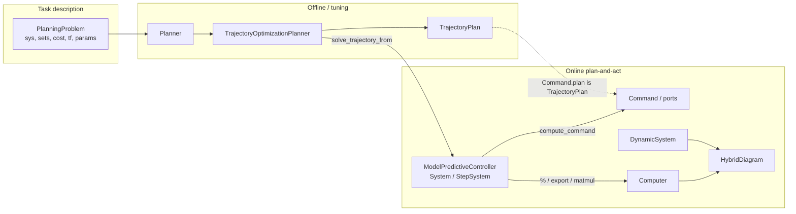
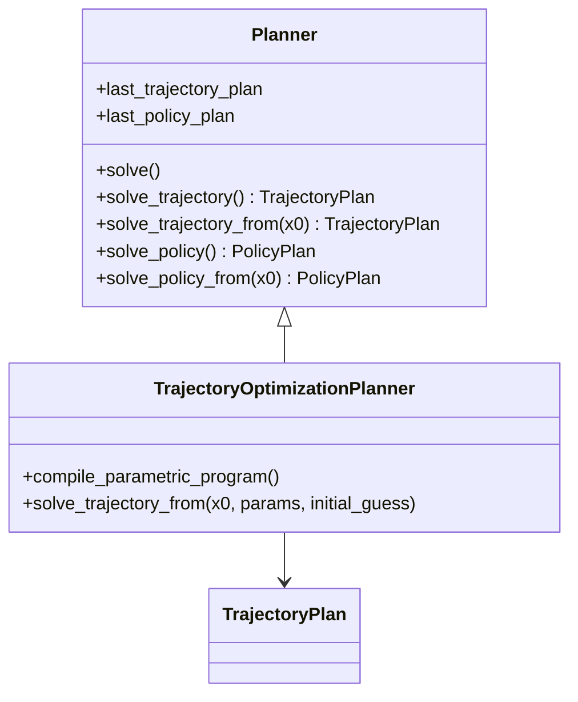

# Vision — MPC / receding-horizon end goal

Status: **locked** (July 2026). Do not re-open naming here without an explicit
decision; implement via [phases.md](phases.md).

## Product story

> Describe a **deterministic planning task** once (`PlanningProblem`).
> Solve it offline or online with a **Planner** that returns a typed
> **TrajectoryPlan**. Drive a plant in closed loop with a
> **ModelPredictiveController** — a Minilink `System` that re-plans from
> measured \(x\) each tick (receding-horizon *loop*), latches the drafted
> horizon, and wires into hybrid via `%` / `export_to_computer` / `@ plant`.

The controller holds any plan-producing solver with
`solve_trajectory_from`. In demos the planner is usually compile-once
trajopt (`TrajectoryOptimizationPlanner` + optional `compile_parametric_program`)
— not a second planner ABC.

## Big picture



## Roles

| Object | Role |
| --- | --- |
| `PlanningProblem` | Math task, incl. continuous \(T\) (`tf`) |
| `Planner` | Tool: how to compute a solution |
| `TrajectoryOptimizationPlanner` | NLP trajopt; rebuild each solve, optional parametric compile |
| `TrajectoryPlan` | Traj-family result: schedule + metadata + warm_state |
| `ModelPredictiveController` | Online product: Minilink `System` family — tick / latch / ports / `@ plant` |
| `Computer` / `HybridDiagram` | Existing step/hybrid host |

**No `HorizonSource`.** The controller calls `planner.solve_trajectory_from(...)`.

**Laws:** continuous core stays clean; planners are tools;
`ModelPredictiveController` **is** the discrete control `System` (not a
non-System object that only exports a leaf); one Planner ABC; receding
horizon is a **loop pattern** on that System, not a special algorithm class.

**Naming:** product type is **`ModelPredictiveController`**. Former vision
name `RecedingHorizonController` is retired. No second product alias
(`MPCController`); casual “MPC” means this controller + NLP planner backend.

## Aim UX

```python
planner = TrajectoryOptimizationPlanner(
    problem,
    n_steps=20,
    transcription="direct_collocation",
    compile_backend="jax",
    optimizer_options={"maxiter": 50, "ftol": 1.0},
)
plan = planner.solve()
mpc = ModelPredictiveController(planner, dt_mpc=0.2, warm_start=True)
hybrid = mpc @ plant
hybrid.compute_trajectory(tf=10.0)

cmd = mpc.compute_command(y)
```

Tier-2 still accepts `transcription=<Transcription>` and
`options=TrajectoryOptimizationOptions(...)`.

---

## `PlanningProblem`

Owns: `sys`, `X`/`U`/`X0`/`Xf`, `x_start`/`x_goal`, `cost`, **`tf`**
(continuous planning horizon \(T\)), `params`, `metadata`.

| Quantity | Home |
| --- | --- |
| Continuous \(T\) | `PlanningProblem.tf` only — `None` unset, `+inf` infinite-horizon, or finite |
| Knot count \(N\) | `TrajectoryOptimizationPlanner` (`n_steps` kwarg / transcription grid) |
| Replan period | `ModelPredictiveController.dt_mpc` |
| Sim length | Simulator / hybrid `tf` (different object) |

Finite trajopt/MPC grids: \(t = \mathrm{linspace}(0, T, N)\) via
`require_finite_tf()`. Cost does **not** carry \(T\). RRT/DP may leave `tf`
unset or use `+inf`.

---

## `Planner` — 2×2 API

One ABC; subclasses implement any subset (others → `NotImplementedError`).

|  | Trajectory → `TrajectoryPlan` | Policy → `PolicyPlan` |
| --- | --- | --- |
| Fixed (offline) | `solve_trajectory(**kw)` | `solve_policy(**kw)` |
| From \(x_0[,p]\) | `solve_trajectory_from(...)` | `solve_policy_from(...)` |

Short offline entry: **`solve()`** replaces `compute_solution` (dispatch by
`result_kind`). Verb is **`solve`**, not `compute` (avoids clash with
`System.compute_trajectory`). Family marker: `"traj"` \| `"policy"`.

**Dual cache slots** (not one `last_result`):

- `last_trajectory_plan`
- `last_policy_plan`

Solving one does not clear the other (DP may hold policy + rolled-out traj).

`ModelPredictiveController` only requires `solve_trajectory_from`. Internal
NLP `bind(x0)` is not on the Planner ABC — called inside parametric
`solve_trajectory_from`.

**Optional kwargs convention** (traj-family; ABC stays `**kwargs`):

| Kwarg | Meaning | Who uses it |
| --- | --- | --- |
| `params=None` | Scene / bind façade (\(p\)); `None` ≡ bind \(x_0\) only for parametric NLP | TOP / MPC; others omit or ignore |
| `initial_guess=None` | Optional seed (schedule and/or packed decision vector) | NLP / local methods; RRT etc. omit |

`initial_guess` is a **seed**, not warm-start *policy*. The planner does not
orchestrate “reuse last online plan”; that lives on
`ModelPredictiveController` (below).



---

## `TrajectoryOptimizationPlanner` + MPC merge

Single `__init__`. Public solve methods always work; parametric NLP is an
**optional acceleration** (not a second planner type).

```python
planner = TrajectoryOptimizationPlanner(problem, transcription=…, options=…)
plan = planner.solve_trajectory()            # always rebuild MathematicalProgram
plan = planner.solve_trajectory_from(x0)     # rebuild with x0 if not compiled

planner.compile_parametric_program()         # build ParametricMathematicalProgram + JIT
plan = planner.solve_trajectory_from(x0)     # bind(x0) + solve only (fast)
```

| Call | Behavior |
| --- | --- |
| `solve_trajectory` | Always re-transcribe a fresh `MathematicalProgram` |
| `solve_trajectory_from` | Fast bind path if `has_parametric_program`; else rebuild (one-time warn on TOP) |
| `compile_parametric_program` | Explicit second step; idempotent |

Today’s `MPCPlanner` is deleted; MPC demos / controllers use TOP and compile
for from-solves. Controllers auto-call `compile_parametric_program()` so ticks
never re-transcribe. Public `solve_trajectory_from(x0, params=None,
initial_guess=None)` accepts `params` and `initial_guess`; `params is None`
≡ bind `x0` only. Scene key reserved (E7 slim → `NotImplementedError`);
full `J(z, p)` / ObstacleBank bind is pipeline B (wanted later; out of the
F → UI closing sequence).

`bind` is evaluator-internal: SciPy sees only `z`; evaluator injects bound `x0`.

**Footnote:** offline TOP may keep convenience `warm_start: bool` meaning
“reuse `last_trajectory_plan` as seed.” That is **not** the controller product
flag — online warm-start orchestration is on `ModelPredictiveController` only.

---

## `TrajectoryPlan`

```text
TrajectoryPlan
  trajectory: Trajectory
  metadata: SolveMetadata
  warm_state: array | None
  x_dot, u_dot: ndarray | None   # reserved optional; default None
  to_flat() / from_flat()
```

Keeps `Trajectory` as pure `(t,x,u)` schedule. Wrapper carries solve extras
(metadata, warm \(z\), optional knot rates). Symmetry with future `PolicyPlan`.
`warm_state` is a **result** artifact for the next caller; using it is not
automatic inside the planner.

---

## `ModelPredictiveController` — System family

Product constructor (factory or dual subclasses) returns a **real Minilink
wireable block** — not a non-System orchestrator that builds a separate leaf.

| `warm_start` | Concrete type | Diagram state |
| --- | --- | --- |
| `False` | subclass of `System` (`n = 0`) | none |
| `True` | subclass of `StepSystem` | packed NLP \(z\) on `Computer.x` |

Both share orchestration (mixin / private helpers):

1. Tick → (optional) warm-start: if enabled, build a seed via
   `utilities.py` from latched plan / `warm_state`
2. Call `planner.solve_trajectory_from(x0, params=…, initial_guess=seed)`
   and latch the returned `TrajectoryPlan`
3. Ports (`u_ff`, `x_ff`, `z`, …) on the System
4. `compute_command(y, …) -> Command` (deploy / RAS; ROS-agnostic)
5. `%` / `export_to_computer` / `__matmul__(plant)` on **this** instance
   (the controller *is* the `%` / `@` leaf)
6. Optional live debug figure (`init_debug_figure` / `update_debug_figure`)

Owns replan period **`dt_mpc`**: warm-start \(\tau\)-shift, Computer schedule,
and tick clock \(t_{\mathrm{solve}} = t_0 + k\,\Delta t_{\mathrm{mpc}}\).

```text
ModelPredictiveController(...)
        │
        ├─ warm_start=False ──► Algebraic System
        └─ warm_start=True  ──► StepSystem (z on Computer.x)
```

### Time frames

| Symbol | Meaning |
| --- | --- |
| \(k\) | Discrete replan tick |
| \(t\) | Absolute sim or real time: \(t_{\mathrm{solve}} = t_0 + k\,\Delta t_{\mathrm{mpc}}\) |
| \(\tau\) | Plan-local; **\(\tau = 0\)** at the solve instant |

`TrajectoryPlan.trajectory.t` is plan-local \(\tau\). `Command` carries `k`
and `t_solve`.

### Deploy vs single-rate sim (E2)

- Deploy: `compute_command` → `Command` (`plan`, `u_ff`, …).
- Sim default: `%` / `@` applies **`u_ff`** (ZOH) at \(\Delta t_{\mathrm{mpc}}\).
- Hybrid tip: `compute_trajectory` defaults to `compile_backend="numpy"`; with
  fine `plant_dt_inner`, pass `"jax"` for JAX plants or plant rollout dominates
  wall time (NLP `solve=` alone understates cost).

### Broadcast + dual-rate (E8)

High-rate nominal sampling from the latched plan (no NLP on the fast path).
Interpolator is **opt-in** — not built inside `compute_command`.

| Method | Role |
| --- | --- |
| `generate_nominal_interpolator(*, derivatives=True)` | Slow post-process → `NominalCache` (FD rates when `derivatives=True`) |
| `get_nominal_u` / `_x` / `_u_dot` / `_x_dot(t)` | Fast eval → one `ndarray` each; \(\tau = t - t_{\mathrm{solve}}\), clamp to \([0, T]\) |

Default sim: `export_to_computer()` / `mpc @ plant` stay **`u_ff` ZOH** at \(\Delta t_{\mathrm{mpc}}\).

Advanced sim: `dual_rate_computer(dt_broadcast)` — replan leaf at `mpc.dt_mpc`,
broadcast leaf at \(\Delta t_{\mathrm{broadcast}}\) applying `u_nom`. Requires
`dt_mpc / dt_broadcast` a positive integer. **Option A (locked for E8):** the
two leaves share the MPC latch / `NominalCache` (no port edge; Graphviz shows
disconnected islands). Deploy truth stays the method API. See
[phase-E8.md](phase-E8.md).

Warm-start *policy* (`warm_start=True` on the controller) is owned here — not
on the Planner ABC / generic from-API.

PoC `MPCStatelessController` / `MPCStatefulController` promote into this
family; keep thin factory aliases until demos migrate (E3) / names retire (E5).

---

## Utility homes

| Concern | Home |
| --- | --- |
| Transcription / pack \(z\) / parametric NLP | Planner / trajopt (+ mpc until merge) |
| Warm-start / nominal helpers (pure) | `control/mpc/utilities.py` |
| Tick latch / ports / `%` / `@` / warm-start orchestration | `ModelPredictiveController` (on the System) |
| Flatten | `TrajectoryPlan` |
| Overlays / plans_from_rollout | `control/mpc/viz.py` |

---

## Package placement

| Piece | Home |
| --- | --- |
| `TrajectoryPlan`, `SolveMetadata` | `planning/results.py` |
| `ModelPredictiveController`, `Command`, latch | `control/mpc/` |
| PoC leaves | Keep until demos migrate; retire later |

Planners must not import hybrid/ROS. `ModelPredictiveController` may import
`Computer` / hybrid.

## Out of scope

Stochastic/robust problem classes; tracker law library; ROS2 package; acados;
shooting-MPC; hard moving-obstacle constraints in first scene pass; forking
TrajectoryPlanner/PolicyPlanner ABCs.
