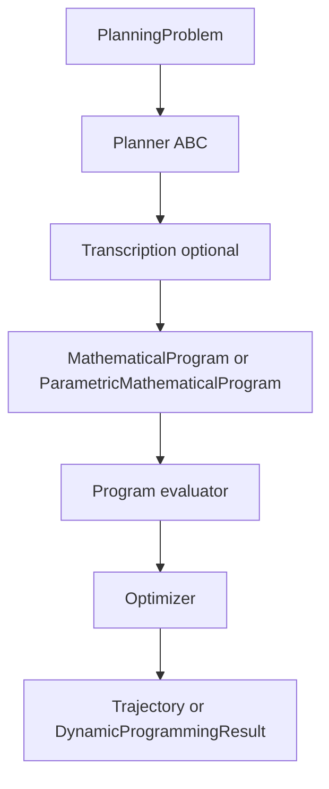

# Planning pipeline architecture (design only)

Status: draft plan (July 2026). No implementation in this phase.

Consolidates two architecture reviews:

1. **Input/output contract** — should all planners return the same result shape?
2. **Trajopt + MPC compile path** — transcription unification and runtime obstacle updates without re-JIT.

Implemented contracts live in [DESIGN.md](../../DESIGN.md) §6 and [ROADMAP.md](../../ROADMAP.md) §5.5.

---

## Main conclusions

### Unified input, split output

**Keep** a single declarative [`PlanningProblem`](../../minilink/planning/problems.py) as the common input for every planner (system, sets, cost, params).

**Keep** a single [`Planner`](../../minilink/planning/planner.py) orchestrator ABC — do **not** fork into separate `TrajectoryPlanner` / `PolicyPlanner` class hierarchies.

**Split** planning **results by family**:

| Family | Planners | Primary artifact | Wrapper (proposed) |
| --- | --- | --- | --- |
| Path | trajopt, RRT/RRT*, MPC | open-loop `Trajectory` `(t, x, u)` | `PathPlan` + `SolveMetadata` |
| Policy | DP (LQR stays in `control/`) | value field + greedy table / controller factory | `PolicyPlan` + `SolveMetadata` |

Do **not** force every planner to return both a trajectory and a policy. Open-loop schedules and closed-loop laws are different mathematical objects; conversions belong at explicit boundaries (`PolicyPlan.rollout()`, `DynamicProgrammingResult.controller()`, `TrajectorySource >> plant`).

Unify **execution downstream** via `StaticSystem` controllers + `Simulator`, not by stuffing dual fields into one result bag.

### Generalized parametric NLP (trajopt + MPC)

Trajopt and MPC already share transcription math (`trajectory_cost`, collocation defects, grid options). The compile-once MPC bet — [`ParametricMathematicalProgram`](../../minilink/planning/mpc/parametric_program.py) + `bind(x0)` — is **directionally correct** but today only `x0` varies at runtime.

**Extend** the parametric tier so runtime arrays (especially scene/obstacle data) flow through `J(z, p)` without re-JIT, while keeping structure (max obstacle count `K`, probe layout, shaping) fixed at compile time.

**Do not** rebuild `Scene` + re-`prepare()` every MPC tick for moving or newly detected obstacles. Use a **fixed-capacity obstacle bank** (`K` slots, dynamic centers, `active` mask). Weight-only scaling does **not** remove an obstacle from min-based clearance fields — inactive slots must yield effectively infinite SDF.

---

## Current pipeline (baseline)

**Trajopt:** three transcriptions (collocation, shooting, multiple shooting); re-transcribes + re-JITs each `compute_solution()` on the JAX path.

**MPC:** direct collocation only; compile once; `J(z)` and `g(z)` frozen; only `h(z, x0)` parametric via `bind(x0)`.

**Obstacles today:** composed at problem-build time (`Scene` → `clearance_field` → `as_cost`); centers/radii baked into the JIT closure. Changing obstacle geometry requires full recompile.

**Success metadata today:** scattered on side channels (`OptimizationResult.success`, `planner.reached_goal`, DP `delta`/`iterations`) — not on the primary return object.

---

## Proposed improvements

Improvement IDs are tracking labels for ROADMAP / implementation PRs.

### A. Result and metadata contract

| ID | Improvement | Notes |
| --- | --- | --- |
| **A1** | Add `SolveMetadata` (`success`, `message`, `solve_time_s`, `cost`, `iterations`) | Shared by all planners |
| **A2** | Add `PathPlan(trajectory, metadata)` | Wraps trajopt / RRT / MPC output |
| **A3** | Add `PolicyPlan(policy, metadata)` with `controller()` and `rollout()` | Wraps `DynamicProgrammingResult` |
| **A4** | Wire metadata from existing side channels | Trajopt/MPC ← `OptimizationResult`; RRT ← `reached_goal`; DP ← `delta` |
| **A5** | Optional `Planner.result_kind` marker (`"path"` / `"policy"`) | Typing aid only; no class split |
| **A6** | `plot_solution()` accepts `PathPlan \| Trajectory` | Policy planners keep explicit rollout for plots |
| **A7** | Document in DESIGN §6 and README call chains | Contract sync |

Migration: non-breaking first — add wrappers and `compute_path_plan()` / `compute_policy_plan()`; keep bare `Trajectory` / `DynamicProgrammingResult` from `compute_solution()` until pre-1.0 cleanup.

### B. Parametric transcription and runtime scene

| ID | Improvement | Notes |
| --- | --- | --- |
| **B1** | Generalize `ParametricMathematicalProgram` runtime pytree `p` | Today only `x0`; target `{"x0", "scene", ...}` |
| **B2** | Extend `JaxParametricProgramEvaluator.bind(p)` | `J(z, p_scene)`, `h(z, p_x0)`, optional `g(z, p_scene)` |
| **B3** | Add `ProblemParameters.scene` + `SceneParameters` | Roadmap item; centers `(K, dim)`, radii, `active` mask |
| **B4** | Add `ObstacleBank(K, dim)` with JAX-traceable `sdf(p, params)` | Inactive slots → large SDF, excluded from min |
| **B5** | `MPCPlanner.step(x_start, scene_params=...)` | Per-tick perception update without re-JIT |
| **B6** | Perception-update MPC demo + compile-once timing test | Mirror `test_mpc_planner.py` pattern |
| **B7** | Document parametric NLP + obstacle-bank semantics in DESIGN §6 | Contract sync |
| **B8** | Fold MPC transcription into `DirectCollocationTranscription` parametric mode | Optional refactor; reduces duplication |
| **B9** | Trajopt scenario sweeps via same parametric evaluator | Vary scene arrays without re-JIT |

**Obstacle update policy (application layer):** nearest-free-slot for new detections; deactivate far slots; if detections exceed `K`, keep closest `K` or rare re-`prepare()` with larger capacity.

**Start soft costs only** for moving obstacles; hard `FieldSet` margins need parametric `g(z, p)` (heavier follow-up).

---

## Decision summary

| Question | Decision |
| --- | --- |
| Unified `PlanningProblem` input? | **Yes — keep** |
| Split planner ABC hierarchies? | **No** |
| One result with trajectory + policy always? | **No** |
| Result families? | **`PathPlan` vs `PolicyPlan` + shared `SolveMetadata`** |
| Recompile when obstacle moves? | **No** — fixed `K` bank + dynamic arrays in JIT args |
| Variable obstacle count? | **Pad to `K` + `active` mask** |
| Weight-only to hide obstacles? | **Not for min/union clearance**; mask or `+∞` SDF |
| Combine trajopt + MPC transcription? | **Share options + math now**; unify parametric `transcribe()` later (B8) |

---

## Target mental model

> **PlanningProblem** — what to achieve.  
> **Planner** — how to compute it.  
> **PathPlan** — open-loop schedule.  
> **PolicyPlan** — closed-loop law.  
> **Parametric NLP** — compile structure once; bind numeric scenario data each tick.  
> **Trajectory from simulation** — verified behavior of either plan type.

---

## Suggested implementation order

1. **A1–A4** — result metadata (low risk, immediate clarity for success/timing)
2. **B3–B4** — obstacle bank + scene params (spatial layer)
3. **B1–B2, B5–B6** — generalized parametric evaluator + MPC API
4. **A5–A7, B7** — docs and planner dispatch helpers
5. **B8–B9** — optional unification and trajopt sweeps

Sections A and B are orthogonal: parametric MPC changes **how** path planners compile; result wrappers change **what** planners return.

---

## Non-goals (this plan)

- Shooting / multiple-shooting MPC transcription
- Mandatory LQR wrapper under `planning/`
- Forcing policy fields into MPC or trajopt results
- Hard moving-obstacle constraints in the first parametric scene pass
