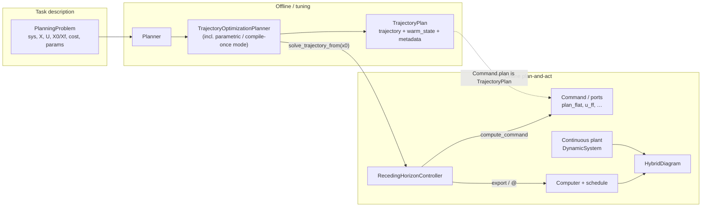
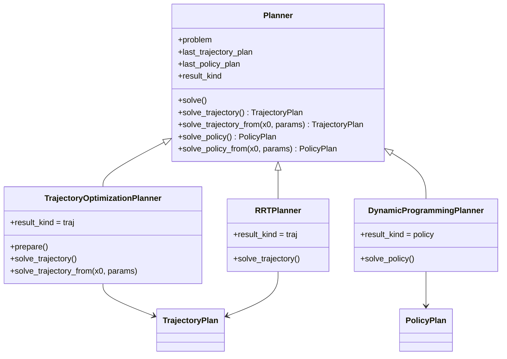
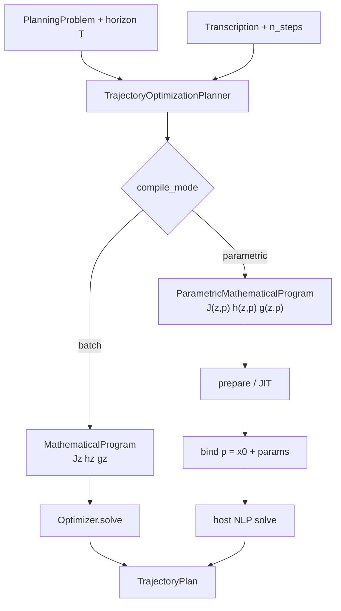
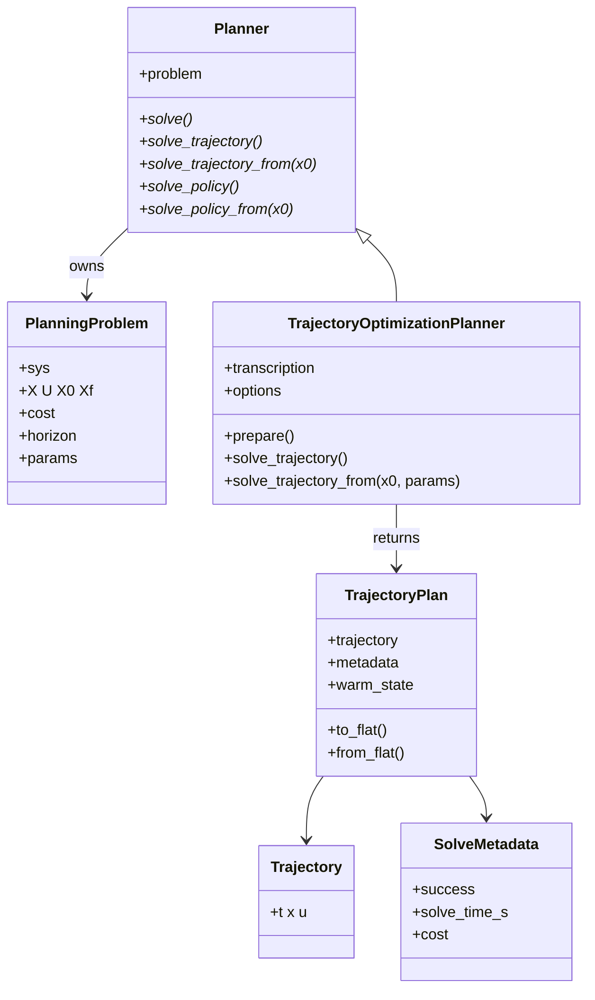
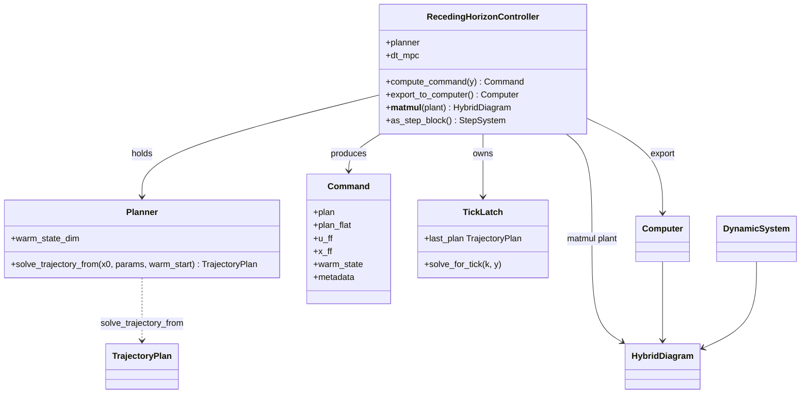
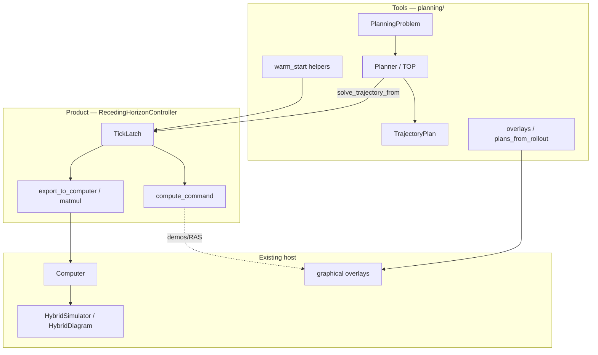
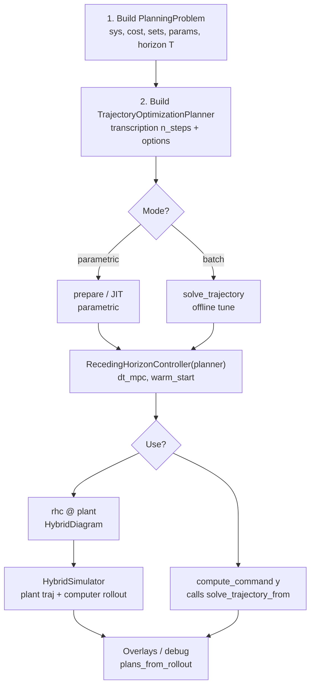

# Receding-horizon vision & implementation plan

Status: **master plan — approved vision** (July 2026).

This is the **master implementation plan for the MPC / receding-horizon
refactor** (Planner 2×2 API, `TrajectoryPlan`, `RecedingHorizonController`,
merge of `MPCPlanner` into parametric TOP). Requirements brainstorm remains in
the related docs; when they disagree, **this file wins** for implementation.

Related plans:

- [mpc-controller-architecture.md](mpc-controller-architecture.md) — requirements R1–R12, Option β
- [planning-pipeline-architecture.md](planning-pipeline-architecture.md) — `TrajectoryPlan` / parametric NLP
- [standard-planning-problems.md](standard-planning-problems.md) — problem taxonomy (stochastic later; **out of this scope**)

Grounded in today’s code (**`dev-alex`**, July 2026):

- Present: `PlanningProblem`, `Planner`, `TrajectoryOptimizationPlanner`,
  `MPCPlanner` (`prepare` / `step` / `compute_solution`),
  `MPCStatelessController` / `MPCStatefulController`, `MPCTickLatch`,
  `Computer` / `HybridDiagram` / hybrid demos
  (`examples/scripts/hybrid/demo_mpc_hybrid_minimal.py`, track lap),
  hand-loop MPC demos under `examples/scripts/mpc/`.
- Implementation branch for this refactor: **`dev-alex`** (do not stage plan
  work on a divergent MPC-only branch without cherry-picking).

---

## 1. End-goal vision (approve this picture)

### One-sentence product story

> Describe a **deterministic planning task** once (`PlanningProblem`).
> Solve it offline or online with a **Planner** that returns a typed
> **TrajectoryPlan**. Drive a plant in closed loop by wrapping any
> plan-producing solver in a **RecedingHorizonController** that re-plans
> from measured \(x\) each tick, latches the drafted horizon, and exports
> as a discrete control block / hybrid `Computer`.

“MPC” in demos is the common nickname for **compile-once trajopt used as
the `solve_trajectory_from` planner** inside that controller — not a second planner ABC.

### Big picture



### Mental model (roles)

| Object | Role | Band |
| --- | --- | --- |
| `PlanningProblem` | **What** to achieve (math task), incl. continuous \(T\) | planning |
| `Planner` | **How** to compute a solution (tool) | planning |
| `TrajectoryOptimizationPlanner` | NLP trajopt planner (shooting / collocation; optional compile-once) | planning |
| `TrajectoryPlan` | Typed **result**: open-loop schedule + solve metadata (+ warm state) | planning |
| `RecedingHorizonController` | Online **control product**: tick → latch → ports / RAS / `@ plant` | planning (controller façade) |
| `Computer` / `HybridDiagram` | Existing step/hybrid host | simulation / core |

**No `HorizonSource` type.** Online capability is just the planner method
`solve_trajectory_from(x0, …) -> TrajectoryPlan` (see §2.2 / §3.2). An extra
adapter object was considered and dropped as redundant with that surface.

**Laws this vision obeys**

- Continuous-time core stays clean; RH lives on **sibling** step/hybrid types.
- Planners are **tools**; the RH object is a **System / StepSystem façade**
  (or builds one). Prefer Option β: do **not** put `@ plant` on raw `Planner`.
- One `Planner` ABC; split **results** (`TrajectoryPlan` vs later `PolicyPlan`),
  not planner hierarchies.
- Receding horizon is a **loop pattern**, not a special algorithm class.

### Aim UX (after prepare)

```python
# tune (offline / fixed problem)
plan = planner.solve()              # short entry → TrajectoryPlan (or .trajectory during migration)
# plan = planner.solve_trajectory() # typed equivalent
planner.plot_solution()

# closed loop (defaults) — pass the planner directly
rhc = RecedingHorizonController(planner, dt_mpc=0.2)
hybrid = rhc @ plant                 # plant sim facade (not planner)
hybrid.compute_trajectory(tf=10.0)

# deploy (same core)
cmd = rhc.compute_command(y)         # calls planner.solve_trajectory_from(y)
# publish cmd.plan_flat / cmd.u_ff / cmd.metadata
```

`MPCController` may remain a thin alias / factory for “NLP compile-once +
defaults” for teaching demos.

---

## 2. Planning stack — contracts

### 2.1 `PlanningProblem` — the task

**What it is:** declarative deterministic task (exists today).
Plant + sets + cost + parameter scaffold. **Does not solve itself.**

**Owns**

| Field | Meaning |
| --- | --- |
| `sys` | Continuous plant / diagram to plan for |
| `X`, `U` | Path sets |
| `X0`, `Xf` | Boundary sets (authoritative) |
| `x_start`, `x_goal` | Representative points / shortcuts |
| `cost` | Optional Bolza / path cost (integrand / terminal — **not** the interval length) |
| `horizon` | **Continuous-time** prediction / planning interval length \(T\) (see §2.1b) |
| `params` | `ProblemParameters` (`system`, `cost`, `sets`; later `scene`) |
| `metadata` | Opaque tags |

**Must implement / keep**

- Construction validation (dims, membership of `x_start` in `X0`, …)
- `require_cost()` / `require_goal()` helpers (planner-facing)
- Optional `horizon` validation when set (`T > 0`, finite)

**Does not implement**

- Discretization knot count `n_steps`, time-grid layout, warm-start, JIT, tick loops
- Optimizer presets

```text
PlanningProblem
  in:  (constructor fields, including optional continuous horizon T)
  out: immutable task description consumed by every Planner
```

### 2.1b Continuous horizon \(T\) vs discretization \(N\) — revised law

These are **different objects**. Do not lump them as “horizon options.”

| Quantity | Math role | Home | Varies online? |
| --- | --- | --- | --- |
| **\(T\)** (continuous time horizon) | Domain of the OCP: plan over \([0, T]\) (or \([t, t+T]\)) | **`PlanningProblem.horizon`** | Allowed in principle (RH may update \(T\)); see below |
| **\(N\)** (`n_steps`) | How the solver discretizes that interval | **Transcription options** only | Fixed with NLP structure / decision size for compile-once |

**Not on the cost.** `cost` defines \(L\), \(\Phi\), weights, barriers. The interval length \(T\) is part of the **task statement**, not a cost coefficient.

**Grounding in today’s demos (to migrate):** every MPC script sets both on transcription today:

```text
DirectCollocationOptions(tf=MPC_HORIZON, n_steps=MPC_STEPS)
# MPC_HORIZON → belongs on PlanningProblem.horizon  (task)
# MPC_STEPS   → stays on DirectCollocationOptions.n_steps  (solver)
```

`TF_SIM` / hybrid `tf=` remains **simulation** length — unrelated to planning \(T\).
RH **`dt_mpc`** remains **replan period** on `RecedingHorizonController` — how often we
resolve — also not \(T\).

**Planners that ignore \(T\):** RRT edge “horizon” and DP backup horizons are
*different* concepts. Those planners leave `problem.horizon` unused (or only
use it if a path-cost / rollout helper wants a duration). Field is **optional**
so RRT/DP construction does not break.

**Compatibility (do not break old call sites):**

1. Add optional `PlanningProblem.horizon: float | None = None`.
2. Trajopt / MPC transcription **prefer** `problem.horizon` when set; else fall
   back to `options.tf` (today’s demos keep working unchanged).
3. If both set and disagree → clear error (or documented override rule:
   problem wins). Long-term: deprecate `FixedGridOptions.tf` as the task source;
   options keep `n_steps` (+ derived `t` grid from problem \(T\)).
4. No required migration of every demo in Phase 1; migrate flagship RH demos
   when wiring `RecedingHorizonController`.

**Varying \(T\) in the RH controller (vision, not Phase 1 must):**

- Updating \(T\) each tick is a **problem / params** change, not an `n_steps` change.
- With **fixed \(N\)**: knot spacing \(\Delta t = T/(N-1)\) can track \(T\) if the
  parametric NLP treats time scale as runtime data (future); or cheap re-`prepare`
  if structure allows.
- Changing \(N\) with \(T\) is a **structural** NLP change (new \(n_z\)) → re-JIT —
  that stays a solver concern, not a reason to put \(N\) on the problem.
- Phase 1 ships **fixed \(T\)** (as today). Phase 4+ may expose runtime
  `horizon` / params updates once parametric time scaling is designed.

*Note:* [standard-planning-problems.md](standard-planning-problems.md) currently
says horizon stays method-side — revise that doc to match this \(T\) vs \(N\)
split when DESIGN is synced (continuous \(T\) on problem; \(N\) method-side).

---

### 2.2 `Planner` — mother class alignment (2×2 API)

**What it is:** shared orchestrator ABC (exists in
[`planning/planner.py`](../../minilink/planning/planner.py)). One ABC for
trajopt, RRT, DP — **no** `TrajectoryPlanner` / `PolicyPlanner` class fork.
A concrete planner may implement **any subset** of the four methods below;
unimplemented ones stay as `NotImplementedError` on the base.

#### Today (problem)

```text
Planner
  + problem
  + last_result          # untyped
  + compute_solution()*  # return type left to subclass — rename to solve()
  + plot_solution()      # assumes Trajectory
  + animate_solution()   # assumes Trajectory
```

| Subclass | `compute_solution()` returns today |
| --- | --- |
| `TrajectoryOptimizationPlanner` | `Trajectory` |
| `MPCPlanner` | `Trajectory` (via `step(x_start)`) |
| `RRTPlanner` / `RRTStarPlanner` | `Trajectory` |
| `DynamicProgrammingPlanner` | `DynamicProgrammingResult` (policy table) |

**Rename scope (repo check, July 2026):** `compute_solution` appears in on the order of
**~40–60 call sites** (tests heaviest in `test_rrt.py`, plus trajopt demos,
benchmarks, a few notebooks, README/DESIGN). Definitions live on
`Planner` + TOP / MPC / RRT / DP / `PolicyEvaluator`. Manageable mechanical
rename — not a large job; do it with the Planner API pass (no long alias
period required pre-1.0).

#### Naming decision: `solve_*` (not `compute_*`)

**Verb:** use **`solve`**, not `compute`, for all four.

| Reason | Detail |
| --- | --- |
| Clash | `System.compute_trajectory` / hybrid `compute_trajectory` already mean **simulate the plant**. A planner method named `compute_trajectory` would collide mentally (and in autocomplete). |
| Domain | Trajopt / MPC / RRT / DP “solve” a problem; `Optimizer.solve` already exists. |
| One verb | Offline and online share the same verb; only the `_from` suffix marks the parameterized entry. |

**Drop “plan” from the method name** — the object is already a `Planner`; the
return type is `TrajectoryPlan` / `PolicyPlan`. So:
`solve_trajectory` not `solve_trajectory_plan` / `compute_trajectory_plan`.

Family marker: **`traj`** \| **`policy`** (not `"path"`).

#### The 2×2 matrix (locked)

|  | **Trajectory** (`TrajectoryPlan`) | **Policy** (`PolicyPlan`) |
| --- | --- | --- |
| **Fixed** (problem data as built; offline tune) | `solve_trajectory(**kw)` | `solve_policy(**kw)` |
| **From runtime args** (online; primarily \(x_0\)) | `solve_trajectory_from(x0, *, params=None, warm_start=None)` | `solve_policy_from(x0, *, params=None, warm_start=None)` |

```text
                    artifact
                 traj              policy
              ┌─────────────────┬─────────────────┐
 fixed        │ solve_trajectory│ solve_policy    │
 (offline)    │                 │                 │
              ├─────────────────┼─────────────────┤
 from(x0[,p]) │ solve_trajectory│ solve_policy    │
 (online)     │ _from           │ _from           │
              └─────────────────┴─────────────────┘
```

**Semantics**

| Method | Meaning |
| --- | --- |
| `solve_trajectory` | Solve using the planner’s bound `PlanningProblem` as-is (template `x_start`, fixed \(T\), …). Returns `TrajectoryPlan`. |
| `solve_trajectory_from(x0, *, params=None, warm_start=None)` | Same algo, but start (and optional runtime `params`) supplied at the call. Primary RH / MPC entry. |
| `solve_policy` | Offline policy synthesis (DP). Returns `PolicyPlan`. |
| `solve_policy_from(…)` | Parameterized policy solve if/when needed (rare at first; façade reserved). |

**Who implements what (typical)**

| Planner | Implements |
| --- | --- |
| TOP batch | `solve_trajectory`; `solve_trajectory_from` = refresh start + re-transcribe (slow OK) |
| TOP parametric / today’s MPC | `prepare` + `solve_trajectory_from`; `solve_trajectory` ≡ `solve_trajectory_from(problem.x_start)` |
| RRT | `solve_trajectory` (+ optional `_from` = replan from new start) |
| DP | `solve_policy`; optional later `solve_trajectory_from` via rollout if used inside RH |

RH **only** requires `solve_trajectory_from`. It never needs policy methods.

#### Target mother contract

```text
Planner
  + problem: PlanningProblem

  # ---- cached solutions (parallel slots — not a single last_result) ----
  + last_trajectory_plan: TrajectoryPlan | None
  + last_policy_plan: PolicyPlan | None
  # deprecated shim: last_result → prefer traj slot, else policy (migration only)

  + result_kind: "traj" | "policy"    # primary family; not exclusive of the other slot

  # ---- 2×2 (defaults: NotImplementedError) ----
  + solve_trajectory(**kw) -> TrajectoryPlan
        # stores last_trajectory_plan
  + solve_trajectory_from(x0, *, params=None, warm_start=None) -> TrajectoryPlan
        # stores last_trajectory_plan
  + solve_policy(**kw) -> PolicyPlan
        # stores last_policy_plan
  + solve_policy_from(x0, *, params=None, warm_start=None) -> PolicyPlan
        # stores last_policy_plan

  # ---- short offline entry (replaces compute_solution) ----
  + solve(**kw)
        # default dispatch by primary result_kind; subclass may fill BOTH slots
        # e.g. DP: solve_policy → last_policy_plan, then optional rollout →
        #          last_trajectory_plan (same call or explicit follow-up)
        # return: primary artifact for that planner (see subclass)

  + plot_solution / animate_solution
        # use last_trajectory_plan.trajectory (roll out first if only policy exists)
```

** Dual slots (why not one `last_result`)**

A planner can hold **both** a policy and a trajectory at once. Classic case: DP
`solve_policy` fills `last_policy_plan`; rolling out \(\pi\) from \(x_0\) fills
`last_trajectory_plan` without discarding the policy table. A single
`last_result` would collide / force awkward unions.

| Slot | Set by | Cleared? |
| --- | --- | --- |
| `last_trajectory_plan` | any `solve_trajectory*` (and optional rollout after policy) | only when overwritten by a new traj solve |
| `last_policy_plan` | any `solve_policy*` | only when overwritten by a new policy solve |

Solving one family does **not** auto-clear the other. Helpers:
`require_trajectory_plan()` / `require_policy_plan()` (clear errors if missing).

**`bind(x0)`** stays **internal** to parametric evaluators (called inside
`solve_trajectory_from`). Not part of the `Planner` ABC.

**`solve()` vs typed methods:** demos/tests may keep calling `planner.solve()`
for the short offline path (today’s `compute_solution`). Typed
`solve_trajectory` / `solve_policy` are the authoritative family APIs;
`solve()` is only the thin dispatcher — **not** a fifth algorithm.

**Decision locked for this plan**

| Choice | Rule |
| --- | --- |
| Verb | **`solve_*`** for the 2×2; short offline entry is **`solve()`** |
| Method names | `solve_trajectory`, `solve_policy`, `solve_trajectory_from`, `solve_policy_from`, plus `solve` |
| Rename | **`compute_solution` → `solve`** repo-wide (mechanical; ~40–60 call sites) |
| Not used | `compute_trajectory*` on Planner (sim clash); bare `solve_from`; keep no `compute_solution` alias after rename |
| Fork ABC? | **No** — one mother; implement 1–4 typed methods (+ inherited `solve` dispatch) |
| What RH imports | `planner.solve_trajectory_from(…) → TrajectoryPlan` (not `solve()`) |
| Result cache | **`last_trajectory_plan` + `last_policy_plan`** in parallel; retire single `last_result` |



**Does not own:** hybrid export, RAS tick, multi-rate broadcast, plant ports.
Those live on `RecedingHorizonController`.

---

### 2.3 `TrajectoryOptimizationPlanner` — detailed contract + merge with `MPCPlanner`

**What it is:** traj-family planner that builds
`problem → transcription → (parametric) MathematicalProgram → Optimizer → TrajectoryPlan`.

#### 2.3.1 What exists today (two sibling classes)

| | `TrajectoryOptimizationPlanner` | `MPCPlanner` |
| --- | --- | --- |
| File | `trajectory_optimization/planner.py` | `mpc/planner.py` |
| Transcription | `DirectCollocationTranscription.transcribe` → `MathematicalProgram` | `MPCDirectCollocationTranscription.transcribe_parametric` → `ParametricMathematicalProgram` |
| Compile | Per `solve()` / `solve_trajectory` (re-transcribe + Optimizer compile) | Once in `prepare()`; JIT `J,h,g` |
| Runtime bind | None — `x_start` frozen in program closure | `bind(x0)` on equality `h(z, x0)` only |
| Online API | — | `step(x_start) -> Trajectory` |
| Offline API | `compute_solution() -> Trajectory` (→ rename `solve`) | same via `step(template x_start)` |
| Cost / sets in JIT | Baked at each transcribe | Baked at `prepare` (scene moves ⇒ re-prepare) |
| Warm-start | options / last Trajectory as guess | packed `z` + `mpc_warm_start_guess` |

Both subclass `Planner` independently. Collocation math is largely duplicated.

#### 2.3.2 End goal — one class, two **program** modes

Same `TrajectoryOptimizationPlanner`; mode selected by options (or by whether
transcription supports parametric export).

```text
compile_mode = "batch" | "parametric"
```

| Mode | Compiled artifact | Solve entry | Typical use |
| --- | --- | --- | --- |
| **`batch`** | Fixed `MathematicalProgram` — \(J(z), h(z), g(z)\); no runtime \(p\) | `solve_trajectory()` (re-transcribe each call, as today) | Open-loop trajopt demos |
| **`parametric`** | `ParametricMathematicalProgram` — structure fixed; runtime bag \(p\) | `prepare()` once, then `solve_trajectory_from(x0, params=…)` | RH / “MPC”, sweeps |



#### 2.3.3 Parametric runtime bag \(p\) — façade even before scene lands

**Today:** `ParametricMathematicalProgram` is only \(h(z, x0)\); \(J(z)\), \(g(z)\)
closed over build-time data.

**Target shape of \(p\)** (align with pipeline plan B / `ProblemParameters`):

```text
p  ~  {
  x0:     ndarray(n,),           # always — measurement / start
  scene:  …,                     # later ObstacleBank arrays
  cost:   …,                     # later weight overrides
  # horizon T: later time-scale if varying-T with fixed N
}
```

**Phase 1 / 2 implementation bar**

| Capability | When |
| --- | --- |
| `solve_trajectory_from(x0, *, params=None, warm_start=None) -> TrajectoryPlan` public | Phase 2 merge (Phase 1: wrap `MPCPlanner.step`) |
| `params is None` → behave as today’s `step(x0)` (`p = {x0}`) | required |
| `params is not None` but scene not wired → **clear error** or ignore-with-warning (prefer error) | Phase 2 |
| Structured `ProblemParameters` / scene in JIT | Phase 4 |
| `solve_trajectory_from(..., params=)` signature exists | Phase 1 on MPC / Phase 2 native — **façade first** |

So: prepare the **API seam** for variable planning parameters now; do not
block RH UX on ObstacleBank.

#### 2.3.4 Target public methods on `TrajectoryOptimizationPlanner`

```text
TrajectoryOptimizationPlanner(
    problem,
    *,
    transcription,                    # owns n_steps; T from problem.horizon
    options: TrajectoryOptimizationOptions,
)
# options.compile_mode: "batch" | "parametric"
# options.compile_backend: numpy | jax (parametric: jax today)

# --- lifecycle ---
prepare() -> None
    batch:       no-op or caches nothing required
    parametric:  resolve T from problem; transcribe_parametric;
                 JIT evaluator; store program + sample z0

# --- Planner mother (traj family) ---
result_kind == "traj"

solve_trajectory(*, initial_guess=None, warm_start=None) -> TrajectoryPlan
    batch:       transcribe fixed MathematicalProgram → solve → wrap TrajectoryPlan
    parametric:  equivalent to solve_trajectory_from(problem.x_start, ...)

solve(**kw) -> TrajectoryPlan   # dispatcher; may return .trajectory during call-site migration

# --- online / RH ---
solve_trajectory_from(x0, *, params=None, warm_start=None) -> TrajectoryPlan
    batch:       rebuild problem x_start (and apply params if any) →
                 full re-transcribe (slow but valid)
    parametric:  bind p={x0, **params}; host NLP; reconstruct;
                 warm_state = result.z in TrajectoryPlan

# warm_state_dim / default_warm_state: optional attrs RH may read (n_z or 0)
```

**Internal attributes (parametric mode)** — merge of today’s TOP + MPCPlanner:

| Attribute | Source today | Role |
| --- | --- | --- |
| `transcription` | both | grid \(N\), pack/unpack |
| `program` | MPC: `ParametricMathematicalProgram`; TOP: last `MathematicalProgram` | compiled NLP |
| `program_evaluator` | MPC JIT bind | SciPy-facing `J,h,g` |
| `last_optimization_result` | both | fills `SolveMetadata` |
| `compile_time_s` / solve timing | MPC | metadata / `step_disp` |
| `_dynamics` | MPC reconstruct | optional consistent \(x\) rollout |

#### 2.3.5 Combining the two classes (merge map)

```text
Phase 1:  RecedingHorizonController  --adapter-->  MPCPlanner.step
Phase 2:  MPCPlanner body moves into TrajectoryOptimizationPlanner(compile_mode="parametric")
          MPCPlanner = thin alias / factory  (pre-1.0 deprecation)
```

| Concern | Keep from TOP | Keep from MPCPlanner | Unified home |
| --- | --- | --- | --- |
| Batch `transcribe` → `MathematicalProgram` | yes | — | `transcription.transcribe` |
| Parametric `transcribe_parametric` | — | yes | same transcription API + `compile_mode` |
| `Optimizer` wrapper + history callbacks | yes | SciPy backend direct | prefer TOP `Optimizer` path where possible |
| `bind(x0)` | — | yes | generalize → `bind(p)` with at least `x0` |
| `step` name | — | yes | rename to **`solve_trajectory_from`**; `step` alias deprecated |
| `MPCOptions` vs `TrajectoryOptimizationOptions` | TOP options | MPC options | one options dataclass + parametric flags (`step_disp`, `compile_mode`) |
| `MPCDirectCollocationTranscription` vs `DirectCollocationTranscription` | both | fold parametric method onto one collocation class (pipeline B8) | Phase 2 |

#### 2.3.6 Program export surface (conceptual)

Not every user needs raw programs, but the planner owns this split:

```text
# batch (fixed)
program = transcription.transcribe(problem)     # MathematicalProgram
#   minimize J(z)
#   s.t.   h(z) = 0,  g(z) >= 0
#   x0 appears only as data closed inside h/J at build time

# parametric (x0 / later params as inputs)
program = transcription.transcribe_parametric(problem)  # ParametricMathematicalProgram
#   minimize J(z, p)          # Phase 2 may still be J(z) until scene
#   s.t.   h(z, p) = 0        # today: h(z, x0); façade: h(z, p)
#          g(z, p) >= 0       # today: g(z); later g(z, p_scene)
#   evaluate.bind(p) before each solve_trajectory_from
```

**Façade rule:** public `solve_trajectory_from(x0, params=None)` always accepts
`params`. Evaluator `bind` accepts a small dict/pytree with required `x0`.
Extra keys reserved for Phase 4; unused keys error until implemented so silent
ignore does not hide perception bugs.

#### 2.3.7 Implements (internally)

- Resolve \(T\) from `problem.horizon` (preferred) else `options.tf`
- Transcription owns **`n_steps` only** (long-term)
- Pack / unpack \(z\); warm-start helpers
- Build `SolveMetadata` from `OptimizationResult`
- Store `TrajectoryPlan(trajectory, metadata, warm_state=z)`

#### 2.3.8 What Phase 1 does **not** require

- Full merge of `MPCPlanner` into TOP (Phase 2)
- Scene-parametric `J(z,p)` / `g(z,p)` (Phase 4)
- Changing mother ABC to remove `compute_solution` (keep + forward)

---

### 2.4 `TrajectoryPlan` — the traj-family result

**What it is:** standard payload of a traj planner (and of each RH tick).

```text
TrajectoryPlan
  trajectory: Trajectory          # (t, x, u) — NumPy reporting bag
  metadata: SolveMetadata         # success, message, solve_time_s, cost, …
  warm_state: array | None        # e.g. packed NLP z for next tick
  x_dot: ndarray | None           # optional dx/dt on the plan grid (n, N)
  u_dot: ndarray | None           # optional du/dt on the plan grid (m, N)
```

**Must implement**

| Method / field | Why |
| --- | --- |
| `.trajectory` / `.metadata` / `.warm_state` | Primary payload |
| `.x_dot` / `.u_dot` | Optional reserved rates (see below); default `None` |
| `to_flat()` / `from_flat()` | Diagram port + RAS one-vector wire (R4/R7); rates in flat layout TBD / versioned |
| Convenience: `.t`, `.x`, `.u` or `.as_trajectory()` | Teach / plot |

**Optional rates (`x_dot`, `u_dot`) — locked as reserved, not required**

Worth reserving on `TrajectoryPlan` (not stuffing into core `Trajectory`) so RH
broadcast / richer FF laws (R6) have a known place for knot-level rates without
polluting the shared sim schedule type.

| Rule | Detail |
| --- | --- |
| Default | Both `None` — RRT / simple trajopt need not compute them |
| Who fills | Optional post-process after solve (FD/spline on knots; or `x_dot ≈ f(x,u,t)` when dynamics available). Never required for `solve_trajectory*` success |
| Not a substitute for ctl-rate interp | High-rate `u_nom(t)` / `dx_nom(t)` between knots still live in broadcast / `get_nominal(t, include_derivatives=…)`; stored plan rates are knot samples or a cache, not the only evaluation path |
| Why not only `Trajectory.signals` | Signals stay valid for ad hoc channels; **reserved fields** advertise a stable contract for RH/Command. Planners should not put NLP `z` in signals |
| Phase 1 | Ship fields as `None`; no planner must fill them; demos unchanged |

**Does not implement**

- Replanning, hybrid export, interpolation policy (those are controller /
  broadcast concerns)

`SolveMetadata`: shared dataclass (`success`, `message`, `solve_time_s`,
`cost`, `iterations`, …) filled from today’s side channels
(`OptimizationResult`, …).

**Policy family (later, not this milestone):** `PolicyPlan` with
`controller()` / `rollout(x0) → TrajectoryPlan`. DP plugs into RH by
implementing `solve_trajectory_from` (e.g. via rollout) on that planner — no
separate `HorizonSource` type.

---

### 2.5 Planning-stack interaction



---

## 3. Receding-horizon control — contracts

### 3.1 What `RecedingHorizonController` is

User-facing **online plan-and-act product** (Option β).

Not a Planner. Not the NLP. It **holds a traj planner** (or any duck with
`solve_trajectory_from`) and runs the online loop:

1. On each control tick: `planner.solve_trajectory_from(y, …)` → latch `TrajectoryPlan`
2. Expose ports / `Command` for FF, full plan, warm state, success
3. Export to `Computer` for hybrid sim, or serve RAS via `compute_command`
4. Aim: `rhc @ plant` with defaults

Alias: `MPCController` = RH façade with NLP parametric planner defaults
(optional naming sugar).

### 3.2 Online planner surface — no `HorizonSource` intermediary

**Decision:** drop the separate `HorizonSource` layer. Online entry is the
mother method `solve_trajectory_from` (see §2.2).

`RecedingHorizonController` takes a **planner duck** that implements:

```text
# required
solve_trajectory_from(x0, *, params=None, warm_start=None) -> TrajectoryPlan

# optional (RH uses defaults if missing)
prepare()?                      # call once if present
warm_state_dim -> int           # default 0
default_warm_state()?           # optional
```

| Backend | How it meets `solve_trajectory_from` |
| --- | --- |
| Parametric TOP / today’s `MPCPlanner` | native / `step` wrapped → `TrajectoryPlan` |
| Batch TOP | re-transcribe from updated `x_start` (slow, valid) |
| RRT | replan from \(x\) → `TrajectoryPlan` |
| DP | later: `solve_trajectory_from` via rollout on that planner if needed |

**When a one-off wrapper is still OK:** only if an object cannot grow
`solve_trajectory_from` without lying (rare). Prefer adding the method on the
planner subclass. Do **not** invent a framework-wide `HorizonSource` type.

**Why this is enough:** RH only needs “given \(x[,p]\), return a
`TrajectoryPlan`.” Offline methods (`solve_trajectory`, `plot_solution`) stay
on the same object; RH simply never calls them on the hot path.

### 3.3 `RecedingHorizonController` — I/O contract

**Construction**

```text
RecedingHorizonController(
    planner,                       # duck: solve_trajectory_from → TrajectoryPlan
    *,
    dt_mpc: float,
    dt_ctl: float | None = None,   # Phase later: broadcast rate; default = dt_mpc
    warm_start: bool = True,
    applied_u: str = "u_ff",       # default ZOH first-move for @ plant
    debug: … = None,
)
```

**Runtime API (deploy + tests)**

```text
compute_command(y, *, params=None, warm_state=None, t=None, k=None) -> Command

Command:
  plan: TrajectoryPlan
  plan_flat: ndarray
  u_ff, x_ff: ndarray          # convenience slices
  z / warm_state: ndarray | None
  metadata: SolveMetadata
```

**Diagram export**

```text
as_stateless_block() -> System          # n=0, optional
as_step_block() -> StepSystem           # state = warm_state when dim>0
export_to_computer(schedule=None) -> Computer
__matmul__(plant) -> HybridDiagram      # aim: rhc @ plant
reset()
```

**Default diagram ports (tick block inside export)**

| Direction | Port | Dim / notes |
| --- | --- | --- |
| in | `y` | measurement ≈ \(x\) (`n`) |
| in | `params` / scene | optional; Phase later (R12) |
| out | `plan_flat` | flattened drafted horizon (baseline) |
| out | `u_ff` | first-move \(u\) (default applied) |
| out | `x_ff` | next planned state slice |
| out | `z` | warm state when used |
| out | `success` | from metadata |

**Phase later (R6):** bundled `BroadcastBlock` reading latched `plan_flat` →
`u_nom(t)`, `x_nom(t)` at `dt_ctl`. **Not required** for first `@ plant`
(hybrid ZOH of `u_ff` already exists).

### 3.4 Tick loop (generic)

```mermaid
sequenceDiagram
  participant Plant
  participant RHC as RecedingHorizonController
  participant PL as TrajPlanner

  Plant->>RHC: y ≈ x (tick k)
  opt perception
    Note over RHC: params / scene (later)
  end
  RHC->>PL: solve_trajectory_from(x, params, warm_start)
  PL-->>RHC: TrajectoryPlan
  RHC->>RHC: latch plan; slice u_ff, plan_flat
  RHC-->>Plant: u (ZOH / applied port)
```

### 3.5 RH class diagram



---

## 4. Where utilities live

Keep **algorithm / transcription** vs **online loop** vs **analysis** separate.

| Concern | Home | Examples |
| --- | --- | --- |
| Transcription, pack/unpack \(z\), parametric NLP | Planner / `trajectory_optimization/` (+ today’s `mpc/transcription.py` until merge) | collocation defects, `prepare` |
| Warm-start shift of \(z\) / plan | Planner-adjacent helpers (`mpc/warm_start.py` or shared) | used by latch + `solve_trajectory_from` |
| Tick latch (one NLP per \(k\)) | Inside RH controller package | evolve today’s `MPCTickLatch` |
| Flatten plan for ports / RAS | `TrajectoryPlan` methods | `to_flat` / `from_flat` |
| Nominal interpolation / rates | RH export helpers or small `BroadcastBlock` | Phase later (R6) |
| Hybrid export / `@` | `RecedingHorizonController` | wraps existing `Computer` / `hybrid_closed_loop` |
| RAS tick API | `RecedingHorizonController.compute_command` | no GUI imports |
| `step_disp`, solve timing prints | Source planner options **and/or** RH `debug=` that forwards | don’t duplicate blindly |
| Horizon overlays / plan history from rollout | `planning/mpc/` analysis helpers **or** `graphical` adapters called from demos | `mpc_plans_from_rollout`, `mpc_animation_overlays` stay **tools**, not methods on `Planner` |
| Plot last closed-loop vs plan | RH façade convenience (`plot_*` / `debug_*`) that calls graphical tools | optional sugar |



**Rule of thumb**

- If it makes a **better NLP / plan** → planner / transcription.
- If it makes a **better online tick / deploy / `@ plant`** → RH controller.
- If it **visualizes or post-processes** rollouts → keep as free functions /
  graphical helpers; RH may expose thin `debug_*` that call them.

---

## 5. End-to-end pipeline graphic



---

## 6. Migration from today’s PoC

| Today (`dev-alex`) | End goal |
| --- | --- |
| `MPCPlanner.step` → bare `Trajectory` | `solve_trajectory_from` → `TrajectoryPlan` |
| `Planner.compute_solution` | `solve()` + typed 2×2 |
| `MPCStateless/StatefulController` + latch | Absorbed / replaced by `RecedingHorizonController` export |
| Hand `while` closed-loop demos | Prefer `rhc.compute_command` or `rhc @ plant` |
| `mpc % dt` then `computer @ plant` | `rhc @ plant` (builds `Computer` under the hood) |
| `MPCPlanner` sibling of TOP | Parametric mode of `TrajectoryOptimizationPlanner` |
| Scene baked at build | Later: `params.scene` / ObstacleBank |

**Sequencing rule:** land types + `solve_trajectory_from` + RH façade; prove on
`demo_mpc_hybrid_minimal` (`rhc @ plant`) early — hybrid host already exists
here. Hand-loop demos migrate in parallel or next.

---

## 7. Execution plan — multi-phase with checkpoints

Vision (§1–§5) stays; this section is **how to land it**. Each phase has:
deliverables → automated gate → smoke demos → exit criteria.
Do not start the next phase until the gate is green unless noted otherwise.

### 7.0 Baseline inventory (what must keep working)

**Hybrid MPC demos** — primary closed-loop regression:

| Demo | Role |
| --- | --- |
| `examples/scripts/hybrid/demo_mpc_hybrid_minimal.py` | Flagship `mpc % dt` → `computer @ plant` |
| `examples/scripts/hybrid/demo_mpc_hybrid_track_lap.py` | Richer hybrid + scene |

**MPC demos (hand-loop)** — also keep green:

| Demo | Role |
| --- | --- |
| `demo_dynamic_bicycle_rate_mpc_straight_line.py` | Minimal compile-once + hand loop |
| `demo_dynamic_bicycle_rate_mpc_closed_loop_lap.py` | Full closed-loop lap |
| `demo_dynamic_bicycle_rate_mpc_obstacle.py` / multi-obstacle / stadium / wide | Smoke optional per phase |
| `demo_mpc_spatial_scene_guide.py` | Teaching / scene API |
| `demo_dynamic_bicycle_rate_mpc_straight_line_trajopt.py` | Per-tick trajopt reference |

**Tests** — gate whenever touching `Planner` / MPC / hybrid:

| Area | Tests |
| --- | --- |
| MPC NLP | `tests/unittest/test_mpc_planner.py` |
| MPC blocks / hybrid | `test_mpc_stateless_controller.py`, `test_mpc_stateful_controller.py`, `test_mpc_export_computer.py`, `test_mpc_hybrid_*.py` |
| JAX collocation | `tests/unittest/test_jax_direct_collocation.py` |
| Planning contracts | `tests/unittest/test_planning_architecture.py` |
| RRT / DP | `test_rrt.py`, `test_dynamic_programming.py` |

**Always before push (repo rule):** `ruff check .` && `ruff format --check .`,
plus the phase’s pytest list below.

### 7.1 Dependency tracks


Hybrid host **already on `dev-alex`** — E2 includes `compute_command` **and**
`export_to_computer` / `__matmul__`; E3 migrates `demo_mpc_hybrid_minimal` to
`rhc @ plant` (no separate hybrid-blocker track).

Default conflict rule: **hard error** if both `problem.horizon` and
`options.tf` set and disagree.

---

### E0 — Foundation (no behavior change for demos)

**Goal:** types + problem field + rename; demos keep calling old patterns via
thin aliases only where needed — prefer clean rename in one PR.

| Step | Work |
| --- | --- |
| E0.1 | Add `planning/results.py`: `SolveMetadata`, `TrajectoryPlan` (`trajectory`, `metadata`, `warm_state`, `x_dot`/`u_dot=None`, `to_flat`/`from_flat` minimal) |
| E0.2 | Optional `PlanningProblem.horizon`; validation \(T>0\) |
| E0.3 | Grid resolve helper: prefer `problem.horizon`, else `options.tf`; conflict → error |
| E0.4 | Wire resolve into MPC + trajopt collocation time-grid construction (behavior-identical if demos still pass `tf=` only) |
| E0.5 | `Planner`: dual slots `last_trajectory_plan` / `last_policy_plan`; `solve()` replaces `compute_solution` repo-wide |
| E0.6 | Stub typed methods as `NotImplementedError` on base; TOP/MPC/RRT/DP route `solve()` to current bodies and store into the right slot (may still wrap bare `Trajectory` as `TrajectoryPlan(metadata=partial)` ) |

**Gate (automated)**

```bash
pytest tests/unittest/test_mpc_planner.py \
       tests/unittest/test_jax_direct_collocation.py \
       tests/unittest/test_planning_architecture.py \
       tests/unittest/test_rrt.py \
       tests/unittest/test_dynamic_programming.py
ruff check . && ruff format --check .
```

**Smoke (manual / optional CI):**
`demo_dynamic_bicycle_rate_mpc_straight_line.py`,
`demo_holonomic_corridor.py` (or one cartpole trajopt),
one RRT demo.

**Exit:** all gate tests green; demos unchanged functionally; public name is
`planner.solve()` not `compute_solution`.

---

### E1 — Online surface on `MPCPlanner`

**Goal:** traj-family online API without RH controller yet.

| Step | Work |
| --- | --- |
| E1.1 | `MPCPlanner.solve_trajectory_from(x0, *, params=None, warm_start=None) -> TrajectoryPlan` wrapping `step`; fill metadata from `OptimizationResult`; `warm_state=z` |
| E1.2 | `solve_trajectory()` ≡ `solve_trajectory_from(problem.x_start)` |
| E1.3 | `solve()` → `solve_trajectory()` (return `TrajectoryPlan`; temporary `.trajectory` unwrap only if a call site still needs bare `Trajectory` — prefer updating call sites) |
| E1.4 | Unit tests: metadata round-trip; `params` non-`None` unused keys → error; parity of `.trajectory` vs old `step` |

**Gate**

```bash
pytest tests/unittest/test_mpc_planner.py tests/unittest/test_mpc_solve_trajectory_from.py  # new
```

**Smoke:** straight-line demo still uses `step` **or** switched to
`solve_trajectory_from` with same plots (either OK).

**Exit:** online contract exists on MPC; hand demos not required to migrate yet.

---

### E2 — `RecedingHorizonController` (command + hybrid export)

**Goal:** product façade — deploy tick **and** `rhc @ plant` (hybrid already
on `dev-alex`). Evolve today’s latch / export helpers; PoC leaves can remain
until demos migrate.

| Step | Work |
| --- | --- |
| E2.1 | `RecedingHorizonController(planner, dt_mpc=…, warm_start=True)` |
| E2.2 | Tick latch → `Command` (`plan`, `plan_flat`, `u_ff`, `x_ff`, `warm_state`, `metadata`) |
| E2.3 | `compute_command(y, *, params=None, warm_state=None, t=None, k=None)` |
| E2.4 | Warm-start via existing `mpc/warm_start.py` helpers |
| E2.5 | `as_step_block` / `export_to_computer` / `__matmul__` (reuse `_block_common` patterns) |
| E2.6 | Tests: command vs `solve_trajectory_from`; warm-start parity vs stateful controller tests; export smoke |

**Gate**

```bash
pytest tests/unittest/test_mpc_planner.py \
       tests/unittest/test_mpc_stateful_controller.py \
       tests/unittest/test_mpc_export_computer.py \
       tests/unittest/test_receding_horizon_controller.py  # new
```

**Smoke:** `compute_command` in a tiny loop **or** partial hybrid export unit test.

**Exit:** RH can tick and export; PoC controllers still used by demos until E3.

---

### E3 — Migrate flagship demos to RH

**Goal:** prove aim UX; keep NLP math identical.

| Step | Work |
| --- | --- |
| E3.1 | Migrate **`demo_mpc_hybrid_minimal.py`** → `PlanningProblem(horizon=T)` + `rhc @ plant` |
| E3.2 | Migrate **`demo_dynamic_bicycle_rate_mpc_straight_line.py`** → `compute_command` hand loop (or hybrid if easy) |
| E3.3 | Optional: hybrid track lap + closed-loop lap |
| E3.4 | Update README / demo docstrings; keep PoC leaves only if other demos still need them |

**Gate**

```bash
pytest tests/unittest/test_mpc_planner.py \
       tests/unittest/test_receding_horizon_controller.py \
       tests/unittest/test_mpc_hybrid_straight_line.py \
       tests/unittest/test_mpc_hybrid_warm_start_parity.py
```

**Smoke (required):**

```bash
python examples/scripts/hybrid/demo_mpc_hybrid_minimal.py
python examples/scripts/mpc/demo_dynamic_bicycle_rate_mpc_straight_line.py
```

**Exit:** hybrid minimal uses `rhc @ plant`; behavior comparable to today.

---

### E4 — Merge compile-once into `TrajectoryOptimizationPlanner`

**Goal:** one trajopt class; `MPCPlanner` thin alias.

| Step | Work |
| --- | --- |
| E4.1 | `compile_mode="batch"|"parametric"` on TOP options |
| E4.2 | Move parametric prepare/bind/`solve_trajectory_from` from `MPCPlanner` into TOP |
| E4.3 | Prefer shared collocation + `transcribe_parametric` (or façade temporarily) |
| E4.4 | `MPCPlanner` → factory/alias around parametric TOP |
| E4.5 | Update `examples/scripts/mpc/*` + hybrid MPC demos; trajopt demos stay batch |
| E4.6 | Sync DESIGN §6 / ROADMAP maturity notes |

**Gate**

```bash
pytest tests/unittest/test_mpc_planner.py \
       tests/unittest/test_jax_direct_collocation.py \
       tests/unittest/test_planning_architecture.py \
       tests/unittest/test_receding_horizon_controller.py \
       tests/unittest/test_mpc_hybrid_*.py
```

**Smoke:** hybrid minimal + one trajopt demo + straight-line.

**Exit:** no separate MPC NLP engine; demos import TOP or alias only.

---

### E5 — Retire PoC leaves (optional cleanup)

**Goal:** after demos/tests use RH only, remove or thin-wrap
`MPCStatelessController` / `MPCStatefulController` (pre-1.0 rename cleanly).

| Step | Work |
| --- | --- |
| E5.1 | Point remaining call sites at RH export |
| E5.2 | Delete or deprecate PoC leaf modules; keep warm_start/overlays tools |
| E5.3 | Shrink hybrid tests to RH surface |

**Gate:** full MPC/hybrid unittest set green.

**Exit:** one controller product (`RecedingHorizonController`).

---

### E6 — Observability polish

- RH telemetry: last plan, `get_solve_metadata`, optional `step_disp` forward
- Keep `mpc_animation_overlays` / plan-history helpers as tools
- Doc: deploy wrap pattern (`compute_command` loop) — no ROS2 package

**Gate:** existing MPC + RH tests; smoke straight-line with overlays if applicable.

---

### E7 — Parametric scene (pipeline B)

- `ObstacleBank`, `ProblemParameters.scene`, `bind(p)` beyond `x0`
- Demo: moving / perception-style obstacle with compile-once timing test
- Soft costs first

**Gate:** new parametric-scene tests + `test_mpc_planner.py`; smoke
multi-obstacle or new perception demo.

---

### E8 — Broadcast + other backends

- Multi-rate nominal broadcast (`u_nom`/`x_nom`); optional fill `x_dot`/`u_dot`
- `solve_trajectory_from` smoke on batch TOP / RRT
- DP rollout → traj only if needed

**Gate:** targeted new tests; one multi-rate hybrid or hand-loop broadcast demo.

---

### 7.2 Suggested PR slicing

| PR | Contents | Gate focus |
| --- | --- | --- |
| PR-A | E0 (results + horizon + `solve` rename) | planning + MPC + hybrid tests |
| PR-B | E1 + E2 (online API + RH command/export/`@`) | MPC + RH + export tests |
| PR-C | E3 (migrate hybrid_minimal + straight-line) | hybrid parity + smoke demos |
| PR-D | E4 (TOP merge) | MPC + trajopt + hybrid + RH |
| PR-E | E5 (retire PoC leaves) | after all demos on RH |
| PR-F+ | E6–E8 | phase gates |

### 7.3 What to do **first** (start here on `dev-alex`)

1. **E0.1–E0.3** — `TrajectoryPlan` / `SolveMetadata` + `PlanningProblem.horizon` + resolve helper.
2. **E0.5** — `compute_solution` → `solve` rename (mechanical blast early).
3. **E1** — `solve_trajectory_from` on `MPCPlanner`.
4. **E2** — `RecedingHorizonController` with `compute_command` + `__matmul__`.
5. **E3.1** — migrate `demo_mpc_hybrid_minimal.py` to `rhc @ plant` (first UX win).

Defer E4 (TOP merge) until E2–E3 green. E5 leaf retirement after demos moved.

---

## 8. Package placement (proposed)

| Piece | Home |
| --- | --- |
| `PlanningProblem`, `ProblemParameters` | `planning/problems.py` (exists) |
| `Planner` | `planning/planner.py` (exists) |
| `TrajectoryOptimizationPlanner` | `planning/trajectory_optimization/` |
| `TrajectoryPlan`, `SolveMetadata` | `planning/results.py` (new) or `planning/plans.py` |
| `RecedingHorizonController`, `Command`, latch | `planning/mpc/` (keep package; broaden beyond NLP-only) |
| Warm-start / overlays | stay under `planning/mpc/` as helpers until merge |
| Quarantine | none for this work |

Dependency law: Planners must not grow hybrid/ROS imports. RH façade may
import `Computer` / hybrid composition from E2 (host already on `dev-alex`).

---

## 9. Explicitly out of scope (this plan)

- Stochastic / robust problem classes ([standard-planning-problems.md](standard-planning-problems.md))
- Tracker / FF–FB law library (expose ports only)
- ROS2 package, acados, shooting-MPC transcription
- Hard moving-obstacle constraints in first scene pass
- Forking `TrajectoryPlanner` / `PolicyPlanner` ABCs

---

## 10. Open decisions (checkboxes for sign-off)

Defaults below match §7 execution plan (reply to change any):

1. [x] **Name:** `RecedingHorizonController` public; `MPCController` optional alias
2. [x] **Order:** `MPCPlanner.solve_trajectory_from` + RH façade **before** TOP merge (E1–E3 before E4)
3. [x] **Default applied `u`:** `u_ff` (ZOH); broadcast later (E8)
4. [x] **Flatten:** on `TrajectoryPlan`
5. [x] **No `HorizonSource`**
6. [x] **PoC leaves:** keep until E3 demos migrate; retire in E5
7. [x] **Doc sync:** README at E3; DESIGN/ROADMAP with E4
8. [x] **Continuous \(T\):** `PlanningProblem.horizon`; `n_steps` on transcription
9. [x] **Conflict rule:** hard error if `problem.horizon` and `options.tf` disagree
10. [x] **Mother 2×2 + `solve()`**; dual slots; optional `x_dot`/`u_dot`
11. [x] **TOP modes** batch/parametric; merge in E4
12. [x] **Implementation branch:** `dev-alex` (hybrid + MPC controllers present)

---

## 11. Approval summary

Vision locked. Work on **`dev-alex`**. Engineering starts at **E0** (§7.3):

```text
PlanningProblem (+ horizon T)
  → Planner.solve / solve_trajectory[_from]
  → TrajectoryPlan
  → RecedingHorizonController  →  compute_command / @ plant
```

First demo target: `demo_mpc_hybrid_minimal.py` → `rhc @ plant`.

Reply “approve execution plan” (or request changes to §7) to begin E0.
