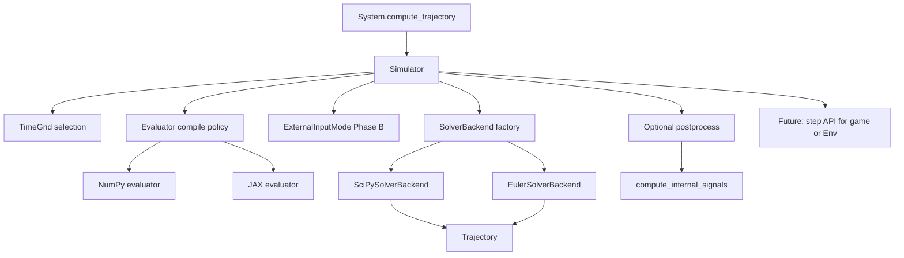

# Simulator backend refactor

Design plan for refactoring simulation around a **backend-pluggable integration layer**.

- Euler fixed-step
- **SciPy family** — `scipy.integrate.solve_ivp` with high-level presets selected by solver mode.

## Current implemented interface (sync)

The current prototype in `minilink/simulation/` exposes a single user-facing selector:

- `solver="euler"`
- `solver="scipy"`
- `solver="scipy_stiff"`
- `solver="scipy_max"`
- `solver="scipy_ultra"`

`Simulator` translates this high-level key into low-level backend options (`method`, `rtol`, `atol`, `use_jac`) and passes them to `SciPySolverBackend`.

`compile_backend` stays orthogonal:

- `compile_backend="numpy"` or `compile_backend="jax"`
- for `scipy_stiff`, Jacobian is applied only when `compile_backend="jax"` (via evaluator bridge).

**Priorities:** preserve default `System.compute_trajectory(...)` behavior; optimize the JAX performance path for compiled dynamics; leave clean extension points for batch rollouts and RL-style interactive stepping.

## Goals

- **Master `Simulator`** class as the single orchestrator (time grid, inputs, `Trajectory`).
- **`SolverBackend` ABC** for concrete solver implementations (SciPy, Euler).
- Unified integrator selection for the modes above.
- Stable defaults when backend/options are omitted.
- Fast path for compiled diagram / system dynamics.
- Explicit seams for future batch simulation and interactive stepping (`game()`, future env API).

## Naming glossary (avoid confusion)

| Name | Meaning |
|------|---------|
| **`solver`** | High-level user key: `"euler"`, `"scipy"`, `"scipy_stiff"`, `"scipy_max"`, `"scipy_ultra"`. |
| **`compile_backend`** | Dynamics evaluator backend: `"numpy"` or `"jax"`. |
| **`SolverBackend`** (ABC) | Python class implementing one stepping strategy (`SciPySolverBackend`, `EulerSolverBackend`). |

**Rule:** solver selection and compile backend are orthogonal. Example: `solver="scipy_stiff"` can run with either compile backend, but Jacobian acceleration is active only with JAX evaluator.

## Current context (what we reuse)

| Area | Location |
|------|----------|
| Offline simulation, `Simulator`, `Trajectory` | [`minilink/core/analysis.py`](../minilink/core/analysis.py) |
| `DynamicsEvaluator` and step/rollout hooks | [`minilink/compile/evaluator.py`](../minilink/compile/evaluator.py) |
| NumPy / JAX evaluators | [`minilink/compile/numpy_evaluator.py`](../minilink/compile/numpy_evaluator.py), [`minilink/compile/jax_evaluator.py`](../minilink/compile/jax_evaluator.py) |
| Interactive loop (`game`, Euler substeps) | [`minilink/graphical/animation.py`](../minilink/graphical/animation.py) |

## Proposed architecture

**Single master `Simulator`** (orchestrator) + **`SolverBackend` ABC** (implementations). The simulator owns run configuration, time grid, and `Trajectory` assembly; solver backends own only how state is advanced.



## Master `Simulator` (orchestrator)

**Role:** one concrete class users call; it does **not** subclass per integrator. It coordinates:

| Responsibility | Notes |
|----------------|--------|
| `sys.refresh()`, `x0` validation | Before integration |
| Time grid | `select_time_vector` — continuous vs discrete; `t0`, `tf`, `dt`, `n_steps` |
| `solver` → backend+options mapping | `"euler"` and SciPy presets map to backend key + low-level options dict |
| `compile_backend` | `"numpy" \| "jax"` for evaluator compilation |
| Build `DynamicsEvaluator` or `None` | `DiagramSystem.compile(...)`; leaf systems may use `sys.f` / `fsim` |
| **`ExternalInputMode`** (Phase B) | Resolve (a–c) → per-step `u` or closed RHS for SciPy |
| **Delegate** | `self._solver_backend.integrate(...)` or equivalent |
| **Assemble** | `Trajectory(x, u, t)`; optional `show` plotting |
| **Post** | `compute_internal_signals` unchanged |
| **SciPy debug** | After a SciPy run, keep **`Simulator.scipy_last_solution`** in sync (e.g. copy from `SciPySolverBackend.last_solve_ivp_solution`) so existing callers and tests keep working |

Optional future: expose a **single-step** helper that reuses the same `SolverBackend` for `game()` / RL-style loops without duplicating Euler logic.

## Abstract `SolverBackend` (ABC)

**Role:** abstract base class for **solver** implementations. Subclasses implement one integration strategy; they do **not** own time-grid policy or `Trajectory` construction beyond returning arrays the orchestrator can pack.

**Suggested name:** `SolverBackend` (or `AbstractSolverBackend` if you want the ABC explicit in the name).

### Canonical `integrate` API (single source of truth)

The doc previously showed two slightly different signatures; use **one** contract and evolve it in phases.

**Phase A — evaluator-centric API (current code in** `minilink/simulation/solver_backends.py` **)**

- **Nominal / free path:** `integrate(evaluator, times, x0, args=None) -> x` only.  
  Orchestrator passes **`x0`** explicitly (normally **`sys.x0`**, overridable at simulate time).  
  **`times`** is the clock; **`args`** is backend-only (e.g. SciPy `solve_ivp` kwargs).
- **Forced path:** `integrate_forced(evaluator, times, u, x0, args=None) -> x` with **`u`** shape `(m, n_pts)` aligned with **`times`**.

```python
class SolverBackend(ABC):
    @abstractmethod
    def integrate(self, evaluator, times, x0, args=None) -> np.ndarray: ...

    @abstractmethod
    def integrate_forced(self, evaluator, times, u, x0, args=None) -> np.ndarray: ...
```

- **`Simulator`** builds **`u_traj`** / **`Trajectory`** from **`get_u_from_input_ports`** where needed; backends return **state `x` only**.
- **`SciPySolverBackend`:** may store **`last_solve_ivp_solution`**; **`Simulator`** mirrors **`scipy_last_solution`**.

**Concrete subclasses (current):**

| Class | Behavior |
|-------|----------|
| `SciPySolverBackend` | `solve_ivp`; RHS from `evaluator` or `fsim`; supports `input_spec` for closed RHS when needed |
| `EulerSolverBackend` | Current explicit Euler loop (diagrams may use `evaluator.f`) |

**Registry / factory:** `Simulator._parse_solver(...)` maps the high-level solver key to `(backend_key, solver_backend_options)` and `_select_backend(...)` instantiates the backend class.

## Design decisions (v1)

- **Single orchestrator `Simulator`**; variability lives in **`SolverBackend` ABC** subclasses, not in multiple `Simulator` subclasses.
- High-level solver API: `"euler" | "scipy" | "scipy_stiff" | "scipy_max" | "scipy_ultra"`.
- RHS construction centralized so backends receive either NumPy-safe or JAX-compiled callables as appropriate.
- Adaptive / error-controlled integration stays on **SciPy**.

## Interfaces and contracts

### Where `integrate(...)` should live

**Recommendation:** implement state advancement in **`SolverBackend` ABC** subclasses (called by **`Simulator`**), **not** as the only API on `JaxDiagramEvaluator`.

**Rationale**

- `DynamicsEvaluator` is the **dynamics** contract: `f(x, u, t)`, `f_ivp`, outputs, optional parametric tiers — compiled graph, frozen params, nominal `u` snapshot.
- **Orchestration** (time grid, `input_spec`, choosing compile backend, building `Trajectory`) belongs on **`Simulator`**. **Stepping** (SciPy loop, Euler loop, `lax.scan`) belongs in **`SolverBackend` subclasses** — not duplicated on `JaxLeafEvaluator` / `JaxDiagramEvaluator` beyond JIT primitives below.

**On the JAX evaluator (compiled primitives)**

| Primitive | Role |
|-----------|------|
| JIT’d `f`, `f_ivp`, `h`, `outputs` | Core RHS for any backend |
| `euler_step`, `rk4_step` (JIT) | Small steps for loops, `game()`, future `Env.step` |
| `rollout_fixed_u` / `scan_integrate_fixed_grid` | Fixed-step rollout given `u_seq` of shape `(N, m)` via `lax.scan` |

**In the integrator / backend**

| Operation | Role |
|-----------|------|
| `SolverBackend.integrate(...)` + `ExternalInputMode` | Resolves inputs (a–c); SciPy / Euler |
| SciPy `solve_ivp` wrapper | Inside `SciPySolverBackend` |

**Summary:** high-level `integrate(tf, x0, t0)` is not a method on `JaxDiagramEvaluator`; **`Simulator` delegates** to **`SolverBackend.integrate`**.

### Proposed types (sketch)

```python
# External ports aggregate to input vector u (length m).

class ExternalInputMode:
    """How u is determined over the simulation interval."""

class NominalInputs(ExternalInputMode):
    """(a) Default/nominal port values — compile snapshot / get_u at t0."""

class ConstantInputs(ExternalInputMode):
    """(b) u constant in time, shape (m,)."""

class SeriesInputs(ExternalInputMode):
    """(c) u on knot times; ZOH or linear between knots."""
    # t_u: (K,), u: (K, m), hold: "zoh" | "linear"

# Optional later: CallableInputs(u_fn) with u_fn(t) -> u;
# discretize for full JAX if needed.
```

```python
# High-level solver selection

solver in {
    "euler",
    "scipy",
    "scipy_stiff",
    "scipy_max",
    "scipy_ultra",
}
```

```python
class DynamicsEvaluatorProtocol(Protocol):
    n: int
    m: int
    backend: str  # "numpy" | "jax"
    def f(self, x, u, t=0.0): ...
    def f_ivp(self, x, t=0.0): ...
```

Concrete **`SolverBackend`** subclasses: `SciPySolverBackend`, `EulerSolverBackend` (see canonical `integrate` above).

```python
class JaxEvaluatorExtras(Protocol):
    def euler_step_jit(self, x, u, t, dt): ...
    def rk4_step_jit(self, x, u, t, dt): ...
    def rollout_fixed_u(self, x0, u_seq, t0, dt):
        """u_seq: (N, m) -> x_seq (N+1, n)."""
        ...
```

### External input modes (a–c)

| Mode | Meaning | RHS |
|------|---------|-----|
| **(a)** | Nominal / default ports | `f_ivp(x, t)` ≡ `f(x, u_nom, t)` |
| **(b)** | Constant `u` | `f(x, u_const, t)` |
| **(c)** | Time series on knots | `u_k = sample(t_k, series)` then `f(x, u_k, t_k)` |

For adaptive SciPy, mode **(c)** uses `f(t, x) = f_dyn(x, u(t), t)` with `u(t)` from interpolation — implemented **once** in the backend.

### Diagram Sources vs simulator-level `u`

**Do not require** Source blocks for (b) and (c).

- **Simulator / `ExternalInputMode`:** best default for experiments, controls, and tests — same `f(x,u,t)`, minimal wiring, aligns with Euler paths that sample `get_u_from_input_ports(t)` when using nominal / default behavior. (The plan text may say “input spec” informally; the type name is **`ExternalInputMode`** / subclasses.)
- **Source blocks:** use when the excitation is **part of the reusable model**, or generated **inside** the diagram.

**Consistency:** the same aggregated `u` (length `m`) must feed `evaluator.f(x, u, t)` whether `u` comes from wired Sources or from the simulator — tests should enforce parity.

### Equivalence: closing over `u(t)` vs Source + diagram

Forming \(\dot x = g(x,t) := f(x,u(t),t)\) in the integrator by closing over a tabulated or interpolated \(u(t)\) is **mathematically the same** as a diagram where a time-varying Source feeds the external ports **if** that Source outputs the **same** \(u(t)\).

That is **not** two different dynamical laws; it is two ways to build the same \(g(x,t)\):

| Aspect | Simulator injects `u(t)` | Source in diagram |
|--------|-------------------------|-------------------|
| Math | \(g(x,t) = f(x,u(t),t)\) | Same when the source output equals \(u(t)\) |
| IR | `u` is **run data** | `u` is **part of the graph** |
| State | Pure \(u(t)\) adds no state | Stateful filters/delays add state — then diagram ≠ pure injection unless modeled explicitly |

Using a full diagram **only** to apply a simple forcing (step, sine, schedule) is often **overkill**; simulator-level **`ExternalInputMode`** keeps forcing lightweight. Use blocks when the signal is **model structure** or coupled to other subsystems.

## Package layout (prototype → library)

**Preferred:** new package **`minilink/simulation/`** so integration code is grouped and `core` stays smaller.

| Path | Role |
|------|------|
| [`minilink/simulation/__init__.py`](../minilink/simulation/__init__.py) | Public exports: `SolverBackend`, `get_solver_backend`, concrete backends |
| [`minilink/simulation/solver_backends.py`](../minilink/simulation/solver_backends.py) | **`SolverBackend` ABC**; Phase A implementations + registry |
| [`minilink/simulation/types.py`](../minilink/simulation/types.py) (new, Phase B) | `ExternalInputMode` hierarchy, `IntegratorBackend` literals / enum |

[`minilink/core/analysis.py`](../minilink/core/analysis.py) imports from **`minilink.simulation`** and delegates `solve()` to the selected backend. Alternative (not preferred): colocate `solver_backends.py` under `minilink/core/` — only if you want zero new package.

## File-level change plan

| File | Change |
|------|--------|
| [`minilink/core/analysis.py`](../minilink/core/analysis.py) | **`Simulator`** orchestrator: time grid, evaluator factory; delegate `solve()` to **`SolverBackend`**; set **`scipy_last_solution`** from SciPy backend when applicable; Phase B: `input_spec` / `compile_backend` |
| **`minilink/simulation/`** (new package) | See table above |
| [`minilink/compile/evaluator.py`](../minilink/compile/evaluator.py) | Align `f_ivp` / `as_scipy_rhs` with `ExternalInputMode` (Phase B); keep base as dynamics + small hooks |
| [`minilink/compile/jax_evaluator.py`](../minilink/compile/jax_evaluator.py) | JIT steps + `rollout_fixed_u`; **no** sole ownership of full `integrate` |
| [`minilink/core/framework.py`](../minilink/core/framework.py) | Extend `compute_trajectory` minimally for backend/options |
| [`minilink/graphical/animation.py`](../minilink/graphical/animation.py) | No breaking changes in v1; optional seam for shared step API with backends |

## Testing strategy

- Extend [`tests/unittest/test_compile_pipeline.py`](../tests/unittest/test_compile_pipeline.py) and add backend-focused tests.
- Parity: `scipy` family modes under `compile_backend="numpy"` vs `"jax"` on representative systems.
- Smoke performance via existing manual scripts under [`tests/manual/`](../tests/manual/).

## Future hooks (not all in v1)

- Batch simulation (vectorized IC / parameters / inputs) in a separate module reusing JAX rollout primitives.
- RL / Gym-style `reset` / `step` on top of the same stepping interface.
- Real-time: optional wall-clock vs sim-time decoupling in `game()` (accumulator, max substeps).

## Risks and mitigations

- **JAX compile latency:** cache JIT’d rollouts per shape/dtype/options; benchmark warm vs cold.
- **Behavior drift across backends:** parity tests on mechanical, physics, and diagram examples.
- **API churn:** defaults preserve old behavior; deprecate only if necessary.

## Implementation checklist

**Phase A (first merge)**  
1. Add **`minilink/simulation/`** with **`SolverBackend` ABC**, `SciPy` / `Euler` backends, matching **Phase A `integrate`** signature.  
2. Refactor **`Simulator.solve()`** to delegate to the backend; preserve **`Trajectory`** layout and **`Simulator.scipy_last_solution`**.  
3. Unit tests: same trajectories as before on a few representative systems.

**Phase B (features)**  
4. Add **`simulation/types.py`**: `ExternalInputMode` typed helpers where needed.  
5. Keep extending JAX evaluator utilities (`euler_step`, `rollout_fixed_u`) for future acceleration paths.  
6. Parity tests across solver presets (`scipy`, `scipy_stiff`, `scipy_max`, `scipy_ultra`) and compile backends.

**Phase C (optional)**  
7. Non-breaking interactive seam in [`animation.py`](../minilink/graphical/animation.py) for `game()` / future env reuse.
