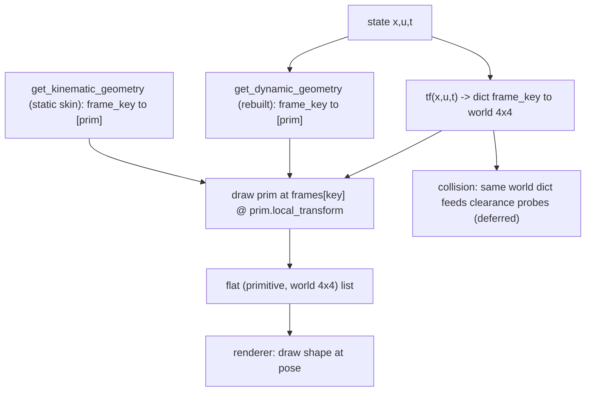

# Upgraded Kinematic Contract for `System`

Short-term goal: a clean, reviewed kinematic contract on `System` that (1) lets a
custom plant declare quick geometry with little ceremony, (2) lets a complex
"skin" (e.g. a detailed car) be reused/swapped, and is shaped so collision,
overlays, and MPC plans plug in later without re-plumbing.

Decisions locked in:

- Same **three hooks** as today; only the output types improve (lists -> keyed
  dicts) and the dead dynamic hook is revived.
- Frames are **string-keyed** (ports-style), returning **global (world)
  transforms**. No parent/child tree; build one internally later only if a deep
  chain needs it.
- `tf` (the renamed transforms hook) carries math for **independent frames
  only**; fixed graphical offsets ride on a `primitive.local_transform`, never as
  extra frames.
- Static skin and dynamic geometry are **both `dict[frame_key, list[prim]]`**,
  both posed by the frames dict.
- `tf` is an **equation path**: bare signature, `xp = array_module(x)` idiom, **no
  `float(x[i])` casts**, native-array in/out — so it is JAX-traceable and reusable
  for collision (the later collision-reuse phase). `get_kinematic_geometry`/`get_dynamic_geometry` are
  rendering-only (NumPy, may cast).
- **Default viz is empty:** base `System`/`StaticSystem`/`DynamicSystem` return
  `{}` for `tf` and `get_kinematic_geometry` (no per-state debug points). A
  `debug_state_skin()` opt-in helper can be offered for quick state dashboards.
- **No new dataclasses**; reuse is plain functions.

## Method names

The frames hook is a state-function like `f`/`h`, so it gets a bare,
textbook-style name (`tf`, echoing ROS tf), not a `get_`-prefixed verb. The two
geometry hooks return data/skins (not equations) and stay descriptive.

| Today | New name | New return |
| --- | --- | --- |
| `get_kinematic_transforms(x,u,t)` | `tf(x,u,t,params)` | `dict[str, 4x4 world]` |
| `get_kinematic_geometry()` | `get_kinematic_geometry()` (kept) | `dict[str, list[primitive]]` (skin) |
| `get_dynamic_geometry(x,u,t)` | `get_dynamic_geometry(x,u,t,params)` (kept, revived) | `dict[str, list[primitive]]` |
| `get_camera_transform(x,u,t)` | removed; replaced by camera hints + boundary resolver (see Camera section) | 4x4 camera computed by animator |

`tf` reads as `T = sys.tf(x, u, t)` next to `dx = f(x,u)` / `y = h(x,u)`.
Alternatives considered: `kinematic_frames()` (clear but verbose), `transforms()`
(generic, overloads the old name), `frames()` (rejected — collides with
animation/video frames in the animator). The two geometry hooks could later be
harmonized to bare names too, but that is out of scope here.

## Core proposal: keyed frames + frame-keyed geometry

Today `get_kinematic_transforms` returns a flat list that must match
`get_kinematic_geometry` index-for-index (see
[minilink/core/system.py](../minilink/core/system.py),
[dynamic_bicycle.py](../minilink/dynamics/catalog/vehicles/dynamic_bicycle.py)).
Replace with:

- `tf(x,u,t,params)` -> `dict[str, 4x4 world transform]` (named frames; e.g.
  `"body"`, `"wheel_fl"`) — math only for independent frames.
- `get_kinematic_geometry()` -> `dict[str, list[primitive]]` (static skin).
- `get_dynamic_geometry(x,u,t,params)` -> `dict[str, list[primitive]]` (rebuilt
  each frame).

Every primitive is drawn at `frames[key] @ primitive.local_transform`. The
animator validates that geometry keys are a subset of frame keys (an unknown key
fails loudly; today only a length mismatch is caught).



## Frames vs graphical offsets (keep base-class math minimal)

Rule: **`tf` holds math only for independent frames** — rigid bodies/joints whose
pose needs `(x,u,t)` kinematics. Fixed decoration offsets are placement, not
kinematics, and must not become frames.

Mechanism: one optional attribute on the `GraphicPrimitive` base —
`local_transform` (identity default, plain `np.ndarray`, **not** a dataclass).
The renderer draws at `frames[key] @ prim.local_transform`. So several decorations
hang off `"body"` at different offsets with **no** extra frames and **no** math in
`tf`. Most primitives already carry `center`; `local_transform` is the general
rigid-offset escape hatch for the rest.

## Standard frame-key vocabulary

Frame keys are programmatic ids -> lowercase snake_case (like port ids); diagram
subsystem frames are auto-prefixed `sys_id:key`. A plant exposes the **superset**
its skins need; a skin keys only the subset it draws (`skin keys subset tf keys`),
so skins interchange across models that share the vocabulary.

- World / generic: `world` (identity root; world-fixed geometry, scenes,
  world-space dynamic primitives), `body` (single rigid-body pose), `com`
  (optional center of mass).
- Serial chains (manipulators, multi-pendulums): `joint{i}` (i = 0..N, `joint0` =
  base mount), `link{i}` (i = 0..N-1, origin at proximal joint, oriented along the
  link), `ee` (end-effector / tool tip).
- Vehicles: `axle_front`, `axle_rear` (centerline axles - bicycle model, steering
  arrows); `wheel_fl`, `wheel_fr`, `wheel_rl`, `wheel_rr` (four corners - cars /
  3D skins). A bicycle plant exposes both axle and corner frames so the 2D
  centerline skin and the 3D four-wheel skin both attach to one `tf`.

Note: **`world` is implicit, never returned by `tf`.** The animator injects
`"world" -> I` (identity) into the merged frame dict before posing, so a plant
keys world-fixed geometry to `"world"` without `tf` ever emitting `"world": I`.
`tf` returns only the **independent frames** it actually computes; the empty `tf`
(`{}`) still has a usable `world`. Key-subset validation treats `world` as always
present, so it never trips the "unknown key" check.

This is what lets `car_skin_2d` (keys `body`, `axle_front`, `axle_rear`) and
`car_skin_3d` (keys `body`, `wheel_*`) share a single bicycle `tf`.

## Skin contract: two ergonomic tiers (no dataclasses)

Coupling is by **frame-key strings** only; both tiers return the same plain
`dict[str, list[primitive]]`.

### Tier 1 - quick geometry (use-case 1)

```python
def get_kinematic_geometry(self):
    return {"body": [vehicle_body(self.L, self.W)], "wheel": [wheel_box()]}

def tf(self, x, u, t):
    W_T_body     = SE2(x[0], x[1], x[2])
    body_T_wheel = SE2(self.a, 0.0, delta)
    W_T_wheel    = W_T_body @ body_T_wheel
    return {"body": W_T_body, "wheel": W_T_wheel}
```

Conventions that avoid extra machinery:
- Multiple primitives on a frame = list value.
- Same primitive at N places (4 wheels) = N keyed frames sharing one primitive
  instance (`"wheel_rl"`, ...).
- A fixed offset within a frame = `primitive.local_transform` (or the primitive's
  own `center`/local `pts`), not a new frame.

### Tier 2 - reusable / swappable complex skin (use-case 2)

Skin **factory functions** (plain functions in `graphical/catalog/skins.py`)
take the plant and return the dict, keyed by an agreed frame vocabulary:

```python
def car_skin_2d(plant, color="blue") -> dict[str, list]: ...
def car_skin_3d(plant, color="#151922") -> dict[str, list]: ...
```

**Swap mechanism (LOCKED - Option B):** the contract hook stays
`get_kinematic_geometry()`; plants carry an opt-in attribute `skin` (a callable
`(plant) -> dict`, or `None`) and the base method delegates:

```python
class System:
    skin = None
    def get_kinematic_geometry(self):
        return {} if self.skin is None else self.skin(self)
```

So `DynamicBicycle` sets `skin = car_skin_2d`; a 3D look is one assignment
`car.skin = car_skin_3d` (same `tf`, same `f`, both factories emit keys
`"body"`, `"wheel_rl"`, ...). `skin : get_kinematic_geometry :: params : f` -
method is the contract, attribute is the policy. **No** `DynamicBicycleCar3D`
class (retired); **do not** reassign the method itself (instance-assigned
functions receive no `self`). `merge_skins(*skins)` composes when needed.

## Dynamic-primitive pipeline

Two layers; **both are `dict[frame_key, list[prim]]` posed by the frames dict**:

- **Static skin** - geometry built once (`get_kinematic_geometry`), re-posed each
  frame. Body, wheels, links: shape fixed, pose moves.
- **Dynamic** - `get_dynamic_geometry(x,u,t,params)` rebuilt each frame; keyed to
  a frame too. Velocity/force arrows, torque arcs key to the body/wheel frame;
  world-space items (MPC horizon, trail) key to `"world"`.

Posing dynamic geometry by a frame is a real cleanup: an arrow built in
body-local coords keys to `"body"`, and `frames["body"]` supplies the rotation —
deleting today's manual `c,s = cos/sin(theta); vfx = c*vx - s*vy ...` per-vector
world rotation. For the dynamic bicycle, `vx,vy` are already body-frame, so the
velocity arrow is local along `(vx,vy)`.

Per-frame animator pipeline. `flatten_draw_list(frames, kinematic, dynamic)` is the
shared helper: it consumes three already-resolved dicts and emits
`(prim, frames[k] @ prim.local_transform)` for every primitive. The animator owns
the per-drawable resolution - the **only** place the two signatures differ - so the
helper itself is signature-agnostic:

1. primary (state-driven): resolve `frames = sys.tf(x, u, t)` (world dict),
   `kinematic = sys.get_kinematic_geometry()` (cached once),
   `dynamic = sys.get_dynamic_geometry(x, u, t)`, then call `flatten_draw_list`.
2. overlays (time-only): resolve `frames = o.tf(t)` (world implicit),
   `kinematic = o.get_kinematic_geometry()` (cached), `dynamic = o.get_dynamic_geometry(t)`,
   then call the **same** `flatten_draw_list`.
3. `camera = resolve_camera(primary.camera_hints, frames, t)` (animator boundary;
   `animate(camera=...)` overrides; overlays carry no hints).
4. renderer draws the single concatenated `(primitive, world 4x4)` list (unchanged:
   "draw shape at pose").

This retires both hacks: `t` is a real argument (no `time_channel_matrix` /
`T[3,3]`), and arrow length is real geometry (no column-norm scaling). First-class
primitives `Arrow`/`TorqueArrow` keep authoring short - they build their own point
geometry internally (via private `arrow_pts` / `torque_arc_pts`), and the frame
supplies world orientation:

```python
def get_dynamic_geometry(self, x, u, t):
    v_local = x[3:5]  # body-frame velocity
    return {"body": [Arrow(base=(0, 0), vector=v_local, scale=0.2, color="red")]}
```

`HorizonPolyline`/`TrajectoryPolyline` keep their data internally and expose
`points_at(t)` (today's `compute_pts`, `t` passed honestly). Camera scale stays in
`T[3,3]` because the camera is not a kinematic frame.

### Static shape vs dynamic reshape (renderer modes)

The kinematic/dynamic split is not just authoring sugar - it is exactly the
distinction a **retained-mode** renderer (meshcat, three.js) needs, and the renderer
contract already encodes it: `draw_frame(primitives, transforms, t, camera)` takes a
**stable primitive list + per-frame transforms**. Three tiers fall out, with **no
`is_dynamic` flag** - the producing hook (and object identity) *is* the signal:

| Tier | What changes per frame | Source | meshcat |
| --- | --- | --- | --- |
| World-fixed static | nothing | `get_kinematic_geometry` keyed to `world` | upload once, never touch |
| Rigid: static shape + moving transform | only the 4x4 | `get_kinematic_geometry` + `tf` | upload geometry **once**, `setTransform` per frame |
| Dynamic reshape | the vertices | `get_dynamic_geometry` | re-stream geometry each frame |

`get_kinematic_geometry()` is **cached once**, so it returns the *same primitive
objects* every frame (geometry unchanged -> transform-only update); `get_dynamic_geometry`
returns *fresh* objects (geometry changed -> re-upload). This replaces today's
`T[3,3]` time/amplitude channel + `compute_pts` mutation: a reshaped primitive is
simply rebuilt by the dynamic hook, never mutated through a transform slot.

**Initially** (the contract slice), `flatten_draw_list` flattens everyone to `(primitive, world 4x4)`
(immediate-mode parity for matplotlib/pygame), so renderers are untouched. The split
is preserved in the hooks, so a later meshcat phase can map cached-skin nodes to
upload-once + `setTransform` and re-stream only the dynamic hooks - a renderer-internal
optimization, **not** a contract change. (Stable node identity comes from the
`(drawable, frame_key, index)` of each entry.)

## Where dynamic data lives (instantaneous vs history-bound)

Two kinds of dynamic content share one mechanism but differ in data ownership.

- **A. Instantaneous** - fully determined by `(x,u,t,params)`: arrows, torque
  arcs, deformation. Rebuilt by `System.get_dynamic_geometry`; **no data stored**.
- **B. History/trajectory-bound** - needs more than the instant: executed trail,
  MPC plan history (predicted futures), reference path, obstacles. **Not**
  reconstructable from `(x,u,t)`; the data is owned by an object, **never the
  `System`**.

| Content | From (x,u,t)? | Data lives in |
| --- | --- | --- |
| arrows, torque arc, deformation | yes | nowhere - recomputed by `System` |
| executed trail | needs full traj | `TrajectoryPolyline(traj)` in a `SceneHistory` |
| MPC plan history | no (futures) | `HorizonPolyline(plans)` in a `SceneHistory` |
| reference path, obstacles | external | `Scene` (collision-first) -> `scene.as_visualizer()` |

Case-B data lives in the **dynamic primitive object itself**
(`HorizonPolyline(plans)` holds `list[(t_solve, Trajectory)]`), exposing
`points_at(t)`. Those primitives are owned by a `SceneHistory`, built at the
animation boundary (demo/planner), not on `sys`.

## Drawables vs geometry sources: combined at `animate`

There is **one drawable contract** - the same three hooks everywhere (`tf`,
`get_kinematic_geometry`, `get_dynamic_geometry`); the **only** difference is the
driving signal:

- a **state-driven drawable** (`System`/`DiagramSystem`) is a function of `(x,u,t)`,
  because its skin/arrows depend on state; only the **primary** is fed the played
  trajectory's `(x,u)`.
- an **overlay add-on** is **time-only** - the same hooks with `(x,u)` dropped:
  `tf(t)` / `get_kinematic_geometry()` / `get_dynamic_geometry(t)`, each with a `{}`
  default so an add-on overrides only the one hook it needs. It owns its own data
  (see *Overlay contract* below).

The animator runs the same `flatten_draw_list` on every drawable and concatenates
`[primary] + overlays` (one render path).

A **geometry source** implements no drawable contract; it **exports** an overlay -
exactly mirroring how `Scene` already exports a `Set`/`CostFunction` instead of
pretending to be one.

| Kind | Contract | Examples | Goes into `overlays=[...]` as |
| --- | --- | --- | --- |
| State-driven drawable | 3 hooks of `(x,u,t)` | `System`, `DiagramSystem` | itself (rendered static at a fixed pose unless wrapped in `Replay`) |
| Overlay add-on | same 3 hooks, **`t`-only** (`{}` defaults) | `Replay`, `SceneHistory` | itself |
| Geometry source (exports an overlay) | exports the `t`-only hooks | `Scene` | `scene.as_visualizer()` |

- **`System`** - the plant (3-hook contract); a `DiagramSystem` is one too
  (its `tf` prefixes `sys_id:frame`).
- **`Scene`** - a **collision-first source** in
  [planning/spatial/scene.py](../minilink/planning/spatial/scene.py) (`obstacles`,
  `workspace_fields`); it already exports
  `scene.clearance_field(robot).as_constraint()` and
  `scene.cost_field(robot).as_cost()`. The third, symmetric export is
  **`scene.as_visualizer()`** -> a `t`-only overlay (LOCKED - Option B). The
  **graphical-band** adapter owns the *default obstacle skin* in
  `get_kinematic_geometry()`: it maps each `core.geometry` `Shape`
  (`Box`/`Sphere`/`Union`) to a default `GraphicPrimitive` keyed to `world` (`tf`
  empty -> world-fixed; `get_dynamic_geometry` empty). This adapter is the natural
  home for the deferred render/SDF `Shape` unification. We **do not** bolt
  the drawable hooks onto the frozen planning `Scene` dataclass; passing a raw
  `Scene` into `overlays` is a category error and the animator rejects it with a
  "call `scene.as_visualizer()`" message (no silent auto-adapt - symmetry with
  `.as_cost()` is the whole point).
- **`SceneHistory`** - a `t`-only overlay holding time-indexed historical data (MPC
  plans, trails); implements only `get_dynamic_geometry(t)` (geometry rebuilt each
  frame via each primitive's `points_at(t)`), keyed to `world`. Built in the
  graphical band.
- **`Replay(drawable, trajectory)`** - a `t`-only overlay that **forwards** the
  wrapped drawable's three hooks at its own `x(t)`: `tf(t) = drawable.tf(*traj.sample(t), t)`,
  and likewise for the geometry hooks. Time-driven, not integrated, never a
  dynamical participant. Because it forwards (not flattens), the ghost keeps the
  wrapped `DiagramSystem`'s named frames + real skin.

```python
history = SceneHistory(horizon=HorizonPolyline(mpc_plans),
                       trail=TrajectoryPolyline(executed_traj))
# Scene exports an overlay; overlays pass directly:
sys.animate(traj, overlays=[scene.as_visualizer(), history])
```

The played-back trajectory is owned by the `Animator`; a trail holds a reference
and slices `t <= t_now` - it owns its *view*, not a copy.

### Overlay contract (add-ons: the `System` hooks, time-only)

An overlay is **not** a new contract: it is the **same three drawable hooks** with
`(x,u)` dropped, plus `{}` defaults so an add-on overrides only what it draws:

```python
class Overlay:                         # the add-on side of the one drawable contract
    def tf(self, t): return {}                    # dict[key, world 4x4]; world implicit
    def get_kinematic_geometry(self): return {}   # dict[key, [prim]]  (static shape, cached)
    def get_dynamic_geometry(self, t): return {}  # dict[key, [prim]]  (rebuilt each frame)
```

Rules:

- **One mental model.** Same `tf` / `get_kinematic_geometry` / `get_dynamic_geometry`
  as a `System`; the animator runs the same `flatten_draw_list` on it. The static
  vs. dynamic split is preserved (it is what retained-mode renderers need - see
  *Static shape vs dynamic reshape*).
- **Driven by playback `t` only**, never the primary's `(x,u)`. An overlay owns
  whatever state it needs: `SceneHistory` slices `points_at(t)` in
  `get_dynamic_geometry(t)`; `Replay` forwards its own trajectory;
  `Scene.as_visualizer()` is a static `get_kinematic_geometry()`.
- **No camera hints.** Camera selection is a `System`-only concern; overlays never
  steal the camera. To follow a non-primary, pass an explicit `camera=` callable or
  make it the primary.
- **Anything attached to the primary body is not an overlay** - it belongs in the
  primary's `get_dynamic_geometry` (which already has the primary's frames).

Which hook each add-on overrides:

| Overlay | Overrides | Nature |
| --- | --- | --- |
| `Scene.as_visualizer()` | `get_kinematic_geometry()` | static shape (obstacles) |
| `SceneHistory` | `get_dynamic_geometry(t)` | reshape (trail/horizon) |
| `Replay(drawable, traj)` | all three (forwarding) | static skin + named frames |

`Replay` is the bridge between the two driving signals - it just supplies the
wrapped drawable's `(x,u)` from a stored trajectory:

```python
@dataclass
class Replay:                          # state-driven drawable -> time-only overlay
    drawable: object                   # a System / DiagramSystem
    trajectory: object
    def tf(self, t):
        x, u = self.trajectory.sample(t)
        return self.drawable.tf(x, u, t)               # keeps the ghost's named frames
    def get_kinematic_geometry(self):
        return self.drawable.get_kinematic_geometry()  # real skin, cached once
    def get_dynamic_geometry(self, t):
        x, u = self.trajectory.sample(t)
        return self.drawable.get_dynamic_geometry(x, u, t)
```

So a moving `System` is never a bare overlay (it needs its own `(x,u)`); wrap it in
`Replay`. A bare `System` in `overlays` renders statically at a fixed pose.

### Two composition axes (and why scenes are not diagram blocks)

Rendering-only objects (`Scene`/`Replay`/`SceneHistory`) compose at `animate`,
**never** inside a diagram. There are two orthogonal axes:

- **Dynamics axis** (`>>`, `@`): composes `f`/`h`, ports, and stacked states.
  Every block contributes dynamical behaviour.
- **Render axis** (`animate(overlays=[...])`): composes drawables spatially /
  temporally; no ports, no state.

A scene/replay "block" would be `n=0` states with no ports and undefined `f`/`h`,
forcing `DiagramSystem` to special-case "rendering-only, skip me" through state
indexing, simulation, and linearization - polluting the core dynamics contract for
a purely visual concern. Keeping them on the render axis gives the same
composition (`[primary] + overlays`) without overloading `>>`.

### Deferred: shared `tf(t)` for moving scenes (planner upgrade)

Today the `Scene` visualizer is **world-fixed** (geometry keyed to `world`, no
frame math). Time-varying obstacles are already expressible through the obstacle
SDF's `t` argument (`scene.clearance(p, t)`), but there is no per-obstacle *frame*.
A future `Scene.tf(t) -> dict[str, world 4x4]` could pose obstacles for **both**
collision probes and the visualizer skin from one source of truth (the deferred
collision/render convergence). This is **out of scope now** and best revisited when
the planner is upgraded. The external visualization contract stays stable either
way: `scene.as_visualizer()` returns a drawable, so a later `tf(t)` slots in behind
it without changing the `overlays` API.

## Module placement (band split)

**Two core math modules, different concerns, both native-array only:**

- `core/kinematics.py` (new) - **rigid-body poses / transform algebra**.
  Native-array and **JAX-functional** (build with `xp.stack`/`xp.array`, no
  in-place index assignment, so `tf` traces). Two layers mirroring the course
  notes: a 3×3 orientation layer (`Rx`/`Ry`/`Rz`) and a 4×4 pose layer built on it
  (`SE3`, `SE2`, `translation`, `identity`, `inv`, `apply` — the last is
  `apply_transform` relocated + renamed from
  [robot.py](../minilink/planning/spatial/robot.py), call sites updated, no alias).
  State-aware / drawing
  sugar (`single_body_tf`, `link_frame`) stays **out** of core — in the catalog /
  graphical layer. No tree/resolver.
- `core/geometry.py` (exists) - **occupied space / SDF solids**. Stays separate;
  it composes with kinematics (body-frame shape probe placed by a world transform)
  but is a distinct concern. Not merged.

Centralization: transform math currently scattered (`apply_transform` in
planning, builders in graphical) moves into `core/kinematics.py` (as `apply`);
`robot.py` and
graphics import from there - one transform toolkit for collision and rendering.

**Rendering stays in the graphical band (messy/Python, may cast):**

- `GraphicPrimitive` classes + the new `local_transform` attribute,
  render-geometry builders `arrow_pts`/`torque_arc_pts`, ready-made shapes
  (`vehicle_body`, `wheel_box`, `spring_line`, `ground_line`) in
  `graphical/animation/primitives.py`, skin factory functions in
  `graphical/catalog/skins.py` (public; pure functions `(plant) -> dict`, see
  *Skin contract* above and [phase1](phases/phase1_foundation.md)), and camera
  (`camera_matrix`, `world_to_camera`, follow factories) in
  `graphical/animation/camera.py`.
- Deleted hacks: `scale_pose2d_matrix`, `arrow_transform`, `line_between_transform`,
  `time_channel_matrix`, `torque_pose2d_matrix`, `extract_amplitude`.

Deferred: render-shape vs SDF-shape unification (graphical `Box`/`Sphere`
vs `core.geometry` `Box`/`Sphere`) - one geometry attached to frames feeding both
render and collision. Note only; not in this slice.

Relocating transform helpers + removing the core->graphics camera import is an
architecture change -> approved scope (D4); touches the band layout, keep
[DESIGN.md §3](../DESIGN.md) in sync.

## Collision reuse (deferred)

`RobotBody`/`PlanarRigidBody.body_poses` already returns world poses per part
([robot.py](../minilink/planning/spatial/robot.py)). Converge it onto the same
world-frame dict: collision `Shape`s key to the same frames, so one FK feeds both
the rendered chassis and the clearance probes. Both consume world poses; no tree
needed.

## Use-case validation (standard workflows)

Walked the contract through real plants ([arms.py](../minilink/dynamics/catalog/manipulators/arms.py),
[dynamic_bicycle.py](../minilink/dynamics/catalog/vehicles/dynamic_bicycle.py),
pendulum family) to validate before implementation.

1. **Physical non-spatial sys (e.g. chemical plant).** `tf` is optional: by
   default it returns `{}` (D2 - nothing drawn, clean in diagrams), or override to
   build a schematic skin. A `debug_state_skin()` opt-in covers quick state
   dashboards.
2. **Quick-and-dirty class.** Two one-line dicts:
   `get_kinematic_geometry()` -> `{"body": [Circle(...)]}` and
   `tf(x,u,t)` -> `{"body": SE2(x[0], x[1], x[2])}`. Optional sugar: a
   `single_body_tf(x, ix=0, iy=1, ith=2)` catalog helper for the planar-rigid-body case.
3. **Many-DOF manipulator.** Frames scale with DOF (`link{i}`, `joint{i}`; 11 keys
   for a 5-link arm) — a dict handles what fragile lists could not. `tf` is the FK
   chain; torque arcs are `get_dynamic_geometry` keyed to each link/joint frame,
   which **removes the manual `start_angle = pi/2 - angle` world-orientation
   math** (the frame carries it). The 5 arm classes share `_planar_*` helpers, so
   they migrate together.
4. **Vehicles: swap dynamics x geometry without duplication.** Three independent
   axes: `f` (dynamics), `tf` (frames; depends on state layout), `skin` (visual).
   New dynamics reuse a `car_skin_*` factory; new skins reuse `tf`. The only
   per-model wrinkle: steer angle is an input in `DynamicBicycle` but a state in
   `...RateInputs` -> a one-line steer-source override, not 85 duplicated lines.
5. **Robot in a scene with context (path, obstacles, other robots).** Two
   implications: (a) `animate` must take **multiple drawables**, since other
   robots are `System` drawables too -> the animator merges `[primary] + others +
   scenes + histories`; (b) other robots move on their own trajectories while the
   timeline plays one -> add a **`Replay(drawable, trajectory)`** overlay that at
   time `t` renders `drawable`'s `tf`+`skin` at `x(t)`. `Replay` also covers the
   executed-run "ghost".
6. **Historical data.** `SceneHistory` with `TrajectoryPolyline`/`HorizonPolyline`
   for line history; `Replay` for full-skin ghosts. Both index by `t`.

Also verified: diagram animation (`DiagramSystem.tf` slices local `x,u`, prefixes
`sys_id:frame`; static controller returns `{}`), modal animation
([analysis/modal.py](../minilink/analysis/modal.py) is a call site to migrate), and
meshcat (named frames map cleanly to scene-graph nodes; the contract slice keeps flattening
to `(primitive, world 4x4)` so renderers are untouched).

## Decisions

Resolved:

- **D1 - `tf` native-array now (LOCKED).** Write `tf` JAX-traceable from day one
  (no `float()`), so collision can reuse it later.
- **D2 - default viz `{}` (LOCKED).** Base `System`/`StaticSystem`/`DynamicSystem`
  return `{}`; no per-state debug points by default.
- **D3a - multi-drawable `animate` (LOCKED).** `animate(traj, overlays=[...])`
  where overlays are **t-only add-ons** (`scene.as_visualizer()`, `SceneHistory`,
  `Replay`); the animator merges `[primary] + overlays`. Raw `Scene` and bare moving
  `System`s are rejected — call `.as_visualizer()` / wrap in `Replay`.
- **D4 - atomic migration (LOCKED).** The no-alias rename migrates *all*
  `get_kinematic_*` overrides in one change (~5 shared-helper rewrites cover most
  of the ~20); the whole catalog will be fixed.

- **D3b - camera system (LOCKED):** hints-as-data + boundary resolver + callable
  override + priority-based source selection (full design below).

## Camera system (D3b)

Camera stays **out of `tf`** (would pollute the native-array equation path that
collision traces) and keeps `scale` in `T[3,3]` (the camera is not a frame). It is
a **hint**, like `x0`/`traj` — not part of the contract. Four layers:

### Layer 1 - hints as data on `System` (no method)

Plain attributes set in `__init__` (no `get_camera_transform`, no `camera_matrix`
import in core — the 4x4 is built at the boundary, removing today's core->graphics
back-reference):

```python
self.camera_scale = 10.0
self.camera_target = np.zeros(3)    # look-at, or offset when following
self.camera_plot_axes = (0, 1)      # which world axes -> screen H/V
self.camera_follow_frame = None     # str key into tf(), or None
self.camera_priority = 0.0          # tie-break when several sources exist
```

`DynamicBicycle` follow-cam becomes `self.camera_follow_frame = "body"` (deletes
its `get_camera_transform` override).

### Layer 2 - default resolver (animator)

Per frame, from the selected source's hints + merged `tf` frames:
`target = frames[camera_follow_frame][:3,3] + camera_target` if following else
`camera_target`; then `camera_matrix(target, camera_plot_axes, camera_scale)`.

### Layer 3 - override contract (power user)

`animate(camera=...)` accepts anything that resolves to a 4x4: a constant
`np.ndarray` (fixed), or a callable `camera(frames, x, u, t) -> 4x4` (cinematic /
state zoom / follow any frame). That callable is the whole contract - no class.
Optional ready-made factories in `graphical/animation/camera.py`
(`follow_frame_camera("body", scale=12)`, `fixed_camera(target, scale)`) return
such callables (Option-3 ergonomics without a class hierarchy).

### Layer 4 - source selection (diagram / multi-object)

Only **state-driven drawables** carry camera hints (the primary and, inside a
diagram, its subsystems); **overlays never carry hints** and so never steal the
camera. When several hint-carrying sources exist, the animator picks one
deterministically:

1. explicit `camera=` override wins;
2. else highest `camera_priority`;
3. tie-break: prefer sources with non-empty `get_kinematic_geometry()` (things
   that actually draw);
4. final tie-break: the **primary** drawable (the `sys` animated / first in list).

Common cases need zero config: `controller @ plant` auto-selects the plant (the
`StaticSystem` controller has empty skin, step 3); a robot with overlaid scenes /
ghosts keeps the primary robot, since overlays have no hints. To follow a
non-primary (e.g. a `Replay` ghost), pass an explicit `camera=` callable or make it
the primary - there is no `camera_from` for overlays in the simple contract.

## Catalog migration order (~20 `get_kinematic_*` overrides)

1. Vehicles (`dynamic_bicycle.py`, `steering.py`) - highest pain, skin payoff.
2. Pendulum family - dynamic-primitive (torque arc) validation.
3. Manipulators.
4. Aerial / marine / misc.
5. Engines (`world.py`, `ancf_tire_jax.py`).
6. MPC / trajopt demo subclasses -> `Scene`/`SceneHistory` (deferred to the overlay phase).
