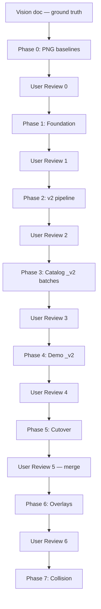

# Kinematic Contract — Master Plan Overview

## Ground truth

The **vision, architecture, and locked decisions** live in
[`00_original_vision.md`](00_original_vision.md).

This document is the **implementation playbook**: how we get there safely, what
each phase delivers, and the gates between them. Companion files:

- [`02_demo_use_cases.md`](02_demo_use_cases.md) — destination user API.
- [`03_kinematics_core_math.md`](03_kinematics_core_math.md) — reusable core math.
- [`phases/`](phases/) — one detailed plan per phase.

Do not duplicate the full design rationale here — refer to the vision doc for
frame vocabulary, module placement, camera layers, and collision notes.

---

## Goal (one paragraph)

Replace index-aligned `get_kinematic_geometry` / `get_kinematic_transforms` lists
with **string-keyed frames** (`tf`) and **frame-keyed geometry dicts**, revive
`get_dynamic_geometry`, retire `T[3,3]` side-channels and column-norm arrow hacks,
and compose plants with scenes, MPC histories, and replay ghosts at
`animate(overlays=[...])` — with **pixel-identical** matplotlib output to today's
rendering.

---

## Execution principles

1. **Parallel v2 pipeline** — build new alongside old; compare `animate()` vs
   `animate_v2()` until cutover.
2. **Old defaults frozen until Phase 5** — base `System` debug-point skin stays on
   old hooks through Phases 0–4; only `_v2` hooks use `{}`.
3. **PNG pixel parity** — primary sign-off measure (matplotlib Agg, fixed DPI).
4. **Validation gate + user review** after every phase; no phase N+1 until both
   pass.
5. **Temporary `_v2` suffix** — dev-branch only; grep-clean at Phase 5 cutover.

---

## Success criteria

| When | Criterion |
| --- | --- |
| Phases 0–4 | Old pipeline unchanged; all pytest green; PNG baselines match |
| Phases 3–4 | `render_v2()` pixel-identical to `render()` per migrated plant |
| Phase 5 | Zero `_v2`; final API; base `{}` default; hacks deleted; docs synced |
| Phase 6 | MPC demos use overlays; same pixels, less boilerplate |
| Phase 7 | `RobotBody` shares `tf` frame dict with renderer |

---

## Phase map

| Phase | Scope | Automated gate | User review | Detail |
| --- | --- | --- | --- | --- |
| **0** | PNG baseline harness | Baseline pytest green | Spot-check 3–4 PNGs | [phase0](phases/phase0_baselines.md) |
| **1** | Additive foundation | Full pytest; baselines unchanged | Skim module APIs | [phase1](phases/phase1_foundation.md) |
| **2** | `Animator2` + `_v2` hooks | Old baselines + empty v2 smoke | `animate()` still identical | [phase2](phases/phase2_v2_pipeline.md) |
| **3a–e** | Catalog `_v2` (5 batches) | Per-batch pixel parity | Side-by-side old vs v2 | [phase3](phases/phase3_catalog_migration.md) |
| **4** | Demo `_v2` (subclasses) | Demo PNG parity | 1 MPC + 1 trajopt demo | [phase4](phases/phase4_demos.md) |
| **5** | Cutover + docs | Full pytest; baselines match | Full demo sweep | [phase5](phases/phase5_cutover.md) |
| **6** | Scene / SceneHistory / Replay | Overlay parity | Architectural review | [phase6](phases/phase6_overlays.md) |
| **7** | Collision on `tf` | Spatial tests | Optional | [phase7](phases/phase7_collision.md) |

---

## Locked decisions (from vision doc)

| ID | Decision | When applied |
| --- | --- | --- |
| D1 | `tf` native-array, JAX-traceable | `_v2` from Phase 3; final at Phase 5 |
| D2 | Default viz `{}` | **Phase 5 cutover only** on final hooks |
| D3a | `animate(overlays=[...])` | Phase 6 |
| D3b | Camera hints + resolver + callable override | Animator2 Phase 2; final Phase 5 |
| D4 | No permanent shims | `_v2` dev suffix until Phase 5 |

**Skin swap (LOCKED — Option B):** the animator only ever calls
`get_kinematic_geometry() -> dict`. Skins are **pure functions** `(plant) -> dict`
in `graphical.catalog`. The base method delegates to an opt-in `skin` attribute;
swapping a look is one assignment (`car.skin = car_skin_3d`). `skin :
get_kinematic_geometry :: params : f`. Reject `sys.get_kinematic_geometry = fn`
(instance-assigned functions get no `self`). `DynamicBicycleCar3D` is retired.

---

## Risk mitigations

| Risk | Mitigation |
| --- | --- |
| Base-class default breaks baselines | `{}` only at Phase 5 on final hooks |
| Silent visual drift | ~36 PNG baselines + old-vs-v2 per batch |
| Monolithic breakage | Parallel pipeline through Phase 4 |
| Demo boilerplate lingers | Phase 6 explicitly replaces subclasses; Phase 4 parity first |
| Review fatigue | One user review per phase/batch, not per file |

> **Intentional visual changes are exempt from pixel parity.** The Phase 0
> baselines bake in some pre-existing rendering defaults that are *known wrong*
> (notably suboptimal default camera scales on a few plants). Pixel parity proves
> only "v2 == old"; if a later phase deliberately fixes such a default, that is an
> allowed visual change — regenerate the affected baselines and **validate
> visually** (user sign-off) rather than gating on parity against the old PNGs.

---

## References

- **Vision:** [`00_original_vision.md`](00_original_vision.md)
- **Current contract:** [`minilink/core/system.py`](../minilink/core/system.py),
  [`minilink/graphical/animation/animator.py`](../minilink/graphical/animation/animator.py)

---

## Current status

**Phases 0–2 complete** (branch `refactor-v4`):

- **Phase 0** — 36 committed PNG baselines + `manifest.json` +
  `test_kinematic_regression`.
- **Phase 1** — additive foundation landed: `core/kinematics.py` (`apply`
  relocated from `robot.py`), `local_transform` + `points_at` on primitives,
  honest `shapes_v2` arrows, `visualization.flatten_draw_list`, `animation/camera`
  resolver + factories, public `graphical/catalog` (shapes + skins), `System.skin`.
- **Phase 2** — parallel v2 pipeline landed: `_v2` hooks (`tf_v2`,
  `get_kinematic_geometry_v2` delegating to `skin`, `get_dynamic_geometry_v2`),
  camera hint attributes, `Animator2`, `render_v2()` / `animate_v2()`, additive
  honest-primitive branches in all four renderers. Old `Animator` / old hooks /
  baselines untouched.

Full pytest green and ruff clean for the new/edited modules; the old render path
is byte-for-byte unchanged. **Awaiting User Review 2** before Phase 3.

> Environment note: `test_kinematic_regression` currently shows pre-existing
> pixel drift on this machine (reproduces with all refactor edits reverted —
> matplotlib/font rendering differs from where the baselines were committed). It
> is **not** caused by Phases 1–2; regenerate baselines here if this becomes the
> canonical environment.
