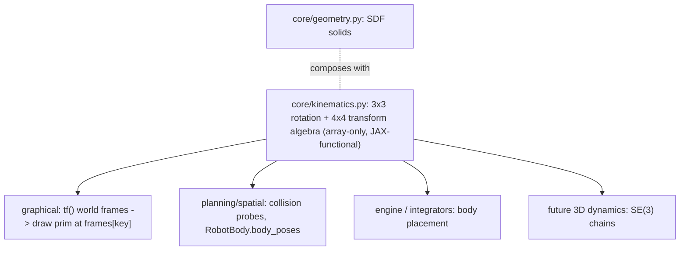

# `core/kinematics.py` — Reusable Transform Algebra (Vision)

Ground truth: [`00_original_vision.md`](00_original_vision.md) § *Module placement*.

This file articulates the **why and the shape** of the new core math module that
the whole refactor stands on. It is the foundation that `tf` (graphics), collision
probing, the engine, and any future 3D dynamics all reuse.

---

## The idea: a core math module, like `sets` and `costs`

`minilink/core/` already hosts small, native-array, reusable math modules that are
**not tied to any one consumer**:

- [`core/sets.py`](../minilink/core/sets.py) — admissible/constraint set algebra.
- [`core/costs.py`](../minilink/core/costs.py) — cost-function building blocks.
- [`core/geometry.py`](../minilink/core/geometry.py) — occupied space / SDF solids.

`core/kinematics.py` joins them as the **rigid-body orientation / pose algebra**
peer: the 3×3 rotations and the homogeneous 4×4 transforms built from them, plus
the operations on both. Like `sets` and `costs`, it is pure functions over
arrays — no classes, no rendering, no solver, no knowledge of `System`. Anything
that needs "how is this body oriented" or "where is this body in the world"
imports it.



**Distinct from `core/geometry.py`:** geometry answers "what space does a solid
occupy" (SDF); kinematics answers "where is the frame in the world" (pose). They
compose — a body-frame SDF probe is placed by a world transform — but stay
separate concerns and are **not merged**.

---

## Design rules (non-negotiable)

1. **Array-only in / array-only out.** Inputs and outputs are `np`/`jnp` arrays.
   No primitives, no dicts of primitives, no matplotlib, no `System`.
2. **JAX-functional construction.** Build matrices with `xp.stack` / `xp.array`
   via `xp = array_module(...)`; **no in-place index assignment** (`T[0, 3] = x`
   breaks tracing). This is what lets `tf` trace under `jax.jit` / `vmap` and be
   reused inside collision and optimization.
3. **No `float()` casts on traced paths.** The equation path stays differentiable.
   Rendering-only consumers may cast *after* calling kinematics, never inside.
4. **No tree / no resolver.** Functions return **world (global) transforms** or
   compose two transforms; any kinematic chain is plain matrix products in the
   caller's `tf`. A parent/child resolver is only built later if a deep chain
   demands it.
5. **No new dataclasses.** Plain functions, mirroring `sets`/`costs` style.

---

## Public API surface

The module mirrors the two-layer structure of the course notes (`Notes-Robotique`,
chapters *Orientation* and *Poses*): a **3×3 orientation layer** `R`, and a **4×4
pose layer** `T` assembled from `R` plus a translation. The surface is textbook
symbols, not descriptive Python names, so a call site reads like the algebra it is.

**Layer 1 — orientation `R` (3×3).** Change of base / relative orientation (the
notes' ᵃRᵇ). Acts on bare vectors — e.g. rotating a body-frame velocity into world
— *without* dragging in a translation:

| Function | Returns | Textbook |
| --- | --- | --- |
| `Rx(theta)` / `Ry(theta)` / `Rz(theta)` | 3×3 | elementary rotations (the notes' axis-indexed R₁/R₂/R₃; planar = Z = R₃) |
| `R.T` | 3×3 | inverse is the transpose, R⁻¹ = Rᵀ (no helper needed) |

**Layer 2 — pose `T` (4×4).** Change of frame / rigid-body pose (the notes' ᴬTᴮ,
literally [[R, p],[0,1]]). This is what `tf` returns and what the animator poses
primitives with:

| Function | Returns | Textbook |
| --- | --- | --- |
| `SE3(R, p=0)` | 4×4 | assemble [[R, p],[0,1]] — lift a rotation (+ optional translation) to a pose |
| `SE2(x, y, theta)` | 4×4 | planar pose (x, y, θ); ≡ `SE3(Rz(theta), [x, y, 0])` |
| `translation(dx, dy, dz)` | 4×4 | pure translation; ≡ `SE3(I, p)` |
| `identity(xp=None)` | 4×4 | I₄ (root / world frame) |
| `inv(T)` | 4×4 | rigid inverse (ᴬTᴮ)⁻¹ = ᴮTᴬ = [[Rᵀ, −Rᵀp],[0,1]] — cheaper/stabler than a generic inverse |
| `apply(T, pts)` | points | homogeneous transform p′ = T·p̃ over a batch (`apply_transform` from `planning/spatial/robot.py:165`, relocated + renamed; call sites updated, no alias) |

Composition is just the matrix product `@`, following the notes' left-multiply rule
(ᶜTᵃ = ᶜTᵇ ᵇTᵃ). Tag locals with frame keys so the algebra self-checks —
`W_T_body = SE2(x, y, theta)`, `body_T_wheel = SE2(a, 0.0, delta)`,
`W_T_wheel = W_T_body @ body_T_wheel`. The `tf` dict keys play the role
of the notes' frame (repère) labels: `tf` returns worldT^key for each key, and the
animator composes `frames[key] @ local_transform`. Lifting a bare rotation into a
4×4 chain stays explicit about the layer boundary — `SE3(Rz(delta))`. The capital
math-symbol names (`Rx`, `SE2`, `SE3`) mirror the catalog's existing `M`/`C`/`H`
callables, so `core/kinematics.py` carries the same ruff allowance for them.

These cover every catalog `tf` need: vehicles (`SE2` + offsets),
pendulum/manipulator chains (`Rz` products lifted by `SE3`, or `SE2` chains in the
plane), and world-fixed scenes (`identity`). Trig locals follow the notes'
cθ = cos θ, sθ = sin θ shorthand (`c, s = xp.cos(th), xp.sin(th)`; `c1, s1` for
multi-angle chains).

**Pure algebra only — no state or drawing conventions.** State-aware and
drawing-specific helpers stay *out* of core kinematics: the planar `tf` sugar
`single_body_tf(x, ...)` lives in the catalog/demo layer (it encodes state-index
conventions), and a link/rod frame `link_frame(p0, p1)` lives in the graphical
catalog (a drawing convenience). Core kinematics stays the conventionless
SE(2)/SE(3) algebra peer of `sets`/`costs`.

---

## Variable naming: frame-tagged symbols (from the course notes)

The notes tag every matrix and vector with the frames it relates (ᵃRᵇ, ᴬTᴮ). We
carry that into code with an ASCII transcription that preserves the same
left-to-right order, so a line of kinematics is **self-checking**:

| Notes | Code | Meaning |
| --- | --- | --- |
| ᵃRᵇ | `a_R_b` | 3×3 orientation of basis `b` relative to basis `a` (lowercase = vector bases) |
| ᴬTᴮ | `A_T_B` | 4×4 pose of frame `B` expressed in frame `A` (uppercase = frames / repères) |
| rᵃ | `r_a` | a vector / point expressed in basis `a` |

Read `W_T_body` as "world‑T‑body": the **left** label is the reference (observer)
frame (`W` = world), the **right** label is the **frame key** being described. So
`W_T_body` is the body frame's pose in world — exactly the value `tf` stores at
key `"body"`.

The tagging makes the algebra visually checkable, mirroring the notes' rules:

- **Composition — inner labels are adjacent and cancel:**
  `W_T_C = W_T_B @ B_T_C` (the `B … B` meeting in the middle is the checksum).
- **Inverse — swap the labels:** `B_T_W = inv(W_T_B)`; likewise `b_R_a = a_R_b.T`.
- **Apply — the right label must match the data's frame:**
  `r_a = a_R_b @ r_b`, `p_W = W_T_B @ p_B` (homogeneous).

Conventions:

- `_R_` for 3×3 (bases, **lowercase**); `_T_` for 4×4 (frames, **frame keys**). The
  middle token is the **representation** and is extensible (`_q_`, `_twist_`, …) —
  see *Future representations* below.
- **Always use the `tf` frame key** as the right label — `W_T_body`, `body_T_wheel`
  (`W` = world). Single letters (`W_T_B`) only in tight catalog math with no named keys.
- A bare local `T` / `R` is fine when only one transform is in scope; tag as soon
  as two or more frames appear in the same expression.

```python
def tf(self, x, u, t=0, params=None):
    W_T_body     = SE2(x[0], x[1], x[2])     # body frame in world
    body_T_wheel = SE2(self.a, 0.0, u[0])    # wheel offset + steer, in the body frame
    W_T_wheel    = W_T_body @ body_T_wheel   # inner 'body' cancels -> world pose
    return {"body": W_T_body, "wheel": W_T_wheel}
```

---

## Future representations & conversions (extensibility)

The two-layer matrix core (`R`, `T`) is the foundation, **not** the ceiling. Later
work will add unit quaternions, axis-angle / rotation vectors, Euler/RPY, and
twists (se(3)), with conversion helpers between them. To keep that growth
churn-free, the naming **grammar** is reserved now even though only the matrix
layer ships first. This is a *namespace reservation*, not a deliverable.

**Representation tokens** — the array's meaning rides in a short token, since
array-only functions cannot dispatch on type:

| Token | Array | Group / meaning |
| --- | --- | --- |
| `R` | 3×3 | rotation matrix (SO(3)) |
| `T` | 4×4 | homogeneous transform (SE(3)) |
| `quat` | 4-vec [η, e₁, e₂, e₃] | unit quaternion |
| `rotvec` (`aa`) | 3-vec (or axis, angle) | axis-angle / rotation vector |
| `rpy` (`euler`) | 3-vec | Euler angles (sequence is an explicit arg) |
| `twist` | 6-vec (v, ω) | se(3) element (velocity / screw) |
| `p` | 3-vec | position |

**Two function families, one rule each:**

1. **Parametric constructors** (build a matrix from raw scalars / a rotation) keep
   the short group/representation names: `Rx`/`Ry`/`Rz`, `SE2(x, y, theta)`,
   `SE3(R, p)`, `translation`, `identity`. These are the blessed builders.
2. **Representation conversions** (between two named tokens) use **`X_from_Y`**,
   matching the repo's house style (`heading_from_vector`, `get_port_values_from_u`,
   `_rotation_from_a_to_b`, …) — output token first, reads as `out = X_from_Y(in)`:
   - orientation: `R_from_quat` / `quat_from_R`, `R_from_euler(rpy, seq=...)` /
     `euler_from_R`, `R_from_rotvec` / `rotvec_from_R`.
   - pose: `T_from_quatpos` / `quatpos_from_T` once a (quat, p) pose is needed
     (the `SE3(R, p)` constructor already covers the matrix-rotation case).

**Lie exp/log are just conversions** under this grammar — no separate `exp`/`log`
namespace (which array-only code can't overload anyway):

- `R_from_rotvec` / `rotvec_from_R` — SO(3) exp / log.
- `T_from_twist` / `twist_from_T` — SE(3) exp / log.
- `skew(w)` / `unskew(W)` — the notes' `a^×` hat / vee operator.

**Variable tagging extends by swapping the middle token** to the representation:
`W_T_body` (matrix pose), `W_q_body` (quaternion), `W_R_body` (rotation matrix),
`body_twist` (se(3), frame-tagged). Frame labels stay the `tf` keys; only the
representation token changes.

The first cut ships **only** the `R`/`T` matrix layer above; everything else lands
additively into these reserved slots.

---

## How each consumer reuses it

- **Graphics (`tf`)** — a plant's `tf(x, u, t)` returns
  `dict[str, 4x4 world]`, built from these helpers (catalog) or inline 4×4
  (demos). The animator poses each primitive at `frames[key] @ local_transform`.
- **Collision (Phase 7)** — `RobotBody`/`PlanarRigidBody.body_poses` converges onto
  the **same** world-frame dict produced by `tf`, so one FK feeds both the drawn
  chassis and the clearance probes. `apply_transform` moves here from
  `planning/spatial/robot.py` (renamed to `apply`).
- **Engine / integrators** — body placement during simulation reuses the same
  pose algebra instead of bespoke trig.
- **Future 3D dynamics** — SE(3) chains build on `Rx`/`Ry`/`Rz` and `SE3`
  composition with no new math module.

---

## Style split: core helpers vs textbook demos

Two legitimate ways to write a transform, by audience:

- **Catalog / shared FK / library internals** → call `core/kinematics.py` symbols
  (`SE2`, `Rz`, `translation`, …). DRY, JAX-safe, one source of truth.
- **Demo scripts & student `tf` overrides** → write the **inline 4×4** with
  `xp = array_module(x)` and `xp.cos`/`xp.stack`, so the SE(2)/SE(3) math reads
  like a textbook (see [`02_demo_use_cases.md`](02_demo_use_cases.md) use case 1).

Both produce identical arrays; the helper path is for reuse, the inline path is
for teaching clarity.

---

## What this module deliberately excludes

- **Camera math.** `camera_matrix` / `world_to_camera` / follow factories live in
  the graphical band (`graphical/animation/camera.py`); the camera is a view hint,
  not a kinematic frame, and `scale` lives in `T[3,3]`.
- **Render builders.** `arrow_pts`, `torque_arc_pts`, ready-made shapes
  (`vehicle_body`, `wheel_box`, …) stay graphical — they emit point geometry, not
  poses.
- **SDF / occupancy.** Stays in `core/geometry.py`.

---

## Phase mapping

- **Phase 1** introduces `core/kinematics.py` additively (no consumer is forced to
  use it yet); unit-tested in isolation.
- **Phase 3** has the `_v2` catalog `tf` methods consume it for shared FK.
- **Phase 5** makes it the only path once `_v2` is renamed to final.
- **Phase 7** routes collision `body_poses` through it, closing the
  "one FK for render + collision" goal.
