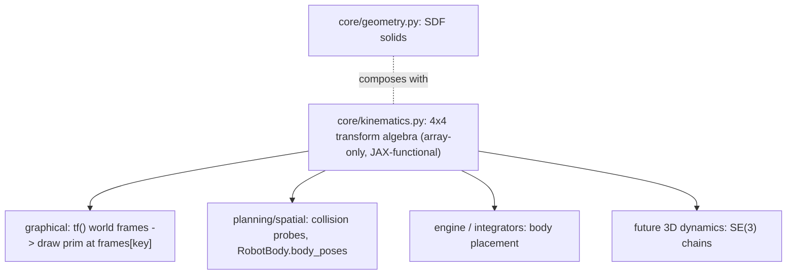

# `core/kinematics.py` — Reusable Transform Algebra (Vision)

Ground truth: [`00_original_vision.md`](00_original_vision.md) § *Module placement*.

This file articulates the **why and the shape** of the new core math module that
the whole refactor stands on. It is the foundation that `tf` (graphics), collision
probing, the engine, and any future 3D dynamics all reuse.

---

## The idea: a core math module, like `sets` and `costs`

`minilink/core/` already hosts small, native-array, reusable math modules that are
**not tied to any one consumer**:

- [`core/sets.py`](../minilink/core/sets.py) — admissible/constraint set algebra.
- [`core/costs.py`](../minilink/core/costs.py) — cost-function building blocks.
- [`core/geometry.py`](../minilink/core/geometry.py) — occupied space / SDF solids.

`core/kinematics.py` joins them as the **rigid-body pose / transform algebra**
peer: homogeneous 4×4 transforms and the operations on them. Like `sets` and
`costs`, it is pure functions over arrays — no classes, no rendering, no solver,
no knowledge of `System`. Anything that needs "where is this body in the world"
imports it.

```mermaid
flowchart TD
  K["core/kinematics.py: 4x4 transform algebra (array-only, JAX-functional)"]
  K --> G["graphical: tf() world frames -> draw prim at frames[key]"]
  K --> C["planning/spatial: collision probes, RobotBody.body_poses"]
  K --> E["engine / integrators: body placement"]
  K --> D3["future 3D dynamics: SE(3) chains"]
  Geo["core/geometry.py: SDF solids"] -. composes with .- K
```

**Distinct from `core/geometry.py`:** geometry answers "what space does a solid
occupy" (SDF); kinematics answers "where is the frame in the world" (pose). They
compose — a body-frame SDF probe is placed by a world transform — but stay
separate concerns and are **not merged**.

---

## Design rules (non-negotiable)

1. **Array-only in / array-only out.** Inputs and outputs are `np`/`jnp` arrays.
   No primitives, no dicts of primitives, no matplotlib, no `System`.
2. **JAX-functional construction.** Build matrices with `xp.stack` / `xp.array`
   via `xp = array_module(...)`; **no in-place index assignment** (`T[0, 3] = x`
   breaks tracing). This is what lets `tf` trace under `jax.jit` / `vmap` and be
   reused inside collision and optimization.
3. **No `float()` casts on traced paths.** The equation path stays differentiable.
   Rendering-only consumers may cast *after* calling kinematics, never inside.
4. **No tree / no resolver.** Functions return **world (global) transforms** or
   compose two transforms; any kinematic chain is plain matrix products in the
   caller's `tf`. A parent/child resolver is only built later if a deep chain
   demands it.
5. **No new dataclasses.** Plain functions, mirroring `sets`/`costs` style.

---

## Public API surface

Already-drafted helpers (see the partial `core/kinematics.py` on the WIP tree):

| Function | Purpose |
| --- | --- |
| `identity_matrix(xp=None)` | 4×4 identity (root / world frame) |
| `translation_matrix(dx, dy, dz)` | pure translation |
| `pose2d_matrix(x, y, theta)` | SE(2) pose embedded in 4×4 (rotate about Z) |
| `rotation_matrix_x/y/z(theta)` | elementary axis rotations |
| `invert_transform(T)` | rigid inverse (Rᵀ, −Rᵀt) — cheaper/stabler than `inv` |
| `apply_transform(T, pts)` | transform a batch of points (relocated from `planning/spatial/robot.py`) |
| `rod_between_transform(p0, p1)` | frame for a link/rod spanning two points |
| `point_transform(...)` | place a point feature |
| `single_body_tf(x, ix=0, iy=1, iz=2, ith=2)` *(optional)* | one-liner planar-rigid-body `tf` sugar |

These cover every catalog `tf` need: vehicles (`pose2d_matrix` + offsets),
pendulum/manipulator chains (`rotation_matrix_z` products + `rod_between_transform`),
and world-fixed scenes (`identity_matrix`).

---

## How each consumer reuses it

- **Graphics (`tf`)** — a plant's `tf(x, u, t)` returns
  `dict[str, 4x4 world]`, built from these helpers (catalog) or inline 4×4
  (demos). The animator poses each primitive at `frames[key] @ local_transform`.
- **Collision (Phase 7)** — `RobotBody`/`PlanarRigidBody.body_poses` converges onto
  the **same** world-frame dict produced by `tf`, so one FK feeds both the drawn
  chassis and the clearance probes. `apply_transform` moves here from
  `planning/spatial/robot.py`.
- **Engine / integrators** — body placement during simulation reuses the same
  pose algebra instead of bespoke trig.
- **Future 3D dynamics** — SE(3) chains build on `rotation_matrix_x/y/z` and
  transform composition with no new math module.

---

## Style split: core helpers vs textbook demos

Two legitimate ways to write a transform, by audience:

- **Catalog / shared FK / library internals** → call `core/kinematics.py` helpers
  (`pose2d_matrix`, `rod_between_transform`, …). DRY, JAX-safe, one source of
  truth.
- **Demo scripts & student `tf` overrides** → write the **inline 4×4** with
  `xp = array_module(x)` and `xp.cos`/`xp.stack`, so the SE(2)/SE(3) math reads
  like a textbook (see [`02_demo_use_cases.md`](02_demo_use_cases.md) use case 1).

Both produce identical arrays; the helper path is for reuse, the inline path is
for teaching clarity.

---

## What this module deliberately excludes

- **Camera math.** `camera_matrix` / `world_to_camera` / follow factories live in
  the graphical band (`graphical/animation/camera.py`); the camera is a view hint,
  not a kinematic frame, and `scale` lives in `T[3,3]`.
- **Render builders.** `arrow_pts`, `torque_arc_pts`, ready-made shapes
  (`vehicle_body`, `wheel_box`, …) stay graphical — they emit point geometry, not
  poses.
- **SDF / occupancy.** Stays in `core/geometry.py`.

---

## Phase mapping

- **Phase 1** introduces `core/kinematics.py` additively (no consumer is forced to
  use it yet); unit-tested in isolation.
- **Phase 3** has the `_v2` catalog `tf` methods consume it for shared FK.
- **Phase 5** makes it the only path once `_v2` is renamed to final.
- **Phase 7** routes collision `body_poses` through it, closing the
  "one FK for render + collision" goal.
