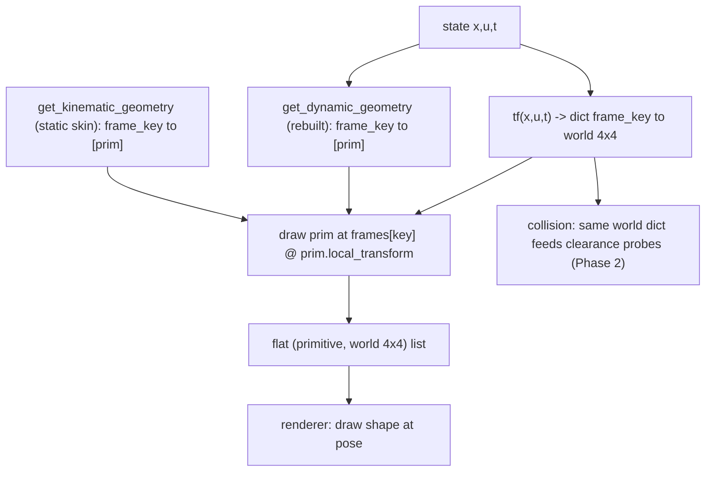

# Upgraded Kinematic Contract for `System`

Short-term goal: a clean, reviewed kinematic contract on `System` that (1) lets a
custom plant declare quick geometry with little ceremony, (2) lets a complex
"skin" (e.g. a detailed car) be reused/swapped, and is shaped so collision,
overlays, and MPC plans plug in later without re-plumbing.

Decisions locked in:

- Same **three hooks** as today; only the output types improve (lists -> keyed
  dicts) and the dead dynamic hook is revived.
- Frames are **string-keyed** (ports-style), returning **global (world)
  transforms**. No parent/child tree; build one internally later only if a deep
  chain needs it.
- `tf` (the renamed transforms hook) carries math for **independent frames
  only**; fixed graphical offsets ride on a `primitive.local_transform`, never as
  extra frames.
- Static skin and dynamic geometry are **both `dict[frame_key, list[prim]]`**,
  both posed by the frames dict.
- `tf` is an **equation path**: bare signature, `xp = array_module(x)` idiom, **no
  `float(x[i])` casts**, native-array in/out — so it is JAX-traceable and reusable
  for collision (Phase 2). `get_kinematic_geometry`/`get_dynamic_geometry` are
  rendering-only (NumPy, may cast).
- **Default viz is empty:** base `System`/`StaticSystem`/`DynamicSystem` return
  `{}` for `tf` and `get_kinematic_geometry` (no per-state debug points). A
  `debug_state_skin()` opt-in helper can be offered for quick state dashboards.
- **No new dataclasses**; reuse is plain functions.

## Method names

The frames hook is a state-function like `f`/`h`, so it gets a bare,
textbook-style name (`tf`, echoing ROS tf), not a `get_`-prefixed verb. The two
geometry hooks return data/skins (not equations) and stay descriptive.

| Today | New name | New return |
| --- | --- | --- |
| `get_kinematic_transforms(x,u,t)` | `tf(x,u,t,params)` | `dict[str, 4x4 world]` |
| `get_kinematic_geometry()` | `get_kinematic_geometry()` (kept) | `dict[str, list[primitive]]` (skin) |
| `get_dynamic_geometry(x,u,t)` | `get_dynamic_geometry(x,u,t,params)` (kept, revived) | `dict[str, list[primitive]]` |
| `get_camera_transform(x,u,t)` | removed; replaced by camera hints + boundary resolver (see Camera section) | 4x4 camera computed by animator |

`tf` reads as `T = sys.tf(x, u, t)` next to `dx = f(x,u)` / `y = h(x,u)`.
Alternatives considered: `kinematic_frames()` (clear but verbose), `transforms()`
(generic, overloads the old name), `frames()` (rejected — collides with
animation/video frames in the animator). The two geometry hooks could later be
harmonized to bare names too, but that is out of scope here.

## Core proposal: keyed frames + frame-keyed geometry

Today `get_kinematic_transforms` returns a flat list that must match
`get_kinematic_geometry` index-for-index (see
[minilink/core/system.py](minilink/core/system.py),
[dynamic_bicycle.py](minilink/dynamics/catalog/vehicles/dynamic_bicycle.py)).
Replace with:

- `tf(x,u,t,params)` -> `dict[str, 4x4 world transform]` (named frames; e.g.
  `"body"`, `"wheel_fl"`) — math only for independent frames.
- `get_kinematic_geometry()` -> `dict[str, list[primitive]]` (static skin).
- `get_dynamic_geometry(x,u,t,params)` -> `dict[str, list[primitive]]` (rebuilt
  each frame).

Every primitive is drawn at `frames[key] @ primitive.local_transform`. The
animator validates that geometry keys are a subset of frame keys (an unknown key
fails loudly; today only a length mismatch is caught).



## Frames vs graphical offsets (keep base-class math minimal)

Rule: **`tf` holds math only for independent frames** — rigid bodies/joints whose
pose needs `(x,u,t)` kinematics. Fixed decoration offsets are placement, not
kinematics, and must not become frames.

Mechanism: one optional attribute on the `GraphicPrimitive` base —
`local_transform` (identity default, plain `np.ndarray`, **not** a dataclass).
The renderer draws at `frames[key] @ prim.local_transform`. So several decorations
hang off `"body"` at different offsets with **no** extra frames and **no** math in
`tf`. Most primitives already carry `center`; `local_transform` is the general
rigid-offset escape hatch for the rest.

## Standard frame-key vocabulary

Frame keys are programmatic ids -> lowercase snake_case (like port ids); diagram
subsystem frames are auto-prefixed `sys_id:key`. A plant exposes the **superset**
its skins need; a skin keys only the subset it draws (`skin keys subset tf keys`),
so skins interchange across models that share the vocabulary.

- World / generic: `world` (identity root; world-fixed geometry, scenes,
  world-space dynamic primitives), `body` (single rigid-body pose), `com`
  (optional center of mass).
- Serial chains (manipulators, multi-pendulums): `joint{i}` (i = 0..N, `joint0` =
  base mount), `link{i}` (i = 0..N-1, origin at proximal joint, oriented along the
  link), `ee` (end-effector / tool tip).
- Vehicles: `axle_front`, `axle_rear` (centerline axles - bicycle model, steering
  arrows); `wheel_fl`, `wheel_fr`, `wheel_rl`, `wheel_rr` (four corners - cars /
  3D skins). A bicycle plant exposes both axle and corner frames so the 2D
  centerline skin and the 3D four-wheel skin both attach to one `tf`.

This is what lets `car_skin_2d` (keys `body`, `axle_front`, `axle_rear`) and
`car_skin_3d` (keys `body`, `wheel_*`) share a single bicycle `tf`.

## Skin contract: two ergonomic tiers (no dataclasses)

Coupling is by **frame-key strings** only; both tiers return the same plain
`dict[str, list[primitive]]`.

### Tier 1 - quick geometry (use-case 1)

```python
def get_kinematic_geometry(self):
    return {"body": [vehicle_body(self.L, self.W)], "wheel": [wheel_box()]}

def tf(self, x, u, t):
    T = pose2d_matrix(x[0], x[1], x[2])
    return {"body": T, "wheel": T @ pose2d_matrix(self.a, 0.0, delta)}
```

Conventions that avoid extra machinery:
- Multiple primitives on a frame = list value.
- Same primitive at N places (4 wheels) = N keyed frames sharing one primitive
  instance (`"wheel_rl"`, ...).
- A fixed offset within a frame = `primitive.local_transform` (or the primitive's
  own `center`/local `pts`), not a new frame.

### Tier 2 - reusable / swappable complex skin (use-case 2)

Skin **factory functions** (plain functions in `graphical/animation/skins.py`)
return the dict, keyed by an agreed frame vocabulary:

```python
def car_skin_2d(length, width, color="blue") -> dict[str, list]: ...
def car_skin_3d(length, width, track, color="#151922") -> dict[str, list]: ...
```

`DynamicBicycle` and `DynamicBicycleCar3D` then differ **only** in
`get_kinematic_geometry`, sharing one `tf` because both factories emit the same
keys (`"body"`, `"wheel_rl"`, `"wheel_rr"`, `"wheel_fl"`, `"wheel_fr"`):

```python
def get_kinematic_geometry(self):  return car_skin_2d(self.L, self.W)
def get_kinematic_geometry(self):  return car_skin_3d(self.L, self.W, self.track)
```

This removes the ~85-line `get_kinematic_transforms` copy in the 3D car.
Composition when needed = a one-function `merge_skins(*skins)` (concatenates lists
on shared keys).

## Dynamic-primitive pipeline

Two layers; **both are `dict[frame_key, list[prim]]` posed by the frames dict**:

- **Static skin** - geometry built once (`get_kinematic_geometry`), re-posed each
  frame. Body, wheels, links: shape fixed, pose moves.
- **Dynamic** - `get_dynamic_geometry(x,u,t,params)` rebuilt each frame; keyed to
  a frame too. Velocity/force arrows, torque arcs key to the body/wheel frame;
  world-space items (MPC horizon, trail) key to `"world"`.

Posing dynamic geometry by a frame is a real cleanup: an arrow built in
body-local coords keys to `"body"`, and `frames["body"]` supplies the rotation —
deleting today's manual `c,s = cos/sin(theta); vfx = c*vx - s*vy ...` per-vector
world rotation. For the dynamic bicycle, `vx,vy` are already body-frame, so the
velocity arrow is local along `(vx,vy)`.

Per-frame animator pipeline:

1. `frames = sys.tf(x, u, t)` -> world dict.
2. for `k, prims` in `sys.get_kinematic_geometry()` (cached once): emit
   `(prim, frames[k] @ prim.local_transform)`.
3. for `k, prims` in `sys.get_dynamic_geometry(x, u, t)`: emit
   `(prim, frames[k] @ prim.local_transform)`.
4. `camera = resolve_camera(primary.camera_hints, frames, t)` (animator boundary;
   `animate(camera=...)` overrides).
5. renderer draws the flat `(primitive, world 4x4)` list (unchanged: "draw shape
   at pose").

This retires both hacks: `t` is a real argument (no `time_channel_matrix` /
`T[3,3]`), and arrow length is real geometry (no column-norm scaling). Terse
render builders in the graphical band (`arrow_pts`, `torque_arc_pts`) keep
authoring short:

```python
def get_dynamic_geometry(self, x, u, t):
    v_local = x[3:5]  # body-frame velocity
    return {"body": [CustomLine(arrow_pts(base=(0, 0), vector=v_local, scale=0.2))]}
```

`HorizonPolyline`/`TrajectoryPolyline` keep their data internally and expose
`points_at(t)` (today's `compute_pts`, `t` passed honestly). Camera scale stays in
`T[3,3]` because the camera is not a kinematic frame.

## Where dynamic data lives (instantaneous vs history-bound)

Two kinds of dynamic content share one mechanism but differ in data ownership.

- **A. Instantaneous** - fully determined by `(x,u,t,params)`: arrows, torque
  arcs, deformation. Rebuilt by `System.get_dynamic_geometry`; **no data stored**.
- **B. History/trajectory-bound** - needs more than the instant: executed trail,
  MPC plan history (predicted futures), reference path, obstacles. **Not**
  reconstructable from `(x,u,t)`; the data is owned by an object, **never the
  `System`**.

| Content | From (x,u,t)? | Data lives in |
| --- | --- | --- |
| arrows, torque arc, deformation | yes | nowhere - recomputed by `System` |
| executed trail | needs full traj | `TrajectoryPolyline(traj)` in a `SceneHistory` |
| MPC plan history | no (futures) | `HorizonPolyline(plans)` in a `SceneHistory` |
| reference path, obstacles | external | `Scene` (static skin) / `Scene.to_overlay()` |

Case-B data lives in the **dynamic primitive object itself**
(`HorizonPolyline(plans)` holds `list[(t_solve, Trajectory)]`), exposing
`points_at(t)`. Those primitives are owned by a `SceneHistory`, built at the
animation boundary (demo/planner), not on `sys`.

## Drawables: System, Scene, SceneHistory combined at `animate`

All three implement the **same drawable contract** (`tf`,
`get_kinematic_geometry`, `get_dynamic_geometry`); the animator iterates
`[sys] + overlays` and merges each draw list (same code path for all).

- **`System`** - the plant (full contract).
- **`Scene`** - static external geometry (obstacles, reference). A `Scene` already
  exists in [planning/spatial/scene.py](minilink/planning/spatial/scene.py);
  making **that** one drawable is the "mirror the contract onto
  Scene/Environment" step, rather than inventing a second Scene. Frames are
  world-fixed; geometry is its obstacles/reference.
- **`SceneHistory`** - holds time-indexed historical data (MPC plans, trails);
  uses only the **time channel** `t`, frames are `{"world": I}`, geometry via each
  primitive's `points_at(t)`.

```python
history = SceneHistory(horizon=HorizonPolyline(mpc_plans),
                       trail=TrajectoryPolyline(executed_traj))
sys.animate(traj, overlays=[scene, history])   # iterate [sys] + overlays, merge
```

The played-back trajectory is owned by the `Animator`; a trail holds a reference
and slices `t <= t_now` - it owns its *view*, not a copy.

## Module placement (band split)

**Two core math modules, different concerns, both native-array only:**

- `core/kinematics.py` (new) - **rigid-body poses / transform algebra**.
  Native-array and **JAX-functional** (build with `xp.stack`/`xp.array`, no
  in-place index assignment, so `tf` traces). Holds: `translation_matrix`,
  `pose2d_matrix`, `rotation_matrix_x/y/z`, `invert_transform`, `apply_transform`
  (relocated from [robot.py](minilink/planning/spatial/robot.py)),
  `rod_between_transform`, `point_transform`, optional `single_body_tf`. No
  tree/resolver.
- `core/geometry.py` (exists) - **occupied space / SDF solids**. Stays separate;
  it composes with kinematics (body-frame shape probe placed by a world transform)
  but is a distinct concern. Not merged.

Centralization: transform math currently scattered (`apply_transform` in
planning, builders in graphical) moves into `core/kinematics.py`; `robot.py` and
graphics import from there - one transform toolkit for collision and rendering.

**Rendering stays in the graphical band (messy/Python, may cast):**

- `GraphicPrimitive` classes + the new `local_transform` attribute,
  render-geometry builders `arrow_pts`/`torque_arc_pts`, ready-made shapes
  (`vehicle_body`, `wheel_box`, `spring_line`, `ground_line`), skin factories in
  `graphical/animation/skins.py`, and camera (`camera_matrix`, `world_to_camera`,
  follow factories) in `graphical/animation/camera.py`.
- Deleted hacks: `scale_pose2d_matrix`, `arrow_transform`, `line_between_transform`,
  `time_channel_matrix`, `torque_pose2d_matrix`, `extract_amplitude`.

Deferred (Phase 2): render-shape vs SDF-shape unification (graphical `Box`/`Sphere`
vs `core.geometry` `Box`/`Sphere`) - one geometry attached to frames feeding both
render and collision. Note only; not in this slice.

Relocating transform helpers + removing the core->graphics camera import is an
architecture change -> approved scope (D4); touches the band layout, keep
[DESIGN.md §3](DESIGN.md) in sync.

## Collision reuse (Phase 2, later)

`RobotBody`/`PlanarRigidBody.body_poses` already returns world poses per part
([robot.py](minilink/planning/spatial/robot.py)). Converge it onto the same
world-frame dict: collision `Shape`s key to the same frames, so one FK feeds both
the rendered chassis and the clearance probes. Both consume world poses; no tree
needed.

## Use-case validation (standard workflows)

Walked the contract through real plants ([arms.py](minilink/dynamics/catalog/manipulators/arms.py),
[dynamic_bicycle.py](minilink/dynamics/catalog/vehicles/dynamic_bicycle.py),
pendulum family) to validate before implementation.

1. **Physical non-spatial sys (e.g. chemical plant).** `tf` is optional: by
   default it returns `{}` (D2 - nothing drawn, clean in diagrams), or override to
   build a schematic skin. A `debug_state_skin()` opt-in covers quick state
   dashboards.
2. **Quick-and-dirty class.** Two one-line dicts:
   `get_kinematic_geometry()` -> `{"body": [Circle(...)]}` and
   `tf(x,u,t)` -> `{"body": pose2d_matrix(x[0], x[1], x[2])}`. Optional sugar: a
   `single_body_tf(x, ix=0, iy=1, ith=2)` helper for the planar-rigid-body case.
3. **Many-DOF manipulator.** Frames scale with DOF (`link{i}`, `joint{i}`; 11 keys
   for a 5-link arm) — a dict handles what fragile lists could not. `tf` is the FK
   chain; torque arcs are `get_dynamic_geometry` keyed to each link/joint frame,
   which **removes the manual `start_angle = pi/2 - angle` world-orientation
   math** (the frame carries it). The 5 arm classes share `_planar_*` helpers, so
   they migrate together.
4. **Vehicles: swap dynamics x geometry without duplication.** Three independent
   axes: `f` (dynamics), `tf` (frames; depends on state layout), `skin` (visual).
   New dynamics reuse a `car_skin_*` factory; new skins reuse `tf`. The only
   per-model wrinkle: steer angle is an input in `DynamicBicycle` but a state in
   `...RateInputs` -> a one-line steer-source override, not 85 duplicated lines.
5. **Robot in a scene with context (path, obstacles, other robots).** Two
   implications: (a) `animate` must take **multiple drawables**, since other
   robots are `System` drawables too -> the animator merges `[primary] + others +
   scenes + histories`; (b) other robots move on their own trajectories while the
   timeline plays one -> add a **`Replay(drawable, trajectory)`** overlay that at
   time `t` renders `drawable`'s `tf`+`skin` at `x(t)`. `Replay` also covers the
   executed-run "ghost".
6. **Historical data.** `SceneHistory` with `TrajectoryPolyline`/`HorizonPolyline`
   for line history; `Replay` for full-skin ghosts. Both index by `t`.

Also verified: diagram animation (`DiagramSystem.tf` slices local `x,u`, prefixes
`sys_id:frame`; static controller returns `{}`), modal animation
([analysis/modal.py](minilink/analysis/modal.py) is a call site to migrate), and
meshcat (named frames map cleanly to scene-graph nodes; Phase 1 keeps flattening
to `(primitive, world 4x4)` so renderers are untouched).

## Decisions

Resolved:

- **D1 - `tf` native-array now (LOCKED).** Write `tf` JAX-traceable from day one
  (no `float()`), so collision can reuse it in Phase 2.
- **D2 - default viz `{}` (LOCKED).** Base `System`/`StaticSystem`/`DynamicSystem`
  return `{}`; no per-state debug points by default.
- **D3a - multi-drawable `animate` (LOCKED).** `animate(traj, overlays=[...])`
  where overlays may be Systems / Scenes / SceneHistory / `Replay`; the animator
  merges `[primary] + overlays`.
- **D4 - atomic migration (LOCKED).** The no-alias rename migrates *all*
  `get_kinematic_*` overrides in one change (~5 shared-helper rewrites cover most
  of the ~20); the whole catalog will be fixed.

- **D3b - camera system (LOCKED):** hints-as-data + boundary resolver + callable
  override + priority-based source selection (full design below).

## Camera system (D3b)

Camera stays **out of `tf`** (would pollute the native-array equation path that
collision traces) and keeps `scale` in `T[3,3]` (the camera is not a frame). It is
a **hint**, like `x0`/`traj` — not part of the contract. Four layers:

### Layer 1 - hints as data on `System` (no method)

Plain attributes set in `__init__` (no `get_camera_transform`, no `camera_matrix`
import in core — the 4x4 is built at the boundary, removing today's core->graphics
back-reference):

```python
self.camera_scale = 10.0
self.camera_target = np.zeros(3)    # look-at, or offset when following
self.camera_plot_axes = (0, 1)      # which world axes -> screen H/V
self.camera_follow_frame = None     # str key into tf(), or None
self.camera_priority = 0.0          # tie-break when several sources exist
```

`DynamicBicycle` follow-cam becomes `self.camera_follow_frame = "body"` (deletes
its `get_camera_transform` override).

### Layer 2 - default resolver (animator)

Per frame, from the selected source's hints + merged `tf` frames:
`target = frames[camera_follow_frame][:3,3] + camera_target` if following else
`camera_target`; then `camera_matrix(target, camera_plot_axes, camera_scale)`.

### Layer 3 - override contract (power user)

`animate(camera=...)` accepts anything that resolves to a 4x4: a constant
`np.ndarray` (fixed), or a callable `camera(frames, x, u, t) -> 4x4` (cinematic /
state zoom / follow any frame). That callable is the whole contract - no class.
Optional ready-made factories in `graphical/animation/camera.py`
(`follow_frame_camera("body", scale=12)`, `fixed_camera(target, scale)`) return
such callables (Option-3 ergonomics without a class hierarchy).

### Layer 4 - source selection (diagram / multi-object)

When several sources carry hints, the animator picks one deterministically:

1. explicit `camera=` override wins;
2. else highest `camera_priority`;
3. tie-break: prefer sources with non-empty `get_kinematic_geometry()` (things
   that actually draw);
4. final tie-break: the **primary** drawable (the `sys` animated / first in list).

Common cases need zero config: `controller @ plant` auto-selects the plant (the
`StaticSystem` controller has empty skin, step 3); robot + other robots + scene
keeps the primary robot (step 4); `Scene`/`SceneHistory` never steal the camera.
To override: bump a robot's `camera_priority`, pass `camera=`, or optional sugar
`animate(camera_from="robot2")`.

## Implications on scope

- The rename touches ~20 catalog files + `animator.py` + `analysis/modal.py` +
  renderers + tests + demos, but collapses to a handful of shared-helper rewrites
  (manipulator `_planar_*`, bicycle, pendulum) plus per-class skin dicts.
- `tf` rewritten native-array per plant is the main *quality* cost (worth it: it
  is the equation-path rule and unlocks collision reuse).
- Removing `time_channel_matrix` / column scaling updates the dynamic primitives
  (`TorqueArrow`, `HorizonPolyline`, `TrajectoryPolyline`) and their renderer
  read paths in the same change.

## Phasing

- **Phase 1 (this slice):** the three upgraded hooks + `local_transform` on
  `System`/`DiagramSystem`, animator/renderer wiring, retire scale/time channels,
  migrate one simple plant + the bicycle pair (+ one diagram demo);
  `Scene`/`SceneHistory` drawable + collision reuse stubbed with
  `TODO: User Architectural Review`.
- **Phase 2:** collision unification onto the shared world-frame dict.
- **Phase 3:** `SceneHistory`/`Scene.to_overlay()` fully wired; MPC demo sweep.

Phase 1 boundary (LOCKED): **contract only** - upgrade the three hooks + camera
hints, migrate the full catalog, wire the multi-drawable animator + camera
selection, and retire the channel hacks. `Scene`/`SceneHistory`/`Replay` and
collision reuse are stubbed with `TODO: User Architectural Review` and land in
Phases 2-3. So instantaneous arrows/torque arcs work now; MPC-plan/trail overlays
follow in Phase 3 (the MPC demo keeps its current form until then).

## Catalog migration order (~20 `get_kinematic_*` overrides)

1. Vehicles (`dynamic_bicycle.py`, `steering.py`) - highest pain, skin payoff.
2. Pendulum family - dynamic-primitive (torque arc) validation.
3. Manipulators.
4. Aerial / marine / misc.
5. Engines (`world.py`, `ancf_tire_jax.py`).
6. MPC / trajopt demo subclasses -> `Scene`/`SceneHistory` (Phase 3).

## Verification

`ruff check/format` on touched files; `pytest` (animation, primitives, camera,
spatial); `MPLBACKEND=Agg` headless smoke of a migrated plant; update
[DESIGN.md](DESIGN.md) visualization-contract section and
[README.md](README.md)/[ROADMAP.md](ROADMAP.md) if public behavior changes.

## Success criteria (Phase 1 sign-off)

- Adding a frame to a plant edits one method (`tf`); geometry keys it by name. No
  synchronized lists.
- Fixed offsets use `primitive.local_transform`; `tf` carries only
  independent-frame math.
- A reusable car skin is shared/swapped (DynamicBicycle vs 3D car) with no
  copy-pasted transform math.
- No `time_channel_matrix` / column-norm scaling in migrated code; arrow size is
  real world geometry; camera scale unchanged.
- No new dataclasses introduced by the contract.
- `DESIGN.md` documents the world-frame contract; frame-key vocabulary approved.
